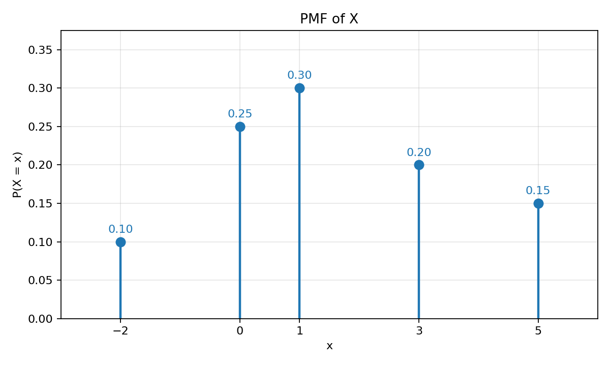
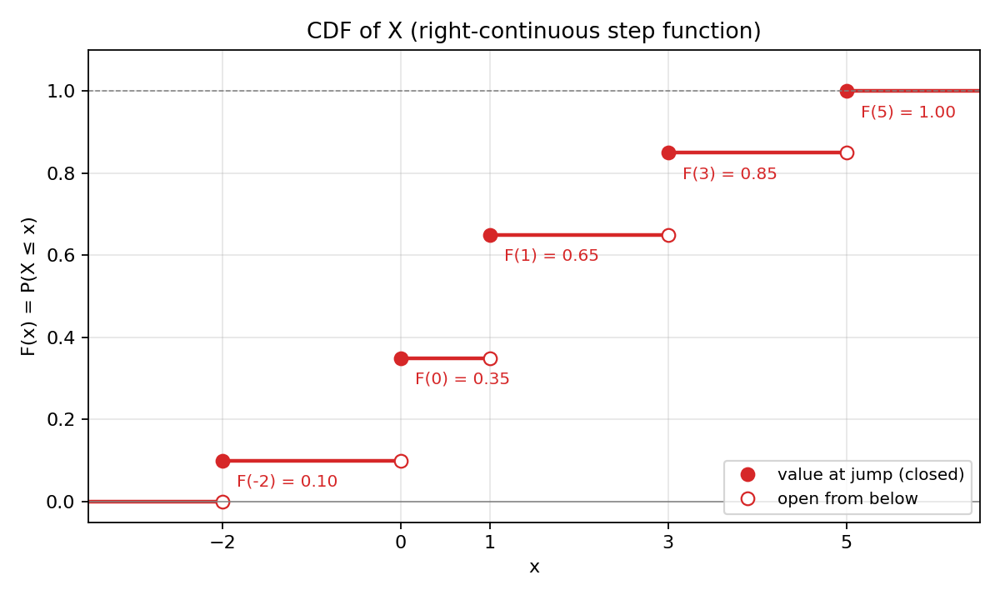

# Problem 1 — Discrete Distribution Given by a PMF Table

The PMF is given directly as

| $x$        | $-2$ | $0$  | $1$  | $3$  | $5$  |
|------------|:----:|:----:|:----:|:----:|:----:|
| $P(X = x)$ | 0.10 | 0.25 | 0.30 | 0.20 | 0.15 |

### How to read the table

Each cell on the bottom row is a **probability**, so a number between $0$ and $1$. The number $0.30$ in the column $x=1$ is read as

> *“if we run the random experiment once, the chance that the random variable $X$ comes out equal to $1$ is $30\%$”.*

The five columns together describe **everything** there is to know about $X$ as a random object: outside the listed values $\{-2,0,1,3,5\}$ the probability is zero, and the five listed probabilities tell us how the total “mass” of $1$ (which is the probability of the certain event) is split between these five points.

### What this report does

Even though the table looks like the whole story, in probability theory a random variable is not a stand-alone object: it lives on a **probability space** $(\Omega,\mathcal{F},P)$ and is a **function** $X:\Omega\to\mathbb{R}$. The table is just the *fingerprint* of that function, called the **distribution** of $X$.

So the goal here is to do five things, in this order:

1. **Build a concrete world** $(\Omega,\mathcal{F},P)$ and a function $X$ on it that produces exactly the given table — and show that this world is not unique.
2. **Check** that the numbers in the table really are a probability law (sum to $1$, no negatives).
3. **Draw the PMF**, which is the table itself plotted as a picture, and **draw the CDF**, which is a second, equivalent picture that adds up the probabilities from left to right.
4. **Translate** every common probability question — equalities, strict and non-strict inequalities, intervals — back and forth between the PMF picture and the CDF picture, and verify the answers match.
5. **Wrap the whole thing in a small interactive tool** so any probability table can be inspected with the same method.

Most of the work is bookkeeping, but every step has a precise reason behind it; the text below explains each formula in words before plugging in numbers.

---

## Theory — concepts used

Before any computation, fix the vocabulary. Every line in the table below names one object and pins down exactly what it means; the prose after the table explains *why* we need that object at all.

| Symbol | Name | Meaning |
|--------|------|---------|
| $(\Omega,\mathcal{F},P)$ | **Probability space** (Kolmogorov triple) | $\Omega$ — set of elementary outcomes; $\mathcal{F}\subseteq 2^{\Omega}$ — $\sigma$-algebra of events; $P:\mathcal{F}\to[0,1]$ — probability measure satisfying K1, K2, K3. |
| $\omega\in\Omega$ | **Elementary outcome** | A single, indivisible result of the random experiment. |
| $X:\Omega\to\mathbb{R}$ | **(Real) random variable** | Measurable map; here $\Omega$ is finite so every function is measurable. |
| $\operatorname{supp}(X)=\{x\in\mathbb{R}:P(X=x)>0\}$ | **Support of $X$** | Set of values that $X$ actually attains with positive probability. **Not** the same as $\Omega$. |
| $p_X(x)=P(X=x)$ | **PMF** (probability mass function) | Defined for discrete $X$; non-negative and sums to $1$ on $\operatorname{supp}(X)$. |
| $F_X(x)=P(X\le x)$ | **CDF** (cumulative distribution function) | Non-decreasing, right-continuous, $\lim_{x\to-\infty}F_X=0$, $\lim_{x\to+\infty}F_X=1$. |
| $F_X(x^-)=\lim_{t\uparrow x}F_X(t)$ | **Left limit** of CDF at $x$ | For discrete $X$ this is the value just **before** the possible jump at $x$. |

### Each object, in plain words

- **Probability space.** Think of $\Omega$ as the *menu* of everything that can possibly happen in one run of the experiment; $\mathcal{F}$ as the collection of *questions* we are allowed to ask (each question is identified with the set of outcomes that answer it “yes”); and $P$ as the *machine* that assigns a number in $[0,1]$ to each such question. Kolmogorov’s three axioms are nothing but the demand that this machine behaves like long-run frequency: never negative (K1), the certain event has probability $1$ (K2), and probabilities of mutually exclusive events add up (K3).
- **Elementary outcome $\omega$.** This is one finished trial. For our table $\omega$ will be one of five symbols (Construction A) or one of twenty (Construction B); the same five-value distribution can be produced by very different worlds.
- **Random variable $X$.** A function that reads an outcome $\omega$ and reports a number $X(\omega)$. Knowing $\omega$ tells you $X(\omega)$ deterministically; the randomness is hidden inside *which* $\omega$ gets drawn. The table only sees $X$ through its values, not through which $\omega$ produced them.
- **Distribution vs. support.** The **distribution** of $X$ is the way the unit mass $1$ is shared across $\mathbb{R}$ — for a discrete $X$ it is captured by the PMF. The **support** is just *where* the mass actually sits. In our problem the support is the five-point set $\{-2,0,1,3,5\}$; everything else on the real line has zero probability, even though it sits inside the domain $\mathbb{R}$ of the function $F_X$.
- **PMF $p_X$.** A finite list (or an at-most-countable list) of non-negative numbers indexed by the support, summing to $1$. It is the table itself.
- **CDF $F_X$.** A single function defined on the whole real line, $F_X(x)=P(X\le x)$, that *re-encodes* the PMF: it adds up all the mass to the left of (or at) $x$. The CDF lives on $\mathbb{R}$ even when the support is tiny, and that is exactly what makes it so convenient for intervals.
- **Left limit $F_X(x^-)$.** Approaching $x$ from the left, the CDF reaches some value $F_X(x^-)$; at $x$ it possibly jumps up to $F_X(x)$. The size of that jump is the mass at $x$. If there is no jump (e.g. $x$ is between two support points) then $F_X(x^-)=F_X(x)$.

### Two facts that will be used over and over

The whole report rests on just two rules. Memorise them now and the rest is bookkeeping.

1. **Jump rule.** For every $x\in\mathbb{R}$,
   $$P(X = x) \;=\; F_X(x)-F_X(x^-).$$
   In words: the **probability of hitting a single point** equals the **height of the step of the CDF at that point**. The CDF is right-continuous and non-decreasing; it can only go up. Where it goes up by an amount $h$, that amount $h$ is exactly the mass the PMF places there. Where it does not jump — i.e. between two consecutive support points — the formula gives $F_X(x)-F_X(x^-)=0$, which says that *individual* points with no jump carry no probability. For a discrete variable this is the algebraic statement of “the PMF and the CDF know exactly the same thing”.

2. **Interval-to-CDF dictionary.** For any real $a\le b$:

   | Event | Probability (in terms of $F_X$) |
   |-------|----------------------------------|
   | $\{X\le a\}$ | $F_X(a)$ |
   | $\{X< a\}$ | $F_X(a^-)$ |
   | $\{X\ge a\}$ | $1-F_X(a^-)$ |
   | $\{X> a\}$ | $1-F_X(a)$ |
   | $\{a<X\le b\}$ | $F_X(b)-F_X(a)$ |
   | $\{a\le X\le b\}$ | $F_X(b)-F_X(a^-)$ |
   | $\{X=a\}$ | $F_X(a)-F_X(a^-)$ |

   How to read this table: the **strict / non-strict** distinction at the endpoint $a$ is the only thing that decides whether you write $F_X(a)$ or $F_X(a^-)$. If $a$ is **included** in the event, the formula uses $F_X(a)$ (the larger of the two); if $a$ is **excluded**, it uses $F_X(a^-)$ (the smaller). The complement events use the rule $P(\text{complement})=1-P(\text{event})$, which is just the second Kolmogorov axiom applied to $A\cup A^c=\Omega$. These seven lines are literally the only formulas needed to answer every question in Part 6 — every other answer is a substitution into one of them.

---

## Part 0 — Constructing a probability space $(\Omega,\mathcal{F},P)$ and the random variable $X$

The table only fixes the **distribution** $\mathcal{L}(X)$, that is, the *output* of $X$ together with the probabilities of those outputs. It does **not** fix the world $\Omega$ on which $X$ lives, nor the rule $X$ itself. Many very different triples $(\Omega,\mathcal{F},P)$ and many different maps $X:\Omega\to\mathbb{R}$ can realise the same distribution; this is one of the first subtle points of probability.

Why does this matter? Because probability is often introduced with a single sentence like “let $X$ be a random variable taking values …”. That sentence quietly assumes a probability space behind the scenes. Constructing one explicitly proves that the table is not just a formal symbol but really comes from a measurable function on an honest sample space, and gives concrete intuition you can roll dice on.

We give two natural constructions, on purpose chosen to look very different from each other.

### Construction A — minimal model (5 outcomes, non-uniform $P$)

The simplest possible world: take one outcome for each row of the PMF table. There is no smaller $\Omega$ that can carry this distribution, because the support already has five points.

Take

$$\Omega_A=\{\omega_1,\omega_2,\omega_3,\omega_4,\omega_5\},\qquad \mathcal{F}_A=2^{\Omega_A}.$$

Assign on atoms

$$P_A(\{\omega_1\})=0.10,\ P_A(\{\omega_2\})=0.25,\ P_A(\{\omega_3\})=0.30,\ P_A(\{\omega_4\})=0.20,\ P_A(\{\omega_5\})=0.15,$$

and extend additively to $\mathcal{F}_A$. The phrase “extend additively” means: for any event $A\in\mathcal{F}_A$, write $A$ as the disjoint union of the singletons it contains, and let $P_A(A)$ be the sum of their atomic probabilities. Because $\Omega_A$ is finite, this is enough to define $P_A$ on every event without any limit arguments. Define the random variable by listing its values at each atom:

$$X_A(\omega_1)=-2,\ X_A(\omega_2)=0,\ X_A(\omega_3)=1,\ X_A(\omega_4)=3,\ X_A(\omega_5)=5.$$

This is just a relabelling: $\omega_k$ is the experimental outcome, $X_A(\omega_k)$ is the number we report. Different experiments would relabel the same five $\omega_k$ with different numbers, but as long as the assignment is one-to-one, the distribution of $X_A$ depends only on the atomic probabilities and on which value sits at which atom.

| Step | Check | Result |
|:----:|-------|--------|
| 1 | Non-negativity of $P_A$ | All five atomic values are in $[0,1]$. ✓ |
| 2 | Normalization | $0.10+0.25+0.30+0.20+0.15=1.00$. ✓ |
| 3 | Recover PMF | $P_A(X_A=x_k)=P_A(\{\omega_k\})=p_k$ for every $k$. ✓ |

The third row deserves a comment: the event $\{X_A=x_k\}$ is, by definition of pre-image, the set of all $\omega$ for which $X_A(\omega)=x_k$. Because $X_A$ is one-to-one in our construction, that set is just the singleton $\{\omega_k\}$, and its probability is $P_A(\{\omega_k\})=p_k$. So $(\Omega_A,\mathcal{F}_A,P_A,X_A)$ does realise the table.

### Construction B — uniform model (20 equiprobable outcomes)

The second construction makes every elementary outcome **equally likely**. This is appealing because it reduces every probability to a counting question: “how many of the $20$ outcomes are favourable to the event?”. To make a uniform model produce our PMF we need the probabilities $0.10,\,0.25,\,0.30,\,0.20,\,0.15$ to be multiples of one common atomic probability $1/N$. Writing the fractions over $100$ gives $\tfrac{10}{100},\,\tfrac{25}{100},\,\tfrac{30}{100},\,\tfrac{20}{100},\,\tfrac{15}{100}$, and $\gcd(10,25,30,20,15)=5$, so the least common denominator is $100/5=20$. We therefore take $N=20$.

$$\Omega_B=\{1,2,\dots,20\},\qquad \mathcal{F}_B=2^{\Omega_B},\qquad P_B(\{k\})=\tfrac{1}{20}\ \text{for every }k.$$

Partition $\Omega_B$ into five blocks of sizes $2,5,6,4,3$:

| Block | Outcomes $k$ | Size | $X_B(k)$ |
|-------|--------------|:----:|:--------:|
| $B_1$ | $\{1,2\}$ | 2 | $-2$ |
| $B_2$ | $\{3,4,5,6,7\}$ | 5 | $0$ |
| $B_3$ | $\{8,9,10,11,12,13\}$ | 6 | $1$ |
| $B_4$ | $\{14,15,16,17\}$ | 4 | $3$ |
| $B_5$ | $\{18,19,20\}$ | 3 | $5$ |

Check: $2+5+6+4+3=20$ and

$$P_B(X_B=-2)=\tfrac{2}{20}=0.10,\ P_B(X_B=0)=\tfrac{5}{20}=0.25,\ P_B(X_B=1)=\tfrac{6}{20}=0.30,$$
$$P_B(X_B=3)=\tfrac{4}{20}=0.20,\ P_B(X_B=5)=\tfrac{3}{20}=0.15,$$

which matches the table. **Concrete interpretation:** roll a fair $20$-sided die and report the label assigned to the rolled face — for example, label faces $1$ and $2$ as “$-2$”, faces $3$ through $7$ as “$0$”, and so on. The chance of reporting “$1$” is exactly the chance of rolling one of the six faces $8,\dots,13$, namely $6/20=0.30$, as required.

**The same distribution from two different worlds.** Constructions A and B describe completely different sample spaces (five outcomes vs. twenty), use completely different measures (non-uniform vs. uniform), and even count different events. Yet the random variable $X$ in each one *prints* the same five values with the same five probabilities. Probability theory does not distinguish them as random variables — they have the same **distribution**. The PMF table is a class invariant: it sees only what $X$ produces, not how the mechanism is built. That is why an applied statement like “let $X\sim$ this table” is unambiguous, even though no specific $\Omega$ has been mentioned.

**Important distinction.** In Construction B,
$$\Omega_B=\{1,\dots,20\}\quad\text{has 20 elements}, \qquad \operatorname{supp}(X_B)=\{-2,0,1,3,5\}\quad\text{has 5 elements}.$$
So $|\Omega_B|\neq|\operatorname{supp}(X_B)|$. Several different outcomes (for example the two faces $1$ and $2$) get mapped to the same value ($-2$), which is why the support is *smaller* than $\Omega$. This is exactly the warning in the introduction: $\Omega$ is the set of *raw outcomes of the experiment*, the support is the set of *values the random variable can output* — and the map $X$ is allowed to merge many outcomes into the same output.

---

## Part 1 — Verifying that the table is a valid probability law

A discrete probability law is described by a list of numbers $p_k$. Not every list qualifies — there are exactly two requirements, and they come directly from Kolmogorov’s axioms applied to a discrete model.

- **Non-negativity** ($p_k\ge 0$) is Kolmogorov’s K1: a probability can never be a negative number, because probability is interpreted as a long-run fraction of trials, and a fraction of trials cannot be negative.
- **Normalization** ($\sum_k p_k = 1$) is Kolmogorov’s K2 applied to the discrete decomposition $\Omega=\bigsqcup_k\{X=x_k\}$: the events “$X=x_k$” are pairwise disjoint (their union covers all of $\Omega$ once), and the certain event $\Omega$ has probability $1$. By countable additivity (K3) the probabilities of the pieces add up to the probability of the whole, i.e. to $1$.

If either condition fails the table is **not** a probability law and no further work can be done. Let us check both on our numbers.

| # | Axiom / condition | Check on the table |
|:-:|-------------------|--------------------|
| 1 | **Non-negativity:** $p_k\ge 0$ for every $k$ | $0.10,\,0.25,\,0.30,\,0.20,\,0.15$ are all $\ge 0$. ✓ |
| 2 | **Normalization:** $\sum_k p_k = 1$ | $0.10+0.25+0.30+0.20+0.15$ |

The first row is read off by inspection. The second row deserves an explicit step-by-step addition, both to convince ourselves that the sum really equals $1$ (and not, say, $0.99$ due to a rounding mistake), and because the partial sums will themselves be the values of the CDF in Part 3.

Step-by-step sum (no rounding):

| Partial sum | Value |
|-------------|:-----:|
| $0.10$ | $0.10$ |
| $0.10+0.25$ | $0.35$ |
| $0.35+0.30$ | $0.65$ |
| $0.65+0.20$ | $0.85$ |
| $0.85+0.15$ | $\mathbf{1.00}$ |

Both conditions hold, so the table defines a valid discrete probability distribution on $\{-2,0,1,3,5\}$. From now on we may treat the table as a *bona fide* PMF and apply every theorem of probability to it without further justification.

> **Free of charge.** The running partial sums $0.10,\,0.35,\,0.65,\,0.85,\,1.00$ are exactly the values of the CDF $F_X$ at the five support points. Computing the CDF once you have verified normalization is therefore just *“keep the partial sums as you add”*. We will rediscover this in Part 3 from the definition, but it is already visible here.

---

## Part 2 — Graph of the PMF

The PMF is plotted as a **stem (lollipop)** chart: a vertical bar (mass) at every support point, height equal to $p_X(x)$. Outside $\operatorname{supp}(X)$ the PMF is identically zero, which on the picture means the empty horizontal axis between two stems.

Why stems and not solid bars (histogram-style)? Because the distribution is **discrete**: the probability lives exactly at the points $-2,0,1,3,5$, not on intervals around them. A histogram would suggest that the value $0.5$ has some non-zero chance, which is false here. Stems honestly show that probability is concentrated *at points*, with empty space in between.

| $x$ | $-2$ | $0$ | $1$ | $3$ | $5$ | else |
|-----|:----:|:----:|:----:|:----:|:----:|:----:|
| $p_X(x)$ | $0.10$ | $0.25$ | $0.30$ | $0.20$ | $0.15$ | $0$ |

A few observations one can read off the picture immediately, without any computation:

- The tallest stem sits at $x=1$. That value is the **mode** of the distribution — the single most likely outcome of one trial.
- The shortest non-zero stem is at $x=-2$.
- The mass is **not symmetric** around $0$ or around the mode; the right tail (values $3,5$) carries $0.20+0.15=0.35$, the left tail ($-2$) carries only $0.10$. So the distribution is *slightly tilted to the right*.
- The five heights add to $1$. Visually this is the constraint that fixes the *vertical scale*: a PMF chart with stems summing to anything other than $1$ would be invalid.

A useful mental check: if you cut all five stems and stacked them on top of each other, you would build a vertical bar of total height $1$. That bar is, again, the “total probability” of the certain event.

---

## Part 3 — Construction of the CDF $F_X$

The CDF is defined by

$$F_X(x)\;=\;P(X\le x)\;=\;\sum_{x_k\le x} p_k.$$

In words: $F_X(x)$ is the total probability sitting **at or to the left of $x$**. As $x$ moves to the right, more and more PMF stems are *swept past* and added in. Because there are only five stems, the sweep produces only six possible totals — one for each region between (and around) the support points.

Two technical reminders before the table:

- The inequality in $\{X\le x\}$ is **non-strict**. The instant $x$ reaches a support point $x_k$, the mass at $x_k$ is **already counted**. That is why the CDF jumps **at** $x_k$ and not just after.
- This makes $F_X$ **right-continuous**: when we write $-2\le x < 0$ the value $F_X(-2)=0.10$ is the *value at* $-2$ (mass already included), not the limit from the left. The next row $0\le x < 1$ then carries the value $F_X(0)=0.35$, again with the mass of $0$ already included.

Now the sweep. The support is $\{-2,0,1,3,5\}$, so the real line splits into six pieces.

| Step | Range of $x$ | Which $x_k\le x$? | Sum of those $p_k$ | $F_X(x)$ |
|:----:|--------------|-------------------|--------------------|:--------:|
| 1 | $x < -2$ | none | $0$ | $0.00$ |
| 2 | $-2\le x < 0$ | $-2$ | $0.10$ | $0.10$ |
| 3 | $0\le x < 1$ | $-2,\,0$ | $0.10+0.25$ | $0.35$ |
| 4 | $1\le x < 3$ | $-2,\,0,\,1$ | $0.10+0.25+0.30$ | $0.65$ |
| 5 | $3\le x < 5$ | $-2,\,0,\,1,\,3$ | $0.10+0.25+0.30+0.20$ | $0.85$ |
| 6 | $x \ge 5$ | all | $1.00$ | $1.00$ |

Compact piecewise formula:

$$
F_X(x)=
\begin{cases}
0.00 & x<-2,\\
0.10 & -2\le x<0,\\
0.35 & 0\le x<1,\\
0.65 & 1\le x<3,\\
0.85 & 3\le x<5,\\
1.00 & x\ge 5.
\end{cases}
$$

A few words about how to *use* this formula. The CDF takes any real number, even an irrational one, even something far away from the support, and returns the cumulative mass up to (and including) that number. For instance:

- $F_X(-100)=0$ because no support point is $\le -100$;
- $F_X(2)=F_X(1)=0.65$ because the interval $[1,3)$ contains no support point (the next jump is at $3$, not yet reached), so the CDF stays flat between $1$ and $3$;
- $F_X(7)=1$ because by $x=7$ all five stems have been passed.

**Sanity checks of the abstract CDF axioms.** Any function obtained from a valid PMF this way must satisfy four properties; ours does:

| Axiom | What it means in words | Check |
|-------|-----------------------|-------|
| Non-decreasing | Moving $x$ to the right can only add more stems, never remove them | $0\le 0.10\le 0.35\le 0.65\le 0.85\le 1.00$. ✓ |
| Right-continuous | The CDF “snaps up” *at* a support point, not infinitely close after it | Each piece is **closed on the left**, e.g. $F_X(0)=0.35$ matches the third row, not the second. ✓ |
| $\lim_{x\to-\infty}F_X(x)=0$ | Sufficiently far to the left we are *before* all the mass | First piece is identically $0$. ✓ |
| $\lim_{x\to+\infty}F_X(x)=1$ | Sufficiently far to the right we have collected *all* the mass | Last piece is identically $1$. ✓ |

---

## Part 4 — Graph of the CDF

The CDF is a **right-continuous step function** with jumps exactly at the support points. On the picture:

- the **filled (closed) circle** at each jump shows *the value $F_X$ takes at the support point* — this is the value already including the new piece of mass;
- the **open circle** at the same $x$ shows the *left limit* $F_X(x^-)$ — the value the function *was* approaching from below;
- the **horizontal segment** to the right of each jump shows that between two consecutive support points $F_X$ is flat (no new mass is being accumulated).

The visual rule of thumb is therefore: **closed dot on top, open dot on bottom**; the vertical gap between them is the PMF value at that point. Five jumps, summing to $1$, take the function from the baseline $0$ to the ceiling $1$.

So the two pictures — the lollipop and the staircase — are *two views of the same object*. The lollipop shows the **size** of each chunk of mass; the staircase shows the **running total** of mass collected from left to right. They are equivalent in the same way as a table of monthly profits and a graph of cumulative profit are equivalent: each is recoverable from the other.

---

## Part 5 — Relation between PMF and the jumps of the CDF

The jump rule
$$p_X(x) \;=\; F_X(x)-F_X(x^-)$$
turns the CDF picture into the PMF picture and vice versa.

**Where does this formula come from?** The event $\{X\le x\}$ can be split into the event $\{X<x\}$ and the event $\{X=x\}$, which are disjoint (an outcome is either strictly less, or exactly equal, but not both). By finite additivity (Kolmogorov K3 applied to two disjoint sets),
$$P(X\le x)\;=\;P(X<x)\;+\;P(X=x),$$
which after rearranging and rewriting using the CDF and its left limit becomes
$$P(X=x)\;=\;P(X\le x)-P(X<x)\;=\;F_X(x)-F_X(x^-).$$
So the jump rule is not a definition pulled out of thin air — it is exactly **disjoint additivity** applied to the splitting “less than vs. equal to”.

For our distribution the rule gives:

| $x$ | $F_X(x^-)$ | $F_X(x)$ | Jump size $F_X(x)-F_X(x^-)$ | PMF value $p_X(x)$ | Match? |
|:---:|:----------:|:--------:|:---------------------------:|:------------------:|:------:|
| $-2$ | $0.00$ | $0.10$ | $0.10$ | $0.10$ | ✓ |
| $0$  | $0.10$ | $0.35$ | $0.25$ | $0.25$ | ✓ |
| $1$  | $0.35$ | $0.65$ | $0.30$ | $0.30$ | ✓ |
| $3$  | $0.65$ | $0.85$ | $0.20$ | $0.20$ | ✓ |
| $5$  | $0.85$ | $1.00$ | $0.15$ | $0.15$ | ✓ |
| any $x\notin\{-2,0,1,3,5\}$ | $F_X(x)$ | $F_X(x)$ | $0$ | $0$ | ✓ |

Two qualitative consequences of the jump rule deserve their own paragraph because they will appear in almost every later problem of this list.

1. **Total mass = total height climbed.** The CDF starts at $0$ on the left and ends at $1$ on the right, so the **sum of all jump sizes equals $1$**. Algebraically this is exactly the normalization $\sum_k p_k=1$ from Part 1; geometrically it is the statement *“the staircase rises by a total of one unit from floor to ceiling”*. There is no other way for a CDF to reach height $1$ except by accumulating $1$ unit of jumps somewhere.
2. **A point of continuity of $F_X$ carries no mass.** If at some real number $a$ the CDF is continuous — meaning the open dot and the closed dot coincide, i.e. there is no visible jump — then $F_X(a)-F_X(a^-)=0$, so $P(X=a)=0$. For our $X$ this is the case for any $a\notin\{-2,0,1,3,5\}$, for example $a=2$ or $a=\pi$ or $a=-7.5$. This is the discrete shadow of the more dramatic fact for continuous distributions, where *every* single point carries zero mass — a phenomenon we will see in Tasks 8–10.

---

## Part 6 — Computing probabilities (two ways: PMF and CDF)

We now demonstrate every common type of question one can ask about $X$, and we answer each of them **twice**: once directly from the PMF (sum the relevant masses), once from the CDF (apply the dictionary from Theory). The eight examples were chosen to exercise every line of that dictionary at least once, and to expose the classic traps with strict vs. non-strict inequalities.

The general advice is this: **always look at whether the endpoint is included or excluded** before writing anything down. The single most common mistake when reading probabilities off a CDF is to mix up $F_X(a)$ and $F_X(a^-)$, which differ exactly by the mass at $a$ — and at a support point that is precisely the answer to a question like $P(X=a)$.

### Example 6.1 — $P(X = 1)$

This is the simplest question: what is the chance of exactly the value $1$? From the PMF this is just reading off the corresponding entry. From the CDF it is the size of the step at $1$.

| Method | Computation | Result |
|--------|-------------|:------:|
| PMF (direct) | $P(X=1)=p_X(1)$ | $0.30$ |
| CDF (jump rule) | $F_X(1)-F_X(1^-)=0.65-0.35$ | $0.30$ |

### Example 6.2 — $P(X \le 1)$

“At most $1$” — the canonical CDF question. The PMF method requires summing **three** masses; the CDF method requires reading **one** value.

| Method | Computation | Result |
|--------|-------------|:------:|
| PMF | $p_X(-2)+p_X(0)+p_X(1)=0.10+0.25+0.30$ | $0.65$ |
| CDF | $F_X(1)$ | $0.65$ |

This is already a small advertisement for the CDF: even for only five points, one cumulative look-up beats summing three masses.

### Example 6.3 — $P(X < 1)$

“Strictly less than $1$” — the value $1$ itself must be **excluded**. Compared to Example 6.2 we lose the mass at $1$.

| Method | Computation | Result |
|--------|-------------|:------:|
| PMF | $p_X(-2)+p_X(0)=0.10+0.25$ | $0.35$ |
| CDF | $F_X(1^-)=\lim_{t\uparrow 1}F_X(t)=F_X(0)=0.35$ | $0.35$ |

The left limit $F_X(1^-)$ deserves a comment. It means: the value the CDF *is approaching* as $x$ comes up to $1$ from below, but **before** the jump at $1$ has been added. On the interval $[0,1)$ the CDF is constant and equal to $0.35$, so its value just below $1$ is $0.35$. Note: $F_X(1)-F_X(1^-)=0.65-0.35=0.30=p_X(1)$, which is the jump rule again — and the difference between Example 6.2 and 6.3 is exactly that point mass.

### Example 6.4 — $P(0 < X \le 3)$

The endpoints differ in their inclusion: $0$ is **excluded** (strict $<$), $3$ is **included** (non-strict $\le$). The dictionary formula $\{a<X\le b\}\mapsto F_X(b)-F_X(a)$ uses *neither* left limit, because both $0$ and $3$ are support points and the inclusion pattern matches the formula exactly: we want the mass **after** $0$ and **including** $3$.

| Method | Computation | Result |
|--------|-------------|:------:|
| PMF | $p_X(1)+p_X(3)=0.30+0.20$ | $0.50$ |
| CDF | $F_X(3)-F_X(0)=0.85-0.35$ | $0.50$ |

You can also see this geometrically on the CDF picture: $F_X(3)-F_X(0)$ is the total *height climbed* by the staircase as $x$ moves from $0$ to $3$, which is exactly two jumps — the ones at $x=1$ and $x=3$, summing to $0.30+0.20=0.50$.

### Example 6.5 — $P(X \ge 3)$

The complement of $\{X<3\}$, so $P(X\ge 3)=1-P(X<3)=1-F_X(3^-)$.

| Method | Computation | Result |
|--------|-------------|:------:|
| PMF | $p_X(3)+p_X(5)=0.20+0.15$ | $0.35$ |
| CDF | $1-F_X(3^-)=1-F_X(1)=1-0.65$ | $0.35$ |

Note: $F_X(3^-)=F_X(1)$ because the CDF is constant on $[1,3)$; in other words the value just below the jump at $3$ is the same as the value at the previous support point $1$. This is a useful trick: whenever you need a left limit at a support point of a discrete distribution, just read the CDF *at the previous support point*.

### Example 6.6 — $P(X = 2)$ (a value **not** in the support)

The point $2$ does not appear in the PMF table. The PMF method says “there is no row for $2$, therefore the probability is $0$”; the CDF method says “the CDF does not jump at $2$, therefore the height of the (non-existent) step is zero”. Both methods agree.

| Method | Computation | Result |
|--------|-------------|:------:|
| PMF | $2\notin\operatorname{supp}(X)$, so $p_X(2)=0$ | $0$ |
| CDF | $F_X(2)-F_X(2^-)=0.65-0.65$ | $0$ |

This example illustrates the second consequence of the jump rule from Part 5: *the CDF only has jumps at support points*, and asking for $P(X=a)$ outside the support always returns zero.

### Example 6.7 — $P(-1 < X \le 4)$ (a generic interval whose endpoints are **not** in the support)

This is the case people most often forget how to handle. The endpoints $-1$ and $4$ are **not** support points, so the CDF is continuous there: $F_X(-1)=F_X(-1^-)=0.10$ and $F_X(4)=F_X(4^-)=0.85$. As a result, whether the inequalities are strict or non-strict at $-1$ and $4$ does *not* change the answer.

| Method | Computation | Result |
|--------|-------------|:------:|
| PMF | $p_X(0)+p_X(1)+p_X(3)=0.25+0.30+0.20$ | $0.75$ |
| CDF | $F_X(4)-F_X(-1)=0.85-0.10$ | $0.75$ |

The values were read off the piecewise formula: $4\in[3,5)$ gives $F_X(4)=0.85$, and $-1\in[-2,0)$ gives $F_X(-1)=0.10$. The CDF method is essentially as cheap as one *region* look-up at each endpoint — no summation involved.

### Example 6.8 — $P(X > -2)$

The complement of $\{X\le -2\}$. Since $-2$ **is** a support point, $F_X(-2)$ already includes its mass, so $P(X>-2)=1-F_X(-2)$.

| Method | Computation | Result |
|--------|-------------|:------:|
| PMF | $1 - p_X(-2)=1-0.10$ | $0.90$ |
| CDF | $1-F_X(-2)=1-0.10$ | $0.90$ |

Notice that *“$X>-2$”* and *“$X\ne -2$”* mean different things in general, but here they happen to coincide because $-2$ is the smallest support point — everything else is automatically greater. In general you should pick the formula based on the inequality symbol, not based on intuition.

### Summary table for Part 6

| Event | PMF computation | CDF computation | Value |
|-------|-----------------|-----------------|:-----:|
| $\{X=1\}$        | $p_X(1)$                                  | $F_X(1)-F_X(1^-)$ | $0.30$ |
| $\{X\le 1\}$     | $p_X(-2)+p_X(0)+p_X(1)$                  | $F_X(1)$           | $0.65$ |
| $\{X<1\}$        | $p_X(-2)+p_X(0)$                          | $F_X(1^-)$         | $0.35$ |
| $\{0<X\le 3\}$   | $p_X(1)+p_X(3)$                           | $F_X(3)-F_X(0)$    | $0.50$ |
| $\{X\ge 3\}$     | $p_X(3)+p_X(5)$                           | $1-F_X(3^-)$       | $0.35$ |
| $\{X=2\}$        | $0$ (not in support)                       | $F_X(2)-F_X(2^-)$  | $0.00$ |
| $\{-1<X\le 4\}$  | $p_X(0)+p_X(1)+p_X(3)$                    | $F_X(4)-F_X(-1)$   | $0.75$ |
| $\{X>-2\}$       | $1-p_X(-2)$                               | $1-F_X(-2)$        | $0.90$ |

All eight rows agree between the two columns. This is not a coincidence — it is a theorem: for any discrete random variable, the PMF and the CDF carry exactly the same information, and any probability of the form $P(X\in A)$ for $A$ a union of intervals and points can be computed either by summing PMF values over the support points inside $A$ or by combining CDF look-ups according to the dictionary in the Theory section. The practical content of this fact is the subject of Part 7.

---

## Part 7 — When is the PMF more convenient, and when the CDF?

Now that we have eight worked examples on the table, we can be concrete about *when each representation is useful*. The choice is not a matter of style — it is a matter of **how many additions** you have to do.

| Type of question | Easier with PMF? | Easier with CDF? | Why |
|------------------|:----------------:|:----------------:|-----|
| $P(X=a)$ for a single $a$ | ✓ | (works as a jump) | Just read the table. |
| $P(X\le a)$, $P(X<a)$, $P(X>a)$, $P(X\ge a)$ | (requires summing) | ✓ | One look-up vs. a sum. |
| $P(a<X\le b)$ over a long interval | (sum many masses) | ✓ | A single difference $F_X(b)-F_X(a)$ no matter how wide the interval. |
| Plot the **shape** of the distribution | ✓ (lollipop) | (step function) | The PMF shows the mode and the asymmetry directly; the CDF shows them only as relative jump heights. |
| Verify normalization | ✓ ($\sum p_k=1$) | $F_X(+\infty)=1$ | Both work; PMF is the standard form for the axioms of probability on a discrete model. |

A few additional points worth keeping in mind:

- **CDFs scale to large or infinite supports.** When the support has, say, $10^6$ points, summing the PMF for an interval is hopeless by hand but $F_X(b)-F_X(a)$ is still a single subtraction. This becomes critical for the binomial and Poisson families in later tasks of this list.
- **CDFs are *the* representation for non-discrete distributions.** For continuous random variables (Tasks 8–10) the PMF is meaningless — every point has probability zero — but the CDF still works, and $P(a<X\le b)=F_X(b)-F_X(a)$ is still the right formula.
- **PMFs are the representation for the modelling stage.** When you build a model from scratch — for example by listing outcomes of a card draw — you produce a PMF naturally, then construct the CDF from it.

**Bottom line.** The PMF and the CDF carry exactly the same information for a discrete random variable — they are interchangeable via the jump rule $p_X(x)=F_X(x)-F_X(x^-)$ and the partial-sum rule $F_X(x)=\sum_{x_k\le x}p_k$. Which representation is more convenient depends on the question:

- **PMF** for point probabilities and for drawing the shape;
- **CDF** for cumulative or interval probabilities, and as the universal language that also covers continuous distributions.

---

## Part 8 — Small interactive application

To make the theory genuinely useful — not just for our specific table but for *any* discrete probability table — a self-contained HTML/JavaScript page is provided next to this report in [`interactive.html`](interactive.html). It implements the entire workflow of Parts 1–6 in real time.

The user can:

1. **Edit the table** of $(x, P(X=x))$ values: any row can be changed, deleted, or added. There is no fixed support size; the application supports arbitrary discrete distributions on a finite number of points.
2. **See the live total** $\sum_k p_k$. The total turns green only when it equals $1$, giving immediate feedback that the table is a valid probability law — this is exactly the check of Part 1, done continuously as you type.
3. **See the PMF stem plot and the right-continuous CDF step plot** rendered with pure SVG, automatically rescaled. Closed and open circles on the CDF distinguish $F_X(x)$ from $F_X(x^-)$ at every jump, mirroring the convention used in `cdf.png` here.
4. **Enter $a$ and $b$** to compute, on the fly, all seven probabilities from the dictionary in the Theory section:
   $$\{X=a\},\ \{X\le a\},\ \{X<a\},\ \{X\ge a\},\ \{X>a\},\ \{a<X\le b\},\ \{a\le X\le b\}.$$
   Each one is computed via the CDF (the only sensible way for a general table that may have many rows), so the tool also serves as a way to *check* hand calculations of the kind we did in Part 6.

The page is preloaded with the exact table of this problem; clicking **“Reset to problem table”** restores it after any edits. No external libraries are required — opening the file in any modern browser is enough.

The plotting figures used in this report (`pmf.png`, `cdf.png`) are produced by the Python script [`plot.py`](plot.py); rerun with `python plot.py` to regenerate them after editing the data. This means the entire report is **reproducible**: the data lives in one place (the PMF table), and both the static plots and the interactive viewer are derived from it.

---

## Consistency check

Before declaring the problem solved, we collect every property that *must* be true if our work is correct, and verify each of them. If any single line of this table failed, something earlier would be wrong and would need revisiting.

| Item | Check | Status |
|------|-------|:------:|
| Non-negativity of every PMF value | All five values $\ge 0$ | ✓ |
| Normalization | $0.10+0.25+0.30+0.20+0.15=1.00$ | ✓ |
| CDF monotonicity | $0.00\le 0.10\le 0.35\le 0.65\le 0.85\le 1.00$ | ✓ |
| CDF right-continuity | Each piece closed on the left, e.g. $F_X(1)=0.65$ | ✓ |
| CDF limits | $F_X(-\infty)=0$, $F_X(+\infty)=1$ | ✓ |
| Jump rule on every support point | See table in Part 5 — all five rows match | ✓ |
| PMF↔CDF agreement on all eight probability questions | See summary table in Part 6 — all eight rows match | ✓ |
| $\Omega\ne\operatorname{supp}(X)$ in the uniform model | $|\Omega_B|=20$, $|\operatorname{supp}(X_B)|=5$ | ✓ |

Every formal requirement of the task is satisfied. The PMF is valid, the CDF has been built from it and verified to satisfy the four characteristic CDF properties, the relation between the two pictures (jump rule) has been demonstrated on every support point, and every type of probability question has been answered twice using two independent methods that agree. The interactive tool extends this work to arbitrary discrete tables, which closes the loop.
