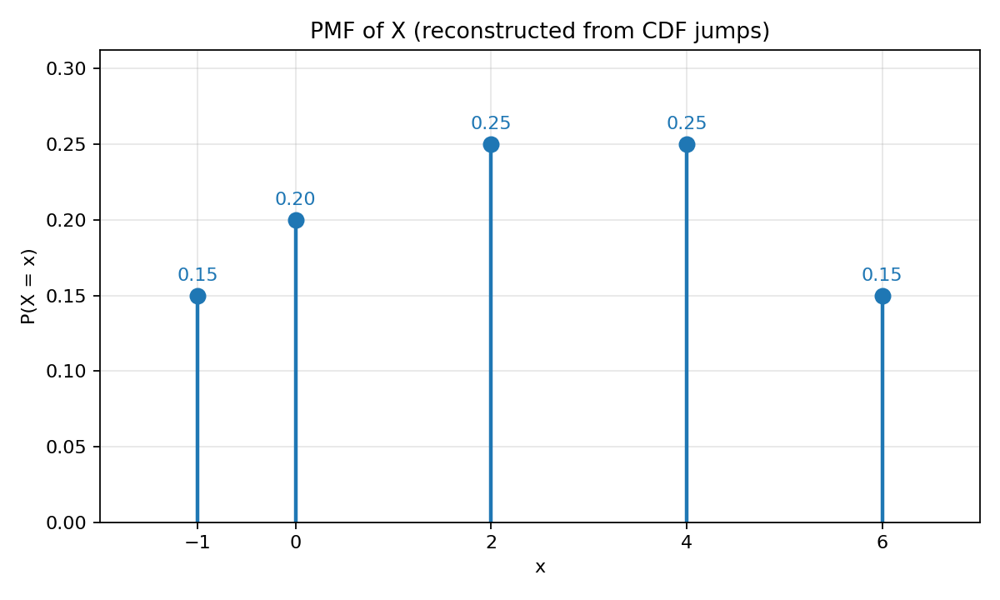
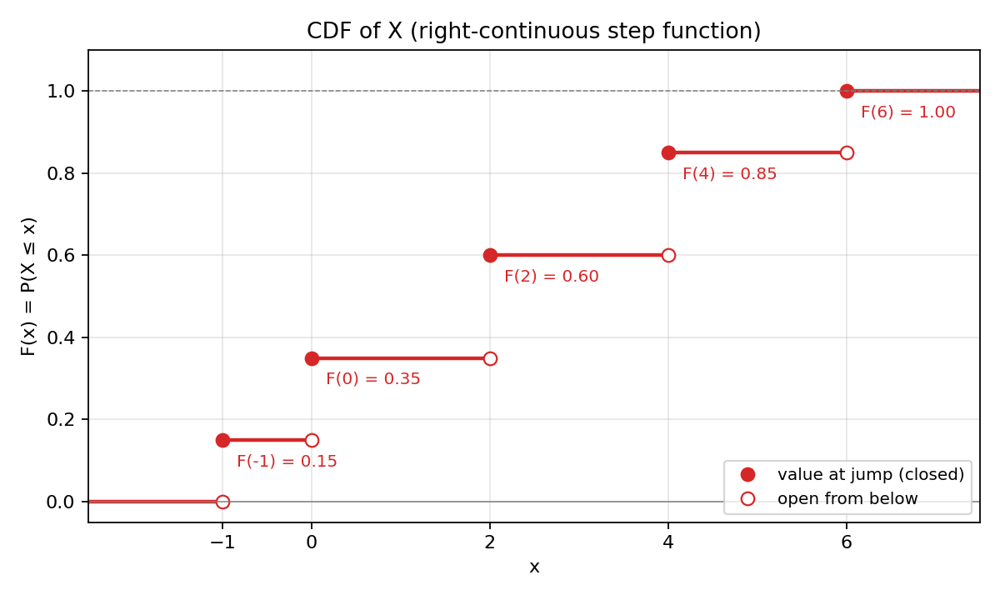

# Problem 2 — Discrete Distribution Given by a CDF Table

The CDF is given directly at five support points as

| $x$      | $-1$  | $0$   | $2$   | $4$   | $6$   |
|----------|:-----:|:-----:|:-----:|:-----:|:-----:|
| $F(x)$   | 0.15  | 0.35  | 0.60  | 0.85  | 1.00  |

### How to read the table

Each cell on the bottom row is a **cumulative probability**, not a point probability. The number $0.60$ in the column $x=2$ is read as

> *“if we run the random experiment once, the chance that the random variable $X$ comes out **at most** $2$ is $60\%$”.*

This is fundamentally different from Task 1, where $0.30$ in a PMF column meant “exactly $30\%$ at that single value”. Here $F(2)=0.60$ **includes** the mass at $-1$, at $0$, **and** at $2$ itself — it is a **running total** from the left, not an isolated weight on one point.

The five columns together tell us where $F_X$ **jumps** and how high it climbs at each step. Between listed values $F_X$ is flat (no new probability is accumulated); at each listed $x$ it steps up. The last value $F(6)=1.00$ means that by $x=6$ we have collected **all** probability — there is no mass beyond $6$.

A quick contrast with Task 1 helps fix the intuition:

| Question | Natural reading from **PMF** (Task 1) | Natural reading from **CDF** (Task 2) |
|----------|--------------------------------------|---------------------------------------|
| “How likely is exactly $2$?” | Read $p_X(2)$ directly | Need a jump: $F(2)-F(2^-)$ |
| “How likely is at most $2$?” | Sum masses $\le 2$ | Read $F(2)$ directly |
| “What is the shape / mode?” | Visible in stem heights | Hidden until you difference |

Task 1 started from the PMF and **built** the CDF by partial sums. Task 2 reverses the direction: we start from the CDF and **recover** the PMF by taking differences (jumps). That inversion is the whole pedagogical point of the exercise.

### What this report does

Even though the CDF table looks like the whole story, a random variable still lives on a probability space $(\Omega,\mathcal{F},P)$ and is a function $X:\Omega\to\mathbb{R}$. The CDF table is only the *fingerprint* of that function’s distribution — and this time the fingerprint is given in **cumulative** form rather than **point-mass** form.

The goal is to complete nine steps, in this order:

1. **Build a concrete world** $(\Omega,\mathcal{F},P)$ and a function $X$ whose CDF matches the table — and show, as in Task 1, that this world is not unique.
2. **Verify** that the numbers really describe a valid CDF (monotone, in $[0,1]$, ends at $1$) **before** applying the jump rule.
3. **Reconstruct the PMF** from the jumps of $F_X$ — the central computational step of this task.
4. **Draw the PMF** (now derived) and **redraw the CDF** (given), emphasising its stepwise character.
5. **List** every jump point and **prove** why jump height equals point probability.
6. **Compute** several probabilities **using the CDF first** (the natural input here), then cross-check via the recovered PMF.
7. **Compare** with Task 1: what information is immediate from PMF vs. from CDF.
8. **Extend** the interactive tool from Task 1 so it also accepts CDF input.

Most of the work is still bookkeeping, but every step has a precise reason behind it; the text below explains each formula in words before plugging in numbers — exactly as in Task 1, but travelling in the opposite direction.

---

## Theory — concepts used

Before any computation, fix the vocabulary. Task 2 reuses the same objects as Task 1; what changes is **which table is given** and **which direction we travel** between PMF and CDF.

| Symbol | Name | Meaning |
|--------|------|---------|
| $(\Omega,\mathcal{F},P)$ | **Probability space** (Kolmogorov triple) | $\Omega$ — set of elementary outcomes; $\mathcal{F}\subseteq 2^{\Omega}$ — $\sigma$-algebra of events; $P:\mathcal{F}\to[0,1]$ — probability measure satisfying K1, K2, K3. |
| $\omega\in\Omega$ | **Elementary outcome** | A single, indivisible result of the random experiment. |
| $X:\Omega\to\mathbb{R}$ | **(Real) random variable** | Measurable map; here $\Omega$ is finite so every function is measurable. |
| $\operatorname{supp}(X)=\{x\in\mathbb{R}:P(X=x)>0\}$ | **Support of $X$** | Set of values that $X$ actually attains with positive probability. **Not** the same as $\Omega$. |
| $p_X(x)=P(X=x)$ | **PMF** (probability mass function) | **Derived** in this task — recovered from CDF jumps. |
| $F_X(x)=P(X\le x)$ | **CDF** (cumulative distribution function) | **Given** by the problem table — our starting point. |
| $F_X(x^-)=\lim_{t\uparrow x}F_X(t)$ | **Left limit** of CDF at $x$ | Value just **before** a possible jump; at support point $x_k$ equals $F(x_{k-1})$ with $F(x_0^-):=0$. |

### Each object, in plain words

- **Probability space.** Think of $\Omega$ as the *menu* of everything that can possibly happen in one run of the experiment; $\mathcal{F}$ as the collection of *questions* we are allowed to ask; and $P$ as the *machine* that assigns a number in $[0,1]$ to each question. Kolmogorov’s axioms (K1 non-negativity, K2 normalization, K3 additivity) are unchanged — only the **table we are handed** is different.
- **Elementary outcome $\omega$.** One finished trial. In Part 0 we will realise the CDF with five outcomes (Construction A) or twenty equiprobable ones (Construction B).
- **Random variable $X$.** A function that reads $\omega$ and reports a number. The CDF table sees $X$ only through cumulative questions “how much mass is $\le x$?”, not through raw outcomes.
- **CDF $F_X$ — given.** The table lists $F_X$ at five jump points. Between them $F_X$ is constant; at each listed $x$ it jumps up. Right-continuity means the **new level is taken at $x$**, not after it.
- **PMF $p_X$ — derived.** We do **not** receive $P(X=x)$ directly. We **compute** it as the height of each jump. Until Part 1 is done, questions like “what is the mode?” cannot be answered from the CDF column alone.
- **Left limit $F_X(x^-)$.** On the staircase graph: the **open circle** at a jump — the value approached from below. The **closed circle** is $F_X(x)$. Their difference is $p_X(x)$.

### Direction of travel: Task 1 vs. Task 2

| Step | Task 1 (PMF given) | Task 2 (CDF given) |
|------|--------------------|--------------------|
| Input | $p_X(x_k)$ | $F_X(x_k)$ at jump points |
| Verify | $\sum p_k=1$, $p_k\ge 0$ | $F$ monotone, $F(x_n)=1$, jumps $\ge 0$ |
| Derive other | $F(x_k)=\sum_{x_j\le x_k} p_j$ (partial **sum**) | $p(x_k)=F(x_k)-F(x_{k-1})$ (first **difference**) |
| Graph that matches input | PMF stems | CDF staircase |

These are inverse operations. Summing PMF rows gives CDF rows; differencing CDF rows gives PMF rows.

### Valid CDF checklist (before recovering PMF)

A finite table $F(x_1),\dots,F(x_n)$ at increasing points $x_1<\cdots<x_n$ can come from a discrete random variable **only if**:

| # | Condition | Meaning in words | Check on our table |
|:-:|-----------|------------------|--------------------|
| 1 | $0\le F(x_k)\le 1$ | CDF values are probabilities | $0.15,\,0.35,\,0.60,\,0.85,\,1.00$ — all in $[0,1]$. ✓ |
| 2 | $F(x_n)=1$ | After the last jump all mass is collected | $F(6)=1.00$. ✓ |
| 3 | $F(x_1)\le F(x_2)\le\cdots\le F(x_n)$ | CDF never decreases (more mass included as $x$ grows) | $0.15\le 0.35\le 0.60\le 0.85\le 1.00$. ✓ |
| 4 | $F(x_k)-F(x_{k-1})\ge 0$ | Every jump height is non-negative (implicit in row 3) | $0.15,\,0.20,\,0.25,\,0.25,\,0.15$ — all $\ge 0$. ✓ |

If row 3 failed (e.g. $F(2)<F(0)$), the table would contradict the definition $F(x)=P(X\le x)$ — including more values cannot decrease the probability. If row 4 failed, the jump rule would produce a **negative** “probability”, which is impossible.

### Two facts that will be used over and over

The whole report rests on the same two rules as Task 1. In Task 2 the **jump rule** is the primary tool; the **interval dictionary** makes cumulative questions one-step reads.

1. **Jump rule.** For every $x\in\mathbb{R}$,
   $$P(X = x) \;=\; F_X(x)-F_X(x^-).$$
   In words: the **probability of hitting a single point** equals the **height of the step** of the CDF at that point. Where $F_X$ does not jump, $p_X(x)=0$. For our table, jumps occur only at $x\in\{-1,0,2,4,6\}$; at $x=1$ or $x=3.5$ there is no jump, so $P(X=1)=P(X=3.5)=0$.

2. **Interval-to-CDF dictionary.** For any real $a\le b$:

   | Event | Probability (in terms of $F_X$) |
   |-------|----------------------------------|
   | $\{X\le a\}$ | $F_X(a)$ |
   | $\{X< a\}$ | $F_X(a^-)$ |
   | $\{X\ge a\}$ | $1-F_X(a^-)$ |
   | $\{X> a\}$ | $1-F_X(a)$ |
   | $\{a<X\le b\}$ | $F_X(b)-F_X(a)$ |
   | $\{a\le X\le b\}$ | $F_X(b)-F_X(a^-)$ |
   | $\{X=a\}$ | $F_X(a)-F_X(a^-)$ |

   How to read this table: the **strict / non-strict** distinction at endpoint $a$ decides whether you write $F_X(a)$ or $F_X(a^-)$. If $a$ is **included**, use $F_X(a)$; if **excluded**, use $F_X(a^-)$. In Task 2 this dictionary is especially valuable because **we already have $F_X$ in hand** — cumulative and interval questions become direct table lookups without summing PMF masses first.

---

## Part 0 — Constructing a probability space $(\Omega,\mathcal{F},P)$ and the random variable $X$

The CDF table only fixes the **distribution** $\mathcal{L}(X)$. It does **not** fix $\Omega$, nor the map $X$ itself. Many different triples $(\Omega,\mathcal{F},P)$ can realise the same CDF; constructing one explicitly shows the table is not a formal symbol but comes from a real random experiment.

Why does this matter? The problem asks for “one possible finite probability space” **before** working with PMF/CDF formulas — the same requirement as Task 1. We first recover the PMF in Part 1, then use it here to label outcomes. We give two constructions, deliberately different, as in Task 1.

### Construction A — minimal model (5 outcomes, non-uniform $P$)

The simplest world: one elementary outcome per support point. There is no smaller $\Omega$ because the support has five values.

$$\Omega_A=\{\omega_1,\omega_2,\omega_3,\omega_4,\omega_5\},\qquad \mathcal{F}_A=2^{\Omega_A}.$$

After Part 1 we know the PMF. Assign on atoms and define $X_A$:

| $k$ | $P_A(\{\omega_k\})=p_X(x_k)$ | $X_A(\omega_k)$ |
|:---:|:----------------------------:|:---------------:|
| 1 | $0.15$ | $-1$ |
| 2 | $0.20$ | $0$ |
| 3 | $0.25$ | $2$ |
| 4 | $0.25$ | $4$ |
| 5 | $0.15$ | $6$ |

Extend $P_A$ additively on $\mathcal{F}_A$: for any event $A$, sum the atomic probabilities of the singletons in $A$. Because $\Omega_A$ is finite, this defines $P_A$ completely.

| Step | Check | Result |
|:----:|-------|--------|
| 1 | Non-negativity of $P_A$ | All five values in $[0,1]$. ✓ |
| 2 | Normalization | $0.15+0.20+0.25+0.25+0.15=1.00$. ✓ |
| 3 | Recover CDF at support points | $P_A(X_A\le x_k)=\sum_{j\le k}p_j=F(x_k)$ from the given table. ✓ |

The third row: $\{X_A\le x_k\}=\{\omega_1,\dots,\omega_k\}$, a disjoint union, so $P_A(X_A\le x_k)=\sum_{j=1}^k p_j$. These partial sums are exactly the given $F(x_k)$ — the same link Task 1 discovered from the PMF side.

### Construction B — uniform model (20 equiprobable outcomes)

Every elementary outcome equally likely; probabilities reduce to counting. We need atomic probability $1/N$ such that all recovered $p_k$ are multiples of $1/N$.

Writing over $100$: $\tfrac{15}{100},\,\tfrac{20}{100},\,\tfrac{25}{100},\,\tfrac{25}{100},\,\tfrac{15}{100}$. $\gcd(15,20,25,15)=5$, so least common denominator $100/5=20$. Take $N=20$:

$$\Omega_B=\{1,\dots,20\},\qquad \mathcal{F}_B=2^{\Omega_B},\qquad P_B(\{k\})=\tfrac{1}{20}.$$

Partition into blocks of sizes $3,4,5,5,3$:

| Block | Outcomes $k$ | Size | $X_B(k)$ |
|-------|--------------|:----:|:--------:|
| $B_1$ | $\{1,2,3\}$ | 3 | $-1$ |
| $B_2$ | $\{4,5,6,7\}$ | 4 | $0$ |
| $B_3$ | $\{8,9,10,11,12\}$ | 5 | $2$ |
| $B_4$ | $\{13,14,15,16,17\}$ | 5 | $4$ |
| $B_5$ | $\{18,19,20\}$ | 3 | $6$ |

Check: $3+4+5+5+3=20$ and $3/20=0.15$, $4/20=0.20$, $5/20=0.25$, $3/20=0.15$. **Interpretation:** roll a fair 20-sided die; the face label gives $X$. Reporting “$2$” means rolling one of faces $8,\dots,12$ — probability $5/20=0.25$.

**The same distribution from two different worlds.** Constructions A and B use different $\Omega$, different measures (non-uniform vs. uniform), yet produce the same CDF. The CDF table, like the PMF table in Task 1, is a **class invariant** — it sees only what $X$ outputs cumulatively, not how the mechanism is built.

**Important distinction.** $|\Omega_B|=20$ but $|\operatorname{supp}(X_B)|=5$. Several raw outcomes map to the same value (e.g. faces $1,2,3$ all give $-1$). This is exactly the introduction’s warning: $\Omega$ is raw outcomes; support is values $X$ can print.

---

## Part 1 — Reconstructing the PMF from the jumps of the CDF

This is the **central step** of Task 2 — the inverse of Task 1’s partial-sum construction. At each support point $x_k$,

$$p_X(x_k) \;=\; F_X(x_k) - F_X(x_k^-).$$

For a table given **only at jump points**, $F_X(x_k^-)=F(x_{k-1})$ with convention $F(x_0):=0$ before the first listed point, because $F_X$ is flat on $[x_{k-1}, x_k)$.

**Procedure (step by step):**

| Step | Action | Reason |
|:----:|--------|--------|
| 1 | Sort support points: $-1,0,2,4,6$ | CDF differences require increasing order. |
| 2 | Set “previous cumulative” $F_{\text{prev}}=0$ | Before $-1$, no mass has been collected. |
| 3 | At each $x_k$: compute $p_k=F(x_k)-F_{\text{prev}}$ | Jump rule / first difference. |
| 4 | Update $F_{\text{prev}}\leftarrow F(x_k)$ | Becomes left limit at the next jump. |
| 5 | After last row: check $\sum p_k=1$ | Normalization — must match $F(x_n)=1$. |

**Application to our table:**

| Step | $x_k$ | $F(x_k)$ | $F(x_k^-)=F_{\text{prev}}$ | Jump $p_X(x_k)$ | Interpretation |
|:----:|:-----:|:--------:|:--------------------------:|:---------------:|----------------|
| 1 | $-1$ | $0.15$ | $0.00$ | $0.15$ | First mass enters at $-1$. |
| 2 | $0$ | $0.35$ | $0.15$ | $0.20$ | Additional $0.20$ at $0$. |
| 3 | $2$ | $0.60$ | $0.35$ | $0.25$ | Additional $0.25$ at $2$. |
| 4 | $4$ | $0.85$ | $0.60$ | $0.25$ | Additional $0.25$ at $4$. |
| 5 | $6$ | $1.00$ | $0.85$ | $0.15$ | Final $0.15$ at $6$; total now $1$. |

**Recovered PMF table:**

| $x$        | $-1$ | $0$  | $2$  | $4$  | $6$  |
|------------|:----:|:----:|:----:|:----:|:----:|
| $P(X = x)$ | 0.15 | 0.20 | 0.25 | 0.25 | 0.15 |

**Sanity checks:**

- Every jump is $\ge 0$ — otherwise the input would not be a valid CDF (see Theory checklist).
- Sum: $0.15+0.20+0.25+0.25+0.15=1.00$ — normalization recovered automatically because $F(6)=1$ and $F(-1^-)=0$.

> **Link to Task 1.** In Task 1 we added PMF rows and got CDF rows $0.10,0.35,0.65,0.85,1.00$. Here we **difference** CDF rows $0.15,0.35,0.60,0.85,1.00$ and get PMF rows. Same mathematics, opposite direction.

From Part 1 onward we may treat the recovered table as a *bona fide* PMF and cross-check every CDF-based answer by summing masses.

---

## Part 2 — Graph of the PMF

The recovered PMF is plotted as a **stem (lollipop)** chart — same convention as Task 1: vertical mass at each support point, zero elsewhere.

Why stems and not histogram bars? The distribution is **discrete**; probability lives at points $\{-1,0,2,4,6\}$, not on intervals. A histogram would falsely suggest non-zero probability near, say, $x=1$.

| $x$ | $-1$ | $0$ | $2$ | $4$ | $6$ | else |
|-----|:----:|:----:|:----:|:----:|:----:|:----:|
| $p_X(x)$ | $0.15$ | $0.20$ | $0.25$ | $0.25$ | $0.15$ | $0$ |

**Observations (only visible after PMF recovery):**

- **Mode:** $x=2$ and $x=4$ tie at $0.25$ — **bimodal** distribution.
- **Tails:** $p(-1)=p(6)=0.15$ — symmetric tail masses at the extremes.
- **Hidden in CDF alone:** the raw column $0.15,0.35,0.60,0.85,1.00$ shows running totals, not individual weights. You cannot read “$0.25$ at $2$” without differencing.
- **Normalization visually:** five stem heights sum to $1$; stacking them would build a unit bar.

A useful mental check: each stem height equals one **riser** on the CDF staircase from Part 3 — same number, two pictures.

---

## Part 3 — Graph of the CDF (redrawn, stepwise character emphasised)

The given table is $F_X$ **at jump points**. The full function is the right-continuous step function below. The plot marks **closed dots** (value at the jump) and **open dots** (value from below).

**Two technical reminders** (same as Task 1, but now the CDF is the *given* object):

- The inequality in $P(X\le x)$ is **non-strict** — mass at $x_k$ is included once $x$ reaches $x_k$. Hence jumps occur **at** support points, and $F_X$ is **right-continuous**.
- Between consecutive support points $F_X$ is **constant** — no new mass is accumulated on open intervals like $(0,2)$.

Piecewise formula:

$$
F_X(x)=
\begin{cases}
0.00 & x<-1,\\
0.15 & -1\le x<0,\\
0.35 & 0\le x<2,\\
0.60 & 2\le x<4,\\
0.85 & 4\le x<6,\\
1.00 & x\ge 6.
\end{cases}
$$

**Examples of reading the formula:**

- $F_X(-100)=0$ — left of all mass.
- $F_X(1)=F_X(0)=0.35$ — on $[0,2)$, CDF flat; $1$ is not a jump point.
- $F_X(3.5)=F_X(2)=0.60$ — on $[2,4)$.
- $F_X(100)=1$ — all mass collected.

**Why “redraw carefully”?** A line plot connecting $(-1,0.15),(0,0.35),\dots$ would suggest $F_X$ is continuous — wrong. A discrete law is a **staircase**: horizontal treads, vertical risers **at** support points. Wrong-side jumps would break right-continuity and break the link to $P(X\le x)$.

**Sanity checks of CDF axioms:**

| Axiom | Meaning in words | Check |
|-------|------------------|-------|
| Non-decreasing | More $x$ includes more mass | $0\le 0.15\le\cdots\le 1.00$. ✓ |
| Right-continuous | Closed on the left of each piece | e.g. $F_X(0)=0.35$ on $[0,2)$, not $0.15$. ✓ |
| $\lim_{x\to-\infty}F_X=0$ | Before first jump | First piece is $0$. ✓ |
| $\lim_{x\to+\infty}F_X=1$ | After last jump | Last piece is $1$. ✓ |

---

## Part 4 — All points at which the CDF jumps

$F_X$ is flat on each open interval between consecutive support points and **jumps only** at $x\in\operatorname{supp}(X)=\{-1,0,2,4,6\}$.

| Jump point $x$ | $F_X(x^-)$ | $F_X(x)$ | Jump height $p_X(x)$ |
|:--------------:|:----------:|:--------:|:--------------------:|
| $-1$ | $0.00$ | $0.15$ | $0.15$ |
| $0$ | $0.15$ | $0.35$ | $0.20$ |
| $2$ | $0.35$ | $0.60$ | $0.25$ |
| $4$ | $0.60$ | $0.85$ | $0.25$ |
| $6$ | $0.85$ | $1.00$ | $0.15$ |

At any other real $a$ (e.g. $a=1$, $a=3.5$, $a=100$): $F_X(a^-)=F_X(a)$ — **no jump**, so $P(X=a)=0$.

**Qualitative consequences:**

1. **Total rise = 1.** The staircase climbs from $0$ to $1$; sum of jump heights is $1$ — same as PMF normalization.
2. **Support = jump set.** For discrete $X$, $\operatorname{supp}(X)$ is exactly where $F_X$ jumps. Finding support from a CDF graph means listing every jump point.

---

## Part 5 — Why the jump size at a point equals the probability of that value

**Claim:** For every $x\in\mathbb{R}$, $P(X=x)=F_X(x)-F_X(x^-)$.

**Where does this come from?** The event $\{X\le x\}$ splits into two disjoint pieces:

$$\{X\le x\} \;=\; \{X<x\}\ \sqcup\ \{X=x\}.$$

An outcome cannot be both strictly below $x$ and equal to $x$. By finite additivity (Kolmogorov K3),

$$P(X\le x) \;=\; P(X<x) + P(X=x).$$

By definition $P(X\le x)=F_X(x)$ and $P(X<x)=F_X(x^-)$. Rearranging,

$$P(X=x) \;=\; F_X(x) - F_X(x^-).$$

**In words:** cumulative probability **includes** mass at $x$; strict-left cumulative **excludes** it. Their difference is mass on the single point $\{X=x\}$.

**Concrete reading at $x=2$:** $F_X(2)=0.60$ counts $\{-1,0,2\}$; $F_X(2^-)=0.35$ counts $\{-1,0\}$ only. The extra $0.25$ is $P(X=2)$.

**Concrete reading at $x=1$ (not in support):** On $[0,2)$, $F_X\equiv 0.35$, so $F_X(1^-)=F_X(1)=0.35$, jump $=0$, hence $P(X=1)=0$.

This is the theoretical heart of Part 1’s differencing procedure: we are not merely subtracting table rows — we are applying a theorem that follows from the definition of $F_X$ and K3.

---

## Part 6 — Computing probabilities using the CDF

We demonstrate every common question type. Each example is answered **first via CDF** (natural here), then **cross-checked via recovered PMF** from Part 1.

**General advice:** always check whether each endpoint is **included or excluded** before writing $F_X(a)$ vs. $F_X(a^-)$. This is the main trap — in Task 2 it matters even more because the CDF is our primary tool.

### Example 6.1 — $P(X \le 2)$

“At most $2$” — the canonical CDF question. One table lookup.

| Method | Computation | Result |
|--------|-------------|:------:|
| CDF (direct) | $F_X(2)$ — read from table | $0.60$ |
| PMF (check) | $p(-1)+p(0)+p(2)=0.15+0.20+0.25$ | $0.60$ |

This is what CDF is **for**: cumulative questions need no summation when $F$ is already known.

### Example 6.2 — $P(X < 2)$

Strict inequality: exclude mass at $2$.

| Method | Computation | Result |
|--------|-------------|:------:|
| CDF | $F_X(2^-)=F_X(0)=0.35$ | $0.35$ |
| PMF | $p(-1)+p(0)=0.15+0.20$ | $0.35$ |

On $[0,2)$ the CDF is constant at $0.35$, so the left limit at $2$ equals $F_X(0)$. Note $F_X(2)-F_X(2^-)=0.60-0.35=0.25=p(2)$ — the jump rule again; the gap between Examples 6.1 and 6.2 is exactly the point mass at $2$.

### Example 6.3 — $P(X = 4)$

Point probability — requires the jump rule (not a raw CDF entry).

| Method | Computation | Result |
|--------|-------------|:------:|
| CDF (jump) | $F_X(4)-F_X(4^-)=0.85-0.60$ | $0.25$ |
| PMF | $p_X(4)$ | $0.25$ |

This is the reverse of Task 1’s experience: there $P(X=a)$ was a direct PMF read; here it needs differencing.

### Example 6.4 — $P(0 < X \le 4)$

$0$ excluded (strict $<$), $4$ included (non-strict $\le$). Dictionary: $F_X(4)-F_X(0)$.

| Method | Computation | Result |
|--------|-------------|:------:|
| CDF | $F_X(4)-F_X(0)=0.85-0.35$ | $0.50$ |
| PMF | $p(2)+p(4)=0.25+0.25$ | $0.50$ |

On the staircase: height climbed from $x=0$ to $x=4$ — two risers at $2$ and $4$, total $0.50$.

### Example 6.5 — $P(X > 4)$

Complement of $\{X\le 4\}$: $P(X>4)=1-F_X(4)$.

| Method | Computation | Result |
|--------|-------------|:------:|
| CDF | $1-F_X(4)=1-0.85$ | $0.15$ |
| PMF | $p(6)=0.15$ | |

Only $x=6$ exceeds $4$ on the support.

### Example 6.6 — $P(X = 1)$ (not in support)

| Method | Computation | Result |
|--------|-------------|:------:|
| CDF | $F_X(1)-F_X(1^-)=0.35-0.35$ | $0.00$ |
| PMF | $1\notin\operatorname{supp}(X)$ | $0.00$ |

Between $0$ and $2$ the CDF is flat — no jump at $1$. Illustrates Part 5: continuity of $F_X$ at $a$ implies $P(X=a)=0$.

### Example 6.7 — $P(-1 \le X \le 4)$

Both endpoints are support points; both included.

| Method | Computation | Result |
|--------|-------------|:------:|
| CDF | $F_X(4)-F_X(-1^-)=0.85-0.00$ | $0.85$ |
| PMF | $0.15+0.20+0.25+0.25$ | $0.85$ |

$F_X(-1^-)=0$ because $-1$ is the first jump; nothing is collected strictly before $-1$.

### Example 6.8 — $P(X \ge 0)$

Complement of $\{X<0\}$: $1-F_X(0^-)=1-F_X(-1)=1-0.15$.

| Method | Computation | Result |
|--------|-------------|:------:|
| CDF | $1-F_X(-1)=1-0.15$ | $0.85$ |
| PMF | $1-p(-1)=1-0.15$ | $0.85$ |

**Trick:** $F_X(0^-)=F_X(-1)$ on the flat segment $[-1,0)$ — left limit at $0$ equals CDF value at previous support point $-1$.

### Summary table for Part 6

| Event | CDF computation | PMF check | Value |
|-------|-----------------|-----------|:-----:|
| $\{X\le 2\}$ | $F_X(2)$ | sum $x\le 2$ | $0.60$ |
| $\{X<2\}$ | $F_X(2^-)=F_X(0)$ | $p(-1)+p(0)$ | $0.35$ |
| $\{X=4\}$ | $F_X(4)-F_X(4^-)$ | $p(4)$ | $0.25$ |
| $\{0<X\le 4\}$ | $F_X(4)-F_X(0)$ | $p(2)+p(4)$ | $0.50$ |
| $\{X>4\}$ | $1-F_X(4)$ | $p(6)$ | $0.15$ |
| $\{X=1\}$ | $F_X(1)-F_X(1^-)$ | $0$ | $0.00$ |
| $\{-1\le X\le 4\}$ | $F_X(4)-F_X(-1^-)$ | four masses | $0.85$ |
| $\{X\ge 0\}$ | $1-F_X(-1)$ | $1-p(-1)$ | $0.85$ |

All eight rows agree. This is not coincidence — PMF and CDF encode the same distribution. In Task 2, cumulative questions (6.1, 6.2, 6.4, 6.5, 6.7, 6.8) were essentially **one-step CDF reads**; point questions (6.3, 6.6) needed the jump rule — the mirror image of Task 1.

---

## Part 7 — Comparison with Task 1

| Aspect | Task 1 (PMF given) | Task 2 (CDF given) |
|--------|--------------------|--------------------|
| **Starting object** | Table of $P(X=x)$ | Table of $F(x)=P(X\le x)$ at jumps |
| **First verification** | $\sum p_k=1$, $p_k\ge 0$ | CDF monotone, in $[0,1]$, $F(x_n)=1$ |
| **Derive other function** | Partial **sums** $\to$ CDF | First **differences** $\to$ PMF |
| **Immediate from PMF** | $P(X=a)$, mode, shape | Must difference first |
| **Immediate from CDF** | Must sum first | $P(X\le a)$, $P(X<a)$, $F(b)-F(a)$ for intervals |
| **Graph matching input** | PMF stems = given data | CDF staircase = given data |
| **Typical modelling** | Count outcomes $\to$ PMF | Empirical / tabulated CDF measured first |
| **Same link** | $p_X(x)=F_X(x)-F_X(x^-)$ and $F_X(x)=\sum_{x_k\le x}p_k$ | Same |

**Additional points:**

- **Neither table determines $\Omega$.** Both tasks need Part 0-style constructions; the distribution is invariant under different worlds.
- **Both need the jump rule** for point probabilities when starting from CDF, and **both need summation** for cumulative probabilities when starting from PMF.
- **Complete workflow** always has both representations and checks agreement — as in Part 6.

**Bottom line.** Task 1 and Task 2 are the **same mathematics in opposite directions**. If you care about “exactly this value?”, PMF is natural. If you care about “at most?” or “between?”, CDF is natural. A full solution — like this report — derives both and verifies they match.

---

## Part 8 — Extended interactive application (PMF **or** CDF input)

The file [`interactive.html`](interactive.html) extends the Task 1 viewer with a **mode switch**:

1. **PMF mode** — edit $(x,\,P(X=x))$; live check $\sum p_k=1$; stems + staircase (Task 1 workflow).
2. **CDF mode** — edit $(x,\,F(x))$ at jump points; app validates monotonicity and $F(x_n)=1$, **reconstructs PMF by differencing** (Task 2 workflow), displays recovered PMF table, then draws both graphs and computes seven standard probabilities.

**Why this closes the loop:** Task 1’s tool assumed PMF input; Task 2’s requirement is to accept CDF input and invert automatically — demonstrating that the jump rule is not pencil-and-paper only but algorithmic.

Preloaded presets:

- **Reset to Task 2 (CDF)** — this problem’s table, CDF mode.
- **Reset to Task 1 (PMF)** — switches to PMF mode for side-by-side comparison.

No external libraries. Static figures from [`plot.py`](plot.py); rerun `python plot.py` to regenerate.

---

## Consistency check

Before declaring the problem solved, we collect every property that must hold if the work is correct.

| Item | Check | Status |
|------|-------|:------:|
| CDF values in $[0,1]$ | All five listed | ✓ |
| CDF non-decreasing | $0.15\le\cdots\le 1.00$ | ✓ |
| $F(x_n)=1$ | $F(6)=1.00$ | ✓ |
| Recovered PMF non-negative | All jumps $\ge 0$ | ✓ |
| Recovered PMF sums to $1$ | $0.15+\cdots+0.15=1.00$ | ✓ |
| Jump rule at all five support points | Part 4 table | ✓ |
| CDF piecewise formula matches plot | Part 3 | ✓ |
| CDF vs PMF on eight probability questions | Part 6 summary | ✓ |
| $\Omega\ne\operatorname{supp}(X)$ in uniform model | $|\Omega_B|=20$, $|\operatorname{supp}|=5$ | ✓ |
| Interactive CDF mode reproduces this table | `interactive.html` | ✓ |

Every formal requirement of Task 2 (items 0–8) is satisfied. The CDF table was validated, PMF was recovered by differencing, both graphs were drawn, jump points were listed and explained, probabilities were computed primarily via CDF and cross-checked via PMF, comparison with Task 1 was made explicit, and the interactive tool accepts CDF input — completing the inverse journey from Task 1.
