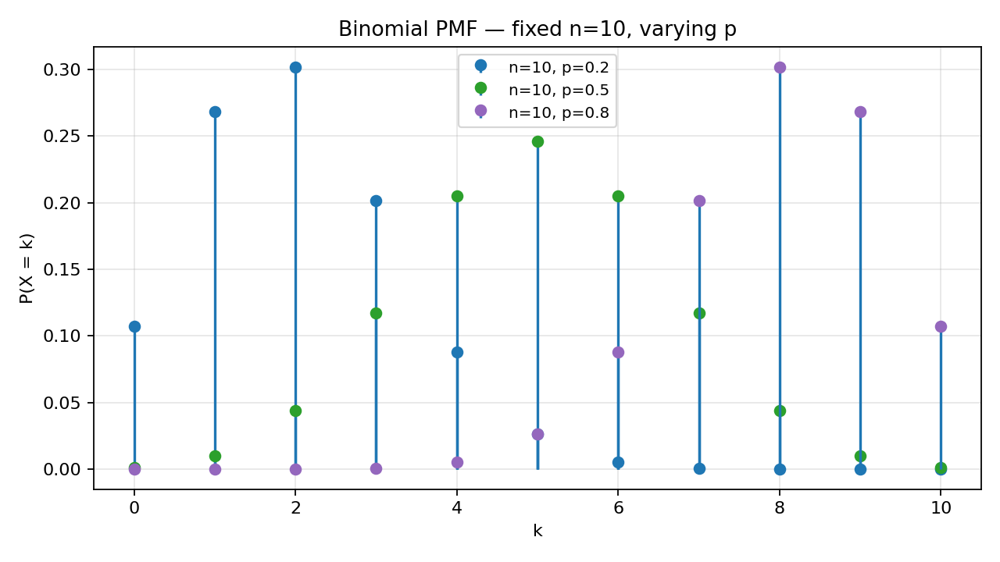
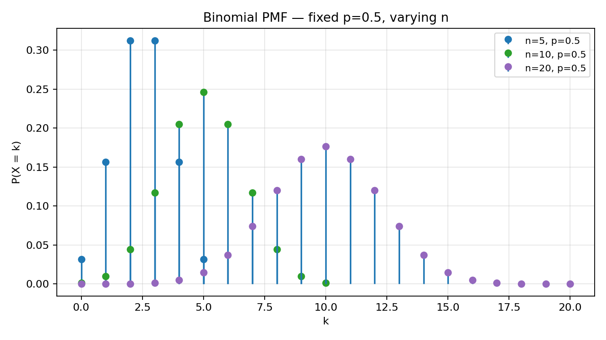
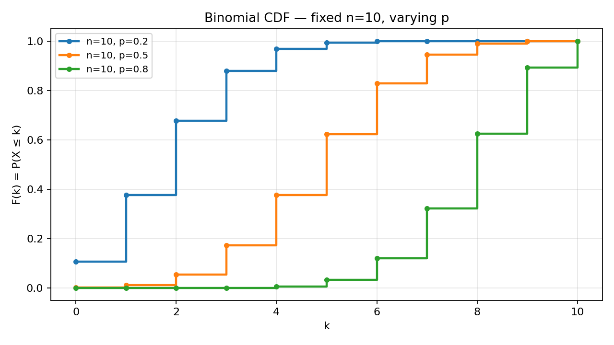
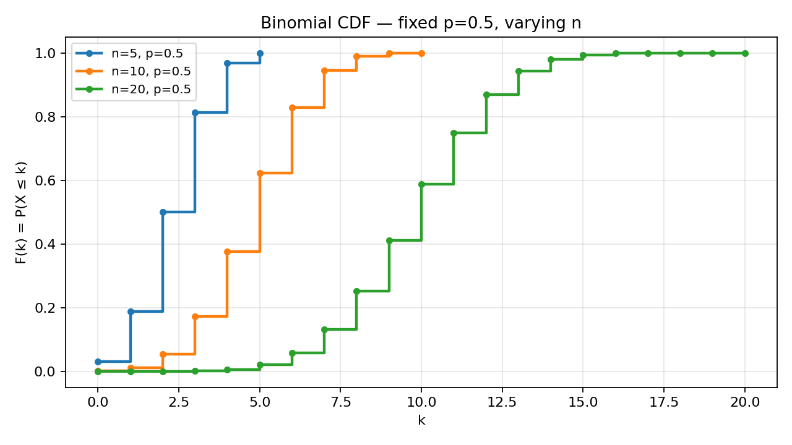

# Problem 3 — Binomial Distribution $\mathrm{Bin}(n,p)$

The binomial family models the **number of successes** in a fixed number of **independent, identical Bernoulli trials**. Each trial has two outcomes — traditionally called *success* (coded $1$) and *failure* (coded $0$) — and the success probability $p$ is the same on every trial. The parameters are:

- $n\in\mathbb{N}$ — the **number of trials** (fixed before the experiment begins),
- $p\in[0,1]$ — the **success probability** on each trial.

We write $X\sim\mathrm{Bin}(n,p)$ when the random variable $X$ follows this law.

### How to read the notation

The symbol $\mathrm{Bin}(n,p)$ is read *“binomial with $n$ trials and success probability $p$”*. It is **not** a table of numbers handed to us (as in Tasks 1 and 2) but a **parametric family**: once you choose $(n,p)$, the entire PMF and CDF are determined by closed formulas. Changing $n$ or $p$ changes the shape of every graph in Parts 3–5.

In **Tasks 1 and 2**, the distribution arrived as a **finished artefact**: a table of values and probabilities (Task 1) or a cumulative table built from one (Task 2). You could read off $P(X=k)$ directly from a cell, verify that the rows sum to $1$, and only then ask what sample space might sit behind it. The support was whatever values appeared in the header row; there was no formula connecting one row to the next — each mass was its own independent number. Task 3 **reverses part of that workflow**. We still build $\Omega$ and define $X$ explicitly, as in Task 1, but we no longer receive the PMF as input. We **derive** it from the physics of the experiment: $n$ independent Bernoulli trials with common success probability $p$. The two parameters $(n,p)$ replace a long list of numerical masses.

The payoff of a parametric family is **generality**. One closed formula covers every $n\in\mathbb{N}$ and every $p\in[0,1]$ simultaneously. Software libraries expose a single function such as `binom.pmf(k, n, p)` rather than a fresh table for each problem instance. Graphs in Parts 3–5 become **parameter sweeps**: slide $p$ or $n$ and watch the entire shape morph in a predictable way. That is the hallmark of a named distribution — the law is a *rule*, not a one-off spreadsheet row. Tasks 4–7 in this chapter introduce more such families (geometric, Poisson, uniform, exponential, normal); the binomial is the template for how they all work: name the experiment, write the PMF, read off the CDF as partial sums, then compute probabilities by whichever route is shorter.

A quick anchor case: when $n=1$, there is only one trial, so $X$ can be $0$ or $1$. That is exactly the **Bernoulli** distribution — the binomial family contains Bernoulli as its simplest member: $\mathrm{Bin}(1,p)=\mathrm{Bernoulli}(p)$.

### What this report does

Even though the binomial formulas are standard textbook material, the task list still asks us to begin from a **probability space** — the same discipline as Tasks 1 and 2. A distribution is not merely a formula; it is the law of a random variable defined on an experiment.

The goal is to complete ten steps, in this order:

1. **Model the experiment** as $n$ Bernoulli trials: specify $\Omega$, an elementary outcome $\omega$, and $X(\omega)$ as the count of successes.
2. **Write the PMF** and explain the combinatorial factor $\binom{n}{k}$.
3. **Identify the support** $\{0,1,\dots,n\}$.
4. **Draw PMF graphs** for fixed $n$ with varying $p$, and for fixed $p$ with varying $n$.
5. **Draw the corresponding CDF graphs** for the same parameter choices.
6. **Explain** how shape changes when $p$ increases and when $n$ increases.
7. **Compute eight probabilities** for a working example ($n=10$, $p=0.4$), using **both** the PMF (direct summation / formula) and the CDF (cumulative reads and complements), and verify agreement.
8. **Compare** when the PMF is more convenient and when the CDF is more convenient.
9. **Describe practical applications** (quality control, surveys, clinical trials).
10. **Point to** the shared distribution visualizer for interactive exploration.

Most of the work is still bookkeeping, but every step has a precise reason behind it; the text below explains each formula in words before plugging in numbers — exactly as in Tasks 1 and 2.

Unlike Task 1, you will not receive a finished PMF table at the top of the page. Unlike Task 2, you will not receive a finished CDF either. Instead, you receive **parameters** $(n,p)$ and a story about Bernoulli trials. The report’s job is to show that the story determines a unique distribution, that the distribution has the binomial PMF, and that every probability question in Parts 6–7 can be answered by the same PMF/CDF machinery you already learned — now with formulas replacing table cells.

---

## Theory — concepts used

Before any computation, fix the vocabulary. The binomial model reuses the same Kolmogorov objects as Tasks 1–2; what is new is the **parametric PMF** and the **Bernoulli-trial sample space**.

| Symbol | Name | Meaning |
|--------|------|---------|
| $(\Omega,\mathcal{F},P)$ | **Probability space** | $\Omega$ — elementary outcomes; $\mathcal{F}$ — admissible events; $P$ — probability measure (K1–K3). |
| $\omega\in\Omega$ | **Elementary outcome** | One full run of $n$ trials, e.g. a sequence of $n$ success/failure symbols. |
| $X:\Omega\to\mathbb{R}$ | **Random variable** | $X(\omega)=$ number of successes (1s) in $\omega$. |
| $\operatorname{supp}(X)=\{0,1,\dots,n\}$ | **Support** | All integers from $0$ to $n$ have positive PMF when $0<p<1$. |
| $p_X(k)=P(X=k)$ | **PMF** | $\binom{n}{k}p^k(1-p)^{n-k}$ for $k=0,\dots,n$. |
| $F_X(k)=P(X\le k)$ | **CDF** | Right-continuous step function; at integer $k$, equals partial sum of PMF. |
| $p$ | **Success probability** | Same on every trial; $1-p$ is failure probability. |
| $n$ | **Number of trials** | Fixed; determines support size and combinatorial structure. |

### Each object, in plain words

The vocabulary table above lists symbols; the bullets below explain **why** each object appears in a binomial report and how it connects back to Tasks 1–2. Read them as a bridge from the abstract Kolmogorov triple to the concrete experiment of flipping $n$ biased coins.

- **Probability space.** Think of $\Omega$ as the complete list of everything that can happen when you run all $n$ trials once. For the binomial model we can take $\Omega=\{0,1\}^n$, the set of all $n$-tuples of zeros and ones. Each tuple is one *full story* of the experiment: trial 1 succeeded or failed, trial 2 succeeded or failed, and so on. The measure $P$ assigns probability $p$ to each success coordinate and $1-p$ to each failure coordinate, independently across coordinates.
- **Elementary outcome $\omega$.** A single $n$-tuple, such as $(1,0,1,0,0,1,0,0,1,0)$ when $n=10$. It records the raw sequence; we have not yet collapsed it to a count.
- **Random variable $X$.** A function that **forgets the order** and reports only *how many* successes appeared: $X(\omega)=\sum_{i=1}^n \omega_i$. Many different sequences share the same count (e.g. $(1,0,1)$ and $(0,1,1)$ both give $X=2$ when $n=3$), which is why $|\Omega|=2^n$ is much larger than $|\operatorname{supp}(X)|=n+1$.
- **PMF $p_X$.** Answers “exactly $k$ successes?” by counting how many sequences have $k$ ones, then multiplying by the probability of any one such sequence. The binomial coefficient $\binom{n}{k}$ is that count; $p^k(1-p)^{n-k}$ is the probability of one specified $k$-success pattern.
- **CDF $F_X$.** Answers “at most $k$ successes?” by adding PMF masses from $0$ up to $k$. For integer $k$, $F_X(k)=\sum_{j=0}^{k}p_X(j)$ — a partial sum, exactly as in Task 1.
- **Parameters $(n,p)$.** $n$ sets the **scale** (how many trials, hence maximum count). $p$ sets the **bias** (how success-prone each trial is). Together they determine the entire family member; there is no separate table to look up.

### Bernoulli distribution as $\mathrm{Bin}(1,p)$

The **Bernoulli** experiment is one trial with success probability $p$. Sample space $\Omega=\{0,1\}$ or $\{\text{fail},\text{succ}\}$; $X(\omega)=\omega\in\{0,1\}$.

| Quantity | Bernoulli$(p)$ | $\mathrm{Bin}(1,p)$ |
|----------|----------------|---------------------|
| Support | $\{0,1\}$ | $\{0,1\}$ |
| $P(X=1)$ | $p$ | $\binom{1}{1}p^1(1-p)^0=p$ |
| $P(X=0)$ | $1-p$ | $\binom{1}{0}p^0(1-p)^1=1-p$ |

So Bernoulli is not a separate universe — it is the **$n=1$ slice** of the binomial family. Every formula in this report with $n=1$ reduces to the two-point Bernoulli law.

When you meet “Bernoulli trial” language in applications, translate it immediately to $\mathrm{Bin}(1,p)$: one trial, support $\{0,1\}$, PMF $(1-p,p)$. When you meet “repeat the Bernoulli trial $n$ times and count successes”, translate to $\mathrm{Bin}(n,p)$. The whole report is the second sentence made rigorous.

### Two facts that will be used over and over

The whole report rests on the same two rules as Tasks 1 and 2. For the binomial family they take a **closed form** (PMF formula) plus **partial sums** (CDF).

1. **Jump rule.** For every $x\in\mathbb{R}$,
   $$P(X = x) \;=\; F_X(x)-F_X(x^-).$$
   For integer support, at $k\in\{0,\dots,n\}$: $p_X(k)=F_X(k)-F_X(k-1)$ with $F_X(-1):=0$. The CDF staircase rises by exactly $p_X(k)$ at each support point.

   In words: the **probability of hitting a single count** equals the **height of the step** of the CDF at that count. Task 1 proved this on five support points; here it holds at all $n+1$ points of $\{0,\dots,n\}$ with masses given by the binomial formula instead of table entries.

2. **Interval-to-CDF dictionary.** For integers $a\le b$ on the support:

   | Event | Probability (PMF) | Probability (CDF) |
   |-------|---------------------|-------------------|
   | $\{X\le k\}$ | $\sum_{j=0}^{k}p_X(j)$ | $F_X(k)$ |
   | $\{X< k\}$ | $\sum_{j=0}^{k-1}p_X(j)$ | $F_X(k-1)$ |
   | $\{X\ge k\}$ | $\sum_{j=0}^{n}p_X(j)-\sum_{j=0}^{k-1}p_X(j)$ | $1-F_X(k-1)$ |
   | $\{X> k\}$ | $\sum_{j=k+1}^{n}p_X(j)$ | $1-F_X(k)$ |
   | $\{a\le X\le b\}$ | $\sum_{j=a}^{b}p_X(j)$ | $F_X(b)-F_X(a-1)$ |
   | $\{X=k\}$ | $p_X(k)$ | $F_X(k)-F_X(k-1)$ |

   For binomial $X$, all endpoints are integers, so the strict/non-strict distinction is simply “include $k$ in the sum or stop at $k-1$”.

How to use this dictionary in practice: read the **words** of the event first (“at most”, “at least”, “strictly less”, “between”), then pick the row. Part 6 runs every common pattern on $\mathrm{Bin}(10,0.4)$; if you can map a new word problem to one of those eight events, you can reuse the same PMF or CDF route without re-deriving anything. The binomial formula does not change the dictionary — it only supplies the numbers that go into it.

### Valid PMF checklist (binomial)

For $0<p<1$ and fixed $n$, the binomial PMF satisfies:

| # | Condition | Meaning | Check |
|:-:|-----------|---------|-------|
| 1 | $p_X(k)\ge 0$ | Non-negative masses | Each term is a product of non-negative factors. ✓ |
| 2 | $\sum_{k=0}^{n}p_X(k)=1$ | Total mass is 1 | Binomial theorem: $(p+(1-p))^n=1$. ✓ |
| 3 | $p_X(k)=0$ for $k\notin\{0,\dots,n\}$ | Support is finite | Formula undefined / zero outside range. ✓ |

When $p=0$ or $p=1$, the distribution **degenerates** ($X=0$ or $X=n$ with probability 1); we assume $0<p<1$ for the shape discussions in Parts 3–5 unless stated otherwise.

The checklist is the parametric version of Task 1’s Part 1 verification. There, you checked non-negativity and normalization on five given numbers. Here, you check that the **formula** produces non-negative values and sums to $1$ for every admissible $(n,p)$ — a stronger statement, because one proof covers infinitely many tables at once.

---

## Part 0 — Modelling $n$ Bernoulli trials: $\Omega$, $\omega$, and $X$

Why does this matter? Because textbook statements like “let $X\sim\mathrm{Bin}(10,0.4)$” pack a lot of structure into a compact notation — structure we must unpack if we want to know *where* the formula comes from. Writing down $\Omega=\{0,1\}^n$ and $X(\omega)=\sum x_i$ makes three things concrete at once: what is random (which full sequence of trial outcomes occurs), what we report (only the success count), and why many different sequences collapse to the same reported value. Without that picture, the combinatorial factor $\binom{n}{k}$ in Part 1 can look like a magic trick rather than a count of equally likely patterns. The same discipline as Task 1 applies: a distribution is not merely a formula on paper; it is the law of a random variable defined on an honest probability space.

### The random experiment (in words)

Perform **$n$ independent trials**. On each trial, *success* occurs with probability $p$ and *failure* with probability $1-p$, independently of all other trials. After all $n$ trials finish, count how many successes occurred. That count is $X$.

**Independence** means the outcome of trial $i$ does not change the probabilities on trial $j\neq i$. **Identical distribution** means every trial uses the same $p$. These two assumptions together are what makes the combinatorial PMF valid: any specific sequence with exactly $k$ successes has probability $p^k(1-p)^{n-k}$, regardless of *where* those successes sit.

Concrete picture: imagine ten light bulbs tested one after another, each independently failing with probability $0.6$ (so $p=0.4$ for “still working”). The random variable $X$ is not “which bulb failed first” but “how many of the ten still work” — a single integer summarising the whole batch. That is the binomial use case in one sentence.

### Sample space $\Omega$

A natural choice is the set of all **success/failure sequences** of length $n$:

$$\Omega=\{0,1\}^n=\{(x_1,\dots,x_n): x_i\in\{0,1\}\text{ for each }i\}.$$

Each coordinate $x_i$ records trial $i$: $1=$ success, $0=$ failure. Cardinality $|\Omega|=2^n$ — exponential in $n$, because every trial doubles the number of possible full histories.

**Alternative labelling.** One may write $\Omega=\{\text{S,F}\}^n$ or use bit strings of length $n$; the mathematical content is the same. The introduction to the task list warns: $\Omega$ is **not** the support of $X$. Here $|\Omega|=2^n$ but $X$ outputs only $n+1$ distinct values.

That warning is not pedantic. Beginners often set $\Omega=\{0,1,\dots,n\}$ by mistake — confusing the **count** with the **full trial history**. If you did that, you would lose the ability to justify independence and the product formula for sequence probabilities. The sample space must be large enough to record each trial separately; the random variable then compresses that detail into one integer.

### One elementary outcome $\omega$

An element $\omega\in\Omega$ is one **specific** $n$-tuple. For $n=10$:

$$\omega=(1,0,1,0,0,1,0,0,1,0).$$

Reading left to right: success on trials $1,3,6,9$; failure on the other six trials. This $\omega$ is one point in a sample space of $2^{10}=1024$ equally structured outcomes (not equally probable unless $p=\tfrac12$).

### The random variable $X$

Define

$$X(\omega)=\sum_{i=1}^{n}x_i=\text{number of coordinates equal to }1\text{ in }\omega.$$

For the example above, $X(\omega)=4$. The map $X:\Omega\to\{0,1,\dots,n\}$ is **many-to-one**: every sequence that contains exactly $k$ ones maps to the same value $k$. For instance, when $n=3$, both $(1,0,1)$ and $(0,1,1)$ give $X=2$.

| Object | Example ($n=10$) | Size / range |
|--------|------------------|--------------|
| $\omega$ | $(1,0,1,0,0,1,0,0,1,0)$ | One of $2^{10}$ sequences |
| $X(\omega)$ | $4$ | Integer in $\{0,\dots,10\}$ |
| Event $\{X=4\}$ | All sequences with exactly four 1s | $\binom{10}{4}=210$ sequences |

### Probability measure $P$ on $\Omega$

Under independence and identical $p$, the probability of a **particular** sequence $\omega=(x_1,\dots,x_n)$ factorises:

$$P(\{\omega\})=p^{\sum x_i}(1-p)^{n-\sum x_i}=p^{X(\omega)}(1-p)^{n-X(\omega)}.$$

So every sequence with the same number of successes has the **same** probability; only the count matters for the weight, while the **number of sequences** at each count is handled by $\binom{n}{k}$ when we derive the PMF in Part 1.

This factorisation is the beating heart of the binomial model. If trials were **dependent**, the probability of a sequence would not split into a product of coordinate probabilities — different orderings could carry different weights, and the combinatorial shortcut of Part 1 would fail. If $p$ varied across trials, sequences with the same count of successes could still have different probabilities depending on *which* trials succeeded. Independence plus constant $p$ is what makes “count the patterns, multiply by one weight” valid.

### Minimal sanity check ($n=2$, $p=0.3$)

| $\omega$ | $X(\omega)$ | $P(\{\omega\})$ |
|----------|:-----------:|:---------------:|
| $(0,0)$ | 0 | $0.7^2=0.49$ |
| $(0,1),(1,0)$ | 1 | $0.3\cdot 0.7=0.21$ each |
| $(1,1)$ | 2 | $0.3^2=0.09$ |

Aggregating: $P(X=0)=0.49$, $P(X=1)=0.42$, $P(X=2)=0.09$ — sum $1$. This matches $\mathrm{Bin}(2,0.3)$ from Part 1.

The sanity check is deliberately tiny: with $n=2$ you can list all four sequences on one line and see the aggregation by hand. The middle row has **two** sequences mapping to $X=1$, which is why $P(X=1)=2\times 0.21=0.42$ — a miniature version of the $\binom{n}{k}$ factor before the general formula appears. If this three-row table does not sum to $1$, something is wrong with the modelling assumptions or the arithmetic; if it does, you have earned confidence to trust the closed form for general $n$.

---

## Part 1 — PMF of the binomial distribution

We want $p_X(k)=P(X=k)$ for $k=0,1,\dots,n$.

The derivation below is the standard counting argument, but it is also the **template** for many discrete families in this chapter: list outcomes in $\Omega$, group them by the value of $X$, count each group, multiply by the probability of one representative. The binomial case is the cleanest instance because every group has the same internal weight.

### Combinatorial reasoning (before the formula)

Fix $k$. How many sequences in $\Omega$ have exactly $k$ successes?

- Choose **which** $k$ of the $n$ trial positions carry a $1$: $\binom{n}{k}$ ways.
- Each chosen pattern has $k$ successes (probability factor $p$ each) and $n-k$ failures (factor $1-p$ each).
- By independence, any **one** such sequence has probability $p^k(1-p)^{n-k}$.
- There are $\binom{n}{k}$ disjoint sequences at count $k$, so add their probabilities:

$$P(X=k)=\binom{n}{k}\,p^k(1-p)^{n-k},\qquad k=0,1,\dots,n.$$

This is the **probability mass function** of $\mathrm{Bin}(n,p)$.

Let us walk through the derivation once more, naming where **each factor** enters — the same logic as Task 1’s “sum the masses of all outcomes that map to $k$”, but now the masses are equal within each count class.

**Step 1 — Fix the target count $k$.** We want $P(X=k)$, the total probability of all sequences that contain exactly $k$ successes and $n-k$ failures. Every such sequence is an elementary outcome $\omega\in\Omega$ with $X(\omega)=k$.

**Step 2 — Count how many sequences achieve that count.** Successes can sit in any $k$ of the $n$ trial positions. The number of ways to choose those positions is $\binom{n}{k}$. This is the combinatorial factor: it answers “how many different full stories produce the same reported count?”

**Step 3 — Compute the probability of one specific pattern.** Pick any one sequence with $k$ ones and $n-k$ zeros — for example, successes on trials $1,3,\dots$ and failures elsewhere. By independence, the probability of that exact pattern is $p$ on each success coordinate and $1-p$ on each failure coordinate, multiplied together: $p^k(1-p)^{n-k}$. Crucially, **every** $k$-success sequence has this same product, because only the count of successes and failures matters, not their order.

**Step 4 — Add over all patterns at count $k$.** There are $\binom{n}{k}$ disjoint sequences, each with weight $p^k(1-p)^{n-k}$, so
$$P(X=k)=\binom{n}{k}\,p^k(1-p)^{n-k}.$$
The binomial coefficient counts; the power product weighs one representative; the product counts and weighs together.

### Reading each factor

| Factor | Plain-language meaning |
|--------|------------------------|
| $\binom{n}{k}$ | Number of ways to place $k$ successes among $n$ ordered trials |
| $p^k$ | Probability the $k$ chosen success positions actually succeed |
| $(1-p)^{n-k}$ | Probability the remaining $n-k$ positions fail |
| Product | Probability of one specific $k$-success sequence |
| Times $\binom{n}{k}$ | Sum over all $k$-success sequences |

Read the table row by row as a recipe, not as isolated symbols. The binomial coefficient answers a **counting** question on $\Omega$; the power product answers a **probability** question for one chosen sequence; multiplying them answers the **aggregation** question “what is the total mass at count $k$?” In Task 1, if five different outcomes had mapped to the same value, you would have added five possibly different probabilities. Here all $\binom{n}{k}$ contributing sequences share the same weight, so one multiplication replaces a long sum — that equality of weights is the mathematical content of “independent, identical trials.”

When $k=0$: $\binom{n}{0}=1$, probability $ (1-p)^n$ — all failures. When $k=n$: probability $p^n$ — all successes. Both match intuition. At the boundaries there is only **one** sequence each (all zeros or all ones), so the combinatorial factor is $1$ and the formula reduces to a single power — the simplest possible sanity check before trusting the general $k$ case.

### Closed-form PMF (summary)

For $X\sim\mathrm{Bin}(n,p)$:

$$
p_X(k)=
\begin{cases}
\displaystyle\binom{n}{k}p^k(1-p)^{n-k} & k=0,1,\dots,n,\\[6pt]
0 & \text{otherwise}.
\end{cases}
$$

**Normalization proof (one line).** Summing over $k$:
$$\sum_{k=0}^{n}\binom{n}{k}p^k(1-p)^{n-k}=(p+(1-p))^n=1.$$
This is the binomial theorem — the family name is not accidental. The normalization check is the discrete analogue of Task 1’s “sum the table rows and get $1$”: here the rows are generated by a formula, but the axiom K2 demand is identical — the total probability of all disjoint outcomes $\{X=0\},\dots,\{X=n\}$ must equal $1$.

### Worked micro-example ($n=4$, $p=0.5$)

The table below is the binomial PMF evaluated by hand for a small case. Notice that when $p=0.5$, every factor $p^k(1-p)^{4-k}$ equals $0.5^4$ regardless of $k$ — only the binomial coefficient changes from row to row. That is why the masses are $1,4,6,4,1$ times a common scale $0.0625$: the coefficients are the fourth row of Pascal’s triangle.

| $k$ | $\binom{4}{k}$ | $p^k(1-p)^{4-k}$ | $p_X(k)$ |
|:---:|:--------------:|:----------------:|:--------:|
| 0 | 1 | $0.5^4=0.0625$ | 0.0625 |
| 1 | 4 | $0.5^4=0.0625$ | 0.2500 |
| 2 | 6 | $0.5^4=0.0625$ | 0.3750 |
| 3 | 4 | $0.5^4=0.0625$ | 0.2500 |
| 4 | 1 | $0.5^4=0.0625$ | 0.0625 |

Symmetric around $k=2$ because $p=0.5$. Mode at $k=2$ with mass $0.375$. The five heights sum to $1$ — the same normalization check as Task 1, now visible as $1+4+6+4+1=16$ parts of $1/16$ each. If you plotted these five stems, you would have a miniature version of the Part 3 figures: symmetric, peaked in the middle, with the mode at $n/2$.

---

## Part 2 — Support

The **support** is where the PMF can be non-zero — the set of values $X$ actually attains with positive probability. For a binomial count, that set is always a consecutive block of integers starting at zero, because you cannot have fewer than zero successes or more than $n$ successes in $n$ trials.

The **support** of $X\sim\mathrm{Bin}(n,p)$ is

$$\operatorname{supp}(X)=\{0,1,2,\dots,n\}.$$

**Why?** The smallest possible count is zero successes (all failures), achieved by sequence $(0,\dots,0)$ with positive probability when $p<1$. The largest is $n$ (all successes), positive when $p>0$. For each intermediate $k$, at least one sequence (in fact $\binom{n}{k}$) has exactly $k$ ones, giving $p_X(k)>0$ when $0<p<1$.

| Setting | Support degeneracy |
|---------|-------------------|
| $0<p<1$ | Full $\{0,\dots,n\}$ |
| $p=0$ | $\{0\}$ only ($X=0$ a.s.) |
| $p=1$ | $\{n\}$ only ($X=n$ a.s.) |

**Contrast with $\Omega$.** $|\Omega|=2^n$ but $|\operatorname{supp}(X)|=n+1$. The random variable collapses $2^n$ raw outcomes onto $n+1$ reported values — the same lesson as Tasks 1–2, now with a standard parametric family.

In Task 1 Construction B, twenty equiprobable die faces collapsed onto five support values; here $2^n$ bit strings collapse onto $n+1$ counts. The compression ratio grows exponentially with $n$, which is why explicit listing of $\Omega$ is impossible for large $n$ even though the support stays manageable.

For $n=10$, support is eleven integers $0,1,\dots,10$; PMF is zero at $k=-1$, $k=11$, or any non-integer. Questions like $P(X=2.5)$ or $P(X=-1)$ are therefore zero by definition — there is no mass off the support. That is the same convention as Task 1, where values outside $\{-2,0,1,3,5\}$ carried zero probability even though $X$ was defined as a function on all of $\mathbb{R}$.

---

## Part 3 — PMF graphs: fixed $n$, varying $p$; fixed $p$, varying $n$

Stem plots display $p_X(k)$ at each integer $k$ on the support. We compare parameter choices on shared axes.

### Before looking at the plots

Before opening the figures, fix what we are comparing. In Task 1 the PMF was a **single** lollipop chart — five stems, one distribution. Here we overlay **several** binomial PMFs on the same axes, changing one parameter at a time while holding the other fixed. That is the standard way to study a parametric family: not “what does this table look like?” but “how does the whole shape respond when I move $p$ or $n$?”. Each curve is a complete probability law; stem heights still sum to $1$ within each curve; only the **allocation** of mass across $\{0,\dots,n\}$ changes. Keep that mental model in mind as you read the two subsections below.

### Fixed $n=10$, different $p\in\{0.2,0.5,0.8\}$

The first panel holds $n$ fixed at ten and compares three success probabilities. This is the experiment you would run if the **design** (number of trials) is locked by protocol but the **underlying success rate** is uncertain or varies across scenarios — for example, three different defect rates in a quality study.

**What to say when presenting this figure.** “We hold the number of trials at ten, so the support always runs from zero to ten — eleven possible counts. The three coloured stem sets differ only in success probability $p$. When $p$ is small, most mass sits near zero successes: getting many successes in ten tries is unlikely. When $p=0.5$, the picture is symmetric about five — the fair-coin case. When $p$ is large, the bulk shifts right: successes are common, so counts near ten dominate. The support width never changes; only the skew and the location of the peak move.”

| Parameter | Shape | Mode (approx.) | Interpretation |
|-----------|-------|:--------------:|----------------|
| $n=10$, $p=0.2$ | Right-skewed | $k=2$ | Successes are rare; mass piles near 0 |
| $n=10$, $p=0.5$ | Symmetric | $k=5$ | Fair coin flipped 10 times |
| $n=10$, $p=0.8$ | Left-skewed | $k=8$ | Successes are common; mass shifts right |

**How to read the plot.** Each coloured stem set is one full PMF; stem heights are **point** probabilities, not cumulative. Heights sum to $1$ within each curve. Where stems are taller, that success count is more likely. When comparing curves on the same axes, resist the temptation to compare absolute stem heights at the same $k$ across different $p$ values without remembering that each curve has its own total mass budget of $1$ — a tall stem in one curve means “likely *relative to other counts in that experiment*”, not “likely in absolute terms across experiments.”

**Key observation.** Fixing $n$ fixes the **width** of the support (always $0$ to $10$). Changing $p$ slides the **bulk** of the mass left or right and changes skewness, but always leaves exactly $n+1$ stems. This is the parametric version of Task 1’s fixed five-point support: the *number* of possible reported values is locked by the experiment design ($n$ trials → counts $0$ through $n$), while the *weights* on those values respond to $p$.

### Fixed $p=0.5$, different $n\in\{5,10,20\}$

The second panel holds $p=0.5$ and increases $n$. This is the experiment you would run if the **per-trial success rate** is known to be fair but the **sample size** grows — more coin flips, more survey respondents, more items on the test bench.

**What to say when presenting this figure.** “Now we fix a fair trial ($p=0.5$) and increase the number of trials. Each curve remains symmetric about its own midpoint $n/2$, but the support grows: six stems for $n=5$, eleven for $n=10$, twenty-one for $n=20$. With more trials the picture becomes finer and more bell-shaped around the mean — a preview of the normal approximation. Relative to the width of the support, the mass concentrates more tightly around $n/2$ as $n$ grows: more trials mean more opportunities for the count to land near its expected value.”

| Parameter | Shape | Spread | Interpretation |
|-----------|-------|--------|----------------|
| $n=5$, $p=0.5$ | Symmetric, coarse | Wide relative to $n$ | Only 6 possible counts |
| $n=10$, $p=0.5$ | Symmetric | Moderate | More granularity |
| $n=20$, $p=0.5$ | Symmetric, bell-like | Concentrated near 10 | More trials → tighter relative spread |

**Key observation.** With $p=0.5$, every curve is **symmetric** about $n/2$. Increasing $n$ adds more support points and makes the picture resemble a normal shape — a preview of the de Moivre–Laplace limit theorem (not required here, but visible in the graph). If you were presenting this slide to a class, you would emphasise that symmetry is special to $p=0.5$; for $p\neq 0.5$ the fixed-$n$ panel in the previous figure would show visible skew even though the support width is the same.

---

## Part 4 — CDF graphs for the same parameter choices

The CDF is $F_X(k)=P(X\le k)$. On integer support we plot the **staircase** at $k=0,1,\dots,n$; between integers the function is constant (right-continuous step).

### Before looking at the CDF plots

The PMF figures showed **point masses**; the CDF figures show **running totals** of those masses — exactly the relationship Task 1 established between the lollipop chart and the staircase. At each integer $k$, the height $F_X(k)$ is the probability of landing at $k$ or below; the vertical riser between $F_X(k-1)$ and $F_X(k)$ equals $p_X(k)$ (the jump rule from Theory). When presenting, read the CDF as “how much probability have we accumulated by the time we reach count $k$?” rather than “how likely is exactly $k$?”.

### Fixed $n=10$, varying $p$

**What to say when presenting this figure.** “Same three parameter choices as Part 3, now in cumulative form. For small $p$, the staircase stays low for a long time — most probability mass sits at counts above the early steps, so $F_X(k)$ rises slowly at first. For $p=0.5$, the curve crosses the 50% mark near $k=5$, matching symmetry. For large $p$, the climb is steep at low $k$ because most mass is already collected early. Every curve still ends at $F_X(10)=1$; only the **timing** of the climb changes.”

| $p$ | $F_X(0)=P(X=0)$ | $F_X(5)$ (median neighbourhood) | $F_X(10)$ |
|:---:|:---------------:|:-------------------------------:|:---------:|
| 0.2 | $(0.8)^{10}\approx 0.11$ | small (bulk below 5) | 1 |
| 0.5 | $2^{-10}\approx 0.001$ | near 0.5 (symmetry) | 1 |
| 0.8 | very small | large (bulk above 5) | 1 |

**Reading the staircase.** At each $k$, the **height** $F_X(k)$ is the area **to the left** of $k+1$ on the PMF picture — all stems from $0$ through $k$. The **riser** between $F_X(k-1)$ and $F_X(k)$ equals $p_X(k)$ (jump rule). When you present a CDF plot, trace one finger along the horizontal axis and one along the curve: each time you cross an integer support point, the curve jumps upward by exactly the PMF mass at that point. Flat segments mean “no new probability mass arrived between these two counts.”

### Fixed $p=0.5$, varying $n$

**What to say when presenting this figure.** “With fair trials and increasing $n$, the staircase has more steps but the steep part clusters around $n/2$. For $n=20$ the rise from near 0 to near 1 happens in a narrower band of $k$ values when measured on the natural scale — the law of large numbers in picture form. Compare each riser height here to the corresponding stem height in the PMF plot: they must match exactly. Where the PMF had a tall stem, the CDF takes a large jump.”

For fair trials, $F_X(\lfloor n/2\rfloor)\approx 0.5$: the median success count is near $n/2$. Larger $n$ produces a **steeper** climb around $n/2$ — cumulative probability moves from near 0 to near 1 in a narrower band of $k$ values when measured on the **relative** scale $k/n$.

**PMF vs CDF visual link.** A tall PMF stem at $k$ creates a **large jump** in the CDF at $k$. Where PMF is flat and small, CDF is nearly horizontal.

When you switch between the PMF and CDF panels for the same parameter choice, you are doing exactly what Task 1 Part 5 recommended: verify the jump rule visually. Pick any integer $k$ on the support; measure the stem height in the PMF plot and the riser height in the CDF plot at that $k$ — they must agree to numerical precision. If they do not, the plots were generated with different parameters or a plotting bug is present.

---

## Part 5 — How shape changes when $p$ increases or $n$ increases

Parts 3 and 4 showed the graphs; Part 5 collects the **qualitative rules** in words and tables. The goal is to be able to predict, without redrawing, what happens when you turn the $p$ knob or the $n$ knob — the same kind of “shape literacy” Task 1 built for a single fixed table, now extended to a whole family.

### Effect of increasing $p$ (with $n$ fixed)

Think of $p$ as **inflating** the expected number of successes $E[X]=np$. When $n$ is fixed, the support $\{0,1,\dots,n\}$ does not grow or shrink; only the **weights** on those points move. Small $p$ means each trial rarely succeeds, so the PMF piles mass near zero and develops a long right tail toward larger counts. Large $p$ reverses the picture: mass drifts toward $n$, and the left tail toward small counts becomes the elongated side. At the special value $p=0.5$ the distribution is symmetric for any $n$.

| Aspect | Small $p$ | Large $p$ |
|--------|-----------|-----------|
| Location | PMF peak near $0$ | PMF peak near $n$ |
| Skewness | Right-skewed (long tail toward large $k$) | Left-skewed (long tail toward small $k$) |
| $P(X=0)$ | Relatively large $(1-p)^n$ | Tiny |
| $P(X=n)$ | Tiny $p^n$ | Relatively large |
| CDF at mid-$k$ | Stays low longer | Rises quickly |

**Intuition.** Each trial is more likely to succeed, so the count distribution drifts upward on the support $\{0,\dots,n\}$. The **support itself does not change** — still $n+1$ points — only the **allocation of mass** moves. On the CDF plot, this drift appears as an earlier rise: for large $p$, $F_X(k)$ is already near $1$ by the time $k$ reaches the middle of the support, because most mass was collected at small counts.

At $p=0.5$ (for any $n$), the PMF is **symmetric**: $p_X(k)=p_X(n-k)$ because swapping successes and failures is a bijection on sequences with $p$ replaced by $1-p$. This symmetry is visible in both PMF and CDF panels whenever the fair-coin parameter appears.

### Effect of increasing $n$ (with $p$ fixed)

Increasing $n$ is a different kind of change: we **add more trials**, so both the expected count $E[X]=np$ and the absolute variance $np(1-p)$ grow. The support gains one more point each time, so the PMF becomes finer — less “blocky”, more envelope-like. When $p=0.5$, symmetry about $n/2$ persists, but the bell narrows **relative to the width** of the support: counts cluster proportionally closer to the mean as $n$ increases. On the CDF side, more steps appear and the steep climb concentrates near $np$.

| Aspect | Small $n$ | Large $n$ |
|--------|-----------|-----------|
| Support size | Few points ($n+1$) | Many points |
| PMF granularity | Coarse “blocky” shape | Finer, smoother envelope |
| Relative spread | Can be wide on $\{0,\dots,n\}$ | Mass concentrates near $np$ (relatively) |
| CDF | Short staircase with few steps | Longer staircase; steep part near $np$ |

**Intuition.** More trials mean more opportunities for successes; the **absolute** variance $np(1-p)$ increases, but when you plot $k$ on its natural scale $0,\dots,n$, the bell becomes **proportionally narrower** around the mean $np$ — the law of large numbers in picture form. In applied language: a coin flipped twenty times produces a count closer to ten (in relative terms) than a coin flipped five times produces to two or three — not because $p$ changed, but because averaging over more trials reduces relative fluctuation.

**What stays invariant.** For fixed $p$, symmetry about $n/2$ remains when $p=0.5$. For any $(n,p)$, PMF sums to $1$ and CDF ends at $F_X(n)=1$. These invariants are the parametric analogue of Task 1’s “five stems sum to $1$” and “CDF reaches $1$ at the largest support point”.

### Summary comparison table

The two effects are easy to confuse because both can move the “bulk” of the mass to the right. The table below separates them: changing $p$ **relocates** mass within a fixed support; changing $n$ **extends** the support and refines the shape while the mean $np$ moves with it.

| Change | Support | Typical peak location | Skew | CDF |
|--------|---------|----------------------|------|-----|
| $p\uparrow$ | Same $\{0,\dots,n\}$ | Moves right (toward $n$) | Toward left-skew | Rises faster at low $k$ |
| $n\uparrow$ | Grows | Mean $np$ moves right | Shape refines | More steps; steep near $np$ |

After studying this table, you should be able to answer two oral exam questions without redrawing: “What happens to the support if I increase $p$ but not $n$?” (nothing — only the weights move) and “What happens to the support if I increase $n$ but not $p$?” (it gains one more integer on the right). Confusing those two answers is one of the most common mistakes when first comparing binomial plots.

---

## Part 6 — Computing probabilities: working example $n=10$, $p=0.4$

Throughout Part 6, let $X\sim\mathrm{Bin}(10,0.4)$. We answer eight standard questions. Each is solved **twice**: by the **PMF** (formula or sum of masses) and by the **CDF** (table lookup, complement, or difference). Results are rounded to four decimal places.

The general advice is the same as in Task 1: **always look at whether the endpoint is included or excluded** before writing anything down. For integer support, strict “$<$” at $k$ means stop the CDF at $k-1$; non-strict “$\le$” includes $k$. Point probabilities “exactly $k$” are natural PMF reads; cumulative and tail questions are natural CDF reads. Because the binomial PMF is a formula, you can compute any $p_X(k)$ from scratch; because the CDF is a partial sum, you can also precompute $F_X(k)$ once and answer many questions by lookup — exactly the dual workflow Task 1 demonstrated on a five-row table, now on eleven support points generated by $(n,p)=(10,0.4)$.

**Reference PMF and CDF (selected $k$):**

| $k$ | $p_X(k)$ | $F_X(k)=P(X\le k)$ |
|:---:|:--------:|:------------------:|
| 0 | 0.0060 | 0.0060 |
| 1 | 0.0403 | 0.0464 |
| 2 | 0.1209 | 0.1673 |
| 3 | 0.2150 | 0.3823 |
| 4 | 0.2508 | 0.6331 |
| 5 | 0.2007 | 0.8338 |
| 6 | 0.1115 | 0.9452 |
| 7 | 0.0425 | 0.9877 |
| 8 | 0.0106 | 0.9983 |
| 9 | 0.0016 | 0.9999 |
| 10 | 0.0001 | 1.0000 |

Mode at $k=4$ (largest mass $0.2508$). Mean $E[X]=4$.

The reference table is the binomial analogue of Task 1’s PMF table plus the running partial sums that became the CDF in Task 1 Part 3. You may compute it once in software and then treat Part 6 as a **dictionary exercise** — the numbers are not the lesson; the event translation is. Keep the table open while working Examples 6.1–6.8 and notice which rows you touch most often: single $p_X(k)$ for point events, single $F_X(k)$ for one-sided cumulatives, pairs of $F_X$ values for intervals and complements.

---

### Example 6.1 — $P(X=3)$ (point probability)

“Exactly three successes in ten trials.”

This is the first of eight worked examples. Read the quoted sentence, translate it to the event $\{X=3\}$, then choose the method. For a single integer on the support, the PMF column is the default; the CDF column is the cross-check via the jump rule — the same division of labour as Task 1 Example 6.1.

| Method | Computation | Result |
|--------|-------------|:------:|
| PMF (direct) | $\binom{10}{3}(0.4)^3(0.6)^7=120\cdot 0.064\cdot 0.02799\approx$ | **0.2150** |
| CDF (jump) | $F_X(3)-F_X(2)=0.3823-0.1673$ | **0.2150** |

This is the **canonical point-mass question** — the same type as $P(X=1)$ in Task 1 Example 6.1. The PMF formula is the natural tool: one evaluation of $\binom{10}{3}p^3(1-p)^7$. The CDF route works via the jump rule $F_X(3)-F_X(2)$, which recovers the mass at $k=3$ as the height of the step at that support point. Both methods must agree because they encode the same law; here the PMF path is slightly shorter if you already know the formula, while the CDF path is a useful cross-check that the reference table is consistent.

---

### Example 6.2 — $P(X\le 4)$ (cumulative, inclusive)

“At most four successes.”

Here the quoted phrase “at most” signals **inclusive** cumulative language: counts $0,1,2,3,4$ are all favourable. That maps immediately to $\{X\le 4\}$ and hence to $F_X(4)$ — no jump rule needed.

| Method | Computation | Result |
|--------|-------------|:------:|
| CDF (direct) | $F_X(4)$ — read from table | **0.6331** |
| PMF (sum) | $p(0)+p(1)+p(2)+p(3)+p(4)=0.0060+0.0403+0.1209+0.2150+0.2508$ | **0.6331** |

“At most four successes” is the **canonical CDF question** — the direct analogue of $P(X\le 1)$ in Task 1 Example 6.2. One lookup of $F_X(4)$ beats summing five PMF values by hand. Geometrically, $F_X(4)$ is the total height climbed on the CDF staircase from $k=-1$ up through $k=4$, collecting every stem from $0$ through $4$ on the PMF picture. If you had only the PMF formula and no CDF table, you would sum five terms; with a precomputed CDF, the answer is immediate.

---

### Example 6.3 — $P(X\ge 7)$ (tail, complement)

“At least seven successes.”

The word “at least” signals a **lower bound** on the count: $7,8,9,10$ are all favourable. That is $\{X\ge 7\}$, which pairs naturally with the complement $1-F_X(6)$ rather than a long PMF sum — though both routes remain valid.

| Method | Computation | Result |
|--------|-------------|:------:|
| CDF (complement) | $1-F_X(6)=1-0.9452$ | **0.0548** |
| PMF (sum) | $p(7)+p(8)+p(9)+p(10)=0.0425+0.0106+0.0016+0.0001$ | **0.0548** |

Tail events “at least $k$” are often faster via a **complement** of a CDF value at $k-1$, mirroring Task 1’s $P(X\ge 3)=1-F_X(2)$ pattern. Here $P(X\ge 7)=1-F_X(6)$ avoids summing four small tail masses — though the PMF sum is still manageable for $n=10$. The probability $0.0548$ is modest: with $p=0.4$, seven or more successes in ten trials is uncommon but not negligible. This is the kind of one-sided tail probability regulators and pollsters routinely report.

---

### Example 6.4 — $P(2\le X\le 5)$ (closed interval)

“Between two and five successes inclusive.”

Both endpoints are included, so this is a **closed interval** on the integer support — not a single point, not a one-sided tail. The CDF difference $F_X(5)-F_X(1)$ collects exactly the four favourable counts without double-counting endpoints.

| Method | Computation | Result |
|--------|-------------|:------:|
| CDF (difference) | $F_X(5)-F_X(1)=0.8338-0.0464$ | **0.7874** |
| PMF (sum) | $p(2)+p(3)+p(4)+p(5)=0.1209+0.2150+0.2508+0.2007$ | **0.7874** |

Closed intervals are the **CDF difference** pattern from Task 1’s interval dictionary: $F_X(5)-F_X(1)$ collects all mass strictly above $1$ and up through $5$. On the PMF side, four masses are added; on the CDF side, two lookups and one subtraction suffice. The answer $0.7874$ means that roughly four trials out of five yield between two and five successes inclusive — a typical “moderate outcome band” around the mean $np=4$. This is the binomial version of Task 1’s $P(0<X\le 3)$, but with both endpoints on the support.

---

### Example 6.5 — $P(X=0)$ (all failures)

| Method | Computation | Result |
|--------|-------------|:------:|
| PMF (direct) | $(0.6)^{10}$ | **0.0060** |
| CDF (jump / read) | $F_X(0)=p(0)$ | **0.0060** |

The event “all ten trials fail” is an **extreme point mass** at the left end of the support. The PMF gives it in closed form as $(1-p)^{10}=0.6^{10}$ — no binomial coefficient needed because there is only one all-failure sequence. On the CDF, $F_X(0)$ equals $p_X(0)$ because no mass sits below zero. This is the binomial counterpart of reading a single table cell in Task 1, but with the mass determined by a formula rather than a given number.

---

### Example 6.6 — $P(X<2)$ (strict cumulative)

“Fewer than two successes” = $\{X=0\}\cup\{X=1\}$.

The word “fewer than” is **strict**: the value $2$ is excluded even though it appears in the sentence. That single word flips the CDF endpoint from $F_X(2)$ to $F_X(1)$.

| Method | Computation | Result |
|--------|-------------|:------:|
| CDF | $F_X(1)=0.0464$ | **0.0464** |
| PMF | $p(0)+p(1)=0.0060+0.0403$ | **0.0464** |

Strict “fewer than two” excludes the value $2$ itself, so we stop at $k=1$ in CDF language — exactly the trap Task 1 Example 6.3 warned about when distinguishing $P(X\le 1)$ from $P(X<1)$. Here $P(X<2)=P(X\le 1)=F_X(1)$, not $F_X(2)$. The PMF sum collects only the two leftmost stems. The probability is small ($\approx 4.6\%$): with $p=0.4$, getting zero or one success in ten trials is a low-probability outcome.

---

### Example 6.7 — $P(X>5)$ (strict upper tail)

| Method | Computation | Result |
|--------|-------------|:------:|
| CDF | $1-F_X(5)=1-0.8338$ | **0.1662** |
| PMF | $p(6)+\cdots+p(10)=0.1115+0.0425+0.0106+0.0016+0.0001$ | **0.1662** |

For integer support, $P(X>5)$ and $P(X\ge 6)$ describe the **same event** — there is no value strictly between $5$ and $6$. The complement route $1-F_X(5)$ is the CDF-first answer, analogous to Task 1’s tail calculations. The PMF path sums five tail masses; the probability $0.1662$ is the mirror of Example 6.3’s upper tail, but starting from the centre rather than the far right. Comparing $P(X>5)=0.1662$ with $P(X\ge 7)=0.0548$ shows how quickly tail mass thins out as you move away from the mean.

---

### Example 6.8 — $P(X=4)$ (mode)

| Method | Computation | Result |
|--------|-------------|:------:|
| PMF | $\binom{10}{4}(0.4)^4(0.6)^6=210\cdot 0.0256\cdot 0.04666\approx$ | **0.2508** |
| CDF (jump) | $F_X(4)-F_X(3)=0.6331-0.3823$ | **0.2508** |

The mode — the **most likely single count** — is a shape question, and shape questions belong to the PMF. Scanning the reference table, $k=4$ carries the largest mass $0.2508$, which matches $E[X]=np=4$. The CDF jump at $4$ confirms the same value. In Task 1, the mode was the tallest stem at $x=1$; here it is the tallest stem at $k=4$, but the logic is identical: read the largest PMF entry, or read the largest riser on the CDF staircase.

---

### Summary table for Part 6

All eight examples exercise the same interval-to-CDF dictionary from Task 1, now on a parametric table generated by $\mathrm{Bin}(10,0.4)$. The summary below collects every event, both computation routes, and the agreed value — a compact checklist that PMF and CDF are two views of one law.

| Event | PMF computation | CDF computation | Value |
|-------|-----------------|-----------------|:-----:|
| $\{X=3\}$ | $\binom{10}{3}p^3(1-p)^7$ | $F(3)-F(2)$ | 0.2150 |
| $\{X\le 4\}$ | $\sum_{k=0}^{4}p(k)$ | $F(4)$ | 0.6331 |
| $\{X\ge 7\}$ | $\sum_{k=7}^{10}p(k)$ | $1-F(6)$ | 0.0548 |
| $\{2\le X\le 5\}$ | $\sum_{k=2}^{5}p(k)$ | $F(5)-F(1)$ | 0.7874 |
| $\{X=0\}$ | $(1-p)^{10}$ | $F(0)$ | 0.0060 |
| $\{X<2\}$ | $p(0)+p(1)$ | $F(1)$ | 0.0464 |
| $\{X>5\}$ | $\sum_{k=6}^{10}p(k)$ | $1-F(5)$ | 0.1662 |
| $\{X=4\}$ | $\binom{10}{4}p^4(1-p)^6$ | $F(4)-F(3)$ | 0.2508 |

All eight rows agree. PMF and CDF encode the same law; the choice of method is **convenience**, not correctness.

The eight examples were chosen to mirror Task 1’s coverage: one point mass, one inclusive cumulative, one strict cumulative, one interval, one upper tail, one lower extreme, one strict upper tail, and one mode read. If you can explain **why** each row prefers one column over the other — not just **that** the numbers match — you have internalised the PMF/CDF duality for the binomial family. Software will compute either column for you; the skill is recognising which question type you are facing before you call the function.

---

## Part 7 — When is the PMF more convenient? When is the CDF?

Now that Part 6 has exercised every common question type on a concrete binomial example, we can state the convenience rules in general — extending Task 1’s Part 7 from a five-point table to a whole parametric family.

| Question type | Prefer **PMF** | Prefer **CDF** |
|---------------|----------------|----------------|
| $P(X=k)$ one point | Direct formula $p_X(k)$ | Needs jump $F(k)-F(k-1)$ — extra step |
| $P(X\le k)$ | Sum $k+1$ terms (or software loop) | **Single** value $F(k)$ |
| $P(X\ge k)$ | Sum up to $n-k+1$ terms | **Complement** $1-F(k-1)$ — often one subtraction |
| $P(a\le X\le b)$ | Sum $b-a+1$ terms | **Difference** $F(b)-F(a-1)$ — two lookups |
| Mode / shape | Scan largest $p_X(k)$ | Hidden until PMF recovered |
| Tail $P(X=0)$ or $P(X=n)$ | Closed form $ (1-p)^n$, $p^n$ | Same via $F(0)$ or complement |

The table above is the binomial version of Task 1’s Part 7 comparison. The pattern is stable across discrete models: **point questions favour the PMF; cumulative and interval questions favour the CDF**. What changes in Task 3 is not the logic but the **source** of the numbers — they come from a formula in $(n,p)$ rather than from a printed table, and software can supply either `pmf` or `cdf` on demand.

**Pattern from Tasks 1–3.**

- **PMF-first** (Task 1): point probabilities and shape are immediate; cumulative questions require **partial sums**.
- **CDF-first** (Task 2): cumulative and interval questions are immediate; point masses require **differencing**.
- **Parametric family** (Task 3): both formulas are available in closed form from $(n,p)$; software libraries expose `pmf` and `cdf` side by side. In hand calculation, use whichever route has **fewer arithmetic steps**.

A few additional points worth keeping in mind, as in Task 1:

- **Large $n$ makes the CDF advantage sharper.** Summing the PMF for “$X\le 500$” when $n=1000$ is hopeless by hand, but $F_X(500)$ is still one lookup in software. The binomial family is where this scaling argument first becomes visible in this problem list.
- **The PMF remains the modelling language.** When you derive $\mathrm{Bin}(n,p)$ from Bernoulli trials in Part 0–1, you naturally produce masses $p_X(k)$; the CDF is then a partial sum. You build the PMF; you *read* the CDF.
- **Cross-check one of each type**, as Part 6 does: one point probability via jump rule, one cumulative via direct read, one tail via complement, one interval via difference. Agreement is a theorem, not luck.

**Practical rule.** One isolated “exactly $k$” → PMF. “At most”, “at least”, “between” → CDF (or complement/difference). Always cross-check one representative of each type, as in Part 6.

**Bottom line.** The PMF and the CDF carry exactly the same information for $\mathrm{Bin}(n,p)$ — they are interchangeable via the jump rule and the partial-sum rule, exactly as in Task 1. The parametric formulas do not change that duality; they only automate the table. Which representation is more convenient depends on the question:

- **PMF** for point probabilities, for the mode, and for drawing shape;
- **CDF** for cumulative and interval probabilities, and as the representation that scales when $n$ is large.

---

## Part 8 — Practical applications of the binomial model

The binomial model applies whenever **all** of the following hold:

1. Fixed number $n$ of trials.
2. Each trial has two outcomes (success/failure).
3. Constant success probability $p$ across trials.
4. Trials are **independent**.

If any condition fails (especially 3 or 4), a different family may be needed (hypergeometric, Poisson, etc.). The checklist is worth memorising: before writing $\mathrm{Bin}(n,p)$, ask “is $n$ fixed?”, “are outcomes binary?”, “is $p$ the same every time?”, and “does one trial’s outcome change the next?” Only when all four answers are favourable does the binomial PMF derived in Part 1 apply without modification.

### Quality control

A factory samples $n=20$ items from a large batch and tests each for defect. If the defect rate is stable at $p$ and items are independent, the number of defectives $X$ in the sample is $\mathrm{Bin}(20,p)$. The binomial model applies because each item is a pass/fail trial with the same defect probability, and the sample size is fixed before testing begins. Quality engineers use it to set acceptance thresholds: “if we see more than $k$ defectives in twenty units, reject the batch.”

- **PMF use:** $P(X=0)$ — probability the whole sample is clean.
- **CDF use:** $P(X\le 2)$ — accept batch if at most two defectives appear.

Sampling **without replacement** from a **small** finite lot would **not** be binomial; the hypergeometric model removes the constant-$p$ assumption because each draw changes the remaining composition. When the lot is large relative to the sample, the binomial remains an excellent approximation.

### Surveys and polling

Ask $n=100$ randomly chosen voters a yes/no question; each answers yes with probability $p$ (their true population proportion, if the sample is representative and independent). The count of yes votes $X\sim\mathrm{Bin}(100,p)$. Pollsters care less about the exact sequence of yes/no answers than about the total yes count — exactly the collapse from $\Omega=\{0,1\}^{100}$ to $X\in\{0,\dots,100\}$ modelled in Part 0.

- **CDF use:** $P(X\ge 55)$ — how surprising is 55% yes if true $p=0.5$?
- **PMF use:** $P(X=50)$ — probability of an exact tie in yes votes.

Real polls violate independence slightly (household clustering, non-response bias); the binomial is the **idealised benchmark** against which more elaborate models are compared. It answers the question “what would we expect if each respondent were an independent Bernoulli trial?”

### Clinical trials

$n=50$ patients receive a treatment; each has probability $p$ of recovery (success). Assume independent patient outcomes with common $p$. Then recoveries $X\sim\mathrm{Bin}(50,p)$. Regulatory decisions often hinge on whether the observed recovery count is unusually high or low under a null hypothesis — a natural binomial tail calculation.

- **PMF:** $P(X=k)$ under a hypothesised $p$ for likelihood-style reasoning.
- **CDF:** $P(X\le k_{\text{obs}})$ — p-value tail if testing “no effect” vs observed success count.

Regulators often care about **one-sided** tail probabilities — natural CDF/complement calculations. The PMF enters when you need the probability of a *specific* outcome under a model; the CDF enters when you need “this good or better” or “this bad or worse.”

### Why name the model explicitly

Recognising $\mathrm{Bin}(n,p)$ tells you immediately: support $\{0,\dots,n\}$, mean $np$, variance $np(1-p)$, and which software function to call. Misidentifying the experiment — for example treating dependent trials as independent — leads to wrong formulas even if the arithmetic is flawless. Naming the model is the first step in every applied probability problem in this chapter.

Each application above ends with a reminder of **which question type** favours PMF vs CDF — the same split as Part 7. In quality control, “whole sample clean” is a point mass; “accept if at most two defectives” is a cumulative read. In polling, “exact tie” is PMF; “55% or more yes” is a tail CDF. In clinical trials, likelihoods use PMF at observed $k$; p-values use CDF tails. Recognising the question type before choosing the formula saves more time than memorising any single binomial identity.

---

## Part 9 — Interactive comparison tool

Static figures in this folder were generated by [`plot.py`](plot.py) (`python plot.py` regenerates `pmf_fixed_n.png`, `pmf_fixed_p.png`, `cdf_fixed_n.png`, `cdf_fixed_p.png`).

For **live** parameter changes and side-by-side comparison of two $(n,p)$ choices on one plot, use the shared distribution visualizer referenced in the task list:

**[`../distribution_viewer.html`](../distribution_viewer.html)**

Recommended checks in the viewer:

1. Select **Binomial**; set $n=10$, $p=0.4$ and verify Part 6 numbers ($P(X=3)$, $P(X\le 4)$, etc.).
2. Overlay $(n=10,p=0.2)$ vs $(n=10,p=0.8)$ — reproduce Part 3 skewness comparison.
3. Fix $p=0.5$; increase $n$ from $5$ to $20$ — observe sharpening near $n/2$ (Part 5).
4. Toggle PMF and CDF panes; confirm riser height equals stem height at each $k$ (jump rule).

Each item above maps directly to a numbered part of this report. Treat the list as a **verification script**: if the viewer confirms all four behaviours, your mental model of $\mathrm{Bin}(n,p)$ is aligned with the static figures and the Part 6 arithmetic. If something disagrees, work backwards from the event notation (strict vs non-strict) before blaming the software.

The viewer extends the Task 1 interactive workflow to parametric families: parameters replace manual table entry, but PMF/CDF duality and probability queries remain the same.

Open the viewer after reading this report, not instead of it. The static figures in Parts 3–4 fix particular parameter grids for reproducible printing; the viewer lets you **test hypotheses** — “what if $p$ were $0.35$ instead of $0.4$?”, “does the mode stay at $\lfloor np\rfloor$?” — without regenerating plots by hand. Treat it as a laboratory bench for the same jump rule and interval dictionary you used in Part 6; if the viewer disagrees with your hand calculation, the bug is almost always in the event translation (strict vs non-strict endpoint), not in the binomial formula itself.

---

## Consistency check

Before declaring the problem solved, we collect every property that must hold if the work is correct. This is the same closing discipline as Task 1’s consistency section: walk through the task list item by item and confirm that the report actually delivered each requirement — not merely that the formulas look plausible.

The table below is a **checklist**, not a summary of new mathematics. Each row points back to a specific part of this report where the property was established or verified. If any row failed, the whole solution would be incomplete even if individual calculations were correct.

| Item | Check | Status |
|------|-------|:------:|
| Experiment modelled as $n$ independent Bernoulli trials | Part 0: $\Omega=\{0,1\}^n$, $X=\sum x_i$ | ✓ |
| PMF $\binom{n}{k}p^k(1-p)^{n-k}$ derived from counting sequences | Part 1 combinatorial argument | ✓ |
| PMF sums to 1 (binomial theorem) | Part 1 normalization | ✓ |
| Support $\{0,\dots,n\}$ for $0<p<1$ | Part 2 | ✓ |
| Bernoulli = $\mathrm{Bin}(1,p)$ | Theory table | ✓ |
| PMF graphs: fixed $n$, varying $p$ | `pmf_fixed_n.png`, Part 3 | ✓ |
| PMF graphs: fixed $p$, varying $n$ | `pmf_fixed_p.png`, Part 3 | ✓ |
| CDF graphs for same parameter sets | `cdf_fixed_n.png`, `cdf_fixed_p.png`, Part 4 | ✓ |
| Shape discussion: $p\uparrow$, $n\uparrow$ | Part 5 | ✓ |
| Eight probabilities ($n=10$, $p=0.4$), PMF vs CDF agree | Part 6 summary table | ✓ |
| Working example values: $0.2150$, $0.6331$, $0.0548$, $0.7874$ | Examples 6.1–6.4 | ✓ |
| PMF vs CDF convenience comparison | Part 7 | ✓ |
| Applications: QC, surveys, clinical trials | Part 8 | ✓ |
| Reference to distribution viewer | Part 9 | ✓ |
| $\|\Omega\|=2^n \neq n+1=\|\operatorname{supp}(X)\|$ | Part 0 distinction | ✓ |

Every formal requirement of Task 3 (items 0–9) is satisfied. The binomial experiment was modelled on $\{0,1\}^n$, the PMF was written and explained combinatorially, support was identified, PMF and CDF graphs were drawn and interpreted for multiple parameter choices, shape changes under $p$ and $n$ were described, eight probabilities were computed by dual PMF/CDF methods and matched, applications were listed, and the shared visualizer was referenced for interactive exploration.

The thread running through Tasks 1–3 is intact: Task 1 taught PMF/CDF duality on a given table; Task 2 reversed the starting point with a given CDF; Task 3 shows that both objects emerge from a **named experiment** once $(n,p)$ are fixed. The jump rule and interval dictionary from Task 1 were used unchanged in Part 6; only the source of the numbers changed from five hand-entered rows to a formula with eleven support points. If you can solve Task 1’s eight examples and read Part 6’s eight examples side by side, you have the core skill this chapter is building: translate a word question into an event, then pick PMF or CDF based on convenience, not habit.

As a final oral check, you should be able to answer without notes: What is $\Omega$ for $\mathrm{Bin}(n,p)$? What is $\operatorname{supp}(X)$? Why are they different? What does $\binom{n}{k}$ count? When does increasing $p$ change the support? When does increasing $n$? If all those answers are immediate, Task 3 is not merely finished — it is understood.
