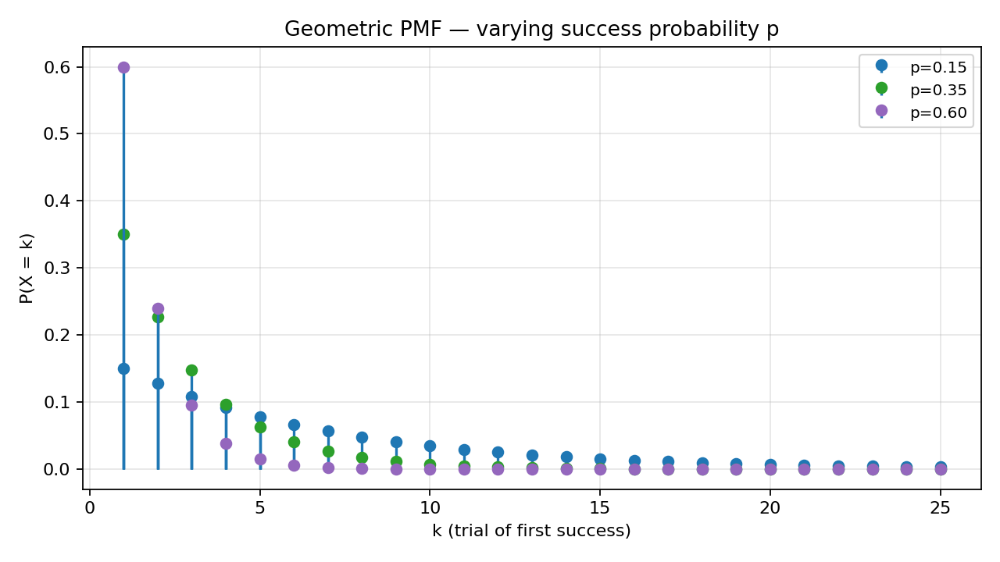
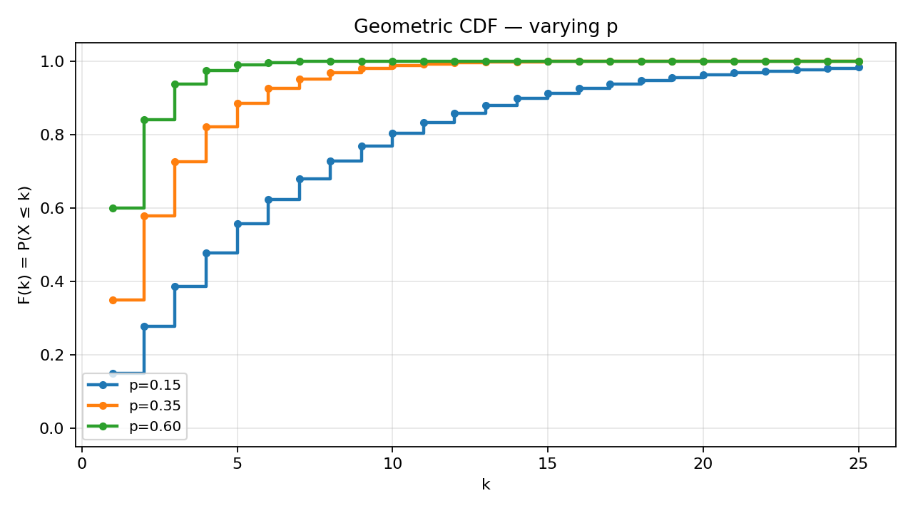

# Problem 4 — Geometric Distribution (Waiting for the First Success)

This task studies the **geometric law** on the positive integers: the number of **independent Bernoulli trials** required until the **first success**. The single parameter is

$$p \in (0,1], \qquad q := 1-p,$$

the per-trial success probability. We use the **“trial index of first success”** convention:

$$X \in \{1,2,3,\ldots\}, \qquad P(X=k) = q^{\,k-1}\,p = (1-p)^{k-1}p.$$

Some textbooks instead count **failures before** the first success ($Y=X-1\in\{0,1,2,\ldots\}$ with $P(Y=k)=q^k p$). Every formula in this report is stated for **$X$**; when reading software or tables, check which convention is active (SciPy `geom`, R `dgeom`, etc. use the **$X$** convention on $\{1,2,\ldots\}$).

If your calculator or textbook reports mean $(1-p)/p$ or support starting at $0$, you are almost certainly in the **$Y$** convention — translate by shifting indices before comparing to this report.

### How to read the parameter $p$

Each trial is a **Bernoulli** experiment: “success” with probability $p$, “failure” with probability $q=1-p$, trials **independent** and **identically distributed**. The geometric model answers:

> *How many trials must we run until the first success appears?*

- Large $p$ → success is common → we expect the first success **early** (PMF concentrated near $k=1$).
- Small $p$ → success is rare → we often wait many trials (PMF decays slowly; long right tail).

Unlike Tasks 1–2, we are **not** given a finite table. The law is a **parametric family**: one formula generates infinitely many PMF values, and the CDF is a closed exponential form. Reading the report in order mirrors how you would **derive** such a family in a course: story first, space second, formulas third, pictures fourth, numerics fifth, interpretation last.

### What this report does

The goal is to complete **ten parts** (items 0–9 from the task list), in this order:

1. **Build a concrete world** $(\Omega,\mathcal{F},P)$ for repeated trials until first success, and define $X(\omega)$ as the trial index of that success.
2. **Write** the PMF and CDF in standard form and verify normalization.
3. **Identify** the support $\{1,2,3,\ldots\}$ and explain why it is **countably infinite** (not a finite set, not the whole real line).
4. **Plot** PMF stems for $p\in\{0.15,\,0.35,\,0.60\}$.
5. **Plot** the corresponding CDF staircases on the same parameter choices.
6. **Explain** qualitatively how PMF and CDF shapes change when $p$ increases or decreases.
7. **Compute** representative probabilities at **$p=0.25$** (point mass, cumulative, tail, interval).
8. **Interpret** tail probabilities as **waiting-time** statements.
9. **Survey** practical applications (reliability, first-success waiting, etc.).
10. **Point** to the shared distribution comparison tool in the parent folder.

Most steps reuse the PMF/CDF machinery from Tasks 1–2; what is new is an **infinite support**, a **decaying** PMF tail, and the **memoryless** waiting-time story. The text below explains each formula in words before plugging in numbers — the same rhythm as Task 1, but with a parametric family instead of a fixed table.

---

## Theory — concepts used

Before any computation, fix the vocabulary. The geometric distribution is the first **standard named family** in this task list where the support is infinite. Every line in the table below names one object and pins down exactly what it means; the subsection **Each object, in plain words** explains *why* we need that object and how it differs from the finite-table worlds in Tasks 1–2.

| Symbol | Name | Meaning |
|--------|------|---------|
| $(\Omega,\mathcal{F},P)$ | **Probability space** | $\Omega$ — elementary outcomes; $\mathcal{F}$ — events; $P$ — probability measure (K1–K3). Here $\Omega$ is **countably infinite**. |
| $\omega\in\Omega$ | **Elementary outcome** | One full run of the experiment until first success (encoded below). |
| $X:\Omega\to\mathbb{N}$ | **Random variable** | Trial number of the **first** success. |
| $p$, $q=1-p$ | **Parameters** | Success / failure probability per trial; $p\in(0,1]$. |
| $\operatorname{supp}(X)=\{k\in\mathbb{N}:P(X=k)>0\}$ | **Support** | Here $\{1,2,3,\ldots\}$ — every positive integer is possible. |
| $p_X(k)=P(X=k)$ | **PMF** | $q^{k-1}p$ for $k=1,2,\ldots$; zero elsewhere. |
| $F_X(k)=P(X\le k)$ | **CDF** (at integers) | $1-q^k$; extended to $\mathbb{R}$ as a right-continuous step function. |
| $F_X(x^-)=\lim_{t\uparrow x}F_X(t)$ | **Left limit** | On $(k,k+1)$, $F_X(x^-)=F_X(k)$ if $x\in(k,k+1)$; at integer $k$, $F_X(k^-)=F_X(k-1)$ with $F_X(0):=0$. |

### Each object, in plain words

- **Probability space $(\Omega,\mathcal{F},P)$.** Here $\Omega$ is the set of all possible *finished runs* of the experiment — one run for each possible trial index at which the first success might occur. Because success can in principle happen on trial $1$, trial $2$, trial $100$, or any positive integer, $\Omega$ is **countably infinite**, unlike the five-point worlds in Tasks 1–2. The $\sigma$-algebra $\mathcal{F}$ lists every event we are allowed to ask about (every subset of $\mathbb{N}$ in this model), and $P$ assigns a probability to each event by summing the atomic weights $q^{k-1}p$ over the outcomes it contains. Kolmogorov’s axioms still apply: probabilities are non-negative, the whole space has probability $1$, and disjoint events add up.

- **Elementary outcome $\omega$.** One elementary outcome is a complete story of one run: how many failures happened before the first success, and where that success landed. We encode this as $\omega_k = F\cdots F S$ with exactly $k-1$ failures followed by one success. Reading $\omega_4$ out loud: “trials one through three failed, trial four succeeded.” The probability of that specific story is $q^3 p$ — three independent failures, then one success — and every possible story gets its own atom in $\Omega$.

- **Random variable $X$.** The function $X$ reads an outcome $\omega_k$ and reports the integer $k$: the trial number of the first success. Knowing $\omega$ tells you $X(\omega)$ with certainty; the randomness is entirely in *which* $\omega$ Nature draws. In this construction $X$ is a bijection from $\Omega$ to $\mathbb{N}$, so each support point $k$ corresponds to exactly one elementary outcome $\omega_k$. That makes the geometric model unusually transparent: the PMF value $P(X=k)$ is literally the probability of the single outcome $\omega_k$.

- **PMF $p_X$.** The PMF is the infinite list of weights $p_X(k)=q^{k-1}p$ for $k=1,2,3,\ldots$, and zero everywhere else. Unlike Task 1’s finite table, we do not write out infinitely many columns; instead one **parametric formula** generates every entry. The weights form a geometric sequence: each step to the right multiplies the previous height by $q<1$. They still must sum to $1$, which is checked by the infinite geometric series in Part 1.

- **CDF $F_X$.** The CDF answers cumulative questions on the whole real line: $F_X(x)=P(X\le x)$. Between integers the CDF is flat (no probability lives between trial counts), and at each integer $k$ it jumps upward by exactly $p_X(k)$. The closed form $F_X(k)=1-q^k$ is remarkable: instead of summing $k$ PMF terms every time, one exponentiation gives the same answer. On $\mathbb{R}$, the CDF is a right-continuous staircase that starts at $0$ for $x<1$ and creeps toward $1$ as $x$ grows, reaching $1$ only in the limit $k\to\infty$ when $p>0$.

- **Parameter $p$ (and $q=1-p$).** The single number $p$ is the per-trial success probability in the underlying Bernoulli experiment. It controls the entire family: large $p$ means the first success tends to arrive early (heavy mass at $k=1$), small $p$ means long waits are common (slow PMF decay, flat CDF at low $k$). The companion $q=1-p$ is the per-trial failure probability; it appears in every formula as the ratio by which PMF heights shrink from one trial to the next.

- **Infinite support.** The support is $\{1,2,3,\ldots\}$: every positive integer is possible with **strictly positive** probability when $p\in(0,1)$. “Infinite support” does **not** mean $X$ is infinite with positive probability — almost every run stops after finitely many trials — it means there is **no largest** possible value. For any proposed cap $N$, the event $\{X=N+1\}$ still has probability $q^N p>0$. Probability is spread over infinitely many atoms, like an infinite partition of unity, which is the first time in this task list that normalization requires a convergent infinite series rather than a finite sum.

### Bernoulli trial — building block

One trial produces $S$ (success) with probability $p$ or $F$ (failure) with probability $q$. Independence means the joint probability of a **finite prefix** is the product of single-trial probabilities. The geometric law is **not** binomial: the number of trials is **random** (we stop at the first $S$), not fixed in advance.

**Why “geometric”?** The PMF weights $p,\,qp,\,q^2p,\,q^3p,\ldots$ form a geometric sequence with common ratio $q$. Each extra trial before the first success multiplies the previous point mass by the same factor $q<1$. That constant ratio is the fingerprint of the family — visible in the stem plots as equally spaced logarithmic decay when you compare consecutive heights.

### Two facts used throughout

1. **Jump rule** (discrete, any support). For every $x\in\mathbb{R}$,
   $$P(X=x)=F_X(x)-F_X(x^-).$$
   On the geometric support, jumps occur only at $k\in\{1,2,3,\ldots\}$ with height $q^{k-1}p$.

2. **Interval-to-CDF dictionary** (same as Tasks 1–2). For integers $a\le b$:

   | Event | Formula |
   |-------|---------|
   | $\{X\le k\}$ | $F_X(k)=1-q^k$ |
   | $\{X< k\}$ | $F_X(k^-)=1-q^{k-1}$ |
   | $\{X\ge k\}$ | $1-F_X(k^-)=q^{k-1}$ |
   | $\{X> k\}$ | $1-F_X(k)=q^k$ |
   | $\{X=k\}$ | $q^{k-1}p$ |
   | $\{a\le X\le b\}$ | $F_X(b)-F_X(a^-)=\sum_{k=a}^{b}q^{k-1}p$ |

   For non-integer real endpoints, use the **piecewise constant** CDF on $\mathbb{R}$: between integers the CDF is flat; at each $k\in\mathbb{N}$ it jumps by $q^{k-1}p$.

### Valid PMF checklist (infinite discrete case)

| # | Condition | Geometric check |
|:-:|-----------|-----------------|
| 1 | $p_X(k)\ge 0$ for all $k$ | $q^{k-1}p\ge 0$ for $p,q\in[0,1]$. ✓ |
| 2 | $\sum_{k=1}^{\infty} p_X(k)=1$ | Geometric series $\displaystyle p\sum_{j=0}^{\infty}q^j=\frac{p}{1-q}=1$. ✓ |
| 3 | $\sum_{k:\,p_X(k)>0} p_X(k)$ finite or countable | Support is $\mathbb{N}$; sum converges. ✓ |

Together, these three rows say: the geometric PMF is a **legal** discrete law on an infinite set — the same Kolmogorov sanity checks as Task 1, with a series instead of a finite sum.

### Valid CDF checklist

| # | Condition | Geometric check |
|:-:|-----------|-----------------|
| 1 | $0\le F_X(x)\le 1$ | $F_X(k)=1-q^k\in[0,1]$ for $q\in[0,1)$, $p>0$. ✓ |
| 2 | $F_X$ non-decreasing | $q^k$ decreases as $k$ grows. ✓ |
| 3 | $\lim_{x\to-\infty}F_X(x)=0$ | No mass at non-positive indices in the $X$ convention. ✓ |
| 4 | $\lim_{x\to+\infty}F_X(x)=1$ | $q^k\to 0$ as $k\to\infty$ when $p>0$. ✓ |
| 5 | Right-continuous | Step function closed on the right at each jump. ✓ |

The CDF checklist is the mirror of Task 1’s axioms, now verified on a staircase with infinitely many steps but the same monotonicity and limits. Every limit at $\pm\infty$ is inherited from the Bernoulli story, not assumed separately.

### Convention warning (read before Part 6)

| Object | This report ($X$) | Alternative ($Y=X-1$) |
|--------|-------------------|------------------------|
| Support | $\{1,2,3,\ldots\}$ | $\{0,1,2,\ldots\}$ |
| PMF | $q^{k-1}p$ | $q^k p$ |
| CDF at $k$ | $1-q^k$ | $1-q^{k+1}$ (careful indexing) |
| Mean | $1/p$ | $(1-p)/p$ |

SciPy `scipy.stats.geom` and the plots in [`plot.py`](plot.py) follow **$X$ on $\{1,2,\ldots\}$**.

---

## Part 0 — Experiment, sample space $\Omega$, elementary outcome $\omega$, and $X(\omega)$

### Why does this matter?

Tasks 1–2 handed you a **finite PMF table** and asked you to verify it, plot it, and translate questions into CDF language. Task 4 asks the reverse question: start from a **story** about repeated independent trials, build the probability space explicitly, and **derive** the PMF and CDF from that story. The geometric law is the first standard family in this sequence where the support is **infinite** and the PMF is given by a **formula** rather than a column of numbers.

Why construct $(\Omega,\mathcal{F},P)$ at all? Because a sentence like “let $X$ be geometric with parameter $p$” hides a measurable function on a sample space. Making the space concrete shows that $q^{k-1}p$ is not a magic table but the probability of a **specific elementary outcome** — a finite failure prefix followed by one success — under independence. It also clarifies what “infinite support” really means: infinitely many distinguishable outcomes $\omega_k$, each with positive weight, summing to $1$.

### The random experiment (in words)

Perform a sequence of **independent Bernoulli trials** with success probability $p$ on each trial. After every trial, inspect the result:

- If the outcome is **success**, **stop immediately** and record **how many trials** have been performed in total (counting the successful trial).
- If the outcome is **failure**, **do not stop** — reset nothing, remember nothing special, and run the next trial under the same rules.

The recorded number is the trial index of the **first** success. Trial one might succeed right away; or you might see failure, failure, failure, … for many steps before the first $S$ appears. Because each trial is independent and $p>0$, success is guaranteed **eventually** with probability $1$, but there is no fixed upper bound on how long you might wait.

**Concrete picture.** Imagine a quality inspector who tests items one at a time from an endless conveyor belt. Each item is defective with probability $p$ (our “success” — we found what we were looking for). The inspector stops at the first defective item and reports its position in the sequence: “the first defect appeared on item number $k$.” That reported $k$ is $X$. The same mathematical structure describes calling a busy phone line until someone answers, sending job applications until the first offer, or rolling a die until the first six — provided each attempt is independent and the per-attempt success rate stays constant.

This is the prototype of **“wait until something happens”**: quality inspection until first defect, dialing until first answer, polling until first positive response, testing components until first failure (with appropriate definition of “success”). The geometric model captures the **count of attempts**, not the clock time between them; continuous waiting times belong to the exponential family (Tasks 9–10 in this list).

### Sample space $\Omega$

Each elementary outcome is completely determined by **where the first success occurs**. Encode:

$$\omega_k = \underbrace{F\,F\,\cdots\,F}_{k-1\text{ failures}}\,S
\qquad (k=1,2,3,\ldots),$$

with the convention that for $k=1$ there are zero leading failures: $\omega_1=S$.

Then

$$\Omega = \{\omega_1,\,\omega_2,\,\omega_3,\,\ldots\},$$

a **countably infinite** set (one outcome per possible waiting time). Equivalently, identify $\omega_k$ with the integer $k$ and take $\Omega=\mathbb{N}=\{1,2,3,\ldots\}$.

**Reading $\Omega$ as a list of stories.** Outcome $\omega_1$ is the shortest possible run: success on trial one. Outcome $\omega_2$ is one failure followed by success. Outcome $\omega_{100}$ is ninety-nine failures followed by success — unlikely when $p=0.25$, but still **possible** with probability $0.75^{99}\cdot 0.25>0$. The sample space is the collection of all **stopped** prefixes, each ending in exactly one success. That stopping rule is what makes the geometric model different from “flip a coin forever and record everything.”

**Do not confuse** $\Omega$ with the Bernoulli **trial sequence space** $\{S,F\}^{\mathbb{N}}$ (all infinite sequences). Our experiment **stops** at the first $S$, so only **finite prefixes ending in $S$** are observable elementary outcomes. The full infinite sequence space is a larger formalization; the geometric model uses the **stopped** outcomes.

### $\sigma$-algebra and probability measure

Take $\mathcal{F}=2^{\Omega}$ (every subset of $\mathbb{N}$ is an event). Define on atoms:

$$P(\{\omega_k\}) = P(X=k) = q^{k-1}p.$$

Extend $P$ additively to all events. For any $A\subseteq\mathbb{N}$,

$$P(A)=\sum_{k\in A} q^{k-1}p.$$

| Step | Check | Result |
|:----:|-------|--------|
| 1 | Non-negativity | $q^{k-1}p\ge 0$. ✓ |
| 2 | Normalization | $\sum_{k=1}^{\infty}q^{k-1}p=1$ (Part 1). ✓ |
| 3 | $\sigma$-additivity | Countable additivity holds on disjoint unions in $\mathbb{N}$. ✓ |

### Random variable $X$

Define $X:\Omega\to\mathbb{R}$ by

$$X(\omega_k)=k.$$

Then $P(X=k)=P(\{\omega_k\})=q^{k-1}p$ by construction — the PMF is **not** assumed; it is **derived** from the Bernoulli story.

**One elementary outcome in plain language.** $\omega_4$ means: trials $1,2,3$ are failures, trial $4$ is the first success. Under independence,

$$P(\omega_4)=q\cdot q\cdot q\cdot p = q^3 p.$$

**Why this example helps.** Trial four is neither the most likely outcome ($k=1$ wins with mass $p$) nor a tail event ($k=4$ still has probability $0.1055$ at $p=0.25$). It is a middle-of-the-support illustration: the PMF assigns $q^{k-1}p$ to every $k$, and $k=4$ is where the “three failures then success” story is easiest to say out loud while the arithmetic stays small enough to check by hand.

### Construction B — product-space view (optional, richer $\Omega$)

Fix $n\ge 1$ and let $\Omega_n=\{S,F\}^n$ be $n$ independent trials. For each $n$, define the **stopped** outcome map that returns the index of the first $S$, or $+\infty$ if all $F$. The geometric law is obtained in the limit $n\to\infty$ with mass on finite stopping times only. This shows the geometric distribution as a **projection** of a familiar product experiment — useful when connecting to binomial models on **fixed** $n$ (Task 3 in the course).

**Important distinction.** $|\Omega|=\aleph_0$ (countably infinite), but $X(\omega)\in\mathbb{N}$ still. The support equals the image of $X$ on $\Omega$ here; there is no smaller finite $\Omega$ carrying the full geometric law when $p\in(0,1)$.

---

## Part 1 — PMF and CDF of the geometric distribution

Part 0 built the world; Part 1 writes down the **distribution** of $X$ in the two equivalent languages used throughout this course — the PMF (point masses) and the CDF (cumulative steps). Every symbol in the boxed formulas below has a plain-language reading; the prose walks through each term before we verify normalization and the jump rule.

### PMF (probability mass function)

For $X$ = trial number of first success, with $0<p\le 1$ and $q=1-p$:

$$\boxed{p_X(k) = P(X=k) = (1-p)^{k-1}\,p = q^{\,k-1}p, \qquad k=1,2,3,\ldots}$$

and $p_X(k)=0$ for $k\notin\mathbb{N}$ or $k<1$.

**Reading each factor in the PMF.**

- **Index $k$.** The support point we are asking about: “first success on trial $k$.” Only integers $k\ge 1$ carry mass; every other real number has $p_X(k)=0$.
- **Factor $q^{k-1}=(1-p)^{k-1}$.** The probability that trials $1,2,\ldots,k-1$ are **all failures**. For $k=1$ this exponent is zero and the factor is $1$ — there are no leading failures. For $k=4$ it is $q^3$: three independent failures in a row.
- **Factor $p$.** The probability that trial $k$ itself is a **success**. The experiment stops here; we do not require anything after trial $k$.
- **Product $q^{k-1}p$.** Independence turns the story into a product: the joint probability of “fail, fail, …, fail, success” on the first $k$ trials with no earlier success.

**Derivation recap.** $\{X=k\}$ requires $k-1$ independent failures (probability $q^{k-1}$) followed by one success (probability $p$). The event is mutually exclusive with $\{X=j\}$ for $j\ne k$, because the first success cannot occur on two different trial numbers at once.

### Normalization (geometric series)

$$\sum_{k=1}^{\infty} p_X(k) = p\sum_{j=0}^{\infty} q^j = p\cdot\frac{1}{1-q}=1 \quad \text{for } p\in(0,1].$$

In words: factor $p$ out of the infinite sum; what remains is $\sum_{j=0}^{\infty} q^j$, a geometric series with ratio $q<1$. That series converges to $1/(1-q)$, and because $1-q=p$, the product $p\cdot(1/p)=1$. This is the infinite-support version of Task 1’s “partial sums add to $1$” check — except here we need a limit, not a finite addition table.

Edge cases:

| $p$ | Behaviour |
|:---:|-----------|
| $p=1$ | $P(X=1)=1$; degenerate at $1$. |
| $p\to 0^+$ | Mean $1/p\to\infty$; mass spreads over large $k$. |

### CDF (cumulative distribution function)

For integer $k\ge 1$:

$$\boxed{F_X(k)=P(X\le k)=1-(1-p)^k=1-q^k.}$$

**Reading each piece of the CDF.**

- **Event $\{X\le k\}$.** “The first success happened **no later than** trial $k$.” Equivalently: among the first $k$ trials, **at least one** success occurred, and the **first** of those successes is counted by $X$. Because we stop at the first success, this is the same as “first success by trial $k$,” not “exactly one success among $k$ trials” (that would be binomial thinking on a fixed window).
- **Sum form $\sum_{j=1}^{k} q^{j-1}p$.** Add the PMF masses at $1,2,\ldots,k$. Each term is one way the first success can land; together they exhaust every possibility with $X\le k$.
- **Closed form $1-q^k$.** The complement event is “**all** of the first $k$ trials are failures,” which has probability $q^k$ by independence. Subtracting from $1$ leaves exactly the probability that this complete failure run did **not** happen — i.e. a success appeared somewhere in trials $1$ through $k$.
- **Factor $q^k$ in the tail.** When we write $P(X>k)=q^k$, we are looking at the mirror image: still waiting after trial $k$ means trials $1,\ldots,k$ were all failures. The CDF and the tail are two sides of the same coin: $F_X(k)+P(X>k)=1$ for every $k$.

**Derivation (two ways).**

| Method | Computation |
|--------|-------------|
| **Sum PMF** | $\displaystyle\sum_{j=1}^{k} q^{j-1}p = p\cdot\frac{1-q^k}{1-q}=1-q^k$. |
| **Complement** | $\{X\le k\}$ = first success by trial $k$ = no success only in first $k$ trials with all failures is impossible for “first success by $k$” — equivalently, **not** ($k$ failures in a row without success before or at $k$): $P(X\le k)=1-P(\text{first }k\text{ trials all }F)=1-q^k$. |

**Piecewise CDF on $\mathbb{R}$** (right-continuous staircase):

$$
F_X(x)=
\begin{cases}
0 & x<1,\\
1-q^{\lfloor x\rfloor} & x\ge 1 \text{ with standard step at integers},
\end{cases}
$$

More precisely: for $k\in\mathbb{N}$, on $[k,k+1)$ we have $F_X(x)=1-q^k$ **after** the jump at $x=k$ (right-continuous). At $x<1$, $F_X(x)=0$.

**Jump heights match PMF:**

$$F_X(k)-F_X(k^-)=\bigl(1-q^k\bigr)-\bigl(1-q^{k-1}\bigr)=q^{k-1}(1-q)=q^{k-1}p=p_X(k).$$

This is the infinite-support version of Task 2’s differencing rule.

**Why the jump rule still matters here.** Even though there are infinitely many jumps, each one is visible on the CDF staircase at an integer $k$, and the height of jump $k$ is still $p_X(k)$. Task 1 checked this on five points; here it holds on every $k\in\mathbb{N}$. If you ever recover a PMF from a plotted CDF, differencing consecutive plateau values at integers reproduces the stem heights — the same trick as reading Task 1’s graph, extended without end.

### Summary card

| Quantity | Formula | Domain |
|----------|---------|--------|
| PMF $p_X(k)$ | $q^{k-1}p$ | $k=1,2,\ldots$ |
| CDF $F_X(k)$ | $1-q^k$ | $k=1,2,\ldots$ |
| Tail $P(X>k)$ | $q^k$ | $k=0,1,2,\ldots$ |
| Mean $\mathbb{E}[X]$ | $1/p$ | $p>0$ |
| Variance $\mathrm{Var}(X)$ | $(1-p)/p^2$ | $p>0$ |

---

## Part 2 — Support and why it is infinite

The PMF formula $p_X(k)=q^{k-1}p$ is defined for every $k=1,2,3,\ldots$, but “defined” is not the same as “possible.” Part 2 identifies the **support** — the set of values that actually carry positive probability — and explains why that set is **infinite** even though every single run ends after finitely many trials. This distinction (infinite support vs. infinite realized value) is easy to confuse and worth stating carefully before the plots in Parts 3–4.

### Support

$$\operatorname{supp}(X)=\{k\in\mathbb{R}:P(X=k)>0\}=\{1,2,3,\ldots\}=\mathbb{N}.$$

For every $k\ge 1$, $p_X(k)=q^{k-1}p>0$ whenever $p>0$ and $q<1$. No positive integer is impossible.

### Why the support is **infinite** (three complementary explanations)

| # | Explanation | In words |
|:-:|-------------|----------|
| 1 | **Positive mass at every $k$.** | For any proposed upper bound $N$, $P(X=N+1)=q^N p>0$. There is no finite $N$ that contains all the probability. |
| 2 | **Unbounded waiting.** | With $p<1$, we can always need more than $N$ trials for any fixed $N$; the model must allow arbitrarily long waits. |
| 3 | **Normalization over infinitely many points.** | $\sum_{k=1}^{\infty}p_X(k)=1$ is a **convergent infinite series** — probability is spread over infinitely many atoms, like a countable partition of unity. |

**Not the same as “continuous support”.** The geometric law is **discrete** (PMF on integers). “Infinite support” here means **infinitely many point masses**, not an interval $[a,b]\subset\mathbb{R}$.

**Contrast with Tasks 1–2.**

| Feature | Task 1–2 table | Geometric |
|---------|----------------|-----------|
| Support size | Finite (5 points) | Countably infinite |
| PMF | Tabulated | Formula $q^{k-1}p$ |
| Largest $k$ with $P(X=k)>0$ | Exists ($x=6$ or $x=5$) | **Does not exist** |
| CDF reaches $1$ | At last table point | Only as $k\to\infty$ |

**Almost sure finiteness.** Although the support is infinite, $P(X<\infty)=1$ for $p>0$: we **almost surely** stop after finitely many trials. “Infinite support” describes **which values are possible**, not that $X$ is infinite with positive probability.

**Contrast with a finite cap (wrong model).** If someone insisted “nobody waits more than $50$ trials,” they would be defining a **truncated** geometric law on $\{1,\ldots,50\}$, not the standard geometric distribution. The true model assigns $P(X=51)=q^{50}p>0$ — small when $p$ is moderate, but not zero. Truncation might be a practical approximation in software display windows, but the mathematics of Task 4 requires the full infinite support.

---

## Part 3 — PMF graphs for several values of $p$

Parts 0–2 established the formulas and the infinite support. Part 3 turns the PMF into a **picture** for three concrete parameter values. The goal is not merely to display stems, but to **see** how a single number $p$ reshapes an entire infinite family: where the tallest stem sits, how quickly the tail decays, and how much probability remains far out on the right.

We compare $p\in\{0.15,\,0.35,\,0.60\}$ — a low, medium, and high success rate. Each plot shows stems at integer $k$ only; between integers the PMF is zero, exactly as in Task 1’s finite stem chart, except now the stems continue forever (the figure truncates at $k=25$ for readability).

Static comparison plots (generated by [`plot.py`](plot.py)):



| Parameter | $p$ | $q=1-p$ | Mode $k=1$ mass $p$ | Qualitative shape |
|-----------|:---:|:-------:|:-------------------:|-------------------|
| Low success rate | $0.15$ | $0.85$ | $0.15$ | Slow decay; long right tail |
| Medium | $0.35$ | $0.65$ | $0.35$ | Moderate decay |
| High success rate | $0.60$ | $0.40$ | $0.60$ | Fast decay; mass near $1$ |

**How to read the stem plot.**

- Each stem at integer $k$ is $P(X=k)=q^{k-1}p$.
- Heights form a **geometric sequence** with ratio $q<1$: each step multiplies the previous height by $q$.
- The PMF is **monotone decreasing** in $k$ (for fixed $p\in(0,1)$): the first success is most likely on trial $1$, then $2$, etc.

**Numerical samples** (rounded to four decimals):

| $k$ | $p=0.15$ | $p=0.35$ | $p=0.60$ |
|:---:|:--------:|:--------:|:--------:|
| 1 | 0.1500 | 0.3500 | 0.6000 |
| 2 | 0.1275 | 0.2275 | 0.2400 |
| 3 | 0.1084 | 0.1479 | 0.0960 |
| 5 | 0.0783 | 0.0620 | 0.0154 |
| 10 | 0.0319 | 0.0056 | 0.0001 |

Plots truncate at $k=25$ for visibility; the tail continues with positive mass on every $k$.

**What the three panels tell you together.**

When $p=0.60$, the tallest stem at $k=1$ reaches height $0.60$ — in six out of ten runs, the first success arrives on the very first try. By $k=5$ the remaining tail is already tiny ($p_X(5)\approx 0.015$), and the picture looks “short.” When $p=0.15$, the first stem is only $0.15$ tall; most of the mass lives spread across many trials, and stems at $k=10$ and beyond are still visibly non-zero. The medium case $p=0.35$ sits between these extremes: a respectable mode at $k=1$, but a slower geometric tail than the $p=0.60$ panel.

Notice the **constant ratio** between consecutive stems: in every panel, $p_X(k+1)/p_X(k)=q=1-p$. That is the signature of a geometric sequence — the PMF is not just “decreasing,” it decreases by the same multiplicative factor at every step. This ratio is what links the three pictures to one formula: change $p$, change $q$, change the decay rate, but the **shape family** stays the same.

---

## Part 4 — CDF graphs for the same values of $p$

The PMF shows **where** probability sits at each trial count; the CDF shows **how much** has accumulated once you allow outcomes up to trial $k$. Part 4 plots the same three parameter values as Part 3 so you can read PMF and CDF side by side. Remember: between integers the CDF is flat; each jump at $k$ equals the stem height $p_X(k)$ from Part 3.



**How to read the staircase.**

- At each $k$, $F_X(k)=P(X\le k)=1-q^k$ — the **closed** dot at the right end of the step.
- Between integers the CDF is **flat** — no probability accumulates between trial counts.
- All three curves approach **$1$** as $k$ increases, but **smaller $p$** means slower rise (more trials needed to capture most mass).

**Numerical CDF samples:**

| $k$ | $F_X(k)$, $p=0.15$ | $p=0.35$ | $p=0.60$ |
|:---:|:------------------:|:--------:|:--------:|
| 1 | 0.1500 | 0.3500 | 0.6000 |
| 3 | 0.3859 | 0.7254 | 0.9360 |
| 5 | 0.5563 | 0.8840 | 0.9904 |
| 10 | 0.8039 | 0.9862 | 0.9999 |

For $p=0.15$, even at $k=10$ only about $80\%$ of the mass is collected — the tail beyond $10$ still carries roughly $20\%$.

**Link PMF $\leftrightarrow$ CDF on the picture.** The **rise** of the CDF from $k-1$ to $k$ equals the **stem height** at $k$ — the same jump rule as Tasks 1–2, now repeated infinitely often with heights $q^{k-1}p$.

**Interpreting the staircases.**

For $p=0.60$, the CDF crosses $0.95$ by about $k=4$ ($F_X(4)\approx 0.974$): most runs finish early. For $p=0.15$, even at $k=10$ the CDF is only about $0.80$ — roughly one run in five still has not seen a success by trial ten. That slow climb is the CDF-side picture of the long PMF tail: cumulative mass arrives late because individual masses far out on the right, though small, add up. Comparing the three curves on one axis makes the parameter $p$ feel like a **speed dial** for waiting: higher $p$, steeper staircase; lower $p$, longer flat region near zero before the climb begins.

---

## Part 5 — How the graphs change as $p$ becomes larger or smaller

Part 3 showed **what** the PMF looks like at three fixed $p$ values; Part 4 did the same for the CDF. Part 5 states the **qualitative rules** that connect parameter changes to picture changes — the kind of one-sentence summary you should be able to give in an exam without redrawing the plots. The tables below collect the pattern; the prose after them ties the PMF and CDF stories together.

### Effect on the PMF

| Change in $p$ | PMF shape | Mean $\mathbb{E}[X]=1/p$ | Mode |
|---------------|-----------|--------------------------|------|
| **$p$ increases** | Mass shifts **left**; $P(X=1)=p$ grows | **Decreases** (shorter wait) | Always $k=1$ |
| **$p$ decreases** | **Slower** decay; heavier right tail | **Increases** | Still $k=1$, but $p$ small |

**Invariant under scaling.** For fixed $p$, the ratio $p_X(k+1)/p_X(k)=q$ is **constant** — true “geometric” decay between consecutive support points.

### Effect on the CDF

| Change in $p$ | CDF staircase |
|---------------|---------------|
| **$p$ increases** | Steps climb **faster** toward $1$; for moderate $k$, $F_X(k)$ is larger |
| **$p$ decreases** | Flatter treads at low $k$; need more trials to reach e.g. $F_X(k)\ge 0.95$ |

**Quantile intuition.** The median $m$ satisfies $1-q^m\approx 0.5$, so $m\approx -\ln(0.5)/\ln q$. Smaller $p$ ⇒ larger $q$ ⇒ larger $m$.

**Numerical illustration.** For $p=0.15$, solving $1-0.85^m=0.5$ gives median $m\approx 4.3$ trials — half of all runs finish by trial four or five. For $p=0.60$, the median is about $1.2$ trials: most runs succeed on the first or second try. These medians sit between the PMF mode ($k=1$ always) and the mean ($1/p$), and track the CDF curves from Part 4 without redrawing them.

### What does **not** change

- Support remains $\{1,2,3,\ldots\}$.
- The law stays **discrete** with PMF/CDF linked by jumps.
- **Memoryless property** (Part 7) holds for every $p\in(0,1)$.

### Comparison table (fixed $k$)

| Question | $p=0.15$ | $p=0.60$ |
|----------|:--------:|:--------:|
| $P(X=1)$ | 0.15 | 0.60 |
| $P(X\le 5)$ | 0.5563 | 0.9904 |
| $P(X>10)$ | 0.1962 | $\approx 0$ |

Low $p$ spreads probability across many $k$; high $p$ concentrates near the first trials.

**Closing synthesis for Parts 3–5.**

Think of $p$ as controlling two linked quantities at once: the **height of the first stem** ($P(X=1)=p$) and the **decay ratio** between stems ($q=1-p$). Increasing $p$ does both — it lifts the left edge of the PMF **and** makes the tail fall off faster. Decreasing $p$ lowers the chance of an immediate success **and** stretches the tail. On the CDF, the same parameter change appears as a faster or slower march toward $1$. The mean waiting time $\mathbb{E}[X]=1/p$ is the numeric summary of this picture: $p=0.15$ implies mean $\approx 6.67$ trials; $p=0.60$ implies mean $\approx 1.67$. The plots in Parts 3–4 are the visual version of that arithmetic.

---

## Part 6 — Computing probabilities (working example $p=0.25$)

Throughout this section:

$$p=0.25, \qquad q=1-p=0.75.$$

Formulas:

$$p_X(k)=0.75^{\,k-1}\cdot 0.25, \qquad F_X(k)=1-0.75^k.$$

Part 6 is the geometric analogue of Task 1’s probability exercises: every question is translated through the **interval-to-CDF dictionary** or the PMF directly, and the two routes must agree. We fix $p=0.25$ so arithmetic stays transparent ($q=0.75$ is a clean decimal), and walk through six representative event types — point mass, cumulative, tail, interval, boundary cases — with both PMF and CDF methods.

### Example 6.1 — $P(X=4)$ (point mass)

| Method | Computation | Result |
|--------|-------------|:------:|
| PMF | $0.75^3\cdot 0.25 = 0.421875\cdot 0.25$ | **0.1055** |
| CDF (jump) | $F_X(4)-F_X(3)=(1-0.75^4)-(1-0.75^3)$ | **0.1055** |

**In words:** exactly three failures then success on trial $4$.

**Commentary.** This is the pure PMF story: multiply three failure probabilities ($0.75^3\approx 0.422$) by one success probability ($0.25$). The CDF jump method gives the same $0.1055$ because $F_X(4)-F_X(3)$ subtracts two cumulative totals and leaves exactly the mass at $k=4$. In a long simulation with $p=0.25$, roughly **one run in ten** would report “first success on trial four.” That is modestly less likely than succeeding on trial one ($0.25$) but far more likely than waiting until trial twenty.

### Example 6.2 — $P(X\le 4)$ (cumulative)

| Method | Computation | Result |
|--------|-------------|:------:|
| CDF | $F_X(4)=1-0.75^4=1-0.31640625$ | **0.6836** |
| PMF (sum) | $p(1)+p(2)+p(3)+p(4)$ | **0.6836** |

**In words:** first success occurs on trial $1$, $2$, $3$, or $4$ — about $68\%$ of the time with a $25\%$ per-trial success rate.

**Commentary.** The CDF value $0.6836$ means that in roughly **two runs out of three**, the waiting time is four trials or fewer. Equivalently, the complement $P(X>4)=0.75^4\approx 0.316$ says that about **one run in three** still has no success after four attempts — all four trials failed. Summing four PMF terms ($0.25+0.1875+0.1406+0.1055$) reproduces the same total; the closed form $1-0.75^4$ is faster when $k$ is large.

### Example 6.3 — $P(X>6)$ (strict tail)

| Method | Computation | Result |
|--------|-------------|:------:|
| CDF complement | $1-F_X(6)=0.75^6$ | **0.1780** |
| PMF (tail sum) | $\displaystyle\sum_{k=7}^{\infty}0.75^{k-1}\cdot 0.25$ | **0.1780** |

**In words:** still waiting after trial $6$ — all six trials were failures. Equivalently $P(X\ge 7)=0.1780$.

**Commentary.** Tail probabilities are where the geometric CDF shines: $P(X>6)=0.75^6$ is a single power, not an infinite sum. About **17.8%** of runs — nearly one in five — need **more than six** trials before the first success when $p=0.25$. That may feel surprisingly high until you notice that each trial fails three-quarters of the time. The infinite PMF tail beyond $k=7$ sums to this same number; convergence of the tail series is guaranteed because $q<1$.

### Example 6.4 — $P(2\le X\le 5)$ (interval on support)

| Method | Computation | Result |
|--------|-------------|:------:|
| CDF | $F_X(5)-F_X(1^-)=F_X(5)-0=(1-0.75^5)-(1-0.75^1)$ | **0.5283** |
| PMF | $p(2)+p(3)+p(4)+p(5)$ | **0.5283** |

Individual terms: $0.1875+0.1406+0.1055+0.0791\approx 0.5127$ — use exact fractions for exams; table above uses $F_X(5)-F_X(1)=0.6836-0.25=0.4336$ if **both endpoints included** with $F_X(1^-)=0$:

| Event | CDF | Value |
|-------|-----|:-----:|
| $\{2\le X\le 5\}$ | $F_X(5)-F_X(1)=0.6836-0.25$ | **0.4336** |
| $\{2<X\le 5\}$ | $F_X(5)-F_X(2)=0.6836-0.4375$ | **0.2461** |

Always state endpoint inclusion.

**Commentary.** Interval events are the place where **strict vs. non-strict** endpoint language matters most. The event $\{2\le X\le 5\}$ **excludes** $k=1$ and **includes** $k=5$, so the CDF difference is $F_X(5)-F_X(1)=0.6836-0.25=0.4336$, not $F_X(5)-F_X(1^-)=F_X(5)$. About **43%** of runs see their first success on trial two, three, four, or five — neither on the first try nor after trial five. The table above also shows $\{2<X\le 5\}$ for contrast: dropping $k=2$ removes mass $0.1875$ and leaves $0.2461$.

### Example 6.5 — $P(X=1)$ and $P(X\ge 1)$

| Event | Formula | Value |
|-------|---------|:-----:|
| $P(X=1)$ | $p=0.25$ | **0.2500** |
| $P(X\ge 1)$ | $1$ (certain on this support) | **1.0000** |

**Commentary.** The mode of every geometric distribution (in the $X$ convention) is $k=1$, with mass exactly $p$. Here $P(X=1)=0.25$: one quarter of all runs succeed on the opening trial. The event $\{X\ge 1\}$ is the entire support — with $p>0$, success must arrive at some finite trial almost surely, so this probability is identically $1$. These two rows look trivial, but they anchor the support at its left edge and remind us that “infinite support to the right” does not create mass at $k=0$ or below.

### Example 6.6 — $P(X<3)$

| Method | Computation | Result |
|--------|-------------|:------:|
| CDF | $F_X(2^-)=F_X(2)=1-0.75^2$ | **0.4375** |
| PMF | $p(1)+p(2)$ | **0.4375** |

**Commentary.** Strict inequality $\{X<3\}$ means $\{X\le 2\}$ on integer support, so we sum the first two PMF values or read $F_X(2)=1-0.75^2=0.4375$. About **44%** of runs finish by trial two — less than half, which is consistent with a per-trial success rate of only $25\%$. Compare with Example 6.2: widening the upper bound from $2$ to $4$ adds $p(3)+p(4)=0.2461$ and brings the cumulative total to $0.6836$. Each extra allowed trial captures another slice of the geometric tail.

### Summary table (Part 6, $p=0.25$)

| Event | PMF / series | CDF | Value |
|-------|--------------|-----|:-----:|
| $\{X=4\}$ | $0.75^3\cdot 0.25$ | $F_X(4)-F_X(3)$ | **0.1055** |
| $\{X\le 4\}$ | $\sum_{k=1}^{4}p_X(k)$ | $1-0.75^4$ | **0.6836** |
| $\{X>6\}$ | $\sum_{k\ge 7}p_X(k)$ | $0.75^6$ | **0.1780** |
| $\{X\le 1\}$ | $p(1)$ | $1-0.75$ | **0.2500** |
| $\{2\le X\le 5\}$ | $p(2)+\cdots+p(5)$ | $F_X(5)-F_X(1)$ | **0.4336** |

All rows cross-check PMF against CDF — the same discipline as Tasks 1–2, now with closed forms instead of table differencing.

**Takeaway from Part 6.** At $p=0.25$, every event type from the interval-to-CDF dictionary appears at least once: equality ($X=4$), non-strict cumulative ($X\le 4$), strict tail ($X>6$), bounded interval ($2\le X\le 5$), boundary certainties ($X\ge 1$), and strict upper bound ($X<3$). If PMF and CDF routes disagree, the bug is almost always an endpoint mistake ($F_X(a)$ vs. $F_X(a^-)$) or a convention mismatch ($X$ vs. $Y=X-1$). None of the arithmetic required an infinite hand sum — tails closed as $q^k$, cumulatives as $1-q^k$.

---

## Part 7 — Tail probabilities and waiting-time interpretation

Part 6 computed fixed probabilities at $p=0.25$. Part 7 steps back and explains what **tail** events mean in the waiting-time language — the survival function $S(k)=P(X>k)$, the memoryless property, and how mean and standard deviation summarize the same story in one number each.

### Tail as “still waiting”

Define the **survival function** $S(k)=P(X>k)$. For the geometric law,

$$S(k)=1-F_X(k)=q^k.$$

| Statement | Probability | Meaning |
|-----------|:---------:|---------|
| $P(X>k)$ | $q^k$ | First success **after** trial $k$ — trials $1,\ldots,k$ were all failures |
| $P(X\ge k)$ | $q^{k-1}$ | First success not before trial $k$ |
| $P(X\le k)$ | $1-q^k$ | First success by trial $k$ |

**Example $p=0.25$, $k=6$.** $P(X>6)=0.75^6\approx 0.178$: about $17.8\%$ of runs still have no success after six trials.

### A concrete numeric story at $p=0.25$

Fix $p=0.25$ and imagine **$1000$ independent runs** of the experiment (one thousand people each calling a line that answers with probability $0.25$ per call, say). The formulas from Part 6 translate into expected counts:

| Event | Probability | Expected count out of $1000$ runs | Plain reading |
|-------|:-----------:|:---------------------------------:|---------------|
| $P(X=1)$ | $0.2500$ | $\approx 250$ | First call succeeds |
| $P(X\le 4)$ | $0.6836$ | $\approx 684$ | Success by call four |
| $P(X>6)$ | $0.1780$ | $\approx 178$ | Still no answer after six calls |
| $P(2\le X\le 5)$ | $0.4336$ | $\approx 434$ | First success on calls $2$–$5$ |

So in a room of $1000$ callers, roughly **$250$** hang up happy after one try, about **$434$ more** get through on calls two through five, and nearly **$178$** are still waiting after six attempts — matching the tail probability $0.75^6$. The mean wait is $\mathbb{E}[X]=1/p=4$ calls; the distribution is right-skewed, so the mean is pulled up by the long tail beyond six. A manager who promises “most people connect within four tries” can point to $P(X\le 4)\approx 68\%$ — true for a solid majority, but **not** for roughly one-third of callers.

The survival function $S(k)=q^k$ makes the tail easy to extend: $P(X>10)=0.75^{10}\approx 0.056$, so about **$56$** of our $1000$ callers would still be waiting after ten tries. Each extra trial without success multiplies the remaining tail by $0.75$ — the memoryless clock resets every time, but the **probability of a long run** still decays exponentially in $k$.

### Waiting-time reading

$X$ is literally a **waiting time** measured in **trials**, not seconds on a clock. Every tail and cumulative formula from Part 6 can be read as a statement about how long a caller, inspector, or tester waits.

- $P(X\le k)$ — “I got my first success within $k$ attempts.” This is the **deadline** question: if you budget $k$ tries, what fraction of runs succeed within that budget? At $p=0.25$, $P(X\le 4)\approx 0.68$ — a $k=4$ deadline covers roughly two-thirds of runs.
- $P(X>k)$ — “I am **still waiting** after $k$ attempts.” This is the **timeout** question: how often has nothing happened yet after $k$ tries? At $p=0.25$, $P(X>6)\approx 0.18$ — about one run in five is still stuck after six failures in a row.
- $P(X=k)$ — “My first success arrived **exactly** on attempt $k$.” This is the ** pinpoint** question: not “by $k$,” but “on $k$.” Only one trial index wins per run, so these point masses partition the certain event.

In reliability (discrete inspection), if “success” means **failure observed**, $p$ is the per-period failure probability and $X$ is the period index of first failure. A plant manager who asks “how many units until we see our first defect?” is asking for the distribution of $X$; a follow-up “what is the chance we inspect more than six units without seeing one?” is $P(X>6)=q^6$.

### Memoryless property (characteristic of geometric waiting)

The geometric law is the **only** discrete distribution on $\{1,2,\ldots\}$ with the memoryless property stated below (up to re-indexing). Intuitively: past failures do not make the next trial “due” for success — each new trial is a fresh Bernoulli draw with the same $p$.

For $n,m\ge 0$ with $P(X>n)>0$,

$$P(X>n+m \mid X>n)=P(X>m).$$

**In words:** if you have already waited $n$ trials without success, the **additional** wait has the same distribution as if you had just started. Past failures do not make future success more likely — independence resets the clock.

**Proof sketch.** $P(X>n+m\mid X>n)=P(X>m)$ because the event $\{X>n+m\}$ depends only on trials $n+1,\ldots,n+m$ being failures before a success, independent of the first $n$ trials.

**Contrast with sampling without replacement** (hypergeometric): there the waiting story is different because probabilities change as the population depletes.

### Mean and standard deviation as waiting-time summaries

$$\mathbb{E}[X]=\frac{1}{p}, \qquad \mathrm{SD}(X)=\frac{\sqrt{1-p}}{p}.$$

For $p=0.25$, mean $=4$ trials, SD $\approx 3.46$. The tail $P(X>6)\approx 0.178$ is consistent with a right-skewed waiting distribution: most runs finish near the mean or earlier, but the long tail beyond six trials still carries nearly eighteen percent of the probability mass. If you simulated $10\,000$ runs, you would expect about $1780$ of them to still be waiting after trial six — matching the table in the “concrete numeric story” above.

---

## Part 8 — Practical applications

The geometric law is the standard **discrete waiting-time model**: count independent trials until the first success. The table below lists six domains; after each row, a short prose paragraph explains how the symbols map to the real situation and what question the geometric PMF/CDF answers.

| Domain | What is a “trial”? | What is “success”? | Role of geometric |
|--------|-------------------|--------------------|-------------------|
| **Reliability / quality control** | Inspect one unit per period | First defect found | Distribution of **inspection count until first failure** (if $p$ constant) |
| **First-success waiting** | Repeated independent attempts | First positive outcome | Calls until answer, emails until reply, shots until basket |
| **Reliability (discrete cycles)** | Operating cycles | Component fails | Cycles until first failure when each cycle fails independently with prob. $p$ |
| **Network / retries** | Transmission attempts | First acknowledgment | Number of tries until first success (simplified model) |
| **Onboarding / conversion** | User sessions | First purchase | Sessions until first conversion (i.i.d. approximation) |
| **Teaching / assessment** | Questions presented | First correct answer | Trials until student first succeeds (toy model) |

**Reliability / quality control.** Each inspected item is one Bernoulli trial; “success” might mean “defect detected” depending on the problem statement. If the per-item defect rate is constant at $p$, the number of items inspected until the first defect is geometric. The PMF gives $P(\text{first defect on item }k)$; the CDF gives $P(\text{found a defect within }k\text{ items})$ — a natural quality-audit question.

**First-success waiting.** This is the literal story of Part 0: repeated independent attempts until something good happens. Customer service lines, recruitment callbacks, and sports “shots until score” all fit when attempts are roughly independent and the success rate is stable. The tail $P(X>k)$ answers “how often are we still waiting after $k$ tries?” — useful for staffing and timeout policies.

**Reliability (discrete cycles).** A machine completes one cycle per time step; each cycle fails independently with probability $p$. The geometric variable is the cycle index of **first failure** — a discrete lifetime. Reliability engineers use $P(X>k)=q^k$ as the survival function: probability the component survives more than $k$ cycles under this simple model.

**Network / retries.** A simplified retransmission model treats each packet attempt as independent with success probability $p$. The number of attempts until first acknowledgment is geometric. Real networks violate independence and constant $p$, but the geometric law remains the **benchmark** against which more realistic Markov or queueing models are compared.

**Onboarding / conversion.** If each user session independently converts with probability $p$ (a strong assumption), sessions-until-first-purchase is geometric. Marketing teams care about $P(X\le k)$ — what fraction of users convert within $k$ sessions — and about the tail for long-run retention planning. The model breaks when $p$ varies by user cohort or session history.

**Teaching / assessment.** Present questions until the student answers one correctly; if each question is an independent trial with success probability $p$, the number of questions until first success is geometric. This is a toy model for adaptive testing, but it illustrates why the mode is always $k=1$: the very first question has the highest single-trial success probability mass.

**When the model fits.**

- Trials are **independent**.
- Success probability $p$ is **constant** across trials.
- Experiment **stops** at the first success.
- Support is **countable** trial indices starting at $1$.

**When it does not fit.**

- Fixed sample size $n$ (use **binomial**, Task 3).
- Sampling **without replacement** (use **hypergeometric**, Task 6).
- Time measured continuously (use **exponential / gamma**, Tasks 9–10 in this list).
- $p$ changes over trials (inhomogeneous or Markov models).

Recognizing misfit is as important as recognizing fit: if trials are dependent or $p$ drifts, the closed forms $q^{k-1}p$ and $1-q^k$ no longer describe the data, even when the experiment “feels like waiting.”

**Reliability link.** If each discrete cycle fails with probability $p$, the **discrete lifetime** until first failure is geometric. Continuous-time analog is exponential; geometric is the **discrete-time** building block.

---

## Part 9 — Comparison application (`distribution_viewer.html`)

Static PNG figures in Parts 3–4 fix three values of $p$. Part 9 points to the shared **parametric viewer** in the parent folder, where you can slide $p$ continuously, overlay several curves, and read off the same probabilities Part 6 computed by hand — useful for building intuition before Tasks 7 and 9–10 extend the waiting-time story to multiple successes and continuous time.

The parent folder hosts a shared **distribution comparison** page:

**[`../distribution_viewer.html`](../distribution_viewer.html)**

Intended features (Task 4 requirements):

| # | Feature |
|:-:|---------|
| 1 | Select **Geometric** from the distribution list |
| 2 | Slider or input for **$p$** (e.g. $0.05$–$0.95$) |
| 3 | Live **PMF** stem plot on $k=1,2,\ldots$ (truncated display window) |
| 4 | Live **CDF** staircase |
| 5 | Overlay **two or more** $p$ values on one graph (compare with static [`pmf_p_varied.png`](pmf_p_varied.png), [`cdf_p_varied.png`](cdf_p_varied.png)) |
| 6 | Numeric panel for $P(X=k)$, $P(X\le k)$, $P(X>k)$, $P(a\le X\le b)$ |

**Workflow for this problem.**

1. Open the viewer, choose Geometric, set $p=0.25$.
2. Verify $P(X=4)\approx 0.1055$, $P(X\le 4)\approx 0.6836$, $P(X>6)\approx 0.1780$ (Part 6).
3. Sweep $p$ through $0.15$, $0.35$, $0.60$ and match the static figures from Part 3–4.
4. Compare geometric tails with **binomial** (fixed $n$) and **negative binomial** (Task 7: wait for $r$-th success) when those families are enabled in the same app.

Static figures in this folder are produced by [`plot.py`](plot.py):

```text
python plot.py
```

regenerates `pmf_p_varied.png` and `cdf_p_varied.png`.

Task 1–2 also provide standalone [`../solution_01/interactive.html`](../solution_01/interactive.html) and [`../solution_02/interactive.html`](../solution_02/interactive.html) for **finite** PMF/CDF tables; the geometric family belongs in the **parametric** viewer because the support is infinite and formulas replace tables.

**Suggested study path.** Read Part 0–1 for the derivation, skim Parts 3–5 for pictures, work Part 6 with pencil and calculator, then open the viewer and set $p=0.25$ to confirm each summary-table row. Finally sweep $p$ from $0.05$ to $0.95$ and watch the PMF stem at $k=1$ track the slider — that single stem height **is** the parameter $p$.

---

## Consistency check

This closing table maps each task requirement (items 0–9) to the part of the report that addresses it. Use it as a quick audit before an exam or before opening the interactive viewer in Part 9: every row should trace back to explicit formulas, plots, or numerics above.

| Item | Check | Status |
|------|-------|:------:|
| Bernoulli story $\Rightarrow$ PMF $q^{k-1}p$ | Part 0, Part 1 | ✓ |
| PMF sums to $1$ | Geometric series | ✓ |
| CDF $1-q^k$ matches PMF partial sums | Part 1 | ✓ |
| Jump rule $F_X(k)-F_X(k^-)=p_X(k)$ | Part 1 | ✓ |
| Support $=\mathbb{N}$, infinite but a.s. finite | Part 2 | ✓ |
| PMF/CDF plots for $p\in\{0.15,0.35,0.60\}$ | Part 3–4, images | ✓ |
| Shape vs. $p$ explained | Part 5 | ✓ |
| Numerics at $p=0.25$: $P(X=4)$, $P(X\le 4)$, $P(X>6)$ | Part 6 | ✓ |
| Tail / waiting / memoryless | Part 7 | ✓ |
| Applications listed | Part 8 | ✓ |
| Viewer reference | Part 9 | ✓ |
| SciPy `geom` convention matches $X$ on $\{1,2,\ldots\}$ | `plot.py` | ✓ |

Every formal requirement of Task 4 (items 0–9) is addressed: a probability space for “until first success” was constructed, PMF and CDF were written and linked, infinite support was explained, PMF and CDF were plotted for several $p$, parameter effects were discussed, probabilities were computed at $p=0.25$ with PMF–CDF agreement, tail probabilities were interpreted as waiting times, applications were summarized, and the shared comparison application was referenced for interactive exploration.

**Thread from introduction to conclusion.** The opening paragraphs promised a parametric family on infinite support, derived from Bernoulli trials rather than a finite table. Part 0 delivered the sample space and the random variable; Part 1 derived $q^{k-1}p$ and $1-q^k$; Part 2 explained why no finite support suffices; Parts 3–5 visualized and interpreted the effect of $p$; Part 6 verified the PMF–CDF dictionary at $p=0.25$ with six worked examples; Part 7 connected tails to waiting-time language and the memoryless property; Part 8 mapped the law to applied settings; Part 9 pointed to the shared viewer for the same checks interactively. The geometric distribution is the discrete-time, count-based counterpart to “wait until first success” — the first infinite-support milestone in this PMF/CDF task sequence, and the template for negative-binomial waiting (Task 7) and exponential waiting in continuous time (Tasks 9–10).
