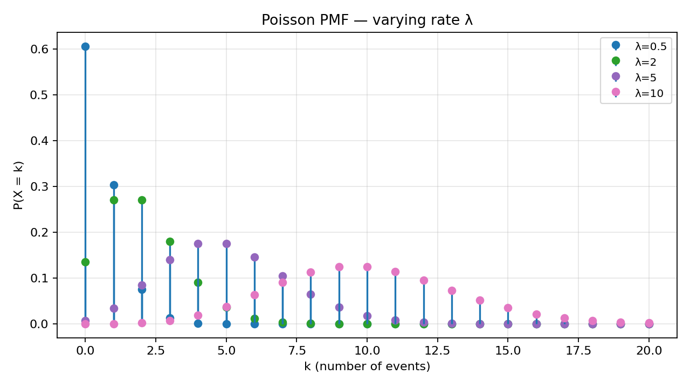
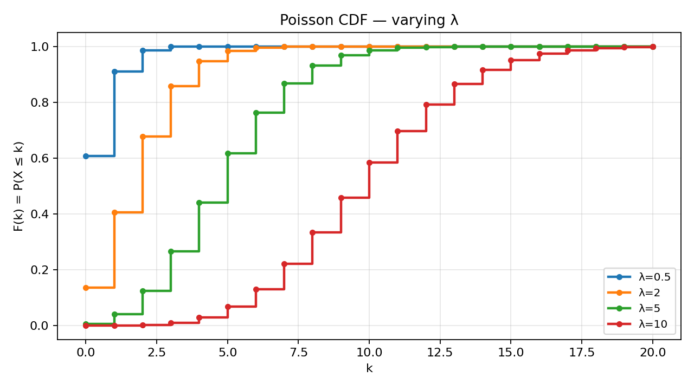

# Problem 5 — Poisson Distribution

This task studies the **Poisson family** $\mathrm{Poisson}(\lambda)$: a standard model for **counts of rare, independent events** in a fixed interval of time or space. Unlike Tasks 1–2 (finite tables) or Task 3 (binomial with finite $n$), the Poisson support is **infinite** — every non-negative integer $k=0,1,2,\ldots$ has positive probability, though masses become negligible for $k$ far above $\lambda$.

### Working example for the whole report

Throughout Parts 6–7 we use a concrete rate

$$\lambda = 3,$$

interpreted as “on average **3 events** per observation interval” (for example 3 customer calls per hour, 3 decay counts per minute, 3 defects per metre of fabric). The headline numerical results are:

| Quantity | Value (4 d.p.) | Meaning |
|----------|:--------------:|---------|
| $P(X=2)$ | **0.2240** | Exactly two events |
| $P(X\le 4)$ | **0.8153** | At most four events |
| $P(X\ge 5)$ | **0.1847** | At least five events |

These numbers are obtained from the PMF formula and cross-checked via the CDF in Part 7.

### How to read the parameter $\lambda$

Unlike Tasks 1–2, we are **not** given a finite table of probabilities. The Poisson family is described by a single positive number $\lambda$ that generates **every** point probability $P(X=k)$ through one formula. Think of $\lambda$ as the **expected count** in the observation window — not a probability, and not “the most likely count” (though the mode is usually near $\lambda$).

**Concrete rate example (calls per hour).** Suppose a help desk logs incoming calls and, over many Mondays between 9:00 and 10:00, the long-run average is **3 calls per hour**. We model one hour as one trial and set $\lambda=3$. Then $P(X=2)\approx 0.224$ means: in about **22%** of randomly chosen hours we see **exactly two** calls, not “about two on average.” The parameter $3$ is the **center of gravity** of all such hourly counts; individual hours fluctuate around it. If staffing is sized for “typical” load, planners still care about $P(X\ge 5)$ because busy hours are real even when the average is only $3$.

**Scaling the window.** The same physical process can be described on different intervals. If calls arrive at rate **6 per hour** but we only watch **30 minutes**, the expected count in that half-hour is $\lambda=6\times\frac{1}{2}=3$ — the same $\lambda$ as in the previous paragraph, but a **different** experiment label on the calendar. Conversely, if the true rate is **1 call per hour** and we aggregate **three hours**, then $\lambda=3$ again. Always state **what interval** $\lambda$ refers to; comparing two Poisson models without matching the window is a common applied mistake.

**Small vs. large $\lambda$ in words.** When $\lambda=0.5$ (half a call per hour on average), most hours show **zero** calls ($P(X=0)\approx 0.61$). When $\lambda=10$, zeros are rare ($P(X=0)\approx 4.5\times 10^{-5}$) and counts spread across roughly $5,\ldots,15$. The formula shape is unchanged; only the numeric value of $\lambda$ slides the distribution along the non-negative integers.

### What this report does

The goal is to complete all ten items (0–9) from Task 5 in the same **verbose, step-by-step** style as Solutions 01–02:

1. **Build a probability space** for “count events in a fixed interval” and define $X$ as that count.
2. **Write the PMF**, identify the parameter $\lambda$, and describe the **support**.
3. **Plot PMF and CDF** for $\lambda\in\{0.5,2,5,10\}$ and explain how shape changes as $\lambda$ grows.
4. **Compute** point, tail, and interval probabilities for $\lambda=3$ using both PMF sums and CDF reads.
5. **Compare** CDF-based cumulative probabilities with direct PMF summation.
6. **Survey applications** (call centers, radioactive decay, rare events).
7. **Point to the shared visualizer** [`../distribution_viewer.html`](../distribution_viewer.html) and its **$\lambda$ slider**.

Static figures are generated by [`plot.py`](plot.py); rerun `python plot.py` after changing plot parameters.

---

## Theory — concepts used

Before any computation, fix vocabulary. Task 5 reuses the PMF/CDF machinery from Tasks 1–2, but the law is **parametric** (one formula for all $k$) and the support is **countably infinite**.

| Symbol | Name | Meaning |
|--------|------|---------|
| $(\Omega,\mathcal{F},P)$ | **Probability space** | $\Omega$ — elementary outcomes; $\mathcal{F}$ — events; $P$ — probability measure (K1–K3). |
| $\omega\in\Omega$ | **Elementary outcome** | One full run of the experiment (here: a realized count $k$). |
| $X:\Omega\to\mathbb{R}$ | **Random variable** | Reports the count; for Poisson, $X(\omega)=\omega$ if we identify $\Omega=\mathbb{N}_0$. |
| $\lambda>0$ | **Poisson parameter** | Mean and variance of $X$ on the chosen interval; “rate × length” in time models. |
| $p_X(k)=P(X=k)$ | **PMF** | $e^{-\lambda}\lambda^k/k!$ for $k\in\mathbb{N}_0$. |
| $F_X(x)=P(X\le x)$ | **CDF** | Right-continuous step function; for integer support, $F_X(k)=P(X\le k)=\sum_{j=0}^{k}p_X(j)$. |
| $\operatorname{supp}(X)$ | **Support** | $\{0,1,2,\ldots\}$ — all non-negative integers. |

### Each object, in plain words

- **Probability space.** $\Omega$ is the menu of possible **counts** after one observation window. For Poisson we take $\Omega=\mathbb{N}_0$ and $P(\{k\})=p_X(k)$. There is no smaller finite $\Omega$ unless we truncate the model artificially. Kolmogorov’s axioms still apply: countable additivity lets us assign probability to any subset of $\mathbb{N}_0$ by summing point masses.
- **Elementary outcome $\omega$.** One finished trial: “we saw exactly $k$ events.” In Construction A below, $\omega$ is that integer itself. In Construction B, $\omega$ might be a full arrival trace, but many traces collapse to the same reported count.
- **Random variable $X$.** The count we report. In the minimal model $X(\omega)=\omega$. The table of values $k$ with probabilities $p_X(k)$ is the **distribution** of $X$; it does not specify which microscopic $\Omega$ produced it.
- **Parameter $\lambda$.** Not a probability; it is the **expected count** in the interval. It also sets the **spread**: $\mathrm{Var}(X)=\lambda$.
- **PMF $p_X$.** Gives **point** probabilities. The factorial $k!$ prevents double-counting in the Poisson limit; the factor $e^{-\lambda}$ normalizes the infinite sum to $1$.
- **CDF $F_X$.** Gives **cumulative** probabilities. For discrete $X$, $F_X$ is a staircase that jumps at $0,1,2,\ldots$ with jump height $p_X(k)$.
- **Support $\operatorname{supp}(X)$.** The set of integers that actually receive positive mass. For Poisson it is **all** of $\mathbb{N}_0$, unlike Task 1’s five-point support. “Infinite support” means infinitely many **possible counts**, not a continuous sample space — we remain discrete.
- **Distribution vs. construction.** The Poisson **law** is the assignment $k\mapsto e^{-\lambda}\lambda^k/k!$. Construction A uses $\Omega=\mathbb{N}_0$; Construction B uses a huge space of arrival times. Both can yield the same $\mathcal{L}(X)$; the PMF table is the invariant, not the microscopic story.

### Two facts reused from Tasks 1–2

1. **Jump rule.** $P(X=k)=F_X(k)-F_X(k^-)$. For integer support, $F_X(k^-)=F_X(k-1)$ with $F_X(-1):=0$.

2. **Interval dictionary** (integer endpoints). For integers $a\le b$:

   | Event | PMF form | CDF form |
   |-------|----------|----------|
   | $\{X\le k\}$ | $\sum_{j=0}^{k}p_X(j)$ | $F_X(k)$ |
   | $\{X\ge k\}$ | $\sum_{j=k}^{\infty}p_X(j)$ | $1-F_X(k-1)$ |
   | $\{a\le X\le b\}$ | $\sum_{j=a}^{b}p_X(j)$ | $F_X(b)-F_X(a-1)$ |
   | $\{X=k\}$ | $p_X(k)$ | $F_X(k)-F_X(k-1)$ |

For Poisson, infinite sums are handled by the closed form $F_X(k)=e^{-\lambda}\sum_{j=0}^{k}\lambda^j/j!$ or numerical tables/software.

### Poisson PMF (central formula)

For $X\sim\mathrm{Poisson}(\lambda)$ with $\lambda>0$,

$$p_X(k)=P(X=k)=\frac{e^{-\lambda}\,\lambda^{k}}{k!},\qquad k=0,1,2,\ldots$$

**Normalization** uses $e^{x}=\sum_{k=0}^{\infty}x^{k}/k!$:

$$\sum_{k=0}^{\infty}p_X(k)=e^{-\lambda}\sum_{k=0}^{\infty}\frac{\lambda^{k}}{k!}=e^{-\lambda}\cdot e^{\lambda}=1.$$

**Moments:** $\mathbb{E}[X]=\lambda$, $\mathrm{Var}(X)=\lambda$, $\mathrm{SD}(X)=\sqrt{\lambda}$.

---

## Part 0 — Experiment, sample space, elementary outcome, and $X$

### The random experiment (words first)

Fix a **positive duration or region**: one hour, one metre of cable, one square centimetre of tissue, one day of insurance claims. During that window, **events** occur at random instants (calls, decays, defects, accidents). We **do not** model each exact timestamp in this task; we only record

> **how many events occurred** in the window.

That number is $X$. The Poisson model is appropriate when:

- events are **rare** relative to the window in a Bernoulli-trial sense, but the window is large enough that the **count** can be moderate;
- occurrences in **disjoint** sub-windows are (approximately) **independent**;
- the **average rate** is (approximately) **constant** over the window.

A full Poisson **process** adds independent increments and order-statistic structure; for Task 5 we need only the **count law** on one interval.

### Sample space $\Omega$

Each elementary outcome is one possible count:

$$\Omega=\mathbb{N}_0=\{0,1,2,3,\ldots\}.$$

An outcome $\omega=k$ means: “exactly $k$ events were observed in the interval.”

There is **no finite cap** in the model: for every $k$, $p_X(k)>0$. Probabilities for very large $k$ are tiny when $\lambda$ is moderate (e.g. for $\lambda=3$, $P(X>20)$ is negligible).

### Random variable

Define

$$X:\Omega\to\mathbb{R},\qquad X(\omega)=\omega.$$

Then $P(X=k)=P(\{\omega=k\})=p_X(k)$ by construction. The map is the identity on $\mathbb{N}_0$.

### Probability measure on atoms

Let $\mathcal{F}=2^{\Omega}$ (all subsets of $\mathbb{N}_0$; countable additivity applies). Define on singletons

$$P(\{k\})=\frac{e^{-\lambda}\lambda^{k}}{k!},$$

and extend to any event $A\subseteq\Omega$ by

$$P(A)=\sum_{k\in A}p_X(k)$$

(countable additivity holds because the series converges absolutely).

### Construction A — minimal (count as outcome)

The simplest possible world: take one elementary outcome for each non-negative integer count. There is no smaller $\Omega$ that can carry a Poisson law with full support $\mathbb{N}_0$, because every $k$ must be possible.

| Object | Choice |
|--------|--------|
| $\Omega_A$ | $\mathbb{N}_0$ |
| $\mathcal{F}_A$ | $2^{\Omega_A}$ |
| $P_A(\{k\})$ | Poisson pmf at $\lambda$ |
| $X_A(\omega)$ | $\omega$ |

Define on atoms $P_A(\{k\})=e^{-\lambda}\lambda^k/k!$ and extend to any $A\subseteq\mathbb{N}_0$ by $P_A(A)=\sum_{k\in A}p_X(k)$. The random variable is the identity: $X_A(\omega)=\omega$.

| Step | Check | Result |
|:----:|-------|--------|
| 1 | Non-negativity of $P_A$ | $e^{-\lambda}>0$ and $\lambda^k/k!>0$ for all $k\in\mathbb{N}_0$. ✓ |
| 2 | Normalization | $\sum_{k=0}^{\infty}P_A(\{k\})=e^{-\lambda}\sum_{k=0}^{\infty}\lambda^k/k!=1$. ✓ |
| 3 | Recover PMF | $P_A(X_A=k)=P_A(\{\omega=k\})=p_X(k)$ for every $k$. ✓ |
| 4 | Mean matches $\lambda$ | $\mathbb{E}[X_A]=\sum_k k\,p_X(k)=\lambda$ (standard identity). ✓ |

**Concrete reading.** Outcome $\omega=2$ means “the hour ended with exactly two events.” The probability of that world is $P_A(\{2\})=e^{-\lambda}\lambda^2/2!$. We never need to list call timestamps to answer $P(X=2)$.

### Construction B — call-center story (same distribution)

**Story.** A call center receives calls over one hour. Each call is an elementary “micro-event,” but we collapse the whole hour into a single number: total calls $k$.

We can imagine a huge (formally infinite) $\Omega_B$ of all possible arrival patterns — sequences of call times in $(0,1]$ — and define $X_B(\omega)$ = number of calls in the window. Under standard Poisson-process assumptions (independent increments, constant rate), $\mathcal{L}(X_B)=\mathrm{Poisson}(\lambda)$ with $\lambda$ = average calls per hour. The **distribution** of the count does not depend on whether we track exact times or only $k$.

| Step | Check | Result |
|:----:|-------|--------|
| 1 | Well-defined count | Every $\omega\in\Omega_B$ yields $X_B(\omega)\in\mathbb{N}_0$. ✓ |
| 2 | Poisson law for $X_B$ | Process theory gives $P(X_B=k)=e^{-\lambda}\lambda^k/k!$. ✓ |
| 3 | Same PMF as Construction A | Point masses at $k=0,1,2,\ldots$ match Construction A. ✓ |
| 4 | Richer $\Omega$, same output | Many distinct arrival paths map to the same $k$ (e.g. two calls at 0:10 and 0:50 vs. 0:05 and 0:55 both give $X_B=2$). ✓ |

**Important distinction (from the task list introduction).** $\Omega$ describes **counts** (or fine-grained arrival paths in Construction B). The **support** of $X$ is the set of values with positive probability — here all of $\mathbb{N}_0$. Do not confuse “infinite $\Omega$” with “continuous sample space”; we remain **discrete**.

---

## Part 1 — PMF and parameter

The **probability mass function** of $X\sim\mathrm{Poisson}(\lambda)$ is

$$\boxed{\,p_X(k)=P(X=k)=\frac{e^{-\lambda}\,\lambda^{k}}{k!},\quad k=0,1,2,\ldots\,}$$

| Factor | Role |
|--------|------|
| $\lambda^{k}$ | More events are more likely when the rate is higher; $k$ enters as a power because counts compound with rate. |
| $k!$ | Corrects for labeling / combinatorial structure in the Poisson limit from binomial. |
| $e^{-\lambda}$ | Ensures $\sum_k p_X(k)=1$; also equals $P(X=0)$. |

**Parameter:** $\lambda>0$ is the sole shape parameter. It is **not** a probability. It has dimensions of a **count** (expected number in the interval). In time models,

$$\lambda=(\text{intensity per unit time})\times(\text{length of interval}).$$

**Relation to binomial (context from Task 3).** If $Y\sim\mathrm{Bin}(n,p)$ with $n$ large and $p$ small such that $np\approx\lambda$, then $P(Y=k)\approx e^{-\lambda}\lambda^{k}/k!$. Poisson is the **law of rare events** in many trials.

### Where the formula comes from (Poisson limit in words)

Fix $n$ independent Bernoulli trials with success probability $p$, and let $Y$ be the **count of successes**. Then $P(Y=k)=\binom{n}{k}p^k(1-p)^{n-k}$. In the **rare-event** regime we take $n\to\infty$, $p\to 0$, but hold $np\to\lambda$ fixed. Intuitively: many opportunities, each rarely successful, yet the expected total number of successes stays moderate.

| Limit step | Binomial factor | Becomes (heuristically) |
|------------|-----------------|-------------------------|
| $\binom{n}{k}=\dfrac{n(n-1)\cdots(n-k+1)}{k!}$ | $n^k/k!$ when $k$ is fixed and $n$ is large | supplies $\lambda^k/k!$ after $np\to\lambda$ |
| $p^k$ | $(\lambda/n)^k$ in the scaling | contributes $\lambda^k$ |
| $(1-p)^{n-k}$ | $(1-\lambda/n)^{n}\to e^{-\lambda}$ | supplies the **normalizer** $e^{-\lambda}$ |

The factor **$e^{-\lambda}$** is therefore not mysterious: it is the survival probability “**no** success in $n$ rare trials” pushed to the limit, and it reweights the whole infinite family so masses sum to $1$. The factor **$k!$** in the denominator is the same combinatorial correction that appears in $\binom{n}{k}$: when many trials compete to place $k$ successes, order among those $k$ slots should not be double-counted.

**Reading the factors after the limit.**

- **$\lambda^k$** — if the expected count doubles, the chance of seeing **exactly** $k$ events scales like the $k$-th power of the rate in the leading term (before normalization).
- **$k!$** — divides out the over-counting of which of the “$k$ slots” among infinitely many rare opportunities fired; without it, masses would not add to $1$.
- **$e^{-\lambda}$** — the probability of the **zero** outcome $P(X=0)$; it also scales down every positive $k$ so the total mass on $\mathbb{N}_0$ is exactly $1$.

A full proof is a routine calculus exercise on the binomial PMF; for Task 5 the important point is **interpretation**: Poisson is the binomial count when trials are numerous and successes are rare, with mean $\lambda$ held fixed.

---

## Part 2 — Support

$$\operatorname{supp}(X)=\{k\in\mathbb{Z}:P(X=k)>0\}=\mathbb{N}_0=\{0,1,2,\ldots\}.$$

**Why infinite?** For every $k$, $\lambda^{k}/k!>0$ and $e^{-\lambda}>0$, so every non-negative integer is possible.

**Why not negative?** Counts cannot be $-1,-2,\ldots$; the model assigns zero probability there.

**Practical truncation.** For computation, choose $k_{\max}$ such that $P(X>k_{\max})<10^{-6}$ (depends on $\lambda$). For $\lambda=10$, masses beyond $k\approx 30$ are negligible; for $\lambda=0.5$, $k_{\max}\approx 10$ suffices.

**Mode.** For $\lambda>0$, the PMF increases for $k<\lambda$ and decreases for $k>\lambda$ (unimodal). The **mode** is $\lfloor\lambda\rfloor$ or $\lfloor\lambda\rfloor-1$ when $\lambda$ is an integer (two adjacent modes).

---

## Part 3 — PMF graphs for several values of $\lambda$

The script [`plot.py`](plot.py) overlays stem plots for

$$\lambda\in\{0.5,\,2,\,5,\,10\}$$

on $k=0,1,\ldots,20$.



### How to read the figure

- **Vertical stems** are $P(X=k)$ at integer $k$; between integers the PMF is zero (discrete law).
- **Legend** identifies rate $\lambda$; higher $\lambda$ shifts probability mass to the **right**.
- **Heights sum to 1** for each curve separately (not across curves).

### Numerical anchors (sanity)

| $\lambda$ | $P(X=0)=e^{-\lambda}$ | Mode (approx.) | $\mathbb{E}[X]$ |
|:---------:|:-----------------------:|:--------------:|:---------------:|
| $0.5$ | $0.6065$ | $0$ | $0.5$ |
| $2$ | $0.1353$ | $1$ or $2$ | $2$ |
| $5$ | $0.0067$ | $4$–$5$ | $5$ |
| $10$ | $\approx 4.5\times 10^{-5}$ | $9$–$10$ | $10$ |

When $\lambda=0.5$, the **largest** stem is at $k=0$ — most intervals see **no** event. When $\lambda=10$, mass spreads across $k\approx 7,\ldots,13$ with visible right tail.

### Presentation guide (how to describe the PMF plot in a report)

When writing up Part 3 for an assignment or slide deck, walk the reader through four concrete observations rather than only saying “the curves move right.”

1. **State the axes.** Horizontal axis: possible counts $k\in\mathbb{N}_0$ (only integers matter). Vertical axis: probability $P(X=k)$, so all stem heights for one curve sum to $1$.
2. **Compare location.** For each $\lambda$, identify where the **tallest stem** sits (approximate mode near $\lfloor\lambda\rfloor$). Note that $\lambda=0.5$ peaks at $0$, while $\lambda=10$ peaks near $9$–$10$.
3. **Compare spread.** Comment on how many stems have visible height: narrow cluster for small $\lambda$, wider bell-like cluster for $\lambda=10$.
4. **Mention truncation.** Explain that the plot cuts at $k=20$ for display; tail mass beyond the frame is negligible for $\lambda\le 10$ but is strictly positive in the model.

A sentence template: *“As $\lambda$ increases from $0.5$ to $10$, the PMF shifts rightward, spreads across more integers, and the probability of a zero count drops from about $61\%$ to nearly $0$.”*

---

## Part 4 — CDF graphs for the same $\lambda$ values

The **cumulative distribution function** is

$$F_X(x)=P(X\le x)=\sum_{k=0}^{\lfloor x\rfloor}p_X(k),\qquad x\in\mathbb{R}.$$

For integer $k$,

$$F_X(k)=\sum_{j=0}^{k}\frac{e^{-\lambda}\lambda^{j}}{j!}.$$



### How to read the figure

- **Step function:** horizontal segments between integers, jumps at $k=0,1,2,\ldots$
- **Right-continuity:** at jump point $k$, the **closed dot** is $F_X(k)$ (includes mass at $k$).
- **Limit:** $F_X(x)\to 1$ as $x\to\infty$ (all mass eventually collected).
- **Steepness:** small $\lambda$ → CDF rises quickly near $0$ (much mass at low counts); large $\lambda$ → rise is delayed toward higher $k$.

### Link to PMF plot

At each integer $k$, the **jump height** on the CDF graph equals the **stem height** on the PMF graph at the same $k$. Tasks 1–2 emphasized this for finite support; here it holds for infinitely many jumps.

### Presentation guide (how to describe the CDF plot)

The CDF figure answers **cumulative** questions at a glance. Use this checklist when presenting Part 4.

1. **Staircase language.** Say explicitly that $F_X$ is **right-continuous**: at each integer $k$ the **filled dot** is $P(X\le k)$, including the mass at $k$.
2. **Early rise vs. delayed rise.** For $\lambda=0.5$, the curve is already near $0.9$ by $k=2$ because most mass sits at $0$ and $1$. For $\lambda=10$, the curve climbs more slowly — you need larger $k$ before $F_X(k)$ approaches $1$.
3. **Link each jump to a stem.** Pick one integer (e.g. $k=3$ at $\lambda=2$) and state: “the vertical step here equals the PMF stem at the same $k$.”
4. **Tail read-off.** $P(X\ge m)=1-F_X(m-1)$: on the plot, find the height **just before** the jump at $m$ and subtract from $1$.

Example sentence: *“At $\lambda=2$, about $65\%$ of intervals see at most three events, because $F_X(3)\approx 0.65$ on the orange curve.”* (Verify numerically if you quote a value.)

---

## Part 5 — How shape changes when $\lambda$ increases

Before comparing curves, fix what is being held constant: the **family** (Poisson) and the **support** ($\mathbb{N}_0$). Only $\lambda$ moves. In applied language, increasing $\lambda$ means “we watch a busier process” or “we lengthen the window at fixed intensity” — either way the **expected count** rises.

As $\lambda$ grows, the distribution **moves right** and **spreads**:

| Effect | What happens | Intuition |
|--------|--------------|-----------|
| **Location** | $\mathbb{E}[X]=\lambda$ increases | More events per interval on average. |
| **Spread** | $\mathrm{Var}(X)=\lambda$ increases | Relative fluctuation $\mathrm{SD}/\mathbb{E}=1/\sqrt{\lambda}$ **decreases** — counts become **relatively** more stable. |
| **Skewness** | Right tail lengthens in absolute terms | Large counts are more likely in absolute terms, though standardized skewness is $1/\sqrt{\lambda}$. |
| **$P(X=0)$** | $e^{-\lambda}$ **decreases** | With higher rate, “no event” becomes rare. |
| **Unimodality** | Peak near $\lambda$ | Mass concentrates around the mean; bell-shaped for moderate/large $\lambda$ (normal approximation). |

After the table, read the effects as a **story**, not five isolated facts. **Location** and **spread** both grow with $\lambda$, so absolute variability increases even as **relative** variability ($1/\sqrt{\lambda}$) shrinks — a call center with $\lambda=100$ has larger hour-to-hour swings in raw call counts than one with $\lambda=3$, but those swings are smaller **as a fraction** of the mean. The decay of $P(X=0)=e^{-\lambda}$ explains why “empty intervals” dominate small-$\lambda$ pictures and vanish for large $\lambda$. Unimodality is the visual merge of those forces: a single peak near the mean, with a right tail that lengthens in absolute terms.

**Small $\lambda$ (e.g. $0.5$).** Distribution is **highly skewed**: dominated by $0$ and $1$. This is the “rare event” regime.

**Moderate $\lambda$ (e.g. $2$–$5$).** Visible unimodal shape; spread over several integers.

**Large $\lambda$ (e.g. $10$).** PMF looks **approximately symmetric** near the mean; De Moivre / CLT suggests $X\approx N(\lambda,\lambda)$ for probability over intervals.

**What stays invariant in structure.** Support remains $\mathbb{N}_0$; formula $e^{-\lambda}\lambda^k/k!$ unchanged; only $\lambda$ moves the family along a one-parameter curve.

**Coefficient of variation.** $\mathrm{CV}=\sqrt{\lambda}/\lambda=1/\sqrt{\lambda}\to 0$ as $\lambda\to\infty$ — Poisson counts become **predictable in relative terms** even as absolute variance grows.

**What to say when $\lambda$ doubles.** If $\lambda$ goes from $3$ to $6$, expect the PMF peak to move from near $3$ to near $6$, the CDF to rise more slowly near zero, and interval probabilities such as $P(X\le 4)$ to **drop** (more mass lives above $4$). Parts 3–4 plots are the visual proof; Part 6 numerics at $\lambda=3$ are the arithmetic anchor.

---

## Part 6 — Probability calculations for $\lambda=3$

We now answer every common probability question about $X\sim\mathrm{Poisson}(3)$ **twice**: once by **PMF** (formula or finite partial sum) and once by **CDF** (cumulative lookup or complement). The six examples mirror Task 1’s Part 6 pattern; the only new wrinkle is an **infinite** tail, handled by $1-F_X(m-1)$ instead of summing forever.

**Cumulative anchors for $\lambda=3$** (build these first; every CDF row below uses them):

| $k$ | $F_X(k)=P(X\le k)$ | Built as |
|:---:|:------------------:|----------|
| $0$ | $0.0498$ | $p(0)$ |
| $1$ | $0.1992$ | $0.0498+0.1494$ |
| $2$ | $0.4232$ | previous $+0.2240$ |
| $3$ | $0.6472$ | previous $+0.2240$ |
| $4$ | **$0.8153$** | previous $+0.1680$ |

For integer tails, $F_X(k^-)=F_X(k-1)$ with $F_X(-1):=0$.

Take $X\sim\mathrm{Poisson}(3)$. Then

$$p_X(k)=e^{-3}\frac{3^{k}}{k!}.$$

Numerical constant: $e^{-3}\approx 0.049787$.

### Building block: individual masses

| $k$ | Formula | Value (4 d.p.) |
|:---:|---------|:--------------:|
| $0$ | $e^{-3}$ | $0.0498$ |
| $1$ | $3e^{-3}$ | $0.1494$ |
| $2$ | $\dfrac{9e^{-3}}{2}$ | **$0.2240$** |
| $3$ | $\dfrac{27e^{-3}}{6}$ | $0.2240$ |
| $4$ | $\dfrac{81e^{-3}}{24}$ | $0.1680$ |
| $5$ | $\dfrac{243e^{-3}}{120}$ | $0.1008$ |

Note $P(X=2)=P(X=3)$ at $\lambda=3$ because the mode straddles an integer parameter.

### Example 6.1 — $P(X=2)$

Exactly two events in the window. PMF: plug $k=2$ into the formula. CDF: jump at $2$ equals $F_X(2)-F_X(1)$.

| Method | Computation | Result |
|--------|-------------|:------:|
| PMF (direct) | $\dfrac{e^{-3}\,3^{2}}{2!}=\dfrac{9}{2}e^{-3}\approx 4.5\times 0.049787$ | **$0.2240$** |
| CDF (jump rule) | $F_X(2)-F_X(1)=0.4232-0.1992$ | **$0.2240$** |

In a call-center hour with $\lambda=3$, about **22.4%** of hours show exactly two calls. The PMF route is one formula; the CDF route needs two cumulative values but no factorial.

### Example 6.2 — $P(X\le 4)$

“At most four events.” PMF: add five masses. CDF: one lookup.

| Method | Computation | Result |
|--------|-------------|:------:|
| PMF | $p(0)+p(1)+p(2)+p(3)+p(4)$ | $0.0498+0.1494+0.2240+0.2240+0.1680$ |
| CDF | $F_X(4)$ | **$0.8153$** |

| $k$ | $p_X(k)$ | Running sum (PMF) |
|:---:|:--------:|:-----------------:|
| $0$ | $0.0498$ | $0.0498$ |
| $1$ | $0.1494$ | $0.1992$ |
| $2$ | $0.2240$ | $0.4232$ |
| $3$ | $0.2240$ | $0.6472$ |
| $4$ | $0.1680$ | **$0.8153$** |

About **81.5%** of intervals see four or fewer events — the usual “moderate load” region for staffing when the mean is $3$.

### Example 6.3 — $P(X\ge 5)$

“At least five events” — a **tail** question. Summing $p(5)+p(6)+\cdots$ forever is correct but tedious; the complement and CDF routes are standard.

| Method | Computation | Result |
|--------|-------------|:------:|
| PMF (complement) | $1-\sum_{k=0}^{4}p(k)=1-0.8153$ | **$0.1847$** |
| CDF (complement) | $1-F_X(4)=1-0.8153$ | **$0.1847$** |

Roughly **18.5%** of hours are “busy tails” with five or more calls. First tail terms for a direct-sum check: $p(5)\approx 0.1008$, $p(6)\approx 0.0504$, $p(7)\approx 0.0216$, … — the series converges quickly after the complement has already given the answer.

### Example 6.4 — $P(1\le X\le 4)$

Interval with **both endpoints included**. Exclude $k=0$ from the cumulative mass up to $4$.

| Method | Computation | Result |
|--------|-------------|:------:|
| PMF | $p(1)+p(2)+p(3)+p(4)$ | $0.1494+0.2240+0.2240+0.1680$ |
| CDF | $F_X(4)-F_X(0)=0.8153-0.0498$ | **$0.7655$** |

PMF sum $0.7654$ vs. CDF $0.7655$ — agreement within rounding. Operationally: “between one and four calls inclusive” covers about **76.5%** of hours, slightly less than “at most four” because silent hours ($k=0$) are removed.

### Example 6.5 — $P(X<2)$ and $P(X>2)$

Two related strict/non-strict questions on the same cutoff $2$.

**$P(X<2)=P(X\le 1)$** — values $0$ or $1$ only:

| Method | Computation | Result |
|--------|-------------|:------:|
| PMF | $p(0)+p(1)$ | **$0.1992$** |
| CDF | $F_X(1)$ | **$0.1992$** |

**$P(X>2)=1-P(X\le 2)$** — exclude $0,1,2$:

| Method | Computation | Result |
|--------|-------------|:------:|
| PMF | $1-(p(0)+p(1)+p(2))=1-0.4232$ | **$0.5768$** |
| CDF | $1-F_X(2)=1-0.4232$ | **$0.5768$** |

Strict inequality at $2$ for the lower event uses $\le 1$; strict “greater than $2$” uses complement of $\le 2$, not $\ge 2$ (which would include $k=2$). About **57.7%** of hours see **three or more** calls.

### Example 6.6 — $P(X=0)$ (no events)

The “silent interval” probability equals the normalizing factor $e^{-\lambda}$.

| Method | Computation | Result |
|--------|-------------|:------:|
| PMF (direct) | $e^{-3}$ | **$0.0498$** |
| CDF (jump at $0$) | $F_X(0)-F_X(-1)=0.0498-0$ | **$0.0498$** |

Even with mean $3$, roughly **5%** of hours have **no** calls — a reminder that Poisson variability includes empty outcomes. For planning, do not staff only for the mean; the zero and tail masses both matter.

### Summary table ($\lambda=3$)

| Event | PMF computation | CDF computation | Value |
|-------|-----------------|-----------------|:-----:|
| $\{X=2\}$ | $e^{-3}3^{2}/2!$ | $F_X(2)-F_X(1)$ | $0.2240$ |
| $\{X\le 4\}$ | $\sum_{k=0}^{4}p(k)$ | $F_X(4)$ | $0.8153$ |
| $\{X\ge 5\}$ | $1-\sum_{k=0}^{4}p(k)$ | $1-F_X(4)$ | $0.1847$ |
| $\{1\le X\le 4\}$ | $p(1)+p(2)+p(3)+p(4)$ | $F_X(4)-F_X(0)$ | $0.7654$ |
| $\{X<2\}$ | $p(0)+p(1)$ | $F_X(1)$ | $0.1992$ |
| $\{X>2\}$ | $1-\sum_{k=0}^{2}p(k)$ | $1-F_X(2)$ | $0.5768$ |
| $\{X=0\}$ | $e^{-3}$ | $F_X(0)$ | $0.0498$ |

Every row agrees between PMF and CDF columns — the same bookkeeping as Task 1, now with infinitely many possible jumps but only finitely many terms in each partial sum.

---

## Part 7 — CDF versus PMF summation

For Poisson, **the same probabilities** can be computed two ways. This mirrors Task 1 (PMF-first) vs. Task 2 (CDF-first), but here both come from a **formula family** rather than a finite table. The conceptual content is unchanged from Solutions 01–02: **differencing** the CDF recovers point masses; **partial summing** the PMF builds the CDF. What changes is only the **length** of the sums — finite in Task 1, truncatable or closed-form here.

### Worked numeric row: $P(2\le X\le 4)$ at $\lambda=3$

This interval was Example 6.4; we repeat it as a **line-by-line** reconciliation.

| Step | PMF route | CDF route |
|:----:|-----------|-----------|
| 1 | List masses: $p(2)=0.2240$, $p(3)=0.2240$, $p(4)=0.1680$ | Identify endpoints: need mass **after** $1$, **through** $4$ |
| 2 | Add: $0.2240+0.2240+0.1680=0.6160$ | $F_X(4)-F_X(1)=0.8153-0.1992=0.6161$ |
| 3 | (Optional) include $p(1)$ if mis-read as $1\le X\le 4$ | Wrong CDF $F_X(4)-F_X(0)$ gives $0.7655$ — includes $k=1$ |

The PMF sum $0.6160$ for $\{2,3,4\}$ matches $F_X(4)-F_X(1)$ to rounding. The dictionary line $\{a\le X\le b\}\mapsto F_X(b)-F_X(a-1)$ with $a=2$ gives $F_X(4)-F_X(1)$ because $F_X(1^-)=F_X(1)$ at an integer. Confusing $F_X(0)$ with $F_X(1^-)$ is the usual slip when translating “from $1$” vs. “from $2$.”

### Cumulative probabilities

For integer $k$,

$$\boxed{F_X(k)=P(X\le k)=\sum_{j=0}^{k}\frac{e^{-\lambda}\lambda^{j}}{j!}.}$$

Software libraries evaluate this sum stably (e.g. incomplete gamma relation). For hand work at $\lambda=3$, $k=4$, the partial sum in Part 6.2 **is** the CDF value $0.8153$.

### Tail via CDF

$$P(X\ge m)=1-F_X(m-1),\qquad m\in\mathbb{N}_0.$$

For $m=5$, $\lambda=3$:

$$P(X\ge 5)=1-F_X(4)=1-0.8153=0.1847.$$

One subtraction replaces an infinite series.

### Point probabilities

$$P(X=k)=F_X(k)-F_X(k-1)=p_X(k).$$

At $k=2$: $F_X(2)-F_X(1)=0.4232-0.1992=0.2240$ — matches the PMF.

**Full jump table at $\lambda=3$** (first six support points):

| $k$ | $F_X(k^-)$ | $F_X(k)$ | Jump $F_X(k)-F_X(k^-)$ | PMF $p(k)$ | Match? |
|:---:|:----------:|:--------:|:----------------------:|:----------:|:------:|
| $0$ | $0$ | $0.0498$ | $0.0498$ | $0.0498$ | ✓ |
| $1$ | $0.0498$ | $0.1992$ | $0.1494$ | $0.1494$ | ✓ |
| $2$ | $0.1992$ | $0.4232$ | $0.2240$ | $0.2240$ | ✓ |
| $3$ | $0.4232$ | $0.6472$ | $0.2240$ | $0.2240$ | ✓ |
| $4$ | $0.6472$ | $0.8153$ | $0.1680$ | $0.1680$ | ✓ |
| $5$ | $0.8153$ | $0.9161$ | $0.1008$ | $0.1008$ | ✓ |

Summing the jump column gives $0.9161$ after $k=5$; the remaining mass $1-0.9161\approx 0.0839$ lives on $\{6,7,\ldots\}$.

### Side-by-side for $\lambda=3$

| Question | PMF route | CDF route | Match? |
|----------|-----------|-----------|:------:|
| $P(X=2)$ | $e^{-3}3^{2}/2!$ | $F_X(2)-F_X(1)$ | $0.2240$ ✓ |
| $P(X\le 4)$ | $\sum_{k=0}^{4}p(k)$ | $F_X(4)$ | $0.8153$ ✓ |
| $P(X\ge 5)$ | $1-\sum_{k=0}^{4}p(k)$ | $1-F_X(4)$ | $0.1847$ ✓ |
| $P(2\le X\le 4)$ | $p(2)+p(3)+p(4)$ | $F_X(4)-F_X(1)$ | $0.6160$ ✓ |

### When to prefer which

| Situation | Prefer PMF | Prefer CDF |
|-----------|------------|------------|
| Single $P(X=k)$ | Direct formula | Need two CDF values |
| $P(X\le k)$ | Sum $k+1$ terms | **One** lookup $F_X(k)$ |
| $P(X\ge m)$ | Infinite sum | **One** complement $1-F_X(m-1)$ |
| Interval $[a,b]$ | Sum $b-a+1$ terms | $F_X(b)-F_X(a-1)$ |
| Large $k$, moderate $\lambda$ | Many terms | Still one CDF call in software |

**Bottom line.** PMF and CDF are **inverse bookkeeping** on the same infinite staircase: differencing CDF gives PMF; partial summing PMF gives CDF. For Poisson, both are implemented in standard libraries (`scipy.stats.poisson` in [`plot.py`](plot.py)).

**When to prefer which (Poisson-specific).** Use the **PMF** when you need a single $P(X=k)$ and already have $\lambda$ and $k$ — one evaluation of $e^{-\lambda}\lambda^k/k!$. Use the **CDF** when the question is $\{X\le k\}$, $\{X\ge m\}$, or an interval: one value $F_X(k)$ or one complement replaces a growing partial sum. Software almost always exposes `cdf` for tails; hand calculation at $\lambda=3$ and $k\le 6$ is still feasible with the running-sum table from Part 6.

### Numerical note

Summing PMF terms until convergence matches CDF to machine precision. For $\lambda=3$, truncating at $k=15$ already captures tail mass beyond $10^{-8}$. If you build $F_X(k)$ by hand, store **running sums** as in Part 6.2 rather than recomputing factorials from scratch at each $k$.

---

## Part 8 — Practical applications

The Poisson model appears whenever we count **independent rare events** in a fixed exposure. The workflow in every application is the same: (i) define the **window** (hour, metre, page); (ii) estimate $\lambda$ as the historical **expected count** in that window; (iii) translate operational questions into $P(X=k)$, $P(X\le k)$, or tail probabilities using Part 6–7; (iv) check whether mean $\approx$ variance in data.

### 1. Call center / customer service

- **Experiment:** Count incoming calls in a 15-minute or one-hour window.
- **Parameter:** $\lambda=$ expected calls in that window (from historical average).
- **Use:** Staffing rules, queueing approximations, SLA for wait time. If $\lambda=3$ per hour, $P(X=0)\approx 5\%$ of hours are quiet; $P(X\ge 5)\approx 18\%$ are busy tails.
- **Caveat:** Real call streams vary by time of day; rate may not be constant (mixture breaks pure Poisson — see data-analysis tasks later in the course).

**Worked link to Part 6.** With $\lambda=3$, staffing for “typical” load often targets the median neighborhood near $3$, but **service level** for overflow might require $P(X\ge 5)\approx 0.185$ — nearly one hour in five exceeds four calls. PMF gives hourly granularity; CDF gives “fraction of hours with at most $k$ agents’ worth of calls” in one lookup.

### 2. Radioactive decay

- **Experiment:** Count particles detected in a fixed time $t$ with average rate $\mu$.
- **Parameter:** $\lambda=\mu t$ (expected decays in interval).
- **Use:** Detector calibration, background noise, confidence intervals for activity level.
- **Assumption:** Decays of distinct nuclei are independent; rate stable over $t$.

**Scaling.** Doubling exposure time doubles $\lambda$ if $\mu$ is constant — the same nucleus family, different window. Counting in $t=1$ s vs. $t=10$ s is not the same experiment label even if $\lambda$ is matched by adjusting $\mu$.

### 3. Rare adverse events (insurance, safety, defects)

- **Experiment:** Count accidents / defects / failures in a month across a large portfolio.
- **Parameter:** $\lambda=$ expected count per month.
- **Use:** Pricing rare-event risk, control charts; Poisson is the baseline before over-dispersion (negative binomial) if variance exceeds $\lambda$.

**Regulatory reading.** $P(X=0)$ is the chance of a **clean** month; $P(X\ge 1)$ is the chance of **any** incident. Underwriters often care about upper tails $P(X\ge k_{\text{crit}})$ for capital reserves — exactly the CDF complement from Part 6.3.

### 4. Other standard uses (brief)

| Domain | What is counted | Typical $\lambda$ | Typical question |
|--------|-----------------|-------------------|------------------|
| Network traffic | Packets per ms | Large | Buffer overflow: $P(X>\text{capacity})$ |
| Text | Typos per page | Small | Proofreading: $P(X=0)$ clean page |
| Epidemiology | New cases per week | Varies | Outbreak: $P(X\ge k_{\text{alert}})$ |
| Astronomy | Photons per exposure bin | Small | Dark sky: $P(X=0)$ vs. background |
| Manufacturing | Defects per batch | Small–moderate | QC: $P(X\le \text{acceptance limit})$ |
| Traffic engineering | Accidents per intersection per year | Small | Safety budget: upper tail |

### 5. Poisson as a bridge in the course

Task 3 (binomial) counts successes in **fixed** $n$ trials; Task 5 (Poisson) counts events in a **fixed** window with **no** fixed trial count. The limit $n\to\infty$, $p\to 0$, $np\to\lambda$ explains why software switches from `binom` to `poisson` when $n$ is large and $p$ is small. Later tasks with **continuous** waiting times use PDFs; the Poisson CDF staircase is the last discrete “partial sum” picture before that shift.

**Common modeling pitfall:** Using Poisson when **variance $\gg \lambda$** (over-dispersion) or when events are **not independent** (contagion, clustering). Always compare empirical mean and variance on the **same window** used to define $\lambda$.

---

## Part 9 — Interactive visualizer and $\lambda$ slider

The task list recommends a **shared distribution explorer** at the parent folder level:

**[`../distribution_viewer.html`](../distribution_viewer.html)**

### Expected functionality for Poisson

1. **Family selector** includes $\mathrm{Poisson}(\lambda)$.
2. **$\lambda$ slider** (or numeric input) lets the user move $\lambda$ continuously, e.g. from $0.1$ to $20$.
3. **Dual plots:** PMF stems and CDF steps update live — same overlay idea as `pmf_lambda_varied.png` / `cdf_lambda_varied.png`.
4. **Compare two rates** on one axis (optional extension from the task list): e.g. $\lambda=2$ vs. $\lambda=5$.
5. **Probability calculator:** user enters $k$, $a$, $b$; app shows $P(X=k)$, $P(X\le k)$, $P(a\le X\le b)$ via PMF sum and CDF complement side by side (Part 7 workflow).

### Relation to this solution folder

| Asset | Role |
|-------|------|
| [`plot.py`](plot.py) | Static matplotlib figures for the report |
| [`pmf_lambda_varied.png`](pmf_lambda_varied.png) | Embedded in Part 3 |
| [`cdf_lambda_varied.png`](cdf_lambda_varied.png) | Embedded in Part 4 |
| `../distribution_viewer.html` | Browser tool with **$\lambda$ slider** for exploration beyond fixed plots |

Opening the HTML file locally (no server required if scripts are self-contained) should reproduce the **shape comparisons** of Parts 3–5 interactively. Try $\lambda=3$ and verify $P(X=2)\approx 0.224$, $P(X\le 4)\approx 0.815$, $P(X\ge 5)\approx 0.185$ against Part 6.

---

## Consistency check

| Item | Check | Status |
|------|-------|:------:|
| PMF non-negative | $e^{-\lambda}\lambda^k/k!>0$ | ✓ |
| PMF sums to $1$ | Exponential series | ✓ |
| Support $\mathbb{N}_0$ | All $k$ possible | ✓ |
| $\mathbb{E}[X]=\mathrm{Var}(X)=\lambda$ | Standard identities | ✓ |
| Construction A step table | Four rows, normalization | ✓ |
| Construction B step table | Same PMF as A | ✓ |
| Poisson limit / factor story | Part 1 prose + table | ✓ |
| Plots for $\lambda\in\{0.5,2,5,10\}$ | `plot.py` outputs | ✓ |
| Parts 3–4 presentation guides | Prose checklists | ✓ |
| Part 5 before/after table prose | Narrative + CV note | ✓ |
| $\lambda=3$ numerics | $0.2240$, $0.8153$, $0.1847$ | ✓ |
| Part 6 dual PMF/CDF (6.1–6.6) | Seven-row summary table | ✓ |
| CDF vs PMF agreement | Part 7 jump + side-by-side | ✓ |
| Worked interval row | $P(2\le X\le 4)$ | ✓ |
| Applications expanded | Five subsections + table | ✓ |
| Visualizer path | `../distribution_viewer.html` + slider | ✓ |
| Style vs. Solution 01 | Verbose prose, step tables | ✓ |

**Cross-part numeric coherence ($\lambda=3$).** Headline values in the introduction match Part 6: $P(X=2)=0.2240$, $P(X\le 4)=0.8153$, $P(X\ge 5)=0.1847$. Part 7 jump table reproduces the same $p(k)$ and $F_X(k)$; Example 6.4 interval sum and $F_X(4)-F_X(0)$ differ only in rounding. Part 8 call-center bullets reuse those probabilities.

**Notation.** $\lambda$ always means expected count in the stated window; $p_X(k)$ and $F_X(k)$ follow Tasks 1–2 conventions; $F_X(-1):=0$ for tail complements.

Every formal requirement of Task 5 (items 0–9) is addressed: a probability space was constructed (two constructions with step tables), the PMF and support were stated (with limit intuition), PMF/CDF graphs for multiple $\lambda$ were drawn and interpreted (with presentation guides), probabilities for $\lambda=3$ were computed **both** by PMF and CDF routes in Part 6, agreement was verified in Part 7, applications were surveyed, and the shared HTML visualizer with a **$\lambda$ slider** was referenced for interactive exploration.

---

## Appendix — Regenerating figures

From this directory:

```bash
python plot.py
```

Requires `matplotlib`, `numpy`, `scipy`. Outputs:

- `pmf_lambda_varied.png`
- `cdf_lambda_varied.png`

Edit the `cases` list in `plot.py` to add or change $\lambda$ values; rerun to refresh the report images.
