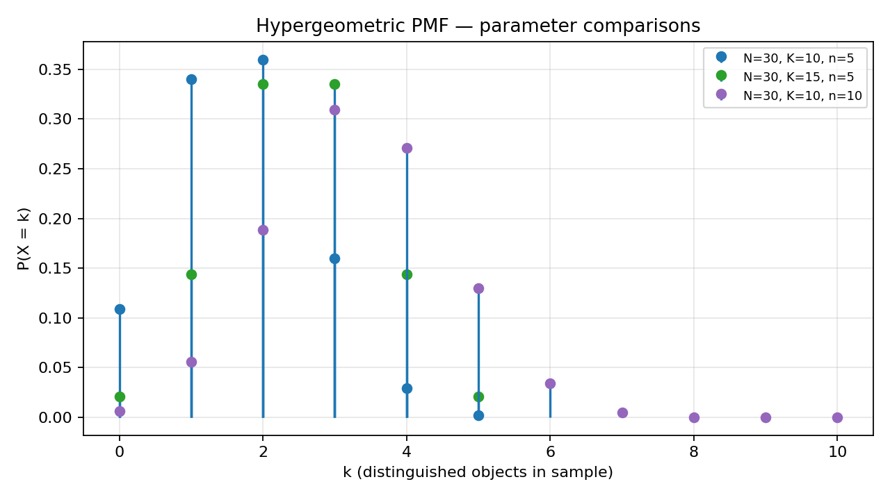
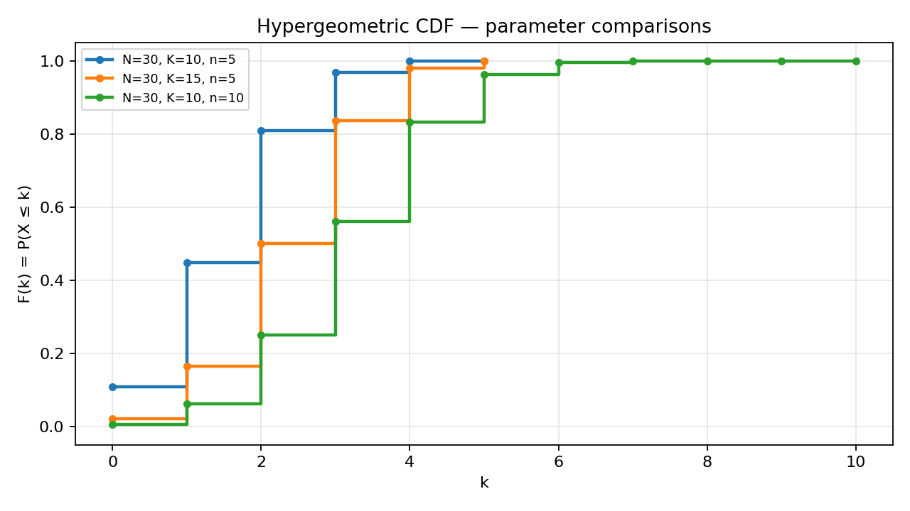
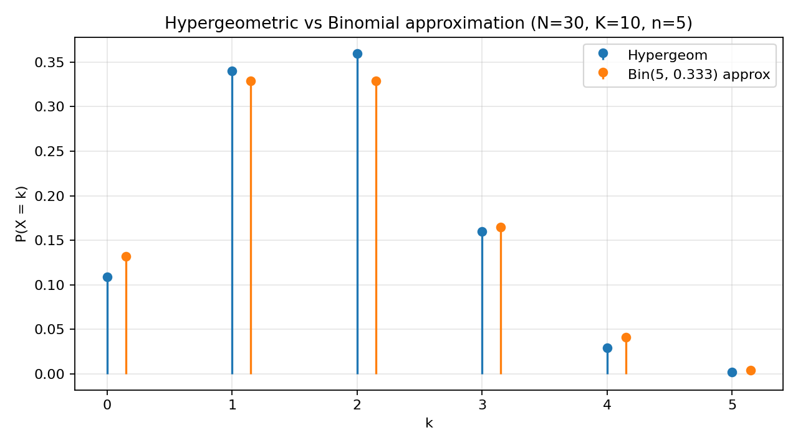

# Problem 6 — Hypergeometric Distribution

A **finite population** contains $N$ objects. Exactly $K$ of them are **distinguished** (often called “successes” or “Type A”); the remaining $N-K$ are **undistinguished** (“failures” or “Type B”). We draw a **simple random sample of size $n$ without replacement**: every subset of $n$ distinct objects from the population is equally likely. Let

$$X = \text{number of distinguished objects in the sample}.$$

Then $X$ follows the **hypergeometric distribution** with parameters $(N,K,n)$. We write $X \sim \mathrm{Hypergeom}(N,K,n)$. The entire report treats $X$ as a **discrete** random variable on the integers: we will plot PMF stems and a CDF staircase, verify that masses sum to $1$, and compute probabilities using the same PMF/CDF dictionary as in Tasks 1 and 2 — only the formula for $p_X(k)$ changes.

### How to read the parameters

| Symbol | Name | Meaning |
|--------|------|---------|
| $N$ | **Population size** | Total number of objects in the urn / batch / deck before sampling. |
| $K$ | **Number of distinguished objects in the population** | How many “success-type” items exist among all $N$. |
| $n$ | **Sample size** | How many objects are drawn, **without** putting them back. |

Read the triple $(N,K,n)$ as a **story about a finite urn**, not as three abstract letters. Picture a mixing bowl with exactly $N$ balls on the table before anyone touches it. You paint $K$ of them red (distinguished / successes / Type A) and leave the other $N-K$ blue (undistinguished / failures / Type B). You then reach in once and pull out a **hand** of $n$ distinct balls, mixing the order in your pocket so only the **set** of colours matters. The random variable $X$ answers one question about that hand: *how many red balls did I get?* The parameter $N$ fixes how big the bowl is; $K$ fixes how many reds were available to begin with; $n$ fixes how large your hand is. None of the three is a probability by itself — they are **counts** that enter the combinatorial PMF in Part 1.

**Concrete urn walk-through.** Take $N=30$, $K=10$, $n=5$ (our working example). Before sampling there are $30$ balls, $10$ red and $20$ blue. After one legal draw you hold exactly $5$ balls, no duplicates. The value $X=2$ means “my hand contains two reds and three blues”. It does **not** mean “I drew red on the second try” — order is irrelevant in the standard model. If instead you had $N=12$, $K=4$, $n=6$, you would draw more than half the urn; every draw noticeably changes the colour mix still in the bowl, and the hypergeometric law (not the binomial) is mandatory.

The phrase **without replacement** is the defining feature. After each object enters the sample it is **gone** from the population for the rest of the draw. The chance that the next ball is red depends on how many reds are still in the bowl, which depends on how many reds you already took. Successive draws are therefore **dependent**. That dependence is exactly what the hypergeometric PMF encodes through binomial coefficients on a **shrinking** population. When $n$ is tiny compared to $N$, removing $n$ balls barely changes the red fraction $K/N$, and the binomial model with $p=K/N$ is often close enough (Part 7). When $n$ is a substantial fraction of $N$, depletion matters and the exact hypergeometric formula should be used.

### Working example (used throughout)

Unless stated otherwise, all numeric work in this report uses

$$N = 30,\qquad K = 10,\qquad n = 5.$$

Interpretation: an urn holds $30$ balls, $10$ red and $20$ blue. Five balls are drawn at random without replacement. Then $X$ counts how many red balls appear in the hand.

Key probabilities for this triple (verified in Part 6 by both PMF and CDF routes):

| Quantity | Value (4 d.p.) | Plain-language read |
|----------|:--------------:|---------------------|
| $P(X = 2)$ | $0.3600$ | About $36\%$ of hands show exactly two reds — the most likely single count. |
| $P(X \le 2)$ | $0.8088$ | About $81\%$ of hands show at most two reds — a typical hand is “low to moderate” red. |
| $P(X \ge 4)$ | $0.0312$ | About $3\%$ of hands show four or five reds — a high-red hand is unusual. |

These three numbers anchor the report: they reappear in the intro, in the PMF/CDF plots, in Part 6’s dual calculations, and in the consistency check at the end.

### What this report does

The goal is to complete nine parts, in this order:

1. **Build a concrete world** $(\Omega,\mathcal{F},P)$ for sampling without replacement — Constructions A (unordered hand) and B (ordered draw) — and define $X(\omega)$ as the number of distinguished objects in the sample.
2. **Write the PMF**, tell the combinatorial numerator/denominator story, explain $(N,K,n)$, and verify normalization on $(30,10,5)$.
3. **Identify the support** $\operatorname{supp}(X)$ and explain the lower and upper bounds in urn language.
4. **Draw PMF graphs** for several parameter choices and interpret how stems move when $K$ or $n$ changes.
5. **Draw the corresponding CDF graphs** and read cumulative probabilities from the staircases.
6. **Explain** in prose how the distribution changes when $n$ or $K$ varies (support, mean, tails).
7. **Compute** $P(X=k)$, $P(X\le k)$, $P(X\ge k)$, and $P(a\le X\le b)$ for the working example — each event by **both** PMF and CDF routes, with commentary.
8. **Compare** numerically and conceptually with the binomial model ($p=K/N$), including a full PMF table and rules for when the approximation is safe.
9. **Describe applications** (cards, audit, quality control, ecology, epidemiology, raffles) and point to the shared distribution viewer.

Most steps are counting bookkeeping, but every formula is explained in words before numbers are plugged in — the same verbose style as Solutions 1 and 2. Where Task 1 built a world from a PMF table and Task 2 from a CDF table, here we **derive** the PMF from a sampling story, then use the same PMF/CDF dictionary as in Tasks 1–2 for all probability questions.

---

## Theory — concepts used

Before any computation, fix the vocabulary. The hypergeometric family reuses the same PMF/CDF machinery as Tasks 1–2; what is new is the **experiment** (sampling without replacement) and the **combinatorial PMF**. If Task 1 taught “table $\leftrightarrow$ world $\leftrightarrow$ graphs” for a generic discrete law, this report runs the same pipeline for one named law generated by an urn. You should leave able to (i) set up $\Omega$ for a sampling story, (ii) explain each factor in the PMF fraction, (iii) read stems and staircases, and (iv) decide whether a binomial shortcut is safe.

| Symbol | Name | Meaning |
|--------|------|---------|
| $(\Omega,\mathcal{F},P)$ | **Probability space** | $\Omega$ — elementary outcomes; $\mathcal{F}\subseteq 2^{\Omega}$ — events; $P:\mathcal{F}\to[0,1]$ — probability measure. |
| $\omega\in\Omega$ | **Elementary outcome** | One equally likely sample of size $n$ (a specific subset of the population). |
| $X:\Omega\to\mathbb{R}$ | **Random variable** | Counts distinguished objects in the sample $\omega$. |
| $\operatorname{supp}(X)$ | **Support** | Values $k$ with $P(X=k)>0$. |
| $p_X(k)=P(X=k)$ | **PMF** | Hypergeometric formula (Part 1). |
| $F_X(k)=P(X\le k)$ | **CDF** | Running sum of PMF masses up to $k$. |
| $\binom{a}{b}$ | **Binomial coefficient** | Number of $b$-subsets of an $a$-element set; $\binom{a}{b}=0$ if $b<0$ or $b>a$. |

### Each object, in plain words

- **Probability space.** Think of $\Omega$ as the *menu* of everything that can happen in one run of the sampling experiment — here, every possible subset of size $n$ from the population. Think of $\mathcal{F}$ as the collection of *questions* we are allowed to ask (“does the sample contain label $7$?”, “does it contain at least three distinguished objects?”). Think of $P$ as the *machine* that assigns a number in $[0,1]$ to each question. Under **simple random sampling without replacement**, that machine is **uniform on atoms**: every $n$-subset $\omega$ has the same atomic probability $1/\binom{N}{n}$, and the probability of any event is “how many favourable subsets divided by $\binom{N}{n}$”. Kolmogorov’s axioms are satisfied because we are just counting equally likely hands.
- **Elementary outcome $\omega$.** This is one finished draw — for example “objects $\{3,7,11,19,22\}$ were selected”. It is a **set**, not an ordered sequence like $(3,7,11,19,22)$, because the standard hypergeometric problem cares only about *which* objects were taken, not the order in which they were physically pulled from the urn. Two different draw orders that produce the same set are the **same** outcome in Construction A (Part 0).
- **Random variable $X$.** A measurable function that reads a sample $\omega$ and reports an integer: how many of its members are distinguished. Knowing $\omega$ tells you $X(\omega)$ deterministically; the randomness is hidden inside *which* $\omega$ gets drawn. The PMF table in Part 1 is only the *fingerprint* of $X$ — it does not specify $\Omega$ uniquely (two different constructions can yield the same hypergeometric law).
- **Support $\operatorname{supp}(X)$.** The set of integer counts $k$ that actually occur with positive probability. It is **not** the same as $\Omega$: $|\Omega|=\binom{N}{n}$ can be enormous while $|\operatorname{supp}(X)|$ is at most $\min(n,K)-\max(0,n-(N-K))+1$, often a handful of integers. Many different samples $\omega$ collapse to the same count $k$.
- **PMF $p_X(k)=P(X=k)$.** A finite list of non-negative numbers on the support, summing to $1$. For hypergeometric $X$ each entry is a **ratio of binomial coefficients** (Part 1): favourable hands divided by all hands. The PMF is the natural object when you ask “what is the chance of **exactly** $k$ reds?”.
- **CDF $F_X(k)=P(X\le k)$.** A staircase on the integers that **re-encodes** the PMF by adding masses from the left: $F_X(k)=\sum_{j\le k}p_X(j)$ on the support. It is the natural object when you ask “what is the chance of **at most** $k$ reds?”. Between consecutive support points the CDF is flat; at each $k$ it jumps by $p_X(k)$.
- **Without replacement vs with replacement.** With replacement, each trial sees the same population composition ($K$ reds out of $N$) and trials are **independent** → **binomial**$(n,p)$ with $p=K/N$. Without replacement, each draw changes what remains → **hypergeometric**$(N,K,n)$. The binomial is a useful approximation when $n\ll N$ because depletion is negligible; when $n$ is comparable to $N$, the finite-population correction in the hypergeometric variance (Part 7) shows up in the numbers.

### Two facts used repeatedly

1. **Jump rule** (discrete CDF). For every integer $k$,
   $$P(X = k) = F_X(k) - F_X(k^-).$$
   On the staircase graph of $F_X$, the riser at $k$ equals $p_X(k)$. For hypergeometric $X$ the jumps occur only at legal counts in Part 2; between those integers the CDF is flat and the jump rule correctly returns zero.

2. **Interval dictionary** (discrete case, integer support):

   | Event | Formula |
   |-------|---------|
   | $\{X\le k\}$ | $F_X(k)=\sum_{j\le k}p_X(j)$ |
   | $\{X< k\}$ | $F_X(k^-)=F_X(k-1)$ (when $k-1$ is the previous support point) |
   | $\{X\ge k\}$ | $1-F_X(k^-)=1-F_X(k-1)$ |
   | $\{X> k\}$ | $1-F_X(k)$ |
   | $\{a\le X\le b\}$ | $F_X(b)-F_X(a^-)=F_X(b)-F_X(a-1)$ |
   | $\{X=k\}$ | $p_X(k)$ |

   For hypergeometric $X$, all support points are integers, so endpoint bookkeeping reduces to “include or exclude the neighbouring integer”.

   **How to read this table in one pass.** Cumulative questions ($X\le k$, $X\ge k$) are CDF-native: one read or one complement. Point questions ($X=k$) are PMF-native **or** jump-sized from the CDF. Interval questions mix both endpoints — write the event in words first (“include $a$? include $b$?”), then pick $F_X(\cdot)$ or $F_X(\cdot^-)$ accordingly. Part 6 is deliberate practice on every row of this dictionary.

### Combinatorial backbone

The hypergeometric PMF counts **favourable samples** divided by **all samples**:

$$\text{favourable} = \underbrace{\binom{K}{k}}_{\text{choose }k\text{ distinguished}} \times \underbrace{\binom{N-K}{\,n-k\,}}_{\text{choose }n-k\text{ undistinguished}}, \qquad \text{total} = \binom{N}{n}.$$

Every term is a binomial coefficient because we choose **unordered** subsets. If order mattered, we would use permutations instead — but the standard hypergeometric model is **simple random sampling** of an unordered set.

---

## Part 0 — Constructing $(\Omega,\mathcal{F},P)$ and defining $X$

The hypergeometric law describes **simple random sampling without replacement** from a finite labelled population. The PMF formula in Part 1 is not a free-standing identity — it is the counting version of one honest probability space. As in Task 1, we give **two** constructions that look very different but induce the **same** distribution on the count $X$.

Why does this matter? Because statements like “let $X\sim\mathrm{Hypergeom}(N,K,n)$” quietly assume a sampling mechanism. Making $(\Omega,\mathcal{F},P)$ explicit shows that the PMF is a theorem about uniform subsets (or uniform ordered draws), not just a mnemonic for a fraction of factorials.

### The experiment (common to both constructions)

1. Label the population $\{1,2,\dots,N\}$.
2. Mark exactly $K$ labels as **distinguished** (red); the rest $N-K$ are **undistinguished** (blue).
3. Draw $n$ objects **without replacement** until a full sample is in hand.
4. Report $X$ = number of distinguished labels in the sample.

**Without replacement** means: once an object is in the sample, it cannot appear again. The sample contains $n$ **distinct** labels.

Fix $N=30$, $K=10$, $n=5$ for both constructions below. Let

$$\mathcal{D}=\{1,2,\dots,10\},\qquad \mathcal{U}=\{11,12,\dots,30\}$$

be the distinguished and undistinguished label sets.

### Construction A — unordered sample (standard PMF world)

The model used in most textbooks and in the hypergeometric PMF: one elementary outcome is an **unordered** $n$-subset of the population.

$$\Omega_A = \bigl\{ \omega \subseteq \{1,\dots,30\} : |\omega| = 5 \bigr\},\qquad \mathcal{F}_A = 2^{\Omega_A}.$$

Each $\omega\in\Omega_A$ is one **elementary outcome**: a specific 5-element hand, e.g.

$$\omega_0 = \{2,\,7,\,14,\,21,\,28\}.$$

Read it: labels $2$ and $7$ lie in $\mathcal{D}$ (red); $14$, $21$, $28$ lie in $\mathcal{U}$ (blue). Define

$$X_A(\omega) = |\omega \cap \mathcal{D}|,\qquad X_A(\omega_0) = 2.$$

Assign **uniform** atomic probability:

$$P_A(\{\omega\}) = \frac{1}{\binom{30}{5}} = \frac{1}{142\,506}\qquad\text{for every }\omega\in\Omega_A,$$

and extend $P_A$ additively to all events in $\mathcal{F}_A$. In words: every 5-subset of the 30 labels is equally likely; there is no bias toward “nice” numbers.

| Quantity | Value |
|----------|:-----:|
| $|\Omega_A|$ | $\binom{30}{5} = 142\,506$ |
| $|\operatorname{supp}(X_A)|$ | $6$ (values $0,\dots,5$) |

| Step | Check | Result |
|:----:|-------|--------|
| 1 | $\Omega_A$ finite, non-empty | $|\Omega_A|=\binom{30}{5}>0$. ✓ |
| 2 | Non-negativity and normalization of $P_A$ | Each atom has probability $1/142\,506>0$; there are exactly $\binom{30}{5}$ atoms, so total mass is $1$. ✓ |
| 3 | $X_A$ measurable | Any function on finite $\Omega_A$ is measurable. ✓ |
| 4 | Recover hypergeometric PMF (preview) | Event $\{X_A=k\}$ is the disjoint union of all $\omega$ with $|\omega\cap\mathcal{D}|=k$; $P_A(X_A=k)$ equals the Part 1 formula (proved there by counting favourable subsets). ✓ |

**Why $|\Omega_A|\gg|\operatorname{supp}(X_A)|$.** There are $142\,506$ different hands, but only six possible red counts. Every hand with exactly two reds — for example $\{1,3,14,21,28\}$, $\{2,7,11,19,22\}$, and thousands more — is a different $\omega$ yet the same output $X_A(\omega)=2$. The PMF **collapses** $\Omega_A$ onto six numbers.

### Construction B — ordered draws without replacement (same count law)

Some courses model the draw as an **ordered** sequence $(Y_1,\dots,Y_n)$ where each $Y_i$ is a distinct label and no label repeats. There are more elementary outcomes than in Construction A because order matters, but the **count**

$$X_B = \bigl|\{Y_1,\dots,Y_n\} \cap \mathcal{D}\bigr|$$

depends only on the **set** $\{Y_1,\dots,Y_n\}$, not on the order in which the labels were physically drawn.

Let

$$\Omega_B = \bigl\{ (y_1,\dots,y_5) : y_i\in\{1,\dots,30\},\ \text{all }y_i\text{ distinct} \bigr\},\qquad \mathcal{F}_B=2^{\Omega_B}.$$

Then $|\Omega_B| = 30\cdot 29\cdot 28\cdot 27\cdot 26 = 17\,100\,720$ (permutations of 5 distinct labels). Assign uniform atomic probability on sequences:

$$P_B\bigl(\{(y_1,\dots,y_5)\}\bigr) = \frac{1}{30\cdot 29\cdot 28\cdot 27\cdot 26}.$$

Define $X_B(y_1,\dots,y_5)=|\{y_1,\dots,y_5\}\cap\mathcal{D}|$. For $\omega_0$ above, any ordering of its five labels — e.g. $(2,7,14,21,28)$ — still yields $X_B=2$.

| Step | Check | Result |
|:----:|-------|--------|
| 1 | $\Omega_B$ finite, non-empty | Permutation count $>0$. ✓ |
| 2 | Normalization of $P_B$ | $|\Omega_B|$ atoms each with probability reciprocal of $|\Omega_B|$. ✓ |
| 3 | Same count law as Construction A | Each unordered hand with $k$ reds can be ordered in $5!$ ways; all contribute to $\{X_B=k\}$; counting favourable sequences gives the same ratio $\binom{K}{k}\binom{N-K}{n-k}/\binom{N}{n}$ as in Part 1. ✓ |
| 4 | $|\Omega_B| = n!\,|\Omega_A|$ | $17\,100\,720 = 5!\times 142\,506$ — each set corresponds to $5!$ orderings. ✓ |

**The same distribution from two different worlds.** Constructions A and B use different $\Omega$, different cardinalities, and different “raw” outcomes (sets vs. sequences). Yet the **distribution** of the count $X$ is the same hypergeometric law. Probability theory identifies them through the PMF/CDF alone. The formula in Part 1 is written for Construction A because “favourable sample / all samples” is literally “favourable subset / all subsets”.

**Important distinction (as in Task 1).** $\Omega_A$ (or $\Omega_B$) is the set of **raw experimental outcomes**; $\operatorname{supp}(X)$ is the set of **reported counts**. The map $X$ merges many raw outcomes into one integer. That is why we work with $p_X(k)$ rather than listing $142\,506$ probabilities.

From Part 1 onward we work with the distribution of $X$, not with individual $\omega\in\Omega_A$ or sequences in $\Omega_B$.

---

## Part 1 — PMF of the hypergeometric distribution

### Statement

If $X \sim \mathrm{Hypergeom}(N,K,n)$, then for every integer $k$ in the support (Part 2),

$$
p_X(k) = P(X=k) = \frac{\displaystyle \binom{K}{k}\,\binom{N-K}{\,n-k\,}}{\displaystyle \binom{N}{n}}.
$$

### Reading the formula

| Factor | Meaning |
|--------|---------|
| $\binom{K}{k}$ | Choose which $k$ distinguished objects enter the sample. |
| $\binom{N-K}{\,n-k\,}$ | Choose which $n-k$ undistinguished objects fill the rest of the sample. |
| $\binom{N}{n}$ | Total number of equally likely samples of size $n$. |

The product in the numerator counts **favourable** samples; the denominator normalizes.

### Combinatorial story in plain words (numerator and denominator)

Imagine the urn again with $N$ balls, $K$ red, $N-K$ blue. You will form one hand of $n$ balls, and you want the event “**exactly** $k$ reds appear”. Under Construction A, every hand is equally likely, so

$$P(X=k)=\frac{\#\text{favourable hands}}{\#\text{all hands}}.$$

**Denominator — all hands.** You must choose $n$ distinct objects from $N$ without caring about order. That is exactly $\binom{N}{n}$. For $N=30$, $n=5$ this is $142\,506$: the size of $\Omega_A$ in Part 0. Nothing in the denominator knows about colours yet; it only counts how many ways there are to form *some* 5-subset.

**Numerator — favourable hands.** Split the construction into two independent choices that together force “$k$ reds and $n-k$ blues”:

1. **Pick which reds enter the hand.** There are $K$ reds in the urn; you need exactly $k$ of them. The number of ways is $\binom{K}{k}$. If $k>K$ this factor is $0$ — you cannot take more reds than exist.
2. **Pick which blues fill the rest.** The hand still needs $n-k$ slots, all filled from the $N-K$ blues. That gives $\binom{N-K}{\,n-k\,}$. If $n-k>N-K$ this factor is $0$ — you cannot take more blues than exist.

Multiply the two factors: every favourable hand is uniquely described by “this $k$-subset of reds together with this $(n-k)$-subset of blues”, and no double-counting occurs because a hand cannot be both a specific red set and a different red set. For $N=30$, $K=10$, $n=5$, $k=2$: choose $2$ reds from $10$ ($\binom{10}{2}=45$ ways) and $3$ blues from $20$ ($\binom{20}{3}=1\,140$ ways), product $51\,300$ favourable hands. Divide by $142\,506$ to get $P(X=2)\approx 0.36$.

This is the same logic as “draw $n$ cards from a deck and count hearts”, “audit $n$ ledger lines and count errors”, or “net $n$ fish and count tags” — only the labels change.

### Parameters

| Parameter | Role |
|-----------|------|
| $N$ | Fixes population size and denominator $\binom{N}{n}$. |
| $K$ | Fixes how many distinguished objects exist; appears in upper index of first factor. |
| $n$ | Sample size; must satisfy $0\le n\le N$. |

Together, $(N,K,n)$ answers three independent counting questions: how big is the urn, how many successes sit in it before sampling, and how large is the hand taken. None of the three is a probability; probabilities arise only after dividing favourable counts by $\binom{N}{n}$. If you change $N$ while keeping $K/N$ and $n/N$ fixed, the **shape** of the law often stabilizes (Part 7); if you change $K$ at fixed $N,n$, you change the success rate in the bowl and the whole PMF shifts (Part 5).

**Notation warning.** Some references swap symbol names ($M$ for population, $n$ for distinguished count). Here we follow the task sheet: $N$, $K$, $n$ as above. SciPy uses `hypergeom.pmf(k, N, K, n)` with the same order.

**Constraints before plugging in.** Require $0\le n\le N$ and $0\le K\le N$; otherwise the experiment “draw $n$ from $N$” or “$K$ successes in $N$” is ill-posed. If $K=0$ the PMF puts all mass on $X=0$; if $K=N$ all mass is on $X=n$. The sample size $n$ cannot exceed the population, and the counted successes $k$ cannot exceed either $n$ or $K$ — those inequalities are exactly the support bounds in Part 2.

### Normalization (sketch)

Summing over all valid $k$:

$$\sum_k \binom{K}{k}\binom{N-K}{n-k} = \binom{N}{n}$$

(Vandermonde’s identity / combinatorial proof: choose $n$ objects from $N$ by first deciding how many come from the $K$ distinguished pool and how many from the $N-K$ undistinguished pool). Hence $\sum_k p_X(k)=1$.

In words: partition every $n$-subset according to its red count $k$. The groups are disjoint and exhaust all samples, so the group sizes must add to $\binom{N}{n}$. Dividing each group size by $\binom{N}{n}$ turns counts into probabilities that sum to $1$. The six-row table for $(30,10,5)$ is the numerical instance of that identity.

### Worked micro-example ($k=2$ before the full table)

For $N=30$, $K=10$, $n=5$, ask for $P(X=2)$. Favourable hands: $\binom{10}{2}=45$ ways to pick the two reds and $\binom{20}{3}=1\,140$ ways to pick the three blues, product $51\,300$. All hands: $\binom{30}{5}=142\,506$. Probability $51\,300/142\,506\approx 0.3600$. Every other row in the table below repeats the same sentence with a different $k$.

### Working example — full PMF table

For $N=30$, $K=10$, $n=5$, denominator $\binom{30}{5}=142\,506$.

| $k$ | $\binom{10}{k}$ | $\binom{20}{\,5-k\,}$ | Numerator | $p_X(k)$ |
|:---:|:--------------:|:--------------------:|:---------:|:--------:|
| $0$ | $1$ | $\binom{20}{5}=15\,504$ | $15\,504$ | $0.1088$ |
| $1$ | $10$ | $\binom{20}{4}=4\,845$ | $48\,450$ | $0.3400$ |
| $2$ | $45$ | $\binom{20}{3}=1\,140$ | $51\,300$ | $0.3600$ |
| $3$ | $120$ | $\binom{20}{2}=190$ | $22\,800$ | $0.1600$ |
| $4$ | $210$ | $\binom{20}{1}=20$ | $4\,200$ | $0.0295$ |
| $5$ | $252$ | $\binom{20}{0}=1$ | $252$ | $0.0018$ |

**Check:** $0.1088+0.3400+0.3600+0.1600+0.0295+0.0018 = 1.0001$ (rounding); exact sum is $1$.

**Mode.** $k=2$ is most likely ($p_X(2)\approx 0.36$): if you repeated the experiment many times, about $36\%$ of hands would show exactly two reds.

**Mean.** $\mathbb{E}[X]=nK/N=5\cdot 10/30=5/3\approx 1.67$. The mean need not be an integer and need not equal the mode — here the centre of mass sits between $1$ and $2$ while the tallest stem is at $2$.

**Spread (preview of Part 7).** Variance $n\frac{K}{N}\frac{N-K}{N}\frac{N-n}{N-1}=\frac{5}{3}\cdot\frac{20}{30}\cdot\frac{25}{29}\approx 0.958$, smaller than the binomial variance with the same $p$ because without replacement makes extreme counts slightly harder.

---

## Part 2 — Support

### Theorem

$$\operatorname{supp}(X) = \bigl\{ k\in\mathbb{Z} : \max(0,\,n-(N-K)) \le k \le \min(n,\,K) \bigr\}.$$

### Why the lower bound

To take $n$ objects from $N$, at most $n$ can be distinguished ($k\le n$) and at most $K$ can be distinguished ($k\le K$), hence $k\le\min(n,K)$. In the urn language: you cannot hold more reds than you drew, and you cannot hold more reds than exist in the bowl.

At least $n-(N-K)$ distinguished objects are **forced** if the sample is to have size $n$: if fewer than that many distinguished objects were included, we would need more than $N-K$ undistinguished objects to fill the sample, which is impossible. There are only $N-K$ blues available. Hence $k\ge n-(N-K)$. Also $k\ge 0$. Combine: $k\ge\max(0,\,n-(N-K))$.

**Urn picture for the lower bound.** With $N=20$, $K=18$, $n=5$, there are only $N-K=2$ blues. Any hand of five must contain at least $5-2=3$ reds — you “run out” of blues if you try to build a mostly blue hand. The support starts at $3$, not at $0$.

### Working example

$$n-(N-K) = 5-(30-10) = -15,\qquad \max(0,-15)=0,$$
$$\min(n,K)=\min(5,10)=5.$$

So $\operatorname{supp}(X)=\{0,1,2,3,4,5\}$ — six values. The PMF table in Part 1 has exactly six positive rows; there is no seventh stem hiding between integers. When you program the distribution, iterate $k$ only over this set — summing $k=0$ to $n$ without the $\max$ and $\min$ guards would add zero terms but wastes effort.

**Quick sanity on bounds.** Upper bound $\min(5,10)=5$: you cannot hold six reds in a five-ball hand. Lower bound $\max(0,5-20)=0$: there are enough blues ($20$) that you are **not** forced to take any red, so $k=0$ is genuinely possible ($p_X(0)\approx 0.11$).

### Edge cases (sanity)

| Situation | Support |
|-----------|---------|
| $K=0$ (no distinguished objects) | $\{0\}$ only |
| $K=N$ (all distinguished) | $\{n\}$ only |
| $n=0$ (empty sample) | $\{0\}$ |
| $n=N$ (sample everything) | $\{K\}$ |

### Example with a binding lower bound

If $N=20$, $K=3$, $n=5$: then $n-(N-K)=5-17=-12$, $\max(0,-12)=0$, $\min(5,3)=3$, support $\{0,1,2,3\}$. You cannot draw more than $3$ distinguished objects because only $3$ exist.

If instead $N=20$, $K=18$, $n=5$: then $n-(N-K)=5-2=3$, support $\{3,4,5\}$ — you **must** take at least $3$ distinguished objects because only $2$ undistinguished exist. The PMF is then concentrated on three values, not six — always compute support before plotting or summing.

**Programming note.** In software, `hypergeom.pmf(k, N, K, n)` returns $0$ automatically when $k$ is outside $\operatorname{supp}(X)$; on paper, the binomial coefficients $\binom{K}{k}$ and $\binom{N-K}{n-k}$ are zero by convention in those cases, which is why the single fraction formula is safe if you sum only over legal $k$.

---

## Part 3 — PMF graphs for several parameter choices

The PMF picture is the same **stem (lollipop)** language as in Task 1: vertical mass at each integer $k$ in the support, empty horizontal axis between integers. For a hypergeometric variable the stems sit only on legal counts from Part 2; everywhere else the PMF is zero by definition, even if the horizontal axis is drawn wider for comparison.

The script [`plot.py`](plot.py) overlays three hypergeometric PMFs:

| Curve | $(N,K,n)$ | Comment |
|-------|-----------|---------|
| Blue (reference) | $(30,10,5)$ | Working example |
| Orange | $(30,15,5)$ | More distinguished objects in population ($K$ increased) |
| Green | $(30,10,10)$ | Larger sample ($n$ increased) |



### How to read the picture

- **Stems** show $P(X=k)$ at each integer $k$ in the support. Between integers the PMF is zero — there is no “$0.05$ probability that $X=2.5$” because $X$ counts indivisible objects.
- For $(30,10,5)$ the tallest stem is at $k=2$, matching the table in Part 1. The mean is $\mathbb{E}[X]=nK/N=5/3\approx 1.67$, but the **mode** is $2$ because the distribution is discrete and asymmetric: you cannot draw half a red ball, and the right tail ($k=4,5$) is thin.
- **Blue curve $(30,10,5)$** is our reference urn: moderate sample, one-third of the population red. Visually, most mass sits on $k=1,2,3$; tails $0$ and $5$ are short.
- **Orange curve $(30,15,5)$** keeps the same $N$ and $n$ but raises $K$. The support upper bound is still $\min(5,15)=5$, yet the whole shape **slides right**: with more reds in the bowl, hands with three or four reds become more common and $k=0$ becomes rarer. This is the picture of “higher success rate in the population” without changing sample size.
- **Green curve $(30,10,10)$** doubles the sample size. The support now runs up to $\min(10,10)=10$ — eleven possible stems — so probability is **spread** across more outcomes and no single stem reaches $0.36$. Intuitively you inspect half the urn ($10$ of $30$); the count variable has more room to move, and the PMF looks flatter and wider.

**Mental check.** The five (or eleven) stem heights for any one curve must sum to $1$. If you imagine stacking the stems vertically, you rebuild the unit probability of “some legal hand occurred”. Comparing curves on one axes is honest only when you remember they refer to **different** random variables $(N,K,n)$ — the $k$-axis label is the same integer, but the legal support and the numeric heights change with parameters.

---

## Part 4 — CDF graphs

Task 1 **built** the CDF from PMF partial sums; here the PMF is **derived** from sampling but the CDF definition is unchanged:

$$F_X(k) = P(X\le k) = \sum_{j=\ell}^{k} p_X(j),$$

where $\ell=\max(0,n-(N-K))$ is the lower support point. On the plot, $F_X$ is the right-continuous **staircase** that starts at $0$ just below the smallest support point and reaches $1$ by the largest support point.



### Reading cumulative values (working example)

From the $(30,10,5)$ curve:

| Read from graph / table | Value |
|-------------------------|:-----:|
| $F_X(2)=P(X\le 2)$ | $\approx 0.81$ |
| $F_X(0)=P(X=0)$ | $\approx 0.11$ |
| $F_X(5)=1$ | all mass collected |

Between integers the CDF is **flat**; at each $k$ in the support it **jumps** by $p_X(k)$. This is the same staircase picture as in Solutions 1 and 2, now applied to a named family.

**How to use the CDF graph without recomputing.** To read $P(X\le 2)$ for $(30,10,5)$, walk along the blue staircase until $k=2$ and read the height — about $0.81$. To read $P(X\ge 4)$, subtract the height at $k=3$ from $1$ (complement of “at most three reds”), or read the remaining risers at $k=4$ and $k=5$. The **open circle / closed circle** language from Task 2 applies at every jump: the left limit at $k$ is the plateau just before the riser; the jump height is $p_X(k)$.

**Comparing CDF curves.** When $K$ increases (orange vs. blue), the staircase rises **earlier** — for each fixed $k$, $F_X(k)=P(X\le k)$ is larger because low counts are less likely. When $n$ increases (green vs. blue), the staircase has **more steps** before reaching $1$; intermediate plateaus can be lower because mass is distributed across more support points. By $k=5$ the blue curve has already reached $1$; the green curve is still climbing because counts up to $10$ are possible.

---

## Part 5 — Effect of sample size $n$ and population successes $K$

Parts 3–4 showed **pictures**; this part states the **mechanism** in words. Both parameters enter the mean $\mathbb{E}[X]=nK/N$ and the support bounds from Part 2, but they change the shape in different ways: $n$ controls how much of the urn you see; $K$ controls how rich the urn is in successes before you start.

### 5.1 Increasing sample size $n$ (fixed $N,K$)

Compare $(30,10,5)$ vs $(30,10,10)$ on the PMF plot.

| Effect | Explanation |
|--------|-------------|
| **Support widens** | Upper bound $\min(n,K)$ grows with $n$ until it hits $K$. |
| **More variability** | Counting more draws increases the range of possible $k$. |
| **Peaks spread** | A single $k$ rarely carries as much mass as when $n$ was small. |
| **Mean increases** | $\mathbb{E}[X]=nK/N$ grows linearly in $n$ (until capped by $K$). |

Intuition: with a larger hand you can hold more red balls, but you also “dilute” any single count’s probability over more possibilities. In the extreme, if $n=N$ you sample the entire population and $X=K$ with probability $1$ — the PMF is a single spike. If $n=0$ you sample nothing and $X=0$ with probability $1$. Between those extremes, growing $n$ pulls the distribution toward observing a larger **fraction** of the reds that exist, which is why the variance formula (Part 7) grows with $n$ but is capped by the finite-population factor $(N-n)/(N-1)$.

### 5.2 Increasing $K$ (fixed $N,n$)

Compare $(30,10,5)$ vs $(30,15,5)$.

| Effect | Explanation |
|--------|-------------|
| **Support upper bound** | $\min(n,K)$ may increase if $K$ was below $n$ before. |
| **Right shift** | More distinguished objects in the population raises typical counts. |
| **Higher tail probabilities** | Events like $\{X\ge 4\}$ become more likely when $K$ grows. |
| **Mean increases** | $\mathbb{E}[X]=nK/N$ increases because $K/N$ is the population fraction of successes. |

### 5.3 Role of $N$ (brief)

$N$ sets the denominator $\binom{N}{n}$ — how many hands are possible — and, together with $K$, the composition of the urn. Holding the **fraction** $K/N$ and sample fraction $n/N$ fixed while scaling $N$ up makes the hypergeometric law **closer to binomial** (Part 7): each draw removes a smaller slice of the population, so the success fraction stays near $K/N$ from draw to draw. Conversely, if $N$ is small (e.g. auditing $n=40$ of $N=50$ ledger lines), almost every draw matters and the binomial shortcut can be materially wrong.

**Reading the summary table below.** Use it as a quick dictionary when you change one knob at a time: widening support means more stems on the PMF plot; “shifts right” means higher typical counts and a CDF that rises faster; “closer to binomial” means PMF stems and binomial$(n,K/N)$ heights begin to overlap (Part 7’s numeric table).

### Summary table

| Change | Support | Typical shape | Mean $\mathbb{E}[X]$ |
|--------|---------|---------------|----------------------|
| $n\uparrow$ | widens | more spread | $nK/N$ increases |
| $K\uparrow$ | may widen | shifts right | $nK/N$ increases |
| $N\uparrow$ with fixed fractions | similar | closer to binomial | $nK/N$ unchanged if $K/N$ fixed |

**Worked contrast on the mean only.** For $(30,10,5)$, $\mathbb{E}[X]=50/30\approx 1.67$. For $(30,15,5)$ (orange curve), $\mathbb{E}[X]=75/30=2.5$ — same sample size, richer urn. For $(30,10,10)$ (green curve), $\mathbb{E}[X]=100/30\approx 3.33$ — you inspect one third of the population, so you expect about one third of the reds on average. The PMF plots show that means need not sit exactly under the tallest stem, especially when $n$ is large and the distribution spreads.

---

## Part 6 — Computing probabilities

All examples use $N=30$, $K=10$, $n=5$. For **every** event below we travel two routes — the same dual method as Task 1 Part 6:

- **PMF route:** point mass, sum of masses, or complement of a sum.
- **CDF route:** one staircase read, a jump $F_X(k)-F_X(k^-)$, or an interval $F_X(b)-F_X(a^-)$ from the interval dictionary in the Theory section.

The two routes must agree; disagreement would signal an arithmetic error or a strict/non-strict endpoint mistake.

### Full PMF and partial CDF (reference)

| $k$ | $0$ | $1$ | $2$ | $3$ | $4$ | $5$ |
|:---:|:---:|:---:|:---:|:---:|:---:|:---:|
| $p_X(k)$ | $0.1088$ | $0.3400$ | $0.3600$ | $0.1600$ | $0.0295$ | $0.0018$ |
| $F_X(k)=P(X\le k)$ | $0.1088$ | $0.4488$ | $0.8088$ | $0.9688$ | $0.9983$ | $1.0000$ |

The $F_X$ row is the running sum of $p_X$ from $k=0$ upward — exactly the partial-sum construction from Task 1.

### Example 6.1 — $P(X = 2)$ (equality)

**PMF route (direct combinatorics).** “Exactly two reds” means choose $2$ from $10$ reds and $3$ from $20$ blues:

$$P(X=2) = \frac{\binom{10}{2}\binom{20}{3}}{\binom{30}{5}} = \frac{45 \times 1\,140}{142\,506} = \frac{51\,300}{142\,506} \approx 0.3600.$$

**CDF route (jump rule).** Equality at an integer support point is **not** $F_X(2)$; it is the riser at $2$:

$$P(X=2)=F_X(2)-F_X(1)=0.8088-0.4488=0.3600.$$

**Commentary.** This is the **modal** outcome: more than one third of all legal hands contain exactly two reds. The PMF route exposes the counting story; the CDF route exposes the staircase geometry. Both are worth practising because exam questions may give either a formula task or a cumulative table.

### Example 6.2 — $P(X \le 2)$ (non-strict upper bound)

**CDF route (natural here).** “At most two reds” includes $k=0,1,2$, so by definition $P(X\le 2)=F_X(2)$:

$$F_X(2)=p(0)+p(1)+p(2)=0.1088+0.3400+0.3600=0.8088.$$

**PMF route (same sum).** Add the three stem heights from the reference table — identical arithmetic, different vocabulary.

**Commentary.** About **$80.9\%$** of hands are “moderately low” in red count. Quality engineers might read this as “if we accept up to two defectives in five inspected items, we pass the lot in roughly four runs out of five” under this $(N,K,n)$ model. The CDF picture is a single horizontal read at $k=2$ on the blue staircase in Part 4.

### Example 6.3 — $P(X \ge 4)$ (tail event)

**CDF route (complement).** The event $\{X\ge 4\}$ is the complement of $\{X\le 3\}$:

$$P(X\ge 4)=1-F_X(3)=1-0.9688=0.0312.$$

**PMF route (tail sum).** Add the last two masses: $p(4)+p(5)=0.0295+0.0018=0.0313$ (rounding from four decimal places).

**Commentary.** Only about **$3.1\%$** of hands contain four or five reds — rare because pulling many reds **depletes** the red pool: after several reds are taken, fewer reds remain among the balls still in the urn, so the later draws are less likely to be red. The binomial model with $p=1/3$ **underestimates** this tail slightly (Part 7) because it pretends the red fraction never drops. For risk questions (“how likely are we to see a very high defect count?”) the hypergeometric tail is the honest finite-sample answer.

### Example 6.4 — $P(1 \le X \le 3)$ (closed interval)

**CDF route (interval dictionary).** Both endpoints are **included**, so

$$P(1\le X\le 3)=F_X(3)-F_X(0^-)=F_X(3)-F_X(0)=0.9688-0.1088=0.8600.$$

Here $F_X(0^-)=0$ because no mass sits below $k=0$.

**PMF route.** $p(1)+p(2)+p(3)=0.3400+0.3600+0.1600=0.8600$.

**Commentary.** Roughly **$86\%$** of hands land in the “middle” band with one to three reds — excluding the empty-red hand and the very red hands. Interval events are where the CDF dictionary earns its keep: one subtraction replaces a three-term PMF sum.

### Example 6.5 — $P(X < 2)$ (strict inequality)

**CDF route.** Strict “less than $2$” means $k\in\{0,1\}$ only, i.e. $P(X\le 1)=F_X(1)$:

$$P(X<2)=F_X(1)=0.4488.$$

**PMF route.** $p(0)+p(1)=0.1088+0.3400=0.4488$.

**Commentary.** The strict inequality **excludes** the mass at $k=2$. That is why we use $F_X(1)$, not $F_X(2)$: the plateau at $k=2$ on the staircase has not yet been climbed. This is the same endpoint discipline as Task 1’s $\{X< a\}$ vs. $\{X\le a\}$ lines.

### Example 6.6 — $P(X > 2)$ (strict lower tail)

**CDF route (complement).** $P(X>2)=1-P(X\le 2)=1-F_X(2)=1-0.8088=0.1912$.

**PMF route.** $p(3)+p(4)+p(5)=0.1600+0.0295+0.0018=0.1913$ (rounding).

**Commentary.** About **$19\%$** of hands contain **more than** two reds — the complement of Example 6.2. Checking $P(X\le 2)+P(X>2)\approx 1$ is a quick sanity test on any computed pair.

### Summary table for Part 6

| Event | PMF route | CDF route | Value |
|-------|-----------|-----------|:-----:|
| $\{X=2\}$ | $\binom{10}{2}\binom{20}{3}/\binom{30}{5}$ | $F_X(2)-F_X(1)$ | $0.3600$ |
| $\{X\le 2\}$ | $p(0)+p(1)+p(2)$ | $F_X(2)$ | $0.8088$ |
| $\{X\ge 4\}$ | $p(4)+p(5)$ | $1-F_X(3)$ | $0.0312$ |
| $\{1\le X\le 3\}$ | $p(1)+p(2)+p(3)$ | $F_X(3)-F_X(0)$ | $0.8600$ |
| $\{X<2\}$ | $p(0)+p(1)$ | $F_X(1)$ | $0.4488$ |
| $\{X>2\}$ | $p(3)+p(4)+p(5)$ | $1-F_X(2)$ | $0.1912$ |

---

## Part 7 — Comparison with the binomial model

Students often ask: “Can I just use $p=K/N$ in the binomial formula?” Sometimes yes, sometimes no. This part separates **when the stories coincide** from **when they genuinely differ**. The hypergeometric model is the exact law for a finite urn without replacement; the binomial model is the exact law for independent Bernoulli trials with a **fixed** success probability. Matching $p=K/N$ aligns the **expected** success count but does not automatically align every probability $P(X=k)$.

### Binomial setup (with replacement / independent trials)

If each of $n$ trials is independent with success probability $p$, then $Y\sim\mathrm{Binomial}(n,p)$ has

$$P(Y=k)=\binom{n}{k}p^k(1-p)^{n-k}.$$

### Matching parameters

Natural choice: $p = K/N$ (population fraction of distinguished objects). For the working example, $p=10/30=1/3$ and $n=5$, compare $X\sim\mathrm{Hypergeom}(30,10,5)$ with $Y\sim\mathrm{Binomial}(5,\,1/3)$.



### Conceptual differences

| Aspect | Hypergeometric | Binomial |
|--------|----------------|----------|
| Sampling | Without replacement from finite $N$ | With replacement / independent trials |
| Trials | Dependent (composition changes) | Independent |
| Parameters | $(N,K,n)$ | $(n,p)$ |
| Support | $\max(0,n-(N-K))$ to $\min(n,K)$ | $\{0,\dots,n\}$ always |
| Variance | $n\frac{K}{N}\frac{N-K}{N}\frac{N-n}{N-1}$ | $np(1-p)$ |

The factor $\frac{N-n}{N-1}$ (finite-population correction) is $<1$ when $n>1$, so hypergeometric variance is **smaller** than binomial variance for the same $p$ — without replacement, extreme counts are slightly harder to achieve.

**Story for the variance factor.** Imagine $n=5$ draws from $N=30$. Under binomial thinking, each draw “forgets” the past and still sees success probability $1/3$. Under hypergeometric thinking, early successes remove reds from the bowl, so later draws are slightly less likely to be red — and early failures remove blues, so later draws are slightly more likely to be red. That negative dependence **pulls mass toward the centre** and shrinks variance. The correction $(N-n)/(N-1)$ equals $1$ only when $n=1$ (one draw cannot deplete the urn) and tends to $0$ when $n\to N$ (you eventually see the whole population).

### When they nearly agree (rule of thumb)

If $n \ll N$ (sample is tiny compared to population), removing $n$ objects barely changes the success fraction from draw to draw, and

$$\mathrm{Hypergeom}(N,K,n) \approx \mathrm{Binomial}\!\left(n,\,\frac{K}{N}\right).$$

**Practical guidance:**

| Regime | Typical size relation | What to expect |
|--------|----------------------|----------------|
| **Excellent approximation** | $n \le 0.05\,N$ (sample at most ~5% of population) | PMF stems often agree to three or four decimal places; use binomial for quick estimates. |
| **Moderate difference** | $n \approx 0.1\,N$ to $0.2\,N$ | Shape similar but tails and mode can differ by several percentage points — our $N=30$, $n=5$ case ($n/N\approx 17\%$). |
| **Poor approximation** | $n \gtrsim 0.5\,N$ | Sampling a large fraction of the urn; depletion dominates — hypergeometric required. |
| **Exact limit** | $n=N$ | Hypergeometric gives $X=K$ with probability $1$; binomial$(N,p)$ still spreads over $\{0,\dots,N\}$ — models are incompatible. |

Another useful scale-free measure is **sampling fraction** $n/N$ and **population fraction** $p=K/N$. Approximation quality improves when $n/N$ is small **regardless** of $p$, and when $Np(1-p)$ is not tiny (very sparse successes need care, but depletion is still the main issue here).

For $N=30$, $n=5$, the overlay in `hypergeom_vs_binomial.png` shows **visible** differences — not a disaster, but not interchangeable for exam-grade numbers. For $N=10\,000$, $K=3333$, $n=5$ ($n/N=0.0005$), the two PMFs are almost indistinguishable on a plot.

### Numeric comparison — full PMF table (working example)

Compare $X\sim\mathrm{Hypergeom}(30,10,5)$ with $Y\sim\mathrm{Binomial}(5,\,1/3)$ at every support point. Binomial probabilities use $P(Y=k)=\binom{5}{k}(1/3)^k(2/3)^{5-k}$.

| $k$ | Hypergeom $p_X(k)$ | Binomial $p_Y(k)$ | Absolute diff. | Comment |
|:---:|:------------------:|:-----------------:|:--------------:|---------|
| $0$ | $0.1088$ | $0.1317$ | $0.0229$ | Binomial **overstates** “no reds” — with replacement, repeated failures stay equally likely; without replacement, drawing blues eventually makes reds slightly more likely in what remains. |
| $1$ | $0.3400$ | $0.3292$ | $0.0108$ | Closest agreement among interior points. |
| $2$ | $0.3600$ | $0.3292$ | $0.0308$ | **Mode** of hypergeometric; binomial puts less mass here (underestimates moderate counts). |
| $3$ | $0.1600$ | $0.1646$ | $0.0046$ | Fairly close. |
| $4$ | $0.0295$ | $0.0412$ | $0.0117$ | Binomial **overstates** high counts — independence allows “lucky streaks” of successes that depletion forbids. |
| $5$ | $0.0018$ | $0.0041$ | $0.0023$ | Both tails tiny; relative error large but absolute mass negligible. |

**Totals.** Both sum to $1$; the largest absolute gap on a single point is about $0.031$ at $k=2$. **Means** agree exactly in this symmetric setup: $\mathbb{E}[X]=\mathbb{E}[Y]=np=5/3$, because both models encode expected success count $n\cdot(K/N)$. **Variances** differ: hypergeometric variance $= \frac{5}{3}\cdot\frac{2}{3}\cdot\frac{25}{29}\approx 0.958$ vs. binomial $= \frac{5}{3}\cdot\frac{2}{3}\approx 1.111$ — the factor $(N-n)/(N-1)=25/29$ is the finite-population correction.

**How to read the table in one sentence.** Binomial treats every draw as if the urn still had $10$ reds out of $30$; hypergeometric remembers that each red taken **removes** one success from the pool, squeezing variance and reshuffling mass toward the centre ($k=2$ here).

### Larger population — same fractions, tiny sample

| $(N,K,n)$ | $p=K/N$ | $n/N$ | $P(X=2)$ hypergeom | $P(Y=2)$ binom | Diff. |
|-----------|:-------:|:-----:|:------------------:|:------------:|:-----:|
| $(30,10,5)$ | $1/3$ | $0.17$ | $0.3600$ | $0.3292$ | $0.0308$ |
| $(300,100,5)$ | $1/3$ | $0.017$ | $0.3328$ | $0.3292$ | $0.0036$ |
| $(10\,000,3333,5)$ | $\approx 1/3$ | $0.0005$ | $0.3294$ | $0.3292$ | $0.0002$ |

As $N$ grows with fixed $p$ and fixed small $n$, the hypergeometric row approaches the binomial row — this is the numerical backing for “use binomial when $n\ll N$”.

**Takeaway for practitioners.** If your problem statement says “without replacement” or names a finite lot/deck/batch, start with hypergeometric. If it says “independent trials” or “with replacement”, use binomial. If it says “without replacement” but $n/N<0.05$, report the binomial answer as an approximation and mention the sampling fraction. For $(30,10,5)$, with $n/N\approx 17\%$, the approximation is instructive but not a substitute in precision-critical work.

---

## Part 8 — Practical applications

Each scenario below is the same mathematical skeleton: finite population size $N$, known count $K$ of “success-type” members, sample $n$ **without replacement**, random variable $X$ = how many successes appear in the sample. The only changes are the labels on the urn.

### 8.1 Drawing cards

A standard deck has $N=52$ cards, of which $K=13$ are hearts. You deal $n=5$ cards fairly from a well-shuffled deck without replacement. The number of hearts in your hand is $X\sim\mathrm{Hypergeom}(52,13,5)$. Poker calculations for “at least three hearts in five cards” or for overlapping flush draws are hypergeometric tail or interval events, not binomial ones, unless you explicitly model with replacement (which would be the wrong experiment for a real deck).

### 8.2 Audit sampling

A company has $N$ ledger entries, exactly $K$ of which contain errors (unknown to the auditor except as a population total from prior studies). The auditor selects $n$ distinct entries **without replacement** for detailed testing. The number of errors discovered is hypergeometric. The probability $P(X=0)$ answers a sobering risk question: “How likely is a clean sample even when the books are not clean?” That probability can remain substantial when $K$ is small relative to $N$ but not zero — the hypergeometric formula quantifies it without assuming independent “error trials”.

### 8.3 Quality control without replacement

A production lot has $N$ items, $K$ defective. Quality engineers pull $n$ items for destructive testing (or simply do not return them to the lot). The number of defectives in the sample is hypergeometric. Acceptance sampling rules often fix a critical value $c$ and accept the lot if $X\le c$; that is the CDF $F_X(c)$ from Part 6. Using the binomial instead would **overstate** the chance of seeing many defectives when $n$ is a noticeable fraction of $N$, which can wrongly reject good lots or under-protect consumers.

### 8.4 Ecology — capture–recapture

A pond holds $N$ fish, $K$ of which were previously tagged. A net catches $n$ fish without returning them to the water (or the model approximates so). The number of tagged fish in the net is hypergeometric. Biologists use such counts to estimate $N$ when $K$ and $n$ are known from experiment design; the PMF shape tells them how surprising a given tag count would be under a candidate population size.

### 8.5 Epidemiology — household surveys

A household has $N$ members, $K$ currently infected. A survey tests $n$ distinct members (without testing the same person twice). The number of positive tests is hypergeometric when infection status is treated as fixed before sampling. Cluster surveys over many households superpose stories, but **within** one finite household the dependence from depletion is real.

### 8.6 Lotteries and urns

An urn contains $N$ tickets, $K$ winning. You draw $n$ tickets without replacement for a school raffle. The number of winners in your hand is hypergeometric — the classroom “ten tickets, three winners” problem is literally Part 0 with different numbers.

| Domain | $N$ (population) | $K$ (distinguished) | $n$ (sample) |
|--------|------------------|---------------------|--------------|
| Cards | 52 cards | 13 hearts | 5-card hand |
| Audit | Ledger lines | Error lines | Sample size |
| QC lot | Batch size | Defectives | Items tested |
| Ecology | Fish in pond | Tagged fish | Net catch |
| Epidemiology | Household size | Infected | Members tested |
| Raffle | Tickets sold | Winning tickets | Tickets drawn |

**Common thread.** Finite population, known $K$, sampling without replacement, count how many distinguished items land in the sample — then use the PMF for point probabilities and the CDF for “at most / at least” regulations.

---

## Part 9 — Distribution viewer application

The shared visualizer at [`../distribution_viewer.html`](../distribution_viewer.html) (relative to this folder) includes the hypergeometric family alongside the other distributions from this chapter.

### Minimum functionality used here

1. **Select** “Hypergeometric” from the distribution list.
2. **Enter** $N$, $K$, $n$ (sliders or numeric fields).
3. **View** PMF stems on the support $\max(0,n-(N-K))$ through $\min(n,K)$.
4. **View** the corresponding CDF staircase.
5. **Compare** two parameter triples on one graph (e.g. different $K$ or $n$).
6. **Compute** probabilities such as $P(X=k)$, $P(X\le k)$, $P(a\le X\le b)$ numerically.

### Recommended workflow for this task

1. Set $(N,K,n)=(30,10,5)$ and verify $P(X=2)\approx 0.36$, $P(X\le 2)\approx 0.81$, $P(X\ge 4)\approx 0.03$ against the intro table.
2. Toggle **binomial overlay** with $p=K/N$ and $n$ fixed — reproduces Part 7’s picture interactively; zoom a single $k$ to see the $0.36$ vs $0.33$ gap at the mode.
3. Increase $n$ or $K$ and watch the support and shape change (Part 5) — confirm the orange and green curves from `pmf_compare.png`.
4. Highlight an interval $\{a\le X\le b\}$ on the PMF plot to see mass-as-area; cross-check with the CDF read $F_X(b)-F_X(a^-)$ from Part 6.4.
5. Repeat with $N=300$ or $N=10\,000$ at the same $p$ and $n=5$ to watch the binomial overlay collapse onto the hypergeometric stems (Part 7’s scaling table).

Static figures in this report were generated by [`plot.py`](plot.py); rerun

```bash
python plot.py
```

from the `solution_06` directory to regenerate `pmf_compare.png`, `cdf_compare.png`, and `hypergeom_vs_binomial.png`.

---

## Consistency check

Before closing, we cross-link the nine parts against the opening promises and the headline numbers from the introduction. The table is not decorative — each row is one claim that appeared earlier in the report; a failure would mean the narrative and the arithmetic diverged.

| Item | Check | Status |
|------|-------|:------:|
| Parameters documented | $N,K,n$ defined with urn story | ✓ |
| Part 0 worlds | Constructions A (unordered) and B (ordered), same law | ✓ |
| PMF sums to $1$ | Six masses sum to $1$ (exact; table shows rounding) | ✓ |
| Support formula | $\{0,\dots,5\}$ for $(30,10,5)$ | ✓ |
| $P(X=2)$ | $0.3600$ (intro, Part 1, Part 6) | ✓ |
| $P(X\le 2)$ | $0.8088$ (intro, Part 4, Part 6) | ✓ |
| $P(X\ge 4)$ | $0.0312$ (intro, Part 6) | ✓ |
| PMF vs CDF | Every Part 6 event: dual routes agree | ✓ |
| Binomial approx | Part 7 table + `hypergeom_vs_binomial.png` | ✓ |
| Graphs present | `pmf_compare.png`, `cdf_compare.png`, binomial overlay | ✓ |
| Viewer (Part 9) | Same $(30,10,5)$ checks as static work | ✓ |

**Closing summary.** The hypergeometric model is the correct law for counting distinguished objects in a **simple random sample without replacement** from a finite population of size $N$ with $K$ successes. Part 0 showed that this story defines an honest probability space; Part 1 showed that uniform counting on subsets yields the PMF ratio $\binom{K}{k}\binom{N-K}{n-k}/\binom{N}{n}$. Parts 2–5 described where mass can live and how pictures change when $n$ or $K$ moves. Part 6 repeated the Task 1 lesson: PMF and CDF are two encodings of one law, and endpoint discipline decides which encoding is faster. Part 7 warned that binomial$(n,K/N)$ is a **limiting convenience** when $n\ll N$, not a universal substitute — the numeric tables quantify the gap for our working example and show it shrinking as $N$ grows. Part 8 listed real settings where the urn story is literal. Together, the report matches the intro’s roadmap and the same verbose “words before numbers” style as Solutions 1 and 2.
