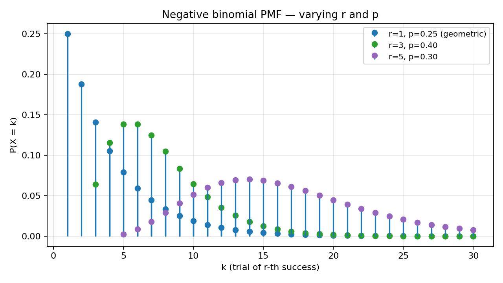
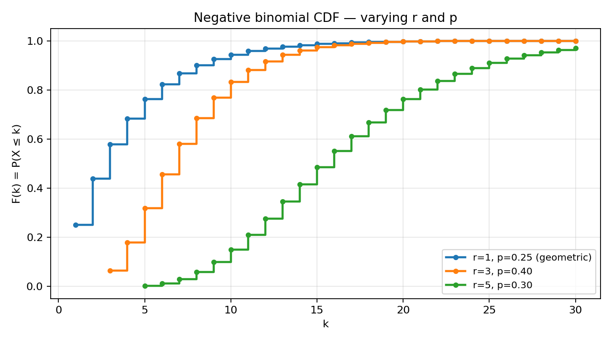
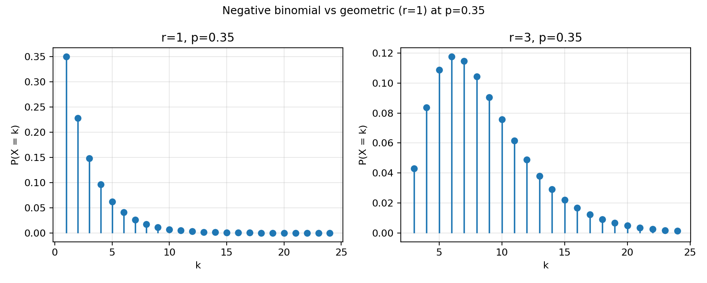

# Problem 7 — Negative Binomial Distribution (Waiting for the $r$-th Success)

This task studies the **negative binomial law** on the positive integers: the number of **independent Bernoulli trials** required until the **$r$-th success**, for a fixed target count $r\ge 1$. The parameters are

$$r \in \{1,2,3,\ldots\}, \qquad p \in (0,1], \qquad q := 1-p,$$

where $p$ is the per-trial success probability and $r$ is how many successes we wait for before stopping. We use the **“trial index of $r$-th success”** convention:

$$X \in \{r,\,r+1,\,r+2,\,\ldots\}, \qquad P(X=k) = \binom{k-1}{r-1}\,p^r\,(1-p)^{k-r}, \quad k\ge r.$$

Some textbooks instead count **failures before** the $r$-th success ($Y=X-r\in\{0,1,2,\ldots\}$ with $P(Y=k)=\binom{k+r-1}{r-1}p^r(1-p)^k$). Every formula in this report is stated for **$X$**; when reading software or tables, check which convention is active (SciPy `nbinom`, R `dnbinom`, etc. parameterize by **number of failures** $Y$, so trial index $X=Y+r$).

If your calculator reports mean $r(1-p)/p$ or support starting at $0$, you are almost certainly in the **$Y$** convention — translate by shifting indices before comparing to this report.

### How to read the parameters $r$ and $p$

Each trial is a **Bernoulli** experiment: “success” with probability $p$, “failure” with probability $q=1-p$, trials **independent** and **identically distributed**. The negative binomial model answers:

> *How many trials must we run until the $r$-th success appears?*

- Large $p$ → successes are common → we expect the $r$-th success **early** (PMF concentrated near $k=r$).
- Small $p$ → successes are rare → we often wait many trials (PMF decays slowly; long right tail).
- Large $r$ → we need more successes before stopping → the support starts at a larger $k=r$ and the distribution shifts **right**.

Unlike Tasks 1–2, we are **not** given a finite table. The law is a **parametric family** with **two** parameters: one formula generates infinitely many PMF values, and the CDF is a partial sum (no single exponential closed form like the geometric case). Reading the report in order mirrors how you would **derive** such a family in a course: story first, space second, formulas third, pictures fourth, numerics fifth, interpretation last.

### What this report does

The goal is to complete **ten parts** (items 0–9 from the task list), in this order:

1. **Build a concrete world** $(\Omega,\mathcal{F},P)$ for repeated trials until the $r$-th success, and define $X(\omega)$ as the trial index of that $r$-th success.
2. **Write** the PMF and CDF in standard form and verify normalization.
3. **Identify** the support $\{r,r+1,r+2,\ldots\}$ and explain why it is **countably infinite**.
4. **Plot** PMF stems for several $(r,p)$ pairs.
5. **Plot** the corresponding CDF staircases on the same parameter choices.
6. **Explain** qualitatively how PMF and CDF shapes change when $p$ or $r$ increases or decreases.
7. **Compute** representative probabilities at **$r=3$, $p=0.4$** (point mass, cumulative, tail, interval).
8. **Explain** how the negative binomial **generalizes** the geometric distribution ($r=1$).
9. **Survey** practical applications (reliability, quota waiting, over-dispersed counts, etc.).
10. **Point** to the shared distribution comparison tool in the parent folder.

Most steps reuse the PMF/CDF machinery from Tasks 1–2 and the geometric waiting-time story from Task 4; what is new is a **second parameter** $r$, a support that **starts at $r$** rather than at $1$, and PMF weights built from **binomial coefficients** rather than a pure geometric sequence. The text below explains each formula in words before plugging in numbers — the same rhythm as Task 4, but waiting for the $r$-th success instead of the first.

---

## Theory — concepts used

Before any computation, fix the vocabulary. The negative binomial distribution is the natural **generalization** of the geometric law (Task 4) to “wait for $r$ successes.” Every line in the table below names one object and pins down exactly what it means; the subsection **Each object, in plain words** explains *why* we need that object and how it differs from the geometric and finite-table worlds in earlier tasks.

| Symbol | Name | Meaning |
|--------|------|---------|
| $(\Omega,\mathcal{F},P)$ | **Probability space** | $\Omega$ — elementary outcomes; $\mathcal{F}$ — events; $P$ — probability measure (K1–K3). Here $\Omega$ is **countably infinite**. |
| $\omega\in\Omega$ | **Elementary outcome** | One full run of the experiment until the $r$-th success (encoded below). |
| $X:\Omega\to\mathbb{N}$ | **Random variable** | Trial number of the **$r$-th** success. |
| $r$, $p$, $q=1-p$ | **Parameters** | Target success count; per-trial success / failure probability; $r\ge 1$, $p\in(0,1]$. |
| $\operatorname{supp}(X)=\{k:P(X=k)>0\}$ | **Support** | Here $\{r,r+1,r+2,\ldots\}$ — every integer $\ge r$ is possible. |
| $p_X(k)=P(X=k)$ | **PMF** | $\binom{k-1}{r-1}p^r(1-p)^{k-r}$ for $k\ge r$; zero elsewhere. |
| $F_X(k)=P(X\le k)$ | **CDF** (at integers) | $\displaystyle\sum_{j=r}^{k}\binom{j-1}{r-1}p^r(1-p)^{j-r}$; extended to $\mathbb{R}$ as a right-continuous step function. |
| $F_X(x^-)=\lim_{t\uparrow x}F_X(t)$ | **Left limit** | On $(k,k+1)$, $F_X(x^-)=F_X(k)$ if $x\in(k,k+1)$; at integer $k$, $F_X(k^-)=F_X(k-1)$ with $F_X(r-1):=0$. |

### Each object, in plain words

- **Probability space $(\Omega,\mathcal{F},P)$.** Here $\Omega$ is the set of all possible *finished runs* of the experiment — one run for each possible trial index at which the $r$-th success might occur. Because the $r$-th success can in principle land on trial $r$, trial $r+1$, trial $100$, or any integer $\ge r$, $\Omega$ is **countably infinite**, unlike the five-point worlds in Tasks 1–2. The $\sigma$-algebra $\mathcal{F}$ lists every event we are allowed to ask about (every subset of $\{r,r+1,\ldots\}$ in this model), and $P$ assigns a probability to each event by summing the atomic weights $\binom{k-1}{r-1}p^r(1-p)^{k-r}$ over the outcomes it contains. Kolmogorov’s axioms still apply: probabilities are non-negative, the whole space has probability $1$, and disjoint events add up.

- **Elementary outcome $\omega$.** One elementary outcome is a complete story of one run: how many failures and successes happened in order, ending exactly when the $r$-th success appears. We encode this as $\omega_k = F\cdots F S\cdots S$ with exactly $r-1$ successes among the first $k-1$ trials (in some order) and a success on trial $k$ that completes the count to $r$. Reading $\omega_5$ with $r=3$ out loud: “among trials one through four we saw exactly two successes and two failures in some order; trial five delivered the third success and we stopped.” The probability of that specific length-$k$ story is $\binom{k-1}{r-1}p^r(1-p)^{k-r}$ — choose which $r-1$ of the first $k-1$ trials were successes, then multiply independent trial probabilities.

- **Random variable $X$.** The function $X$ reads an outcome $\omega_k$ and reports the integer $k$: the trial number of the $r$-th success. Knowing $\omega$ tells you $X(\omega)$ with certainty; the randomness is entirely in *which* $\omega$ Nature draws. Unlike the geometric case ($r=1$), many different trial sequences can share the same $k$ when $r>1$ — the PMF value $P(X=k)$ is a **sum over compatible prefixes**, which is why the binomial coefficient appears.

- **PMF $p_X$.** The PMF is the infinite list of weights $p_X(k)=\binom{k-1}{r-1}p^r(1-p)^{k-r}$ for $k=r,r+1,\ldots$, and zero everywhere else. Unlike Task 1’s finite table, we do not write out infinitely many columns; instead one **parametric formula** generates every entry. When $r=1$, the coefficient $\binom{k-1}{0}=1$ and the weights reduce to the geometric sequence $q^{k-1}p$ from Task 4. For $r>1$, the coefficient grows combinatorially before the failure tail $(1-p)^{k-r}$ pulls it down — producing a **unimodal** shape rather than monotone decay.

- **CDF $F_X$.** The CDF answers cumulative questions on the whole real line: $F_X(x)=P(X\le x)$. Between integers the CDF is flat (no probability lives between trial counts), and at each integer $k\ge r$ it jumps upward by exactly $p_X(k)$. Unlike the geometric CDF $1-q^k$, there is no single-term closed form for general $r$; we sum PMF values or use software special functions. On $\mathbb{R}$, the CDF is a right-continuous staircase that starts at $0$ for $x<r$ and creeps toward $1$ as $x$ grows.

- **Parameters $r$ and $p$ (and $q=1-p$).** The number $p$ is the per-trial success probability in the underlying Bernoulli experiment. The integer $r$ is how many successes we wait for before stopping. Together they control the entire family: large $p$ pulls mass left (the $r$-th success arrives early), large $r$ pushes the support right (we need more successes, so we need at least $r$ trials). The companion $q=1-p$ is the per-trial failure probability; it appears in every formula as the factor $(1-p)^{k-r}$ counting failures after the $r$-th success is placed at trial $k$.

- **Infinite support.** The support is $\{r,r+1,r+2,\ldots\}$: every integer $\ge r$ is possible with **strictly positive** probability when $p\in(0,1)$. “Infinite support” does **not** mean $X$ is infinite with positive probability — almost every run stops after finitely many trials — it means there is **no largest** possible value. For any proposed cap $N$, the event $\{X=N+1\}$ still has probability $\binom{N}{r-1}p^r(1-p)^{N+1-r}>0$. Probability is spread over infinitely many atoms, and normalization requires a convergent infinite series.

### Bernoulli trials — building block

One trial produces $S$ (success) with probability $p$ or $F$ (failure) with probability $q$. Independence means the joint probability of a **finite prefix** is the product of single-trial probabilities. The negative binomial law is **not** binomial (Task 3): the number of trials is **random** (we stop at the $r$-th $S$), not fixed in advance. It **is** a generalization of geometric (Task 4): when $r=1$, “wait for the $r$-th success” becomes “wait for the first success.”

**Why “negative binomial”?** Historically the name comes from the **negative-binomial series** expansion of $(1-q)^{-r}$ when summing the PMF; the coefficients $\binom{k-1}{r-1}$ mirror binomial coefficients in a generating-function identity. In applied work the name is less important than the story: **count trials until a quota of $r$ successes is met**.

### Two facts used throughout

1. **Jump rule** (discrete, any support). For every $x\in\mathbb{R}$,
   $$P(X=x)=F_X(x)-F_X(x^-).$$
   On the negative binomial support, jumps occur only at $k\in\{r,r+1,r+2,\ldots\}$ with height $\binom{k-1}{r-1}p^r(1-p)^{k-r}$.

2. **Interval-to-CDF dictionary** (same as Tasks 1–2). For integers $a\le b$ with $a,b\ge r$:

   | Event | Formula |
   |-------|---------|
   | $\{X\le k\}$ | $F_X(k)=\displaystyle\sum_{j=r}^{k}p_X(j)$ |
   | $\{X< k\}$ | $F_X(k^-)=F_X(k-1)$ |
   | $\{X\ge k\}$ | $1-F_X(k^-)=1-F_X(k-1)$ |
   | $\{X> k\}$ | $1-F_X(k)$ |
   | $\{X=k\}$ | $p_X(k)=\binom{k-1}{r-1}p^r(1-p)^{k-r}$ |
   | $\{a\le X\le b\}$ | $F_X(b)-F_X(a^-)=F_X(b)-F_X(a-1)$ |

   For non-integer real endpoints, use the **piecewise constant** CDF on $\mathbb{R}$: between integers the CDF is flat; at each $k\ge r$ it jumps by $p_X(k)$. When $a=r$, remember $F_X(r^-)=F_X(r-1)=0$.

### Valid PMF checklist (infinite discrete case)

| # | Condition | Negative binomial check |
|:-:|-----------|-------------------------|
| 1 | $p_X(k)\ge 0$ for all $k$ | $\binom{k-1}{r-1}p^r(1-p)^{k-r}\ge 0$ for $p,q\in[0,1]$, $k\ge r$. ✓ |
| 2 | $\sum_{k=r}^{\infty} p_X(k)=1$ | Negative-binomial / generating-function identity (Part 1). ✓ |
| 3 | $\sum_{k:\,p_X(k)>0} p_X(k)$ finite or countable | Support is $\{r,r+1,\ldots\}$; sum converges. ✓ |

Together, these three rows say: the negative binomial PMF is a **legal** discrete law on an infinite set — the same Kolmogorov sanity checks as Task 1, with a series instead of a finite sum.

### Valid CDF checklist

| # | Condition | Negative binomial check |
|:-:|-----------|-------------------------|
| 1 | $0\le F_X(x)\le 1$ | Partial sums of non-negative terms. ✓ |
| 2 | $F_X$ non-decreasing | Adding more $k$ cannot decrease cumulative mass. ✓ |
| 3 | $\lim_{x\to-\infty}F_X(x)=0$ | No mass below $r$. ✓ |
| 4 | $\lim_{x\to+\infty}F_X(x)=1$ | Tail series tends to $0$. ✓ |
| 5 | Right-continuous | Step function closed on the right at each jump. ✓ |

The CDF checklist is the mirror of Task 1’s axioms, now verified on a staircase with infinitely many steps but the same monotonicity and limits. Every limit at $\pm\infty$ is inherited from the Bernoulli story, not assumed separately.

### Convention warning (read before Part 6)

| Object | This report ($X$) | Alternative ($Y=X-r$) |
|--------|-------------------|------------------------|
| Support | $\{r,r+1,r+2,\ldots\}$ | $\{0,1,2,\ldots\}$ |
| PMF | $\binom{k-1}{r-1}p^r(1-p)^{k-r}$ | $\binom{y+r-1}{r-1}p^r(1-p)^y$ |
| SciPy `nbinom.pmf(k,r,p)` | $k$ = **failures**; trial index $=k+r$ | failures $k$ |
| Mean | $r/p$ | $r(1-p)/p$ (failures) |

SciPy `scipy.stats.nbinom` and the plots in [`plot.py`](plot.py) follow the **failures** parameterization internally; trial index $X=k+r$ when `k` is the SciPy argument.

---

## Part 0 — Experiment, sample space $\Omega$, elementary outcome $\omega$, and $X(\omega)$

### Why does this matter?

Tasks 1–2 handed you a **finite PMF table** and asked you to verify it, plot it, and translate questions into CDF language. Task 4 built the geometric world for “until first success.” Task 7 asks the next natural question: start from a **story** about repeated independent trials, build the probability space explicitly, and **derive** the negative binomial PMF and CDF from waiting for the **$r$-th** success. The negative binomial law is the standard family where the support is **infinite**, starts at $r$, and the PMF is given by a **formula with a binomial coefficient** rather than a pure geometric ratio.

Why construct $(\Omega,\mathcal{F},P)$ at all? Because a sentence like “let $X$ be negative binomial with parameters $r$ and $p$” hides a measurable function on a sample space. Making the space concrete shows that $\binom{k-1}{r-1}p^r(1-p)^{k-r}$ is not a magic table but the probability of a **class of elementary outcomes** — all length-$k$ prefixes with exactly $r-1$ successes among the first $k-1$ trials and a success on trial $k$ — under independence. It also clarifies what “infinite support” really means: infinitely many distinguishable stopping times, each with positive weight, summing to $1$.

### The random experiment (in words)

Perform a sequence of **independent Bernoulli trials** with success probability $p$ on each trial. After every trial, inspect the result and update a running count of successes:

- If the cumulative number of successes reaches **$r$**, **stop immediately** and record **how many trials** have been performed in total (counting the successful trial that completed the quota).
- If the cumulative number of successes is still **below $r$**, **do not stop** — run the next trial under the same rules.

The recorded number is the trial index of the **$r$-th** success. Trial $r$ might succeed on the very first $r$ trials (if every trial succeeds); or you might see many failures interleaved before the quota is met. Because each trial is independent and $p>0$, the $r$-th success is guaranteed **eventually** with probability $1$, but there is no fixed upper bound on how long you might wait.

**Concrete picture.** Imagine a recruiter who needs **three** qualified hires ($r=3$) and interviews candidates one at a time. Each interview independently ends in “hire” with probability $p$. The recruiter stops on the interview where the third hire occurs and reports that interview number: “our third hire happened on candidate number $k$.” That reported $k$ is $X$. The same mathematical structure describes testing devices until the third failure (with “success” = failure), or flipping a coin until the fifth head — provided each attempt is independent and the per-attempt success rate stays constant.

This is the prototype of **“wait until a quota is met”**: quality inspection until the $r$-th defect, clinical trials until the $r$-th response, sports until the $r$-th goal. The negative binomial model captures the **count of attempts**, not clock time between them; continuous waiting for $r$ events belongs to the gamma family (Task 9).

### Sample space $\Omega$

Each elementary outcome is completely determined by **where the $r$-th success occurs** and **which** of the first $k-1$ trials carried the earlier $r-1$ successes. Encode a stopping time $k\ge r$ by:

$$\omega_k = \text{a sequence of length }k\text{ with exactly }r\text{ successes, the last trial }S,$$

so among trials $1,\ldots,k-1$ there are exactly $r-1$ successes and $k-r$ failures, in some order, followed by $S$ on trial $k$.

Then

$$\Omega = \bigcup_{k=r}^{\infty} \{\text{all length-}k\text{ sequences with exactly }r-1\text{ successes in trials }1,\ldots,k-1\text{ and }S\text{ on trial }k\},$$

a **countably infinite** union of finite sets. For fixed $k$, there are $\binom{k-1}{r-1}$ distinct sequences — exactly the binomial coefficient in the PMF.

**Reading $\Omega$ as a list of stories.** Outcome at $k=r$ is the shortest possible run: success on every one of the first $r$ trials. Outcome at $k=r+1$ is $r-1$ successes among the first $r$ trials, then success on trial $r+1$ — there are $\binom{r}{r-1}=r$ such orderings. Outcome at $k=100$ with $r=3$ is ninety-nine trials containing exactly two successes, then success on trial $100$ — unlikely when $p=0.4$, but still **possible** with probability $\binom{99}{2}(0.4)^3(0.6)^{97}>0$. The sample space is the collection of all **stopped** prefixes, each ending exactly when the success count hits $r$.

**Do not confuse** $\Omega$ with the Bernoulli **trial sequence space** $\{S,F\}^{\mathbb{N}}$ (all infinite sequences). Our experiment **stops** at the $r$-th $S$, so only **finite prefixes with exactly $r$ successes** are observable elementary outcomes.

### $\sigma$-algebra and probability measure

Take $\mathcal{F}=2^{\Omega}$ (every subset of stopping outcomes is an event; equivalently, every subset of $\{r,r+1,\ldots\}$ via $X$). Define on atoms of fixed length $k$:

$$P(\text{one specific sequence of length }k)=p^r(1-p)^{k-r}$$

(the $r$ successes and $k-r$ failures multiply by independence). There are $\binom{k-1}{r-1}$ such sequences, so total mass at trial index $k$ is

$$P(X=k)=\binom{k-1}{r-1}p^r(1-p)^{k-r}.$$

Extend $P$ additively to all events. For any $A\subseteq\{r,r+1,\ldots\}$,

$$P(X\in A)=\sum_{k\in A} \binom{k-1}{r-1}p^r(1-p)^{k-r}.$$

| Step | Check | Result |
|:----:|-------|--------|
| 1 | Non-negativity | $\binom{k-1}{r-1}p^r(1-p)^{k-r}\ge 0$. ✓ |
| 2 | Normalization | $\sum_{k=r}^{\infty}p_X(k)=1$ (Part 1). ✓ |
| 3 | $\sigma$-additivity | Countable additivity holds on disjoint unions in $\mathbb{N}$. ✓ |

### Random variable $X$

Define $X:\Omega\to\mathbb{R}$ by

$$X(\omega)=k \quad \text{when } \omega \text{ is a length-}k\text{ stopping sequence as above}.$$

Then $P(X=k)=\binom{k-1}{r-1}p^r(1-p)^{k-r}$ by construction — the PMF is **not** assumed; it is **derived** from the Bernoulli story.

**One elementary outcome in plain language.** With $r=3$, a sequence $F,S,F,S,S$ has $k=5$: among trials $1$–$4$ there are exactly two successes ($S$ on trials $2$ and $4$), and trial $5$ delivers the third success. Under independence,

$$P(\text{this specific ordering})=(0.6)(0.4)(0.6)(0.4)(0.4)=0.02304.$$

There are $\binom{4}{2}=6$ equally likely orderings of two successes among four trials before the final $S$, so

$$P(X=5)=\binom{4}{2}(0.4)^3(0.6)^2=6\cdot 0.02304=0.13824.$$

**Why this example helps.** Trial five is neither the shortest run ($k=3$) nor a negligible tail event. It is a middle-of-the-support illustration: the PMF assigns the same formula to every $k\ge r$, and $k=5$ is where the “two successes among the first four, then success” story is easy to say out loud while the arithmetic stays small enough to check by hand.

### Construction B — product-space view (optional, richer $\Omega$)

Fix $n\ge r$ and let $\Omega_n=\{S,F\}^n$ be $n$ independent trials. For each $n$, define the **stopped** outcome map that returns the index of the $r$-th $S$, or $+\infty$ if fewer than $r$ successes appear. The negative binomial law is obtained in the limit $n\to\infty$ with mass on finite stopping times only. This shows the negative binomial distribution as a **projection** of a familiar product experiment — useful when connecting to binomial models on **fixed** $n$ (Task 3 in the course).

**Important distinction.** $|\Omega|$ is countably infinite, but $X(\omega)\in\{r,r+1,\ldots\}$ still. The support equals the image of $X$ on $\Omega$ here; there is no smaller finite $\Omega$ carrying the full negative binomial law when $p\in(0,1)$ and $r\ge 1$.

---

## Part 1 — PMF and CDF of the negative binomial distribution

Part 0 built the world; Part 1 writes down the **distribution** of $X$ in the two equivalent languages used throughout this course — the PMF (point masses) and the CDF (cumulative steps). Every symbol in the boxed formulas below has a plain-language reading; the prose walks through each term before we verify normalization and the jump rule.

### PMF (probability mass function)

For $X$ = trial number of $r$-th success, with $r\ge 1$, $0<p\le 1$, and $q=1-p$:

$$\boxed{p_X(k) = P(X=k) = \binom{k-1}{r-1}\,p^r\,(1-p)^{k-r} = \binom{k-1}{r-1}\,p^r\,q^{\,k-r}, \qquad k=r,r+1,r+2,\ldots}$$

and $p_X(k)=0$ for $k<r$ or non-integer $k$.

**Reading each factor in the PMF.**

- **Index $k$.** The support point we are asking about: “$r$-th success on trial $k$.” Only integers $k\ge r$ carry mass; every other value has $p_X(k)=0$.
- **Factor $\binom{k-1}{r-1}$.** The number of ways to place exactly $r-1$ successes among the first $k-1$ trials. Each ordering of the prefix is equally likely under independence; this coefficient **counts** compatible stories.
- **Factor $p^r$.** Exactly $r$ successes must occur ( $r-1$ in the prefix plus one on trial $k$ ), each contributing a factor $p$.
- **Factor $(1-p)^{k-r}=q^{k-r}$.** Exactly $k-r$ failures must occur among the first $k$ trials, each contributing a factor $q$.
- **Product $\binom{k-1}{r-1}p^r(1-p)^{k-r}$.** Independence turns the story into a product, after counting how many sequences share the same stopping time $k$.

**Derivation recap.** $\{X=k\}$ requires exactly $r-1$ successes among trials $1,\ldots,k-1$ (in any order), then success on trial $k$. There are $\binom{k-1}{r-1}$ such prefixes; each has probability $p^{r-1}q^{k-r}$ for the prefix and another $p$ for the final success. The events $\{X=k\}$ for different $k$ are mutually exclusive because the $r$-th success cannot occur on two different trial numbers at once.

### Normalization (negative-binomial series)

$$\sum_{k=r}^{\infty} p_X(k) = \sum_{k=r}^{\infty} \binom{k-1}{r-1} p^r (1-p)^{k-r} = 1 \quad \text{for } p\in(0,1].$$

In words: substitute $j=k-r$ so $j=0,1,2,\ldots$ and $k=j+r$; then

$$\sum_{j=0}^{\infty} \binom{j+r-1}{r-1} p^r (1-p)^j = p^r \sum_{j=0}^{\infty} \binom{j+r-1}{r-1} q^j = p^r \cdot \frac{1}{p^r} = 1,$$

using the generalized binomial identity $\sum_{j=0}^{\infty}\binom{j+r-1}{r-1}q^j=(1-q)^{-r}$ when $q<1$. This is the infinite-support version of Task 1’s “partial sums add to $1$” check — except here we need a convergent series with binomial weights, not a finite addition table.

Edge cases:

| $p$ | Behaviour |
|:---:|-----------|
| $p=1$ | $P(X=r)=1$; degenerate at $r$. |
| $p\to 0^+$ | Mean $r/p\to\infty$; mass spreads over large $k$. |
| $r=1$ | $\binom{k-1}{0}=1$; PMF reduces to geometric $q^{k-1}p$ (Task 4). |

### CDF (cumulative distribution function)

For integer $k\ge r$:

$$\boxed{F_X(k)=P(X\le k)=\sum_{j=r}^{k} \binom{j-1}{r-1}\,p^r\,(1-p)^{j-r}.}$$

**Reading each piece of the CDF.**

- **Event $\{X\le k\}$.** “The $r$-th success happened **no later than** trial $k$.” Equivalently: among the first $k$ trials, **at least $r$** successes occurred, and we count trials until the **$r$-th** of those successes.
- **Sum form.** Add the PMF masses at $r,r+1,\ldots,k$. Each term is one way the $r$-th success can land; together they exhaust every possibility with $X\le k$.
- **No single-term shortcut for general $r$.** Unlike the geometric CDF $1-q^k$, the negative binomial CDF is a **partial sum** of binomial-weighted terms. Software evaluates it via regularized incomplete beta functions or recursive summation; for hand work at moderate $k$, direct summation is reliable.

**Piecewise CDF on $\mathbb{R}$** (right-continuous staircase):

$$
F_X(x)=
\begin{cases}
0 & x<r,\\
F_X(\lfloor x\rfloor) & x\ge r \text{ with standard step at integers},
\end{cases}
$$

More precisely: for $k\in\{r,r+1,\ldots\}$, on $[k,k+1)$ we have $F_X(x)=F_X(k)$ **after** the jump at $x=k$ (right-continuous). At $x<r$, $F_X(x)=0$.

**Jump heights match PMF:**

$$F_X(k)-F_X(k^-)=F_X(k)-F_X(k-1)=p_X(k).$$

This is the infinite-support version of Task 2’s differencing rule.

**Why the jump rule still matters here.** Even though there are infinitely many jumps, each one is visible on the CDF staircase at an integer $k\ge r$, and the height of jump $k$ is still $p_X(k)$. Task 1 checked this on five points; here it holds on every $k\in\{r,r+1,\ldots\}$. If you ever recover a PMF from a plotted CDF, differencing consecutive plateau values at integers reproduces the stem heights — the same trick as reading Task 1’s graph, extended without end.

### Summary card

| Quantity | Formula | Domain |
|----------|---------|--------|
| PMF $p_X(k)$ | $\binom{k-1}{r-1}p^r(1-p)^{k-r}$ | $k=r,r+1,\ldots$ |
| CDF $F_X(k)$ | $\sum_{j=r}^{k}p_X(j)$ | $k\ge r$ |
| Tail $P(X>k)$ | $1-F_X(k)$ | $k\ge r$ |
| Mean $\mathbb{E}[X]$ | $r/p$ | $p>0$ |
| Variance $\mathrm{Var}(X)$ | $r(1-p)/p^2$ | $p>0$ |

When $r=1$, the mean $1/p$ and variance $(1-p)/p^2$ recover the geometric summary from Task 4.

---

## Part 2 — Support and why it is infinite

The PMF formula $p_X(k)=\binom{k-1}{r-1}p^r(1-p)^{k-r}$ is defined for every $k\ge r$, but “defined” is not the same as “possible.” Part 2 identifies the **support** — the set of values that actually carry positive probability — and explains why that set is **infinite** even though every single run ends after finitely many trials. This distinction (infinite support vs. infinite realized value) is easy to confuse and worth stating carefully before the plots in Parts 3–4.

### Support

$$\operatorname{supp}(X)=\{k\in\mathbb{R}:P(X=k)>0\}=\{r,r+1,r+2,\ldots\}.$$

For every $k\ge r$, $p_X(k)=\binom{k-1}{r-1}p^r(1-p)^{k-r}>0$ whenever $p>0$ and $q<1$. No integer below $r$ is possible — you cannot record the $r$-th success before trial $r$.

### Why the support is **infinite** (three complementary explanations)

| # | Explanation | In words |
|:-:|-------------|----------|
| 1 | **Positive mass at every $k\ge r$.** | For any proposed upper bound $N$, $P(X=N+1)=\binom{N}{r-1}p^r(1-p)^{N+1-r}>0$. There is no finite $N$ that contains all the probability. |
| 2 | **Unbounded waiting when $p<1$.** | With $p<1$, we can always need more than $N$ trials for any fixed $N$; the model must allow arbitrarily long waits even when $r$ is small. |
| 3 | **Normalization over infinitely many points.** | $\sum_{k=r}^{\infty}p_X(k)=1$ is a **convergent infinite series** — probability is spread over infinitely many atoms. |

**Not the same as “continuous support”.** The negative binomial law is **discrete** (PMF on integers). “Infinite support” here means **infinitely many point masses**, not an interval $[a,b]\subset\mathbb{R}$.

**Contrast with Tasks 1–2 and Task 4.**

| Feature | Task 1–2 table | Geometric ($r=1$) | Negative binomial |
|---------|----------------|-------------------|-------------------|
| Support size | Finite | Countably infinite | Countably infinite |
| Support start | Various | $k=1$ | $k=r$ |
| PMF | Tabulated | $q^{k-1}p$ | $\binom{k-1}{r-1}p^r(1-p)^{k-r}$ |
| Largest $k$ with $P(X=k)>0$ | Exists | **Does not exist** | **Does not exist** |
| CDF reaches $1$ | At last table point | Only as $k\to\infty$ | Only as $k\to\infty$ |

**Almost sure finiteness.** Although the support is infinite, $P(X<\infty)=1$ for $p>0$: we **almost surely** stop after finitely many trials. “Infinite support” describes **which values are possible**, not that $X$ is infinite with positive probability.

**Contrast with a finite cap (wrong model).** If someone insisted “nobody waits more than $50$ trials,” they would be defining a **truncated** negative binomial on $\{r,\ldots,50\}$, not the standard law. The true model assigns $P(X=51)>0$ whenever $51\ge r$ — small when $p$ is moderate, but not zero. Truncation might be a practical approximation in software display windows, but the mathematics of Task 7 requires the full infinite support.

---

## Part 3 — PMF graphs for several values of the parameters

Parts 0–2 established the formulas and the infinite support. Part 3 turns the PMF into a **picture** for three concrete parameter pairs. The goal is not merely to display stems, but to **see** how $r$ and $p$ jointly reshape an entire infinite family: where mass begins, where the peak sits, how quickly the tail decays, and how much probability remains far out on the right.

We compare:

| Label | $r$ | $p$ | Role |
|-------|:---:|:---:|------|
| Geometric limit | $1$ | $0.25$ | Same as Task 4 at low $p$ |
| Working example | $3$ | $0.40$ | Part 6 numerics |
| High quota | $5$ | $0.30$ | Large $r$, moderate $p$ |

Each plot shows stems at integer $k\ge r$ only; between integers the PMF is zero, exactly as in Task 1’s finite stem chart, except now the stems continue forever (the figure truncates at $k=30$ for readability).

Static comparison plots (generated by [`plot.py`](plot.py)):



| Parameter | $r$ | $p$ | $q=1-p$ | Minimum $k$ | Mode region | Qualitative shape |
|-----------|:---:|:---:|:-------:|:-----------:|-------------|-------------------|
| Geometric limit | $1$ | $0.25$ | $0.75$ | $1$ | $k=1$ (mass $p$) | Monotone decay |
| Working example | $3$ | $0.40$ | $0.60$ | $3$ | Near $k=3,4,5,6$ | Unimodal then decay |
| High quota | $5$ | $0.30$ | $0.70$ | $5$ | Near $k=10$–$15$ | Peak far right, slow tail |

**How to read the stem plot.**

- Each stem at integer $k\ge r$ is $P(X=k)=\binom{k-1}{r-1}p^r(1-p)^{k-r}$.
- For $r=1$, heights form a **geometric sequence** with ratio $q$ — the Task 4 picture reappears.
- For $r>1$, the coefficient $\binom{k-1}{r-1}$ initially grows with $k$ while $q^{k-r}$ shrinks, producing a **hump** before the tail decays.

**Numerical samples** (rounded to four decimals):

| $k$ | $r=1,p=0.25$ | $r=3,p=0.40$ | $r=5,p=0.30$ |
|:---:|:------------:|:------------:|:------------:|
| $r$ | 0.2500 | 0.0640 | 0.0024 |
| $r+2$ | 0.1406 | 0.1382 | 0.0179 |
| $r+5$ | 0.0593 | 0.1244 | 0.0515 |
| $r+10$ | 0.0141 | 0.0645 | 0.0687 |

Plots truncate at $k=30$ for visibility; the tail continues with positive mass on every $k\ge r$.

**What the three curves tell you together.**

When $r=1$ and $p=0.25$, the tallest stem at $k=1$ reaches height $0.25$ — the geometric baseline from Task 4. When $r=3$ and $p=0.40$, mass **cannot** appear before $k=3$; the peak is broader, near $k=5$ and $k=6$ with height about $0.138$. When $r=5$ and $p=0.30$, the support starts at $k=5$ with tiny mass $0.0024$, and the distribution peaks much later (around $k=10$–$15$), illustrating how a larger quota pushes probability rightward even when $p$ is not extremely small.

Notice that increasing $r$ at fixed $p$ **delays** the entire picture: the left edge of the support moves from $k=1$ to $k=r$, and the mode moves with it. Changing $p$ at fixed $r$ controls how quickly mass accumulates after that left edge — the same two-knob story as in Task 4, plus a **shift parameter** $r$.

---

## Part 4 — CDF graphs for the same parameter choices

The PMF shows **where** probability sits at each trial count; the CDF shows **how much** has accumulated once you allow outcomes up to trial $k$. Part 4 plots the same three parameter pairs as Part 3 so you can read PMF and CDF side by side. Remember: between integers the CDF is flat; each jump at $k\ge r$ equals the stem height $p_X(k)$ from Part 3.



**How to read the staircase.**

- At each $k\ge r$, $F_X(k)=P(X\le k)$ — the **closed** dot at the right end of the step.
- Between integers the CDF is **flat** — no probability accumulates between trial counts.
- All three curves approach **$1$** as $k$ increases, but **smaller $p$** and **larger $r$** mean slower rise (more trials needed to capture most mass).

**Numerical CDF samples:**

| $k$ | $F_X(k)$, $r=1,p=0.25$ | $r=3,p=0.40$ | $r=5,p=0.30$ |
|:---:|:----------------------:|:------------:|:------------:|
| $r$ | 0.2500 | 0.0640 | 0.0024 |
| $r+2$ | 0.5781 | 0.3174 | 0.0288 |
| $r+5$ | 0.8220 | 0.5801 | 0.1503 |
| $r+10$ | 0.9578 | 0.8326 | 0.4845 |

For $r=5$, $p=0.30$, even at $k=15$ only about $48\%$ of the mass is collected — the tail beyond $15$ still carries roughly half the probability.

**Link PMF $\leftrightarrow$ CDF on the picture.** The **rise** of the CDF from $k-1$ to $k$ equals the **stem height** at $k$ — the same jump rule as Tasks 1–2, now repeated infinitely often with heights $\binom{k-1}{r-1}p^r(1-p)^{k-r}$.

**Interpreting the staircases.**

For $r=3$, $p=0.40$, the CDF reaches $F_X(7)=0.5801$ — about **58%** of runs finish by trial seven (Part 6). For $r=5$, $p=0.30$, the same threshold $F_X(k)\ge 0.58$ requires $k$ near $17$ or $18$, reflecting mean waiting time $\mathbb{E}[X]=r/p=16.\overline{6}$ trials. Comparing the three curves on one axis makes $r$ feel like a **delay** on the horizontal axis and $p$ like a **steepness** control on the climb toward $1$.

---

## Part 5 — How the graphs change as $p$ or $r$ becomes larger or smaller

Part 3 showed **what** the PMF looks like at three fixed parameter pairs; Part 4 did the same for the CDF. Part 5 states the **qualitative rules** that connect parameter changes to picture changes — the kind of one-sentence summary you should be able to give in an exam without redrawing the plots. The tables below collect the pattern; the prose after them ties the PMF and CDF stories together.

### Effect on the PMF when $p$ changes (fixed $r$)

| Change in $p$ | PMF shape | Mean $\mathbb{E}[X]=r/p$ | Left edge |
|---------------|-----------|--------------------------|-----------|
| **$p$ increases** | Mass shifts **left**; peak moves toward $k=r$ | **Decreases** (shorter wait) | Fixed at $k=r$ |
| **$p$ decreases** | **Slower** tail decay; heavier right tail | **Increases** | Fixed at $k=r$ |

**Contrast with geometric ($r=1$).** When $r=1$, the mode is always $k=1$. For $r>1$, the mode is **not** always $k=r$; the binomial coefficient creates a hump whose location depends on both $r$ and $p$.

### Effect on the PMF when $r$ changes (fixed $p$)

| Change in $r$ | PMF shape | Mean $\mathbb{E}[X]=r/p$ | Support |
|---------------|-----------|--------------------------|---------|
| **$r$ increases** | Entire picture shifts **right**; support starts at larger $k$ | **Increases** linearly in $r$ | $\{r,r+1,\ldots\}$ |
| **$r$ decreases** | Shifts **left**; $r=1$ gives geometric | **Decreases** | Minimum trial index drops |

### Effect on the CDF

| Change | CDF staircase |
|--------|---------------|
| **$p$ increases** (fixed $r$) | Steps climb **faster** toward $1$; for moderate $k$, $F_X(k)$ is larger |
| **$p$ decreases** (fixed $r$) | Flatter treads at low $k$; need more trials to reach e.g. $F_X(k)\ge 0.95$ |
| **$r$ increases** (fixed $p$) | Staircase **starts later** (flat at $0$ until $x=r$); climb shifts right |

**Quantile intuition.** The median $m$ satisfies $F_X(m)\approx 0.5$. For $r=3$, $p=0.40$, Part 4 shows $F_X(7)\approx 0.58$ and $F_X(6)\approx 0.46$, so the median lies between trials six and seven — consistent with mean $\mathbb{E}[X]=7.5$.

### What does **not** change

- Support remains $\{r,r+1,r+2,\ldots\}$ for the chosen $r$.
- The law stays **discrete** with PMF/CDF linked by jumps.
- Independence and constant $p$ remain part of the model assumptions.

### Comparison table (fixed $k$, varying parameters)

| Question | $r=1,p=0.25$ | $r=3,p=0.40$ | $r=5,p=0.30$ |
|----------|:------------:|:------------:|:------------:|
| $P(X=r)$ | 0.2500 | 0.0640 | 0.0024 |
| $P(X\le r+4)$ | 0.6843 | 0.5801 ($k=7$) | 0.1503 ($k=10$) |
| Mean $\mathbb{E}[X]$ | 4.00 | 7.50 | 16.67 |

Low $p$ or high $r$ spreads probability across many $k$; high $p$ with small $r$ concentrates near the left edge.

**Closing synthesis for Parts 3–5.**

Think of $p$ as controlling how quickly successes arrive once the experiment runs, and $r$ as controlling how many successes you need before stopping — which sets the **earliest possible** trial index. Increasing $p$ lifts the early part of the PMF **and** makes the CDF climb faster. Increasing $r$ slides the entire PMF and CDF **rightward** without changing the per-trial success rate. The mean waiting time $\mathbb{E}[X]=r/p$ summarizes both effects in one number: double $r$ doubles the mean at fixed $p$; halve $p$ doubles the mean at fixed $r$. The plots in Parts 3–4 are the visual version of that arithmetic.

---

## Part 6 — Computing probabilities (working example $r=3$, $p=0.4$)

Throughout this section:

$$r=3, \qquad p=0.4, \qquad q=1-p=0.6.$$

Formulas:

$$p_X(k)=\binom{k-1}{2}(0.4)^3(0.6)^{k-3}, \quad k\ge 3, \qquad F_X(k)=\sum_{j=3}^{k}p_X(j).$$

Part 6 is the negative binomial analogue of Task 4’s probability exercises: every question is translated through the **interval-to-CDF dictionary** or the PMF directly, and the two routes must agree. We fix $r=3$, $p=0.4$ so arithmetic stays transparent, and walk through four representative event types — point mass, cumulative, tail, interval — with **both** PMF and CDF methods and commentary after each.

**Reference PMF values** (four decimals):

| $k$ | $\binom{k-1}{2}$ | $p_X(k)$ |
|:---:|:----------------:|:--------:|
| 3 | 1 | 0.0640 |
| 4 | 3 | 0.1152 |
| 5 | 6 | **0.1382** |
| 6 | 10 | 0.1382 |
| 7 | 15 | 0.1244 |
| 8 | 21 | 0.1045 |
| 9 | 28 | 0.0836 |
| 10 | 36 | 0.0645 |

### Example 6.1 — $P(X=5)$ (point mass)

| Method | Computation | Result |
|--------|-------------|:------:|
| PMF | $\binom{4}{2}(0.4)^3(0.6)^2 = 6\cdot 0.064\cdot 0.36$ | **0.1382** |
| CDF (jump) | $F_X(5)-F_X(4)=0.3174-0.1792$ | **0.1382** |

**In words:** among the first four trials exactly two successes occurred (in any order), and trial five delivered the third success.

**Commentary.** This is the pure PMF story: the binomial coefficient $6$ counts the six equally likely orderings of two successes among four trials; each contributes $(0.4)^3(0.6)^2=0.02304$. The CDF jump method gives the same **0.1382** because $F_X(5)-F_X(4)$ subtracts two cumulative totals and leaves exactly the mass at $k=5$. In a long simulation with $r=3$, $p=0.4$, roughly **one run in seven** would report “third success on trial five.” Note $P(X=6)=0.1382$ as well — the hump is **flat** between $k=5$ and $k=6$ at this parameter pair.

### Example 6.2 — $P(X\le 7)$ (cumulative)

| Method | Computation | Result |
|--------|-------------|:------:|
| CDF | $F_X(7)=p(3)+p(4)+p(5)+p(6)+p(7)$ | **0.5801** |
| PMF (sum) | $0.0640+0.1152+0.1382+0.1382+0.1244$ | **0.5801** |

**In words:** the third success occurs on trial $3$, $4$, $5$, $6$, or $7$ — about **58%** of the time with a $40\%$ per-trial success rate and quota $r=3$.

**Commentary.** The CDF value **0.5801** means that in roughly **three runs out of five**, the waiting time is seven trials or fewer. Equivalently, the complement $P(X>7)=0.4199$ says that about **42%** of runs still need **more than seven** trials. Summing five PMF terms reproduces the same total; there is no single exponential closed form like the geometric $1-q^k$, so the partial sum is the honest hand calculation.

### Example 6.3 — $P(X>7)$ (strict tail)

| Method | Computation | Result |
|--------|-------------|:------:|
| CDF complement | $1-F_X(7)=1-0.5801$ | **0.4199** |
| PMF (tail sum) | $\displaystyle\sum_{k=8}^{\infty}p_X(k)=1-F_X(7)$ | **0.4199** |

**In words:** still waiting after trial $7$ — the third success has **not** yet occurred by the end of trial seven. Equivalently $P(X\ge 8)=0.4199$.

**Commentary.** Tail probabilities are where the CDF is most convenient: subtract one cumulative total from $1$ instead of summing infinitely many PMF terms. About **42%** of runs — between two and five out of ten — need **eight or more** trials before the third success when $p=0.4$. Compare with the geometric case ($r=1$) at the same $p$: $P(X>7)=0.6^7\approx 0.028$ — much smaller, because only one success is required, not three.

### Example 6.4 — $P(5\le X\le 10)$ (interval on support)

| Method | Computation | Result |
|--------|-------------|:------:|
| CDF | $F_X(10)-F_X(4)=0.8326-0.1792$ | **0.6535** |
| PMF | $p(5)+p(6)+p(7)+p(8)+p(9)+p(10)$ | **0.6535** |

Individual terms: $0.1382+0.1382+0.1244+0.1045+0.0836+0.0645=0.6535$.

**Commentary.** Interval events are the place where **strict vs. non-strict** endpoint language matters most. The event $\{5\le X\le 10\}$ **excludes** $k=3,4$ and **includes** $k=10$, so the CDF difference is $F_X(10)-F_X(4)$, not $F_X(10)-F_X(5^-)$. About **65%** of runs see their third success on trial five through ten — neither in the earliest window ($k=3,4$) nor after trial ten. For contrast, the narrower interval $\{6\le X\le 10\}$ drops the $k=5$ mass and gives **0.5153** — useful when comparing “middle” waiting times excluding the first hump peak.

| Event | CDF | Value |
|-------|-----|:-----:|
| $\{5\le X\le 10\}$ | $F_X(10)-F_X(4)$ | **0.6535** |
| $\{6\le X\le 10\}$ | $F_X(10)-F_X(5)$ | **0.5153** |
| $\{5\le X< 10\}$ | $F_X(9)-F_X(4)$ | **0.5890** |

Always state endpoint inclusion.

### Example 6.5 — $P(X=3)$ and $P(X\ge 3)$

| Event | Formula | Value |
|-------|---------|:-----:|
| $P(X=3)$ | $\binom{2}{2}(0.4)^3=0.064$ | **0.0640** |
| $P(X\ge 3)$ | $1$ (certain on this support) | **1.0000** |

**Commentary.** The **minimum** possible value is $k=r=3$, with mass $p^r=0.064$ — all three successes on the first three trials. The event $\{X\ge 3\}$ is the entire support — with $p>0$, the $r$-th success must arrive at some finite trial almost surely, so this probability is identically $1$. These two rows anchor the support at its left edge and remind us that “infinite support to the right” does not create mass below $r$.

### Summary table (Part 6, $r=3$, $p=0.4$)

| Event | PMF / series | CDF | Value |
|-------|--------------|-----|:-----:|
| $\{X=5\}$ | $\binom{4}{2}(0.4)^3(0.6)^2$ | $F_X(5)-F_X(4)$ | **0.1382** |
| $\{X\le 7\}$ | $\sum_{k=3}^{7}p_X(k)$ | $F_X(7)$ | **0.5801** |
| $\{X>7\}$ | $\sum_{k\ge 8}p_X(k)$ | $1-F_X(7)$ | **0.4199** |
| $\{5\le X\le 10\}$ | $p(5)+\cdots+p(10)$ | $F_X(10)-F_X(4)$ | **0.6535** |
| $\{6\le X\le 10\}$ | $p(6)+\cdots+p(10)$ | $F_X(10)-F_X(5)$ | **0.5153** |

All rows cross-check PMF against CDF — the same discipline as Tasks 1–2, now with binomial coefficients instead of pure powers of $q$.

**Takeaway from Part 6.** At $r=3$, $p=0.4$, every event type from the interval-to-CDF dictionary appears: equality ($X=5$), non-strict cumulative ($X\le 7$), strict tail ($X>7$), bounded interval ($5\le X\le 10$), boundary certainties ($X\ge 3$), and a narrower interval ($6\le X\le 10$) yielding **0.5153**. If PMF and CDF routes disagree, the bug is almost always an endpoint mistake ($F_X(a)$ vs. $F_X(a^-)$) or a convention mismatch (trial index $X$ vs. failures $Y$). None of the tail arithmetic required an infinite hand sum — subtracting $F_X(7)$ from $1$ closed the tail exactly.

---

## Part 7 — Geometric distribution as the $r=1$ special case

Task 4 studied waiting for the **first** success; Task 7 waits for the **$r$-th**. Part 7 makes the relationship explicit: when $r=1$, the negative binomial PMF, CDF, support, and mean formulas **reduce** to the geometric law. This is item 7 on the task list — the conceptual bridge between the two waiting-time families.

### Algebraic reduction

Set $r=1$ in the negative binomial PMF:

$$p_X(k)=\binom{k-1}{0}\,p^1(1-p)^{k-1}=(1-p)^{k-1}p=q^{k-1}p, \quad k=1,2,3,\ldots.$$

This is exactly the geometric PMF from Task 4 with support $\{1,2,3,\ldots\}$.

The CDF at $r=1$:

$$F_X(k)=\sum_{j=1}^{k}q^{j-1}p=1-q^k,$$

the closed geometric cumulative form — whereas for $r>1$ the CDF remains a partial sum without a single $q$-power expression.

| Quantity | Negative binomial ($r\ge 1$) | Geometric ($r=1$) |
|----------|-------------------------------|-------------------|
| Support | $\{r,r+1,\ldots\}$ | $\{1,2,\ldots\}$ |
| PMF | $\binom{k-1}{r-1}p^r(1-p)^{k-r}$ | $q^{k-1}p$ |
| CDF | $\sum_{j=r}^{k}p_X(j)$ | $1-q^k$ |
| Mean | $r/p$ | $1/p$ |
| Variance | $r(1-p)/p^2$ | $(1-p)/p^2$ |

### Story reduction

When $r=1$, the experiment stops at the **first** success — precisely Task 4’s story. The binomial coefficient $\binom{k-1}{0}=1$ counts only one way to place zero successes among the first $k-1$ trials (all failures), so the combinatorial factor disappears and the geometric ratio $q$ governs decay between consecutive support points.

When $r>1$, the coefficient $\binom{k-1}{r-1}$ counts **multiple** ways to interleave $r-1$ successes among early trials, creating a hump before decay — the qualitative difference visible in [`nb_vs_geometric.png`](nb_vs_geometric.png).



The side-by-side panels at $p=0.35$ show $r=1$ (left) with monotone decay from $k=1$, and $r=3$ (right) with support starting at $k=3$ and a broader peak — same per-trial $p$, different quota $r$.

### Memoryless property (geometric only among $r=1$)

The geometric law (Task 4) satisfies the **memoryless** property on the discrete waiting scale. The negative binomial with $r>1$ does **not** share that full property: after $n$ trials without having reached $r$ successes, the remaining wait is negative binomial with the same $r$ and $p$ but **conditional** on partial progress — the distribution of additional trials depends on how many successes have already accumulated. Only when $r=1$ does “no success yet” reduce to a fresh geometric clock.

### Naming consistency

Some authors call the $r=1$ case “geometric” and the general $r$ case “negative binomial”; others use “negative binomial” for all $r\ge 1$ and say geometric is $r=1$. This report follows the second convention: **one family**, two parameters, geometric as the boundary case.

---

## Part 8 — Practical applications

The negative binomial law is the standard **discrete quota waiting-time model**: count independent trials until the $r$-th success. It also appears as a **count model** for over-dispersed data (when variance exceeds the mean of a Poisson). The table below lists six domains; after each row, a short prose paragraph explains how the symbols map to the real situation and what question the negative binomial PMF/CDF answers.

| Domain | What is a “trial”? | What is “success”? | Role of negative binomial |
|--------|-------------------|--------------------|---------------------------|
| **Reliability / burn-in testing** | Test one unit per cycle | Observe failure (or pass) | Trials until the $r$-th failure under constant hazard (discrete toy model) |
| **Quota hiring / recruitment** | Interview one candidate | Hire | Interview count until the $r$-th hire |
| **Clinical / quality milestones** | Run one patient / batch | Positive response | Trials until the $r$-th response |
| **Sports / gaming** | Attempt one shot | Score | Attempts until the $r$-th goal |
| **Network retries (batch)** | Send one packet batch | Acknowledgment | Batches until the $r$-th success (simplified) |
| **Over-dispersed counts** | Not a waiting story | Event count in window | Poisson–gamma mixture yields NB as count law |

**Reliability / burn-in testing.** Each tested unit is one Bernoulli trial; “success” might mean “failure observed” depending on the problem statement. If the per-unit failure rate is constant at $p$, the number of units tested until the $r$-th failure is negative binomial with that $p$. The PMF gives $P(\text{$r$-th failure on unit }k)$; the CDF gives $P(\text{$r$ failures within }k\text{ units})$ — a natural burn-in audit question.

**Quota hiring / recruitment.** A hiring manager needs $r$ accepted candidates. If each interview independently yields acceptance with probability $p$, the interview index of the $r$-th hire is negative binomial. The tail $P(X>k)$ answers “how often are we still interviewing after $k$ candidates?” — useful for scheduling and budget planning when $r>1$.

**Clinical / quality milestones.** A trial may require $r$ successful responses before stopping a phase. The negative binomial models the patient (or batch) index at which the quota is met when responses are i.i.d. Bernoulli with probability $p$. Real trials violate independence and constant $p$, but the law remains a **benchmark**.

**Sports / gaming.** Count attempts until the $r$-th score; if each attempt succeeds with probability $p$, attempts-until-$r$-th-score is negative binomial. For $r=1$ this is geometric (first goal); for $r=3$ it is “third goal on attempt $k$” — a natural extension of Task 4’s waiting story.

**Network retries (batch).** A simplified model treats each batch transmission as independent with success probability $p$; batches until the $r$-th acknowledgment is negative binomial. Real networks violate independence, but the law is a building block for more realistic Markov models.

**Over-dispersed counts (Poisson mixture).** When events in fixed windows are modeled as Poisson with random intensity, the marginal count can be negative binomial — variance larger than the mean. Here $r$ and $p$ are not “trials until quota” in the experiment, but **mixture parameters** in a count model. Task 5’s Poisson is the mean–variance-equal special case; negative binomial adds flexibility.

**When the model fits (waiting-time form).**

- Trials are **independent**.
- Success probability $p$ is **constant** across trials.
- Experiment **stops** at the $r$-th success.
- Support is **countable** trial indices starting at $r$.

**When it does not fit.**

- Fixed sample size $n$ (use **binomial**, Task 3).
- Sampling **without replacement** (use **hypergeometric**, Task 6).
- Waiting for **first** success only with $r=1$ already covered — but if the story is truly “first hit,” geometric is simpler.
- Time measured continuously (use **gamma**, Task 9).
- $p$ or effective $r$ changes over trials (inhomogeneous or Markov models).

Recognizing misfit is as important as recognizing fit: if trials are dependent or $p$ drifts, the closed forms $\binom{k-1}{r-1}p^r(1-p)^{k-r}$ no longer describe the data, even when the experiment “feels like waiting for a quota.”

**Link to Task 4.** Every geometric application in Task 4 extends naturally by replacing “first success” with “$r$-th success” and updating $r$. Mean waiting time scales linearly: $\mathbb{E}[X]=r/p$ versus $1/p$.

---

## Part 9 — Comparison application (`distribution_viewer.html`)

Static PNG figures in Parts 3–4 fix three parameter pairs. Part 9 points to the shared **parametric viewer** in the parent folder, where you can slide $r$ and $p$ continuously, overlay several curves, and read off the same probabilities Part 6 computed by hand — useful for building intuition and for comparing the negative binomial with the geometric ($r=1$) case on one screen.

The parent folder hosts a shared **distribution comparison** page:

**[`../distribution_viewer.html`](../distribution_viewer.html)**

Intended features (Task 7 requirements):

| # | Feature |
|:-:|---------|
| 1 | Select **Negative Binomial** from the distribution list |
| 2 | Sliders or inputs for **$r$** and **$p$** |
| 3 | Live **PMF** stem plot on $k=r,r+1,\ldots$ (truncated display window) |
| 4 | Live **CDF** staircase |
| 5 | Overlay **two or more** parameter pairs (compare with static [`pmf_r_p_varied.png`](pmf_r_p_varied.png), [`cdf_r_p_varied.png`](cdf_r_p_varied.png)) |
| 6 | Numeric panel for $P(X=k)$, $P(X\le k)$, $P(X>k)$, $P(a\le X\le b)$ |
| 7 | Side-by-side **geometric** ($r=1$) vs. **negative binomial** ($r>1$) at the same $p$ (compare with [`nb_vs_geometric.png`](nb_vs_geometric.png)) |

**Workflow for this problem.**

1. Open the viewer, choose **Negative Binomial**, set $r=3$, $p=0.4$.
2. Verify $P(X=5)\approx 0.1382$, $P(X\le 7)\approx 0.5801$, $P(X>7)\approx 0.4199$ (Part 6).
3. Sweep $(r,p)$ through $(1,0.25)$, $(3,0.40)$, $(5,0.30)$ and match the static figures from Parts 3–4.
4. Set $r=1$ at fixed $p$ and confirm recovery of the **geometric** tab (Task 4) — same PMF/CDF as [`../solution_04/solution_04.md`](../solution_04/solution_04.md).
5. Compare negative binomial tails with **geometric** ($r=1$) and **binomial** (fixed $n$) when those families are enabled in the same app.

Static figures in this folder are produced by [`plot.py`](plot.py):

```text
python plot.py
```

regenerates `pmf_r_p_varied.png`, `cdf_r_p_varied.png`, and `nb_vs_geometric.png`.

Task 1–2 provide standalone [`../solution_01/interactive.html`](../solution_01/interactive.html) and [`../solution_02/interactive.html`](../solution_02/interactive.html) for **finite** PMF/CDF tables; the negative binomial family belongs in the **parametric** viewer because the support is infinite and formulas replace tables.

**Suggested study path.** Read Part 0–1 for the derivation, skim Parts 3–5 for pictures, work Part 6 with pencil and calculator, then open the viewer’s **Negative Binomial** tab and set $r=3$, $p=0.4$ to confirm each summary-table row. Finally set $r=1$ and watch the PMF collapse to the geometric stems from Task 4 — the single parameter $p$ then controls the same decay ratio $q=1-p$, but the support starts at $k=1$ instead of $k=r$.

---

## Consistency check

This closing table maps each task requirement (items 0–9) to the part of the report that addresses it. Use it as a quick audit before an exam or before opening the interactive viewer in Part 9: every row should trace back to explicit formulas, plots, or numerics above.

| Item | Check | Status |
|------|-------|:------:|
| Bernoulli story $\Rightarrow$ PMF $\binom{k-1}{r-1}p^r(1-p)^{k-r}$ | Part 0, Part 1 | ✓ |
| PMF sums to $1$ | Negative-binomial series | ✓ |
| CDF partial sums match PMF | Part 1 | ✓ |
| Jump rule $F_X(k)-F_X(k^-)=p_X(k)$ | Part 1 | ✓ |
| Support $=\{r,r+1,\ldots\}$, infinite but a.s. finite | Part 2 | ✓ |
| PMF/CDF plots for several $(r,p)$ | Part 3–4, images | ✓ |
| Shape vs. $r$ and $p$ explained | Part 5 | ✓ |
| Numerics at $r=3$, $p=0.4$: $P(X=5)$, $P(X\le 7)$, $P(X>7)$ | Part 6 | ✓ |
| Geometric as $r=1$ special case | Part 7 | ✓ |
| Applications listed | Part 8 | ✓ |
| Viewer reference (Negative Binomial tab) | Part 9 | ✓ |
| SciPy `nbinom` convention (failures vs. trial index) | Theory, Part 6 | ✓ |

Every formal requirement of Task 7 (items 0–9) is addressed: a probability space for “until $r$-th success” was constructed, PMF and CDF were written and linked, infinite support starting at $r$ was explained, PMF and CDF were plotted for several parameter pairs, parameter effects were discussed, probabilities were computed at $r=3$, $p=0.4$ with PMF–CDF agreement, the geometric case $r=1$ was explained, applications were summarized, and the shared comparison application was referenced for interactive exploration including comparison with the geometric distribution.

**Thread from introduction to conclusion.** The opening paragraphs promised a two-parameter waiting-time family on infinite support, derived from Bernoulli trials rather than a finite table. Part 0 delivered the sample space and the random variable; Part 1 derived $\binom{k-1}{r-1}p^r(1-p)^{k-r}$ and its cumulative partial sums; Part 2 explained why no finite support suffices and why the left edge sits at $k=r$; Parts 3–5 visualized and interpreted the effect of $r$ and $p$; Part 6 verified the PMF–CDF dictionary at $r=3$, $p=0.4$ with dual methods and commentary; Part 7 showed that Task 4’s geometric law is exactly the $r=1$ boundary case; Part 8 mapped the law to applied settings; Part 9 pointed to the shared viewer’s **Negative Binomial** tab for the same checks interactively. The negative binomial distribution is the discrete-time, count-based counterpart to “wait until $r$ successes” — the natural successor to the geometric milestone in Task 4 and a discrete building block for gamma waiting in continuous time (Task 9).
