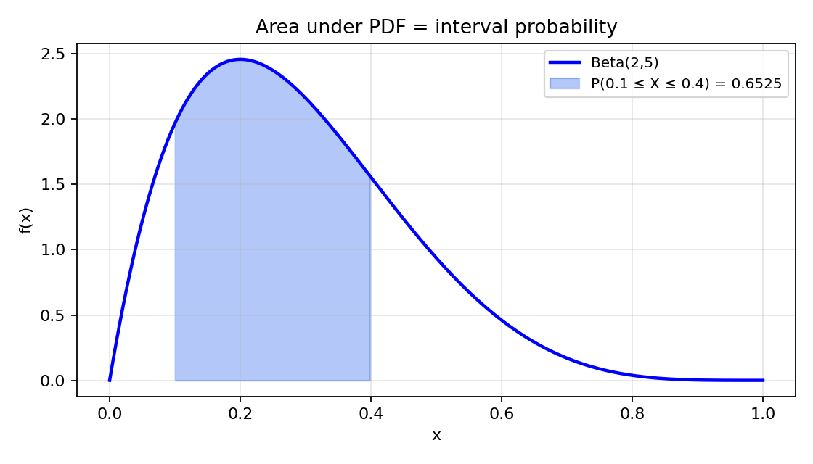

# Problem 8 — Beta Distribution (Continuous on $[0,1]$)

This task studies the **beta law** on the unit interval: a **continuous** random variable whose possible values fill the entire segment $[0,1]$ without gaps. The two shape parameters are

$$\alpha>0, \qquad \beta>0,$$

and the density is

$$f(x)=\frac{x^{\alpha-1}(1-x)^{\beta-1}}{B(\alpha,\beta)}, \qquad x\in(0,1),$$

with $f(x)=0$ outside $(0,1)$. Here $B(\alpha,\beta)=\displaystyle\int_0^1 t^{\alpha-1}(1-t)^{\beta-1}\,dt=\frac{\Gamma(\alpha)\Gamma(\beta)}{\Gamma(\alpha+\beta)}$ is the **beta function** — the normalizing constant that forces the total area under the curve to equal $1$.

Unlike Tasks 1–7, there is **no PMF**: probability is spread **continuously** along the interval. Point questions like $P(X=0.3)$ have answer **zero**; interval questions like $P(0.2\le X\le 0.5)$ are answered by **area under the PDF** or by **differences of the CDF**. The beta family is the first **standard continuous** model in this PMF/PDF task sequence where both parameters control **shape** (symmetry, skew, U-shape) rather than location and scale on the whole real line.

### How to read the parameters $\alpha$ and $\beta$

Each parameter is a **positive real number**, not a probability. Informally:

- **Large $\alpha$ relative to $\beta$** pulls mass toward **$1$** (right-skewed density on $(0,1)$).
- **Large $\beta$ relative to $\alpha$** pulls mass toward **$0$** (left-skewed density).
- **$\alpha=\beta$** gives a **symmetric** density about $x=\tfrac12$ (not necessarily uniform unless $\alpha=\beta=1$).
- **$\alpha,\beta<1$** (both small) push mass toward **both endpoints** — a **U-shaped** density.

The mean is $\mathbb{E}[X]=\alpha/(\alpha+\beta)$: with $\alpha=2$, $\beta=5$ the centre of mass sits near $2/7\approx 0.29$, consistent with a **left-skewed** picture (longer tail toward $1$).

### Working example (used throughout)

Unless stated otherwise, numeric work in Parts 6–7 uses

$$\alpha=2, \qquad \beta=5.$$

Key probabilities for this pair (verified in Part 6 by **both** CDF and integration routes):

| Quantity | Value (4 d.p.) | Plain-language read |
|----------|:--------------:|---------------------|
| $P(X\le 0.3)$ | $0.5798$ | About $58\%$ of runs produce a value at or below $0.3$ — more than half the mass lies in the lower third of the interval. |
| $P(X\ge 0.7)$ | $0.0109$ | About $1.1\%$ of runs reach $0.7$ or higher — the upper tail is thin for this left-skewed choice. |
| $P(0.2\le X\le 0.5)$ | $0.5460$ | About $55\%$ of runs fall in the middle band from $0.2$ to $0.5$. |

These three numbers anchor the report: they reappear in the intro, in the shaded-area figure, in Part 6’s dual calculations, and in the consistency check at the end.

### What this report does

The goal is to complete **ten parts** (items 0–9 from the task list), in this order:

1. **Build a concrete world** $(\Omega,\mathcal{F},P)$ on $[0,1]$, define $X(\omega)=\omega$, and connect the story to the beta PDF.
2. **Write** the PDF and CDF in standard form and verify normalization.
3. **Identify** the support $[0,1]$ and explain why $P(X=a)=0$ for every fixed $a$ in a continuous model.
4. **Plot** PDF curves for four shape families: symmetric $(2,2)$, left skew $(2,5)$, right skew $(5,2)$, U-shaped $(0.5,0.5)$.
5. **Plot** the corresponding CDF curves on the same parameter choices.
6. **Explain** qualitatively how $\alpha$ and $\beta$ reshape the density and the slope of the CDF.
7. **Compute** representative probabilities at **$\mathrm{Beta}(2,5)$** — cumulative, tail, interval — using **CDF differences** and **PDF integration** in parallel.
8. **Interpret** interval probabilities as **areas under the PDF** (with a shaded figure).
9. **Survey** practical applications (Bayesian proportions, order statistics, project timelines).
10. **Point** to the shared distribution comparison tool in the parent folder (Beta tab with parameter sliders).

Most steps reuse the PDF/CDF machinery introduced for discrete laws in Tasks 1–2, but the **continuous** replacements are: **density** instead of mass, **integration** instead of summation, and **$F(b)-F(a)$** instead of jump bookkeeping at single points.

---

## Theory — concepts used

Before any computation, fix the vocabulary. The beta distribution is the first **continuous** standard family in this task list where the support is a **closed interval** and probabilities are **areas**. Every line in the table below names one object and pins down exactly what it means; the subsection **Each object, in plain words** explains *why* we need that object and how it differs from the discrete PMF worlds in Tasks 1–7.

| Symbol | Name | Meaning |
|--------|------|---------|
| $(\Omega,\mathcal{F},P)$ | **Probability space** | $\Omega=[0,1]$; $\mathcal{F}$ — Borel sets; $P$ — probability measure absolutely continuous w.r.t. Lebesgue measure on $[0,1]$. |
| $\omega\in\Omega$ | **Elementary outcome** | One real number in $[0,1]$ — the “raw draw” from the unit interval. |
| $X:\Omega\to\mathbb{R}$ | **Random variable** | $X(\omega)=\omega$ — identity on $[0,1]$. |
| $\alpha>0$, $\beta>0$ | **Shape parameters** | Control curvature, skew, and endpoint concentration of the beta density. |
| $\operatorname{supp}(X)=[0,1]$ | **Support** | Every value in $[0,1]$ is possible; the PDF is positive on $(0,1)$ for all $\alpha,\beta>0$. |
| $f_X(x)$ | **PDF** | $x^{\alpha-1}(1-x)^{\beta-1}/B(\alpha,\beta)$ on $(0,1)$; $0$ elsewhere. |
| $F_X(x)=P(X\le x)$ | **CDF** | $\displaystyle\int_{-\infty}^x f_X(t)\,dt$; on $[0,1]$ equals $I_x(\alpha,\beta)$ (regularized incomplete beta). |
| $B(\alpha,\beta)$ | **Beta function** | Normalizing constant; $\displaystyle\int_0^1 t^{\alpha-1}(1-t)^{\beta-1}\,dt$. |

### Each object, in plain words

- **Probability space $(\Omega,\mathcal{F},P)$.** Here $\Omega$ is the unit interval itself: one run of the experiment returns a single real number between $0$ and $1$. Think of a dial, a percentage, a fraction of capacity used, or a uniform random number generator clipped to $[0,1]$. The $\sigma$-algebra $\mathcal{F}$ contains every interval and every reasonable subset built from intervals; the measure $P$ spreads probability continuously according to the beta density rather than placing atoms on a finite list of points.

- **Elementary outcome $\omega$.** One outcome is one number, e.g. $\omega=0.37$. There is no separate “story string” as in the geometric model — the outcome **is** the measured value. Under the beta law, some regions of $[0,1]$ are more likely than others in the sense that intervals of equal length can carry different probability if they sit under different parts of the density curve.

- **Random variable $X$.** We define $X(\omega)=\omega$: the reported value equals the raw draw. This is the simplest possible measurable function on $[0,1]$, and it makes the beta model a **direct distribution on the interval** rather than a transformation of something else. Many applications instead define $Y=Z_1/(Z_1+Z_2)$ from independent gamma draws; that construction yields the same beta law (mentioned briefly in Part 8).

- **PDF $f_X$.** The PDF is a **density**, not a probability. Only **integrals** of $f$ over intervals produce probabilities. The exponents $\alpha-1$ and $\beta-1$ control how sharply the density rises or falls near $0$ and $1$; dividing by $B(\alpha,\beta)$ scales the curve so $\int_0^1 f(x)\,dx=1$. At a single point $x_0$, the “height” $f(x_0)$ can exceed $1$ (e.g. U-shaped cases) without violating any axiom — total **area** is what must equal $1$.

- **CDF $F_X$.** The CDF is the **running area** from $-\infty$ up to $x$. For $x\le 0$, $F_X(x)=0$; for $x\ge 1$, $F_X(x)=1$; on $(0,1)$ the graph is a smooth, strictly increasing **S-curve** (no jumps). Reading $F_X(0.3)=0.5798$ means “$57.98\%$ of the probability mass lies at or to the left of $0.3$.”

- **Parameters $\alpha$ and $\beta$.** They are **shape** knobs, not mean and variance directly (though they determine mean and variance). Increasing $\alpha$ while holding $\beta$ fixed tends to move probability toward the right end of the interval; increasing $\beta$ moves it left. Setting both below $1$ creates a **U-shape** with poles at both endpoints; setting both above $1$ creates a **bell-like** hump inside $(0,1)$.

- **Continuous support.** The support is the **entire** interval $[0,1]$, not a finite list. “Continuous support” means there is a PDF on an interval (or union of intervals) and **no point mass** at individual values. For any fixed $a$, the event $\{X=a\}$ has probability zero even though values **arbitrarily close** to $a$ can occur.

### Beta function — normalizing backbone

The raw kernel $x^{\alpha-1}(1-x)^{\beta-1}$ integrates to $B(\alpha,\beta)$ on $(0,1)$. Dividing by $B(\alpha,\beta)$ produces a legal PDF:

$$\int_0^1 \frac{x^{\alpha-1}(1-x)^{\beta-1}}{B(\alpha,\beta)}\,dx = \frac{B(\alpha,\beta)}{B(\alpha,\beta)} = 1.$$

Special cases worth remembering:

| $(\alpha,\beta)$ | Name / shape | $B(\alpha,\beta)$ | Mean |
|:----------------:|--------------|:-----------------:|:----:|
| $(1,1)$ | Uniform on $[0,1]$ | $1$ | $1/2$ |
| $(2,2)$ | Symmetric, unimodal | $1/6$ | $1/2$ |
| $(2,5)$ | Left-skewed | $1/42$ | $2/7$ |
| $(5,2)$ | Right-skewed | $1/42$ | $5/7$ |
| $(0.5,0.5)$ | U-shaped (Jeffreys prior) | $\pi$ | $1/2$ |

### Two facts used throughout (continuous case)

Discrete Tasks 1–2 used **jumps** of the CDF. For continuous laws the parallel facts involve **derivatives** and **integrals**:

1. **Density from CDF** (where $F_X$ is differentiable). For $x$ in the interior of the support,
   $$f_X(x)=\frac{d}{dx}F_X(x)=F_X'(x).$$
   In words: the PDF at $x$ is the **instantaneous rate** at which cumulative probability accumulates as you move past $x$. Consequently, for any fixed $a$,
   $$P(X=a)=F_X(a)-F_X(a^-)=0$$
   — there is **no jump** at a single point. This is the precise reason “exactly $0.3$” has probability zero even though “near $0.3$” does not.

2. **Interval-to-CDF dictionary** (continuous case, $a\le b$ on the support):

   | Event | Formula |
   |-------|---------|
   | $\{X\le a\}$ | $F_X(a)$ |
   | $\{X< a\}$ | $F_X(a)$ (same as $\le$ for continuous) |
   | $\{X\ge a\}$ | $1-F_X(a^-)=1-F_X(a)$ |
   | $\{X> a\}$ | $1-F_X(a)$ |
   | $\{a\le X\le b\}$ | $F_X(b)-F_X(a)$ |
   | $\{a< X< b\}$ | $F_X(b)-F_X(a)$ |
   | $\{X=a\}$ | $0$ |

   For intervals, **endpoints do not matter**: adding or removing a single point changes the probability by $0$. The interval probability also equals the **integral** of the PDF:
   $$P(a\le X\le b)=\int_a^b f_X(x)\,dx.$$

   The CDF route and the integral route are the **same calculation** written two ways — Part 6 uses both deliberately.

### Valid PDF checklist (continuous case)

| # | Condition | Beta check |
|:-:|-----------|------------|
| 1 | $f_X(x)\ge 0$ for all $x$ | Kernel $\ge 0$ on $(0,1)$; zero outside. ✓ |
| 2 | $\displaystyle\int_{-\infty}^{\infty} f_X(x)\,dx=1$ | Integral over $(0,1)$ equals $B(\alpha,\beta)/B(\alpha,\beta)=1$. ✓ |
| 3 | $F_X$ non-decreasing, right-continuous, limits $0$ and $1$ | Integral of non-negative density. ✓ |

### Valid CDF checklist

| # | Condition | Beta on $[0,1]$ |
|:-:|-----------|-----------------|
| 1 | $0\le F_X(x)\le 1$ | Area fractions. ✓ |
| 2 | $F_X$ non-decreasing | Integral of non-negative integrand. ✓ |
| 3 | $\lim_{x\to-\infty}F_X(x)=0$ | No mass below $0$. ✓ |
| 4 | $\lim_{x\to+\infty}F_X(x)=1$ | All mass on $[0,1]$. ✓ |
| 5 | Right-continuous | Standard construction from integral. ✓ |
| 6 | No jumps at isolated points | Continuous CDF on $(0,1)$. ✓ |

---

## Part 0 — Experiment, sample space $\Omega$, elementary outcome $\omega$, and $X(\omega)$

### Why does this matter?

Tasks 1–7 built or studied **discrete** laws: PMF tables, geometric decay, binomial counts, hypergeometric sampling. Task 8 asks the continuous analogue of the opening move in those reports: specify a **sample space**, name one **elementary outcome**, and define a **random variable** as a function on that space. Here the construction is deliberately minimal — the beta law is often introduced as a **named density on $[0,1]$** — but the probability-space language still applies.

Why take $\Omega=[0,1]$ and $X(\omega)=\omega$? Because many applied quantities are naturally **proportions**, **percentiles**, or ** fractions of a whole** confined to the unit interval. The beta model assigns **unequal likelihood** to different subintervals while keeping the possible values exactly the set $[0,1]$.

### The random experiment (in words)

Draw **one number at random** from the interval $[0,1]$, where “at random” is defined so that the probability of landing in any subinterval $[a,b]\subseteq[0,1]$ equals

$$P(a\le X\le b)=\int_a^b \frac{t^{\alpha-1}(1-t)^{\beta-1}}{B(\alpha,\beta)}\,dt.$$

**Concrete picture.** A machine reports the **fraction of a tank still full** after a random usage episode; a pollster records the **share of respondents** favouring a policy in a synthetic population model; a quality engineer observes the **proportion of acceptable items** in a batch when the underlying rate is uncertain. In each story the outcome is a number between $0$ and $1$, and the beta parameters describe **which fractions are more typical** before data arrive or after partial information is encoded.

When $\alpha=\beta=1$, every fraction in $[0,1]$ is equally likely — the uniform model. When $\alpha=2$, $\beta=5$, small fractions are **more likely** than values near $1$; the PDF is highest near $0$ and tapers toward the right end.

### Sample space $\Omega$

$$\Omega = [0,1] = \{\omega\in\mathbb{R} : 0\le \omega\le 1\}.$$

Each **elementary outcome** is one real number:

$$\omega \in [0,1].$$

**Reading $\Omega$ as a continuum.** Unlike the geometric sample space $\{\omega_1,\omega_2,\ldots\}$, which listed countably many stories, $[0,1]$ contains **uncountably many** outcomes — one for every decimal between zero and one. No single outcome is “most likely” in the sense of a PMF atom; instead, **intervals** carry probability.

**Example outcome.** $\omega=0.24$ means “the realized proportion is $24\%$.” Under $\mathrm{Beta}(2,5)$ this outcome is not a single atom; rather, the **infinitesimal neighbourhood** around $0.24$ contributes density $f(0.24)\,d\omega$ to events.

### $\sigma$-algebra and probability measure

Take $\mathcal{F}$ to be the **Borel $\sigma$-algebra** on $[0,1]$ (generated by all intervals). Define $P$ on intervals by

$$P([a,b]) = \int_a^b f_X(x)\,dx, \qquad 0\le a\le b\le 1,$$

and extend uniquely to all of $\mathcal{F}$. This is the standard construction of a continuous probability law from a PDF.

| Step | Check | Result |
|:----:|-------|--------|
| 1 | Non-negativity | $f_X\ge 0$. ✓ |
| 2 | Normalization | $\int_0^1 f_X=1$. ✓ |
| 3 | $\sigma$-additivity | Inherited from Lebesgue integral. ✓ |

### Random variable $X$

Define $X:\Omega\to\mathbb{R}$ by

$$X(\omega)=\omega.$$

Then for $0\le a\le b\le 1$,

$$P(a\le X\le b)=P(\{\omega\in[0,1]: a\le \omega\le b\})=\int_a^b f_X(x)\,dx$$

by construction — the PDF is **not** assumed from nowhere; it is the **Radon–Nikodym derivative** of $P$ with respect to length on $[0,1]$.

**Identity vs. transformation view (optional).** If $Z_1\sim\mathrm{Gamma}(\alpha,1)$ and $Z_2\sim\mathrm{Gamma}(\beta,1)$ are independent, then $X=Z_1/(Z_1+Z_2)\sim\mathrm{Beta}(\alpha,\beta)$ on $[0,1]$. Part 0’s identity map is the **direct** proportion interpretation; the gamma ratio is the **constructive** proof that such a density exists.

---

## Part 1 — PDF and CDF of the beta distribution

Part 0 fixed the world; Part 1 writes down the **distribution** in PDF and CDF form. Every symbol in the boxed formulas below has a plain-language reading; the prose walks through each term before we verify normalization.

### PDF (probability density function)

$$\boxed{f_X(x)=\frac{x^{\alpha-1}(1-x)^{\beta-1}}{B(\alpha,\beta)}, \qquad x\in(0,1),}$$

and $f_X(x)=0$ for $x\le 0$ or $x\ge 1$.

**Reading each factor in the PDF.**

- **Domain $(0,1)$.** The beta standard model lives on the open unit interval; at the endpoints $0$ and $1$ the kernel may blow up (when $\alpha<1$ or $\beta<1$) but the **integrable singularity** still yields finite total probability.
- **Factor $x^{\alpha-1}$.** Controls behaviour near **$0$**. If $\alpha<1$, the density is unbounded at $0$ (U-shaped cases); if $\alpha>1$, the density vanishes at $0$ (hump-shaped cases).
- **Factor $(1-x)^{\beta-1}$.** Mirror behaviour near **$1$** with the same exponent logic.
- **Denominator $B(\alpha,\beta)$.** Scales the curve so the **area** is exactly $1$ — the continuous analogue of dividing by a finite sum of PMF weights.

**Explicit form for $\mathrm{Beta}(2,5)$:**

$$f(x)=\frac{x^{1}(1-x)^{4}}{B(2,5)}=\frac{x(1-x)^4}{1/42}=42\,x(1-x)^4, \qquad x\in(0,1).$$

At $x=0.2$, $f(0.2)=42\cdot 0.2\cdot 0.8^4\approx 1.376$ — a density **above $1$** is normal; only areas matter.

### Normalization

$$\int_0^1 x^{\alpha-1}(1-x)^{\beta-1}\,dx = B(\alpha,\beta) \quad\Longrightarrow\quad \int_0^1 f_X(x)\,dx=1.$$

This is the definition of $B(\alpha,\beta)$. For integer parameters, factorial formulas apply: $B(2,5)=\frac{1!\cdot 4!}{6!}=\frac{1}{30\cdot 6}=\frac{1}{42}$.

### CDF (cumulative distribution function)

$$\boxed{F_X(x)=P(X\le x)=\int_0^x f_X(t)\,dt = I_x(\alpha,\beta), \qquad x\in[0,1],}$$

where $I_x(\alpha,\beta)=\dfrac{B(x;\alpha,\beta)}{B(\alpha,\beta)}$ is the **regularized incomplete beta function** (SciPy: `betainc(α, β, x)`). For $x<0$, $F_X(x)=0$; for $x>1$, $F_X(x)=1$.

**Reading the CDF.**

- **Event $\{X\le x\}$.** “The realized proportion is **at most** $x$.”
- **Integral form.** Accumulate area under the PDF from $0$ to $x$.
- **Closed form.** Tables and software evaluate $I_x(\alpha,\beta)$; hand computation for non-integer parameters is usually impractical — numerical tools are standard (Part 6).

**Derivative check (link PDF $\leftrightarrow$ CDF):**

$$\frac{d}{dx}I_x(\alpha,\beta)=\frac{x^{\alpha-1}(1-x)^{\beta-1}}{B(\alpha,\beta)}=f_X(x), \qquad x\in(0,1).$$

This is the continuous **inverse** of the discrete jump rule: density equals the slope of the cumulative curve.

### Summary card

| Quantity | Formula | Domain |
|----------|---------|--------|
| PDF $f_X(x)$ | $x^{\alpha-1}(1-x)^{\beta-1}/B(\alpha,\beta)$ | $x\in(0,1)$ |
| CDF $F_X(x)$ | $I_x(\alpha,\beta)$ | $x\in[0,1]$ |
| Mean $\mathbb{E}[X]$ | $\alpha/(\alpha+\beta)$ | $\alpha,\beta>0$ |
| Variance $\mathrm{Var}(X)$ | $\alpha\beta/[(\alpha+\beta)^2(\alpha+\beta+1)]$ | $\alpha,\beta>0$ |
| Mode (if $\alpha,\beta>1$) | $(\alpha-1)/(\alpha+\beta-2)$ | interior mode |

For $\mathrm{Beta}(2,5)$: mean $=2/7\approx 0.2857$, mode $=1/5=0.2$, variance $\approx 0.0255$.

---

## Part 2 — Support and why $P(X=a)=0$

The PDF formula is positive on all of $(0,1)$, but “positive density” is not the same as “positive probability at one point.” Part 2 identifies the **support** and explains the continuous **zero point-mass** rule that replaces the discrete PMF’s isolated jumps.

### Support

$$\operatorname{supp}(X)=\{x\in\mathbb{R}: f_X(x)>0\}=[0,1].$$

For every $\alpha,\beta>0$, the kernel is strictly positive on $(0,1)$. Endpoints $0$ and $1$ belong to the **closed** support even when the density diverges there (U-shaped case).

### Why $P(X=a)=0$ for every fixed $a$ (continuous case)

| # | Explanation | In words |
|:-:|-------------|----------|
| 1 | **Single point has length zero.** | $P(X=a)=P(\{\omega=a\})=\int_a^a f(x)\,dx=0$ — integrating over an interval of width $0$. |
| 2 | **CDF has no jump at $a$.** | $P(X=a)=F_X(a)-F_X(a^-)=0$ because $F_X$ is continuous. |
| 3 | **Only intervals get positive probability.** | Questions must be phrased as $X\le a$, $X\ge a$, or $a\le X\le b$ — never “exactly $a$” if you expect a non-zero answer. |

**Contrast with Tasks 1–2.**

| Feature | Discrete (Tasks 1–2) | Beta (continuous) |
|---------|----------------------|-------------------|
| Support | Finite or countable set | Interval $[0,1]$ |
| Probability at one point | Can be $>0$ ($p_X(k)$) | Always $0$ |
| CDF graph | Staircase with jumps | Smooth increasing curve |
| Compute $P(X\in A)$ | Sum PMF over atoms in $A$ | Integrate PDF over $A$ |

**Almost sure vs. impossible.** $P(X=0.3)=0$ does **not** mean $0.3$ is impossible — it means the **exact** value has no mass. In simulation, rounded values will appear; the mathematical event is still measure zero.

**Practical reading.** If someone asks “what is the probability the proportion is **exactly** $50\%$?” the beta model answers $0$. The meaningful question is “what is the probability it falls **between** $49\%$ and $51\%$?” — an interval with positive length and positive probability.

---

## Part 3 — PDF graphs for several parameter choices

Parts 0–2 established formulas and support. Part 3 turns the PDF into a **picture** for four standard shape families. The goal is to **see** how $(\alpha,\beta)$ reshapes the curve on $[0,1]$.

Static comparison plot (generated by [`plot.py`](plot.py)):

![Beta PDF shape families on [0,1]](pdf_shapes.png)

| Label | $(\alpha,\beta)$ | Qualitative shape | Where mass concentrates |
|-------|:----------------:|-------------------|-------------------------|
| Symmetric | $(2,2)$ | Bell-shaped, symmetric about $0.5$ | Middle of interval |
| Left skew | $(2,5)$ | Highest near $0$, long tail toward $1$ | Lower third |
| Right skew | $(5,2)$ | Mirror of $(2,5)$ | Upper third |
| U-shaped | $(0.5,0.5)$ | Poles at both endpoints, minimum at $0.5$ | Near $0$ and $1$ |

**How to read the PDF plot.**

- Vertical axis is **density**, not probability. Compare **heights** only after remembering that narrow peaks can still integrate to modest probability.
- **Symmetry:** $(2,2)$ satisfies $f(x)=f(1-x)$ — reflection about $x=\tfrac12$.
- **Skew:** $(2,5)$ vs $(5,2)$ swap roles of $x$ and $1-x$ — the same algebra with parameters interchanged.
- **U-shape:** $(0.5,0.5)$ is the **Jeffreys prior** for a binomial proportion — both endpoints are “attractive,” the centre is unlikely.

**Numerical samples** ($f(x)$ at selected $x$, rounded to three decimals):

| $x$ | $(2,2)$ | $(2,5)$ | $(5,2)$ | $(0.5,0.5)$ |
|:---:|:-------:|:-------:|:-------:|:-----------:|
| 0.1 | 0.162 | 2.625 | 0.066 | 1.061 |
| 0.3 | 1.296 | 2.143 | 0.360 | 0.654 |
| 0.5 | 1.500 | 1.312 | 1.312 | 0.636 |
| 0.7 | 1.296 | 0.360 | 2.143 | 0.654 |
| 0.9 | 0.162 | 0.066 | 2.625 | 1.061 |

Notice $(2,5)$ and $(5,2)$ swap columns — reflection symmetry of the family.

---

## Part 4 — CDF graphs for the same parameter choices

The PDF shows **local** likelihood; the CDF shows **accumulated** probability from $0$ upward. Part 4 plots the four CDF curves matching Part 3.

![Beta CDF shape families on [0,1]](cdf_shapes.png)

**How to read the smooth CDF.**

- $F_X(0)=0$, $F_X(1)=1$ for all parameter choices.
- **Steep regions** of $F_X$ correspond to **high PDF** — probability accumulates quickly where the density is tall.
- **Flat regions** near $0$ or $1$ indicate **slow** accumulation (tail or endpoint concentration depending on shape).
- **Symmetric $(2,2)$:** $F_X(0.5)=0.5$ — median equals mean at $0.5$.
- **Left skew $(2,5)$:** $F_X(x)$ rises **quickly** for small $x$; by $x=0.3$ already $F_X(0.3)\approx 0.58$.
- **Right skew $(5,2)$:** slow rise initially, fast rise near $1$.
- **U-shaped $(0.5,0.5)$:** $F_X(0.5)=0.5$ but the curve is **concave up** near both ends — probability pours in near $0$ and $1$.

**Numerical CDF samples:**

| $x$ | $(2,2)$ | $(2,5)$ | $(5,2)$ | $(0.5,0.5)$ |
|:---:|:-------:|:-------:|:-------:|:-----------:|
| 0.2 | 0.104 | 0.345 | 0.006 | 0.369 |
| 0.3 | 0.216 | 0.580 | 0.011 | 0.500 |
| 0.5 | 0.500 | 0.891 | 0.109 | 0.500 |
| 0.7 | 0.784 | 0.989 | 0.420 | 0.631 |
| 0.8 | 0.896 | 0.998 | 0.663 | 0.736 |

For $(2,5)$, $F_X(0.3)=0.5798$ matches Part 6’s first working probability.

**Link PDF $\leftrightarrow$ CDF on the picture.** The slope of the CDF at $x$ equals the PDF height at $x$. Where the PDF plot peaks, the CDF bends most sharply.

---

## Part 5 — How parameters influence PDF shape and CDF growth

Part 3 showed **what** the curves look like at four fixed pairs; Part 4 tracked the cumulative picture. Part 5 states the **qualitative rules** connecting parameter changes to graph changes.

### Effect on the PDF

| Change | PDF shape | Mean $\alpha/(\alpha+\beta)$ |
|--------|-----------|------------------------------|
| **Increase $\alpha$ (fix $\beta$)** | Mass shifts **right** | Increases |
| **Increase $\beta$ (fix $\alpha$)** | Mass shifts **left** | Decreases |
| **$\alpha=\beta$** | Symmetric about $0.5$ | $1/2$ |
| **Both $<1$** | U-shaped, endpoint poles | Depends on ratio |
| **Both $>1$** | Unimodal hump inside $(0,1)$ | Depends on ratio |

**Mode intuition (when $\alpha,\beta>1$).** Mode $=(\alpha-1)/(\alpha+\beta-2)$ moves right with $\alpha$ and left with $\beta$.

### Effect on the CDF

| Change | CDF curve |
|--------|-----------|
| **Increase $\alpha$ (fix $\beta$)** | Rises **later** at first, then catches up near $1$ |
| **Increase $\beta$ (fix $\alpha$)** | Rises **early** — more mass at small $x$ |
| **Large both** | Sharper transition — concentration near mean |
| **Small both ($<1$)** | Slow rise in middle; steep near $0$ and $1$ |

**Quantile intuition for $(2,5)$.** Because $F_X(0.3)\approx 0.58$, the **30th percentile** lies **below** $0.3$ — more than half the mass is still to the left of $0.3$. For $(5,2)$ the mirror statement holds near $0.7$.

**Numerical illustration (medians).** For $(2,2)$, the median is exactly $0.5$ by symmetry. For $(2,5)$, solving $I_m(2,5)=0.5$ gives $m\approx 0.26$ — half the mass lies below roughly a quarter of the interval, confirming left skew. For $(5,2)$, $m\approx 0.74$. For $(0.5,0.5)$, the median is still $0.5$ but the **inter-quartile** behaviour differs: quartiles crowd toward $0$ and $1$ because of endpoint concentration.

**Density height vs. probability (exam trap).** At $(2,5)$, $f(0.2)\approx 2.63$ exceeds $1$, yet $P(X\le 0.2)=F_X(0.2)\approx 0.345$ stays below $1$. High density over a **short** neighbourhood need not imply high **cumulative** probability — always integrate or read the CDF.

### What does **not** change

- Support remains $[0,1]$.
- The law stays **continuous** with $P(X=a)=0$ for all $a$.
- **Endpoint inclusion:** $F_X(0)=0$, $F_X(1)=1$ always.

### Comparison table (fixed $x$)

| Question | $(2,5)$ | $(5,2)$ |
|----------|:-------:|:-------:|
| $F_X(0.3)$ | 0.5798 | 0.0109 |
| $F_X(0.7)$ | 0.9891 | 0.5798 |
| $f(0.2)$ (density) | 2.625 | 0.360 |

Left skew concentrates cumulative probability at low $x$; right skew mirrors at high $x$.

**Closing synthesis for Parts 3–5.**

Think of $(\alpha,\beta)$ as two **counterweights** on a seesaw between endpoints $0$ and $1$. Raising $\alpha$ tips the hump toward $1$; raising $\beta$ tips it toward $0$. The CDF is the **running total** of that tipping: left-skewed laws climb early, right-skewed laws climb late, U-shaped laws climb at both ends and stall in the middle. The mean $\alpha/(\alpha+\beta)$ is a one-number summary of the balance — for $(2,5)$ it is $2/7$, already visible in the PDF peak near $0.2$.

---

## Part 6 — Computing probabilities (working example $\mathrm{Beta}(2,5)$)

Throughout this section:

$$\alpha=2, \qquad \beta=5, \qquad f(x)=42\,x(1-x)^4 \text{ on }(0,1).$$

Part 6 is the continuous analogue of Task 1’s probability exercises: every question is translated through the **interval-to-CDF dictionary** or the **PDF integral**, and the two routes must agree. We walk through cumulative, tail, and interval events with **dual methods**.

### Example 6.1 — $P(X\le 0.3)$ (cumulative)

| Method | Computation | Result |
|--------|-------------|:------:|
| **CDF** | $F_X(0.3)=I_{0.3}(2,5)$ (SciPy `beta.cdf(0.3,2,5)`) | **0.5798** |
| **Integration** | $\displaystyle\int_0^{0.3} 42\,t(1-t)^4\,dt$ | **0.5798** |

**In words:** about **$58\%$** of realizations fall at or below $0.3$ — consistent with left skew and mean $2/7$.

**Commentary.** The antiderivative of $42t(1-t)^4$ can be found by substitution or expanded by parts, but numerical evaluation is standard. The CDF value is the **area from $0$ to $0.3$** under the blue curve in [`pdf_shapes.png`](pdf_shapes.png) for the $(2,5)$ panel.

### Example 6.2 — $P(X\ge 0.7)$ (upper tail)

| Method | Computation | Result |
|--------|-------------|:------:|
| **CDF complement** | $1-F_X(0.7)=1-I_{0.7}(2,5)$ | **0.0109** |
| **Integration** | $\displaystyle\int_{0.7}^{1} 42\,t(1-t)^4\,dt$ | **0.0109** |

**In words:** only about **$1.1\%$** of mass lies at $0.7$ or above — the right tail is thin.

**Commentary.** Tail questions for continuous laws use **one minus CDF** exactly as in discrete tails, except there is no off-by-one index issue. Compare with $(5,2)$ where $P(X\ge 0.7)=0.5798$ — parameter swap mirrors the tail.

### Example 6.3 — $P(0.2\le X\le 0.5)$ (interval)

| Method | Computation | Result |
|--------|-------------|:------:|
| **CDF difference** | $F_X(0.5)-F_X(0.2)=I_{0.5}(2,5)-I_{0.2}(2,5)$ | **0.5460** |
| **Integration** | $\displaystyle\int_{0.2}^{0.5} 42\,t(1-t)^4\,dt$ | **0.5460** |

**In words:** roughly **$55\%$** of outcomes land in the middle band from $0.2$ to $0.5$.

**Commentary.** For continuous $X$, $\{0.2\le X\le 0.5\}$ and $\{0.2<X<0.5\}$ have the **same** probability — endpoints contribute zero. The CDF difference $F(0.5)-F(0.2)$ is the most efficient hand-off to software.

### Example 6.4 — $P(X=0.3)$ (point event — always zero)

| Method | Computation | Result |
|--------|-------------|:------:|
| **CDF jump** | $F_X(0.3)-F_X(0.3^-)=0$ | **0.0000** |
| **Integral** | $\displaystyle\int_{0.3}^{0.3} f(x)\,dx$ | **0.0000** |

**Commentary.** Even though $f(0.3)\approx 2.14>0$, the **probability of exactly $0.3$** is zero. This example is the continuous correction to discrete “$P(X=k)$” calculations.

### Example 6.5 — $P(X\le 0)$ and $P(X\le 1)$ (boundary checks)

| Event | Formula | Value |
|-------|---------|:-----:|
| $P(X\le 0)$ | $F_X(0)=0$ | **0.0000** |
| $P(X\le 1)$ | $F_X(1)=1$ | **1.0000** |

**Commentary.** All mass lies on $[0,1]$. These boundary rows anchor the CDF plot.

### Example 6.6 — $P(X<0.3)$ vs $P(X\le 0.3)$

| Event | Formula | Value |
|-------|---------|:-----:|
| $P(X<0.3)$ | $F_X(0.3)$ | **0.5798** |
| $P(X\le 0.3)$ | $F_X(0.3)$ | **0.5798** |

**Commentary.** Strict and non-strict inequalities **coincide** for continuous laws — unlike Task 2’s integer endpoints where $P(X<k)$ and $P(X\le k)$ could differ.

### Summary table (Part 6, $\mathrm{Beta}(2,5)$)

| Event | CDF route | Integration route | Value |
|-------|-----------|-------------------|:-----:|
| $\{X\le 0.3\}$ | $I_{0.3}(2,5)$ | $\int_0^{0.3} f$ | **0.5798** |
| $\{X\ge 0.7\}$ | $1-I_{0.7}(2,5)$ | $\int_{0.7}^{1} f$ | **0.0109** |
| $\{0.2\le X\le 0.5\}$ | $I_{0.5}-I_{0.2}$ | $\int_{0.2}^{0.5} f$ | **0.5460** |
| $\{X=0.3\}$ | $0$ | $0$ | **0.0000** |

All rows cross-check CDF against integration — the continuous discipline parallel to PMF–CDF agreement in Tasks 1–2.

**Takeaway from Part 6.** For $\mathrm{Beta}(2,5)$, cumulative, tail, and interval events reduce to **regularized beta values** or **definite integrals** of $42x(1-x)^4$. If the two routes disagree, the bug is usually a mis-specified interval endpoint, a parameter order swap $(\alpha,\beta)$ vs $(\beta,\alpha)$, or confusing density height with probability.

---

## Part 7 — Probabilities as areas under the PDF

Part 6 computed numbers. Part 7 explains **why** integration appears at all — the geometric meaning of continuous probability.

### Area equals probability

For any $a,b$ with $0\le a\le b\le 1$,

$$P(a\le X\le b)=\int_a^b f_X(x)\,dx=\text{(area under }f_X\text{ between }x=a\text{ and }x=b).$$

There is **no** mass function to read off a single bar; the only visual weight is **area**.

### Shaded interval figure

The plot below fixes $\mathrm{Beta}(2,5)$ and highlights one interval (the script uses $[0.1,0.4]$ for visual clarity; the same principle applies to any interval, including $[0.2,0.5]$ from Part 6):



**How to read the shading.**

- The **curve** is $f(x)=42x(1-x)^4$.
- The **shaded region** between vertical lines $x=a$ and $x=b$ has area $F_X(b)-F_X(a)$.
- Taller density over a **narrow** band can yield the same area as shorter density over a **wider** band.

### Worked area narrative for $[0.2,0.5]$

Split the interval mentally into thin vertical strips of width $\Delta x$. Each strip contributes approximately $f(x)\,\Delta x$ to the probability. Summing (integrating) from $0.2$ to $0.5$ yields $0.5460$ — slightly more than half the total unit area. The density is already declining by $x=0.5$, but the interval is wide enough to capture substantial mass.

### Point vs. interval — exam language

| Question phrasing | Correct object | Typical answer for beta |
|-------------------|----------------|-------------------------|
| “Exactly $0.3$” | Point | $0$ |
| “Between $0.2$ and $0.5$” | Interval area | $0.5460$ for $(2,5)$ |
| “At most $0.3$” | Cumulative area from $0$ | $0.5798$ for $(2,5)$ |

### Connection to the CDF picture

$F_X(b)-F_X(a)$ is the **vertical rise** of the cumulative curve from $a$ to $b$ — equivalently, the area under the PDF between the same bounds. Parts 4 and 7 are two views of one fact.

### Riemann-sum picture (optional)

Partition $[a,b]$ into $n$ equal subintervals of width $\Delta x=(b-a)/n$. Approximate

$$P(a\le X\le b)\approx \sum_{i=1}^{n} f(x_i^*)\,\Delta x$$

for sample points $x_i^*$ in each subinterval. As $n\to\infty$, the Riemann sums converge to the exact integral — this is the computational idea behind numerical quadrature in software. For $\mathrm{Beta}(2,5)$ on $[0.2,0.5]$ with $n=100$, a trapezoidal rule already returns $\approx 0.546$ to three decimals, matching $F_X(0.5)-F_X(0.2)$.

### Contrasting discrete Tasks 1–2

| Step | Discrete PMF world | Beta (continuous) |
|------|-------------------|-------------------|
| Local weight at $x$ | $p_X(x)$ **is** a probability | $f_X(x)$ is **not** a probability |
| Total weight | $\sum p_X(x)=1$ | $\int f_X(x)\,dx=1$ |
| Event $\{X=x\}$ | Can be $>0$ | Always $0$ |
| Event $\{a\le X\le b\}$ | $\sum_{a\le k\le b}p_X(k)$ | $\int_a^b f_X(x)\,dx$ |

Task 8 is where the course vocabulary shifts from **mass** to **density** without changing the role of the CDF as **accumulated probability**.

---

## Part 8 — Practical applications

The beta law is the standard **continuous model for proportions and rates on $[0,1]$** when uncertainty remains about the true underlying fraction.

| Domain | What does $X$ represent? | Role of $(\alpha,\beta)$ |
|--------|--------------------------|--------------------------|
| **Bayesian inference** | Unknown success probability | Prior/posterior for binomial rate; e.g. $\mathrm{Beta}(1,1)$ uniform, $\mathrm{Beta}(0.5,0.5)$ Jeffreys |
| **Order statistics (uniform)** | $k$th smallest of $n$ i.i.d. $\mathrm{Uniform}(0,1)$ | Exact beta law with integer parameters |
| **Project management (PERT)** | Completion proportion / time fraction | Beta-shaped uncertainty on $[0,1]$ before scaling |
| **Proportion defective** | Fraction nonconforming in a batch | Prior belief about defect rate |
| **A/B testing** | Conversion rate | Posterior update after binomial data |
| **Ecology** | Site occupancy or coverage fraction | Hierarchical models for true rates |

**Bayesian inference.** If $p\sim\mathrm{Beta}(\alpha,\beta)$ is a prior for a binomial proportion and we observe $s$ successes in $n$ trials, the posterior is $\mathrm{Beta}(\alpha+s,\beta+n-s)$. The parameters are **pseudo-counts**: $\alpha-1$ and $\beta-1$ behave like prior successes and failures in conjugate updating.

**Order statistics link.** If $U_1,\ldots,U_n$ are i.i.d. uniform on $[0,1]$ and $U_{(k)}$ is the $k$th order statistic, then $U_{(k)}\sim\mathrm{Beta}(k,n-k+1)$. This connects the beta family to **random quantiles** and rank-based statistics.

**PERT / project networks.** Classic PERT uses a beta-like shape to encode expert opinion about task duration as a fraction of a range, then scales to time. The U-shaped and skewed cases mirror **optimistic/pessimistic** asymmetry.

**When the model fits.**

- Outcomes are naturally **bounded** between $0$ and $1$ (or can be rescaled to that range).
- Belief is **continuous** — many values near the endpoints or near a central hump are plausible.
- **Conjugate** binomial updating is desired (Bayesian setting).

**When it does not fit.**

- Data live on the **whole real line** (use normal, gamma, etc. — Tasks 9–10).
- Observations are **counts** not proportions (use binomial, Poisson, etc.).
- Heavy tails beyond $[0,1]$ are needed (rescale or choose another family).

**Simulation check.** Drawing $10\,000$ samples from $\mathrm{Beta}(2,5)$ and histogramming with area $1$ should reproduce the PDF hump near $0.2$. Empirical fractions below $0.3$ cluster near $0.58$, matching $P(X\le 0.3)=0.5798$. This Monte Carlo picture is the frequentist mirror of the area interpretation in Part 7 — bin widths play the role of $\Delta x$ in the Riemann sum.

---

## Part 9 — Comparison application (`distribution_viewer.html`)

Static PNG figures in Parts 3–4 fix four parameter pairs. Part 9 points to the shared **parametric viewer** in the parent folder, where you can slide $\alpha$ and $\beta$ continuously, overlay curves, and read the same probabilities Part 6 computed — the continuous counterpart to the geometric viewer in Task 4’s Part 9.

The parent folder hosts a shared **distribution comparison** page:

**[`../distribution_viewer.html`](../distribution_viewer.html)**

Intended features (Task 8 requirements):

| # | Feature |
|:-:|---------|
| 1 | Select **Beta** from the distribution list (tab alongside discrete families) |
| 2 | Sliders or inputs for **$\alpha$** and **$\beta$** (e.g. $0.1$–$10$) |
| 3 | Live **PDF** plot on $[0,1]$ |
| 4 | Live **CDF** curve |
| 5 | Overlay **two or more** parameter pairs (compare with static [`pdf_shapes.png`](pdf_shapes.png), [`cdf_shapes.png`](cdf_shapes.png)) |
| 6 | Numeric panel for $P(X\le a)$, $P(X\ge a)$, $P(a\le X\le b)$ via CDF |
| 7 | Optional **interval shading** under the PDF (same idea as [`pdf_interval_shaded.png`](pdf_interval_shaded.png)) |

**Workflow for this problem.**

1. Open the viewer, choose **Beta**, set $\alpha=2$, $\beta=5$.
2. Verify $P(X\le 0.3)\approx 0.5798$, $P(X\ge 0.7)\approx 0.0109$, $P(0.2\le X\le 0.5)\approx 0.5460$ (Part 6).
3. Sweep to $(2,2)$, $(5,2)$, $(0.5,0.5)$ and match the static figures from Parts 3–4.
4. Compare beta curves with **binomial** proportions $k/n$ (discrete) and with **uniform** $(1,1)$ when both tabs are enabled.

Static figures in this folder are produced by [`plot.py`](plot.py):

```text
python plot.py
```

regenerates `pdf_shapes.png`, `cdf_shapes.png`, and `pdf_interval_shaded.png`.

Discrete Tasks 1–2 provide standalone interactive tables for **finite** PMFs; the beta family belongs in the **parametric continuous** viewer because support is an interval and probabilities require integration or incomplete beta functions.

**Suggested study path.** Read Part 0–1 for definitions, skim Parts 3–5 for shape intuition, work Part 6 with a calculator or SciPy, then open the viewer and set $(2,5)$ to confirm each summary-table row. Finally sweep $\alpha$ and $\beta$ and watch how endpoint exponents move mass — the PDF peak near $0.2$ for $(2,5)$ is the visual signature of mean $2/7$.

---

## Consistency check

This closing table maps each task requirement (items 0–9) to the part of the report that addresses it.

| Item | Check | Status |
|------|-------|:------:|
| $\Omega=[0,1]$, $X(\omega)=\omega$ | Part 0 | ✓ |
| PDF $x^{\alpha-1}(1-x)^{\beta-1}/B(\alpha,\beta)$ | Part 1 | ✓ |
| Normalization / valid PDF | Part 1 | ✓ |
| CDF as integral / $I_x(\alpha,\beta)$ | Part 1 | ✓ |
| Support $=[0,1]$, $P(X=a)=0$ | Part 2 | ✓ |
| PDF plots: symmetric, left/right skew, U-shaped | Part 3, image | ✓ |
| CDF plots for same four cases | Part 4, image | ✓ |
| Parameter shape discussion | Part 5 | ✓ |
| Numerics at $(2,5)$: $P(X\le 0.3)$, $P(X\ge 0.7)$, interval | Part 6 | ✓ |
| CDF vs integration dual methods | Part 6 | ✓ |
| Area interpretation + shaded figure | Part 7 | ✓ |
| Applications | Part 8 | ✓ |
| Viewer reference (Beta tab, sliders) | Part 9 | ✓ |
| SciPy `beta` convention matches report | `plot.py` | ✓ |

Every formal requirement of Task 8 (items 0–9) is addressed: a probability space on $[0,1]$ was specified with $X(\omega)=\omega$, the beta PDF and CDF were written and linked, continuous support and zero point masses were explained, PDF and CDF were plotted for four shape families, parameter effects were discussed, probabilities were computed at $\mathrm{Beta}(2,5)$ with CDF–integral agreement, interval probabilities were interpreted as areas under the PDF, applications were summarized, and the shared comparison application was referenced for interactive exploration.

**Thread from introduction to conclusion.** The opening paragraphs promised a continuous law on $[0,1]$ with two shape parameters and area-based probabilities. Part 0 delivered the sample space and identity random variable; Part 1 wrote the PDF and CDF; Part 2 explained why exact equality events carry zero probability; Parts 3–5 visualized and interpreted skew and U-shape; Part 6 verified the interval-to-CDF dictionary at $(2,5)$ with parallel integration; Part 7 connected formulas to shaded areas; Part 8 mapped the law to proportions and Bayesian updating; Part 9 pointed to the shared viewer for the same checks interactively. The beta distribution is the natural **continuous companion** to binomial thinking on proportions — the bridge from discrete counts to smooth beliefs on $[0,1]$ before gamma and normal models extend the scale to the full real line in Tasks 9–10.
