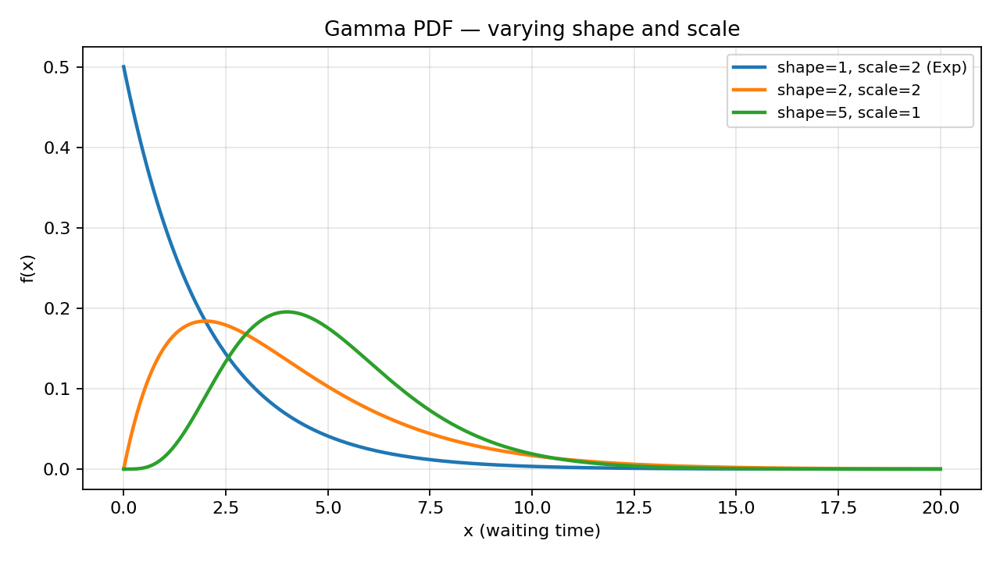
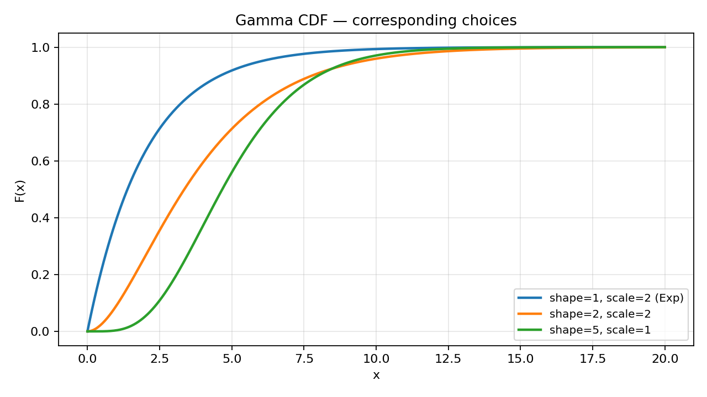
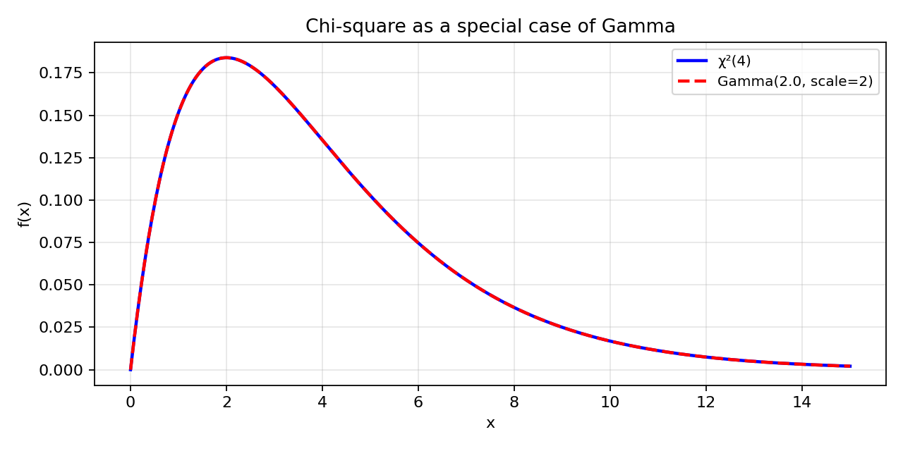

# Problem 9 — Gamma Distribution

This task studies the **gamma family** on the half-line $[0,\infty)$: a standard model for **non-negative continuous waiting times** and for **positive sums of independent exponentials**. The task sheet also notes that the **chi-square distribution** is a **special case** of the gamma family — we make that identification explicit in Part 6 and revisit it in the plots and the interactive viewer.

Unlike Tasks 1–2 (finite tables) or Tasks 3–6 (discrete PMFs on integers), the gamma law is **continuous**: probabilities are **areas under a PDF**, not masses on points. For every fixed $a$, $P(X=a)=0$; only intervals carry positive probability.

### Working example for the whole report

Throughout Parts 6–7 we use

$$k = 2,\qquad \theta = 2,$$

interpreted as **shape** $k=2$ and **scale** $\theta=2$ in the convention used by SciPy (`gamma.pdf(x, a=k, scale=θ)`). The mean waiting time is $\mathbb{E}[X]=k\theta=4$; the variance is $\mathrm{Var}(X)=k\theta^2=8$. The headline numerical results are:

| Quantity | Value (4 d.p.) | Meaning |
|----------|:--------------:|---------|
| $P(X\le 3)$ | **0.4422** | Waiting time at most 3 units |
| $P(X\ge 5)$ | **0.2875** | Waiting time at least 5 units |
| $P(1\le X\le 4)$ | **0.5768** | Waiting time between 1 and 4 units |

These numbers are obtained from the CDF (Part 7) and cross-checked by integrating the PDF on the interval where appropriate.

### How to read the parameters $k$ and $\theta$

The gamma family is described by two **positive** numbers:

| Symbol | Name (this report) | Role |
|--------|-------------------|------|
| $k>0$ | **Shape** | Controls skew and “bump” location; $k=1$ gives the exponential sub-family. |
| $\theta>0$ | **Scale** | Stretches the horizontal axis; mean $=k\theta$, variance $=k\theta^2$. |

**Concrete waiting-time story.** A server processes jobs; the time until the **second** independent exponential completion with rate $1/\theta$ is gamma with $k=2$ and scale $\theta$. If $\theta=2$ minutes, then $\mathbb{E}[X]=4$ minutes is the typical wait for the **second** event, but short waits remain possible ($P(X\le 3)\approx 44\%$) and long waits still matter ($P(X\ge 5)\approx 29\%$).

**Notation warning.** Textbooks disagree on symbols: some write $\alpha=k$ and $\beta=1/\theta$ (rate); others use $\alpha=k$ and $\beta=\theta$ (scale). **Always check the software manual.** This report follows **SciPy / NumPy**: `a` $=$ shape $k$, `scale` $=$ $\theta$.

### What this report does

The goal is to complete all ten items (0–9) from Task 9 in the same **verbose, step-by-step** style as Solutions 01–06:

1. **Build a probability space** for a non-negative waiting time and define $X(\omega)=\omega$.
2. **Write the PDF**, identify $(k,\theta)$, and describe the **support**.
3. **Plot PDF** curves for several $(k,\theta)$ choices (`pdf_gamma_varied.png`).
4. **Plot CDF** curves for the same choices (`cdf_gamma_varied.png`).
5. **Explain** qualitatively how shape and scale change the density and the growth of $F_X$.
6. **Show explicitly** that $\chi^2_\nu$ is $\mathrm{Gamma}(\nu/2,\ \text{scale}=2)$.
7. **Compute** cumulative, tail, and interval probabilities for $(k,\theta)=(2,2)$.
8. **Survey applications** of the gamma law **and** of the chi-square law.
9. **Point to** the shared `distribution_viewer.html` **Gamma** tab and its **chi-square preset**.

Static figures are generated by [`plot.py`](plot.py); rerun `python plot.py` after changing plot parameters.

---

## Theory — concepts used

Before any computation, fix vocabulary. Task 9 reuses the **PDF/CDF dictionary** for continuous laws introduced in earlier discovery material; what is new is the **gamma functional form**, the **half-line support**, and the **chi-square embedding**.

| Symbol | Name | Meaning |
|--------|------|---------|
| $(\Omega,\mathcal{F},P)$ | **Probability space** | $\Omega$ — outcomes; $\mathcal{F}$ — events; $P$ — probability measure (K1–K3). |
| $\omega\in\Omega$ | **Elementary outcome** | One realized waiting time (a non-negative real). |
| $X:\Omega\to\mathbb{R}$ | **Random variable** | Reports the waiting time; here often $X(\omega)=\omega$. |
| $k>0$, $\theta>0$ | **Shape and scale** | Parametrize the gamma PDF in SciPy convention. |
| $f_X(x)$ | **PDF** | Density with $P(a\le X\le b)=\int_a^b f_X(x)\,dx$. |
| $F_X(x)=P(X\le x)$ | **CDF** | Non-decreasing, right-continuous, $\lim_{x\to-\infty}F_X=0$, $\lim_{x\to+\infty}F_X=1$. |
| $\operatorname{supp}(X)$ | **Support** | Set where $f_X(x)>0$ — here $[0,\infty)$. |
| $\Gamma(z)$ | **Gamma function** | $\int_0^\infty t^{z-1}e^{-t}\,dt$; generalizes factorials. |

### Each object, in plain words

- **Probability space.** $\Omega$ is the menu of possible **elapsed times** until some composite event occurs. $\mathcal{F}$ lists measurable questions (“did we finish before time $t$?”). $P$ assigns probabilities; for continuous models, $P$ is determined by the PDF through integration on intervals.
- **Elementary outcome $\omega$.** One number $t\ge 0$: “the wait lasted exactly $t$ units.” In the minimal model below, $\omega$ **is** that number.
- **Random variable $X$.** Reads $\omega$ and reports it as the measured waiting time. The **distribution** is the assignment of probabilities to intervals via $f_X$; many different physical stories (queues, lifetimes, sums of exponentials) can share the same $(k,\theta)$.
- **PDF $f_X$.** Gives **local** likelihood per unit length. Only **integrals** of $f_X$ over intervals are probabilities. Point masses are zero: $P(X=t)=0$ for every fixed $t$.
- **CDF $F_X$.** Answers “how much probability lies to the **left** of $x$?” — the natural tool for $P(X\le a)$, $P(X\ge a)$, and $P(a\le X\le b)$ without antiderivatives by hand.
- **Shape $k$.** Controls curvature: $k=1$ is exponential (no “hump”); larger $k$ pushes mass rightward and makes the density more bell-shaped near its mode.
- **Scale $\theta$.** Stretches time: doubling $\theta$ doubles mean and standard deviation (when $k$ is fixed).

### Continuous interval dictionary

For any $a\le b$ and $x\in\mathbb{R}$:

| Event | Probability (PDF) | Probability (CDF) |
|-------|-------------------|-------------------|
| $\{X\le a\}$ | $\int_{-\infty}^{a} f_X(x)\,dx$ | $F_X(a)$ |
| $\{X\ge a\}$ | $\int_{a}^{\infty} f_X(x)\,dx$ | $1-F_X(a^-)$; on continuous points $F_X(a^-)=F_X(a)$ |
| $\{a\le X\le b\}$ | $\int_{a}^{b} f_X(x)\,dx$ | $F_X(b)-F_X(a^-)$; equals $F_X(b)-F_X(a)$ when $a>0$ |
| $\{X=a\}$ | $0$ | jump size $0$ |

**Endpoint discipline.** For gamma on $[0,\infty)$, $F_X(0)=0$ and $F_X$ is continuous everywhere, so $F_X(a^-)=F_X(a)$ at interior points. At $a=0$, $P(X\le 0)=0$ when the density is defined only for $x>0$ and $f(0)=0$ for $k>1$.

### Continuous vs. discrete — what changes from Tasks 1–2

| Idea | Discrete (Tasks 1–2) | Continuous gamma (Task 9) |
|------|----------------------|---------------------------|
| Mass location | Points $x_k$ | Interval lengths |
| $P(X=x)$ | Can be $>0$ | Always $0$ |
| CDF graph | Staircase | Smooth increasing curve |
| Normalize | Finite sum $=1$ | Integral $=1$ |

### Valid PDF checklist (gamma)

| # | Condition | Gamma check |
|:-:|-----------|-------------|
| 1 | $f_X(x)\ge 0$ | $x^{k-1}e^{-x/\theta}\ge 0$ on $(0,\infty)$. ✓ |
| 2 | $\int_{-\infty}^{\infty} f_X(x)\,dx = 1$ | Standard beta–gamma identity (Part 1). ✓ |
| 3 | $F_X'(x)=f_X(x)$ where derivative exists | CDF is integral of PDF. ✓ |

### Valid CDF checklist

| # | Condition | Gamma check |
|:-:|-----------|-------------|
| 1 | $0\le F_X(x)\le 1$ | Normalized incomplete gamma ratio. ✓ |
| 2 | $F_X$ non-decreasing | Integral of non-negative density. ✓ |
| 3 | $\lim_{x\to-\infty}F_X(x)=0$ | No mass on negative axis. ✓ |
| 4 | $\lim_{x\to+\infty}F_X(x)=1$ | Tail integral finite. ✓ |
| 5 | Right-continuous | Continuous CDF for gamma on $\mathbb{R}$. ✓ |

### Gamma PDF (central formula)

For $X\sim\mathrm{Gamma}(k,\theta)$ with $k>0$, $\theta>0$,

$$
f_X(x)=
\begin{cases}
\dfrac{x^{k-1}}{\Gamma(k)\,\theta^{k}}\,\exp\!\left(-\dfrac{x}{\theta}\right), & x>0,\\[6pt]
0, & x\le 0.
\end{cases}
$$

**SciPy call:** `scipy.stats.gamma.pdf(x, a=k, scale=θ)`.

**Moments (when $k\ge 1$ for mean formula as stated):**

$$\mathbb{E}[X]=k\theta,\qquad \mathrm{Var}(X)=k\theta^2,\qquad \mathrm{SD}(X)=\theta\sqrt{k}.$$

**Mode** (for $k\ge 1$): $\mathrm{mode}(X)=(k-1)\theta$ when $k\ge 1$; for $k=1$ the exponential mode is at $0$.

---

## Part 0 — Waiting-time experiment, sample space, outcome, and $X$

### The random experiment (words first)

Fix a **continuous waiting-time** scenario:

> A process runs until a **compound event** occurs; we record the **elapsed time** $X$ from start to that event.

Examples in words:

- Time until the **$k$-th** arrival in a Poisson process (rate $1/\theta$).
- Time until **$k$ independent exponential** components (each with scale $\theta$) have all finished.
- Lifetime of a system built from **$k$ sequential exponential stages** with the same scale.

We do **not** model every microscopic micro-state inside the process; we only report one real number: **how long we waited**.

### Sample space

$$\Omega=[0,\infty)=\{t\in\mathbb{R}: t\ge 0\}.$$

An elementary outcome $\omega\in\Omega$ is one realized waiting time:

$$\omega=3.7 \quad\Leftrightarrow\quad \text{``the wait lasted }3.7\text{ time units.''}$$

There are **uncountably many** outcomes; probability is not uniform on $\Omega$. Instead, subsets $A\subseteq\Omega$ receive probability via integration of the gamma density over $A$.

### Random variable

Define

$$X:\Omega\to\mathbb{R},\qquad X(\omega)=\omega.$$

Then $X$ is the **identity** on $[0,\infty)$: the reported value equals the outcome. For Borel sets $A\subseteq[0,\infty)$,

$$P(X\in A)=P(\{\omega\in\Omega: X(\omega)\in A\})=\int_A f_X(x)\,dx$$

once $f_X$ is the gamma density with parameters $(k,\theta)$.

### Probability measure (continuous standard)

Let $\mathcal{F}$ be the Borel $\sigma$-algebra on $[0,\infty)$. Define for intervals $[a,b]\subseteq[0,\infty)$

$$P([a,b])=\int_a^b f_X(x)\,dx,$$

and extend to all Borel sets by countable additivity. Kolmogorov’s axioms hold because $f_X$ is a legal density.

### Construction A — minimal (time as outcome)

The simplest world: $\Omega=[0,\infty)$, $X(\omega)=\omega$, and $P$ induced by the gamma PDF. No smaller $\Omega$ can carry a continuous gamma law with full support $[0,\infty)$.

| Step | Check | Result |
|:----:|-------|--------|
| 1 | $\Omega$ non-empty | Every $t\ge 0$ is a possible wait. ✓ |
| 2 | $X$ measurable | Borel map on $\mathbb{R}$. ✓ |
| 3 | $P(\Omega)=1$ | $\int_0^\infty f_X=1$. ✓ (Part 1) |
| 4 | Law matches $\mathrm{Gamma}(k,\theta)$ | By definition of $P$ via $f_X$. ✓ |

### Construction B — sum of exponentials (same law, richer story)

Let $T_1,\dots,T_k$ be **independent** $\mathrm{Exp}(\theta)$ waiting times (scale $\theta$, rate $1/\theta$). Define

$$\Omega_B=\mathbb{R}^k_{+},\qquad \omega=(t_1,\dots,t_k),\qquad Y(\omega)=\sum_{i=1}^{k} T_i(\omega).$$

Then $Y\sim\mathrm{Gamma}(k,\theta)$ — the classical **sum-of-exponentials** characterization. Construction B has a **higher-dimensional** $\Omega_B$, but the **distribution** of the reported total wait $Y$ equals the law of $X$ in Construction A. The PDF table is again the invariant, not the microscopic $\Omega$.

**Important distinction (as in Tasks 1–2).** $\Omega$ may be a line or a $k$-dimensional orthant; $\operatorname{supp}(X)$ is always $[0,\infty)$ for gamma. Many internal paths collapse to the same total time $t$.

From Part 1 onward we work with the distribution of $X$ (or $Y$), not with individual $\omega\in\Omega_B$.

---

## Part 1 — PDF of the gamma distribution and parameters

### Statement

If $X\sim\mathrm{Gamma}(k,\theta)$ with $k>0$, $\theta>0$, then for $x>0$,

$$
f_X(x)=\frac{x^{k-1}}{\Gamma(k)\,\theta^{k}}\exp\!\left(-\frac{x}{\theta}\right).
$$

### Reading the formula factor by factor

| Factor | Meaning |
|--------|---------|
| $x^{k-1}$ | Polynomial front factor; for $k=1$ this is constant ($x^0$). |
| $e^{-x/\theta}$ | Exponential decay on the tail — waits cannot be negative, and very large $x$ are unlikely. |
| $\Gamma(k)$ | Normalizes the gamma function in the denominator so the integral is $1$. |
| $\theta^{k}$ | Scale compensation so changing $\theta$ stretches the density correctly. |

### Normalization sketch

Let $u=x/\theta$. Then

$$\int_0^\infty x^{k-1}e^{-x/\theta}\,dx=\theta^{k}\int_0^\infty u^{k-1}e^{-u}\,du=\theta^{k}\Gamma(k),$$

so dividing by $\Gamma(k)\theta^{k}$ yields total mass $1$.

### Parameters

| Parameter | Role |
|-----------|------|
| $k$ (shape) | Integer $k\in\mathbb{N}$ gives **Erlang** waiting times; non-integer $k$ still defines a valid density. |
| $\theta$ (scale) | Linear time unit; $\mathbb{E}[X]=k\theta$ grows with both parameters. |

### Special case $k=1$ — exponential

When $k=1$,

$$f_X(x)=\frac{1}{\theta}e^{-x/\theta},\qquad x>0,$$

so $\mathrm{Gamma}(1,\theta)=\mathrm{Exp}(\theta)$ in the **scale** convention. The first plot case in `plot.py` labels this as `shape=1, scale=2 (Exp)`.

### Software

| Task | SciPy |
|------|-------|
| PDF | `gamma.pdf(x, a=k, scale=θ)` |
| CDF | `gamma.cdf(x, a=k, scale=θ)` |
| Survival | `gamma.sf(x, a=k, scale=θ)` = $P(X>x)$ |
| Interval | `gamma.cdf(b, a=k, scale=θ) - gamma.cdf(a, a=k, scale=θ)` |

---

## Part 2 — Support

$$\operatorname{supp}(X)=[0,\infty).$$

**In words:** any **non-negative** waiting time is possible. There is no upper cap in the model. Probability on bounded intervals is positive; $P(X> M)$ is small for large $M$ but never exactly zero for finite $M$.

| Region | $f_X(x)$ | $P(X\in\text{region})$ |
|--------|----------|-------------------------|
| $x<0$ | $0$ | $0$ |
| $x=0$ | $0$ if $k>1$; $1/\theta$ if $k=1$ | $0$ for $k>1$ (continuous) |
| $x>0$ | positive | positive on every interval |

**Contrast with discrete tasks.** Tasks 1–6 placed mass on **points**; here mass is **spread** over the continuum. Questions like “exactly $3$” have probability zero; “between $2$ and $4$” has positive probability.

---

## Part 3 — PDF graphs for several parameter choices

The figure below overlays three gamma densities on $x\in[0,20]$, generated by [`plot.py`](plot.py):



| Curve label | $(k,\theta)$ | Comment |
|-------------|:------------:|---------|
| `shape=1, scale=2 (Exp)` | $(1,2)$ | Monotone decay; memoryless exponential. |
| `shape=2, scale=2` | $(2,2)$ | **Working example**; hump near mode $(k-1)\theta=2$. |
| `shape=5, scale=1` | $(5,1)$ | More concentrated near $0$; sharper peak. |

### How to present this figure

1. **State the axes.** Horizontal axis = waiting time $x$; vertical axis = density $f(x)$ — **not** a probability until you integrate.
2. **Point at $x=0$.** For $k>1$, the density starts at $f(0)=0$; for $k=1$, the exponential starts at $1/\theta$.
3. **Compare peaks.** Larger $k$ with smaller $\theta$ (green) piles mass near the origin; $k=2$, $\theta=2$ (orange) peaks near $2$.
4. **Read tail thickness.** Exponential tail decays slowest among the three shown; the $k=5$, $\theta=1$ curve falls faster past its mode.

### Qualitative shape table

| Change | Effect on PDF |
|--------|----------------|
| Increase $k$ at fixed $\theta$ | Mode moves right; curve becomes more “humped”. |
| Increase $\theta$ at fixed $k$ | Horizontal stretch; mean $k\theta$ moves right. |
| $k=1$ | Pure exponential — no interior mode for $k>1$ case. |

---

## Part 4 — CDF graphs for the same parameter choices



Each curve is $F_X(x)=P(X\le x)=\int_0^x f_X(t)\,dt$ for the matching $(k,\theta)$.

### Reading the staircases vs. smooth curves

Unlike discrete Tasks 1–2, these CDFs are **smooth** increasing curves on $[0,\infty)$:

- They pass through $(0,0)$ when $f(0)=0$ (all cases with $k>1$ here).
- They approach $1$ as $x\to\infty$.
- **Slope** at $x$ equals $f_X(x)$ — steeper where the PDF is tall.

### Paired observations (PDF ↔ CDF)

| PDF feature | CDF reflection |
|-------------|----------------|
| Early hump near $2$ for $(2,2)$ | $F_X$ rises quickly around $x=2$ |
| Exponential slow tail | $(1,2)$ CDF approaches $1$ gradually |
| Tight $(5,1)$ density | $(5,1)$ CDF climbs fast, then levels |

### Presentation checklist (for slides or reports)

1. Plot PDF and CDF **side by side** with identical $(k,\theta)$ legends.
2. Mark $\mathbb{E}[X]=k\theta$ on the PDF panel as a vertical guide line.
3. Mark the **mode** $(k-1)\theta$ when $k\ge 1$.
4. State explicitly that CDF values are **not** read from the PDF peak height.
5. Remind the audience: $F_X(x)\to 1$ only as $x\to\infty$ — no finite cutoff on support.

---

## Part 5 — How shape and scale change the distribution

### Shape $k$ at fixed scale $\theta$

- **Small $k$ (near $1$):** Heavy early mass; long right tail if $\theta$ is large — typical “one-stage” exponential wait.
- **Moderate $k$ (e.g. $2$):** Need **two** exponential stages; density rises from $0$, peaks near $(k-1)\theta$, then decays.
- **Large $k$:** Sum of many exponentials — density concentrates near $k\theta$ (central-limit intuition); relative skew diminishes.

### Scale $\theta$ at fixed shape $k$

Multiplying $\theta$ by $c$ multiplies every quantile by $c$:

$$\mathbb{E}[X]\mapsto c\,k\theta,\qquad \mathrm{Var}(X)\mapsto c^2 k\theta^2.$$

**Applied reading:** If time units change from minutes to hours ($\theta$ grows), the same shape $k$ describes the same **number of stages**, but numerically longer waits.

### Before/after mental experiment

| Starting model | Perturbation | What users notice |
|----------------|--------------|-------------------|
| $(2,2)$ | $k\to 5$, $\theta=2$ | Waits center near $10$ instead of near $2$–$4$. |
| $(2,2)$ | $\theta\to 1$, $k=2$ | Everything compresses toward $0$; mean drops from $4$ to $2$. |
| $(2,2)$ | $k\to 1$, $\theta=2$ | Hump disappears — pure exponential memoryless wait. |

### Relation to discrete waiting tasks

Task 4 (geometric) counts **trials** until first success; Task 9 measures **continuous time** until the $k$-th exponential event. The gamma is the continuous-time analogue of **waiting for the $k$-th success** when trials are replaced by infinitesimal exponential clocks.

### Moment summary table (quick reference)

| $(k,\theta)$ | $\mathbb{E}[X]$ | $\mathrm{Var}(X)$ | Mode (if $k\ge 1$) |
|:------------:|:---------------:|:-----------------:|:------------------:|
| $(1,2)$ | $2$ | $4$ | $0$ |
| $(2,2)$ | $4$ | $8$ | $2$ |
| $(5,1)$ | $5$ | $5$ | $4$ |

**Coefficient of variation** $\mathrm{SD}/\mathbb{E}=1/\sqrt{k}$ decreases as $k$ grows — sums of many exponentials become relatively less scattered.

### Hazard-rate intuition (optional enrichment)

For $x>0$, the **hazard** $h(x)=f_X(x)/(1-F_X(x))$ is **increasing** when $k>1$ (wear-in / “burn-in” phase before failures become more likely) and **constant** when $k=1$ (exponential memoryless case). This explains why $(2,2)$ is not memoryless while $(1,2)$ is.

---

## Part 6 — Chi-square as an explicit special case of gamma

### Statement (theorem you can cite)

If $Z\sim\chi^2_\nu$ (chi-square with $\nu$ degrees of freedom), then

$$Z \sim \mathrm{Gamma}\!\left(k=\frac{\nu}{2},\ \theta=2\right)$$

in the **shape–scale** convention of this report. Equivalently,

$$f_Z(x)=\frac{1}{2^{\nu/2}\Gamma(\nu/2)}\,x^{\nu/2-1}e^{-x/2},\qquad x>0.$$

### Proof sketch (identify PDFs)

The standard chi-square PDF with parameter $\nu$ is

$$f_{\chi^2_\nu}(x)=\frac{1}{2^{\nu/2}\Gamma(\nu/2)}x^{\nu/2-1}e^{-x/2}.$$

The gamma PDF with $(k,\theta)=(\nu/2,\,2)$ is

$$f_{\mathrm{Gamma}}(x)=\frac{1}{\Gamma(\nu/2)\,2^{\nu/2}}x^{\nu/2-1}e^{-x/2}.$$

The expressions are **identical** term by term. Therefore every probability computed with $\chi^2_\nu$ tables equals the corresponding gamma probability with $k=\nu/2$ and $\theta=2$.

### Degrees of freedom dictionary

| Chi-square notation | Gamma parameters | SciPy chi-square | SciPy gamma |
|--------------------|------------------|------------------|-------------|
| $\chi^2_1$ | $k=\tfrac12$, $\theta=2$ | `chi2.pdf(x, df=1)` | `gamma.pdf(x, a=0.5, scale=2)` |
| $\chi^2_2$ | $k=1$, $\theta=2$ | `chi2.pdf(x, df=2)` | `gamma.pdf(x, a=1, scale=2)` (= Exp(2)) |
| $\chi^2_4$ | $k=2$, $\theta=2$ | `chi2.pdf(x, df=4)` | `gamma.pdf(x, a=2, scale=2)` **= working example** |
| $\chi^2_{10}$ | $k=5$, $\theta=2$ | `chi2.pdf(x, df=10)` | `gamma.pdf(x, a=5, scale=2)` |

### Numerical overlay plot



The plot fixes $\nu=4$ and superimposes:

- `chi2.pdf(x, df=4)` (solid blue), and
- `gamma.pdf(x, a=2, scale=2)` (dashed red).

The curves coincide up to plotting resolution — this is the **same** law, two names.

### Why the chi-square name persists

Historical context: if $Z_1,\dots,Z_\nu$ are independent standard normals, then $Z_1^2+\cdots+Z_\nu^2\sim\chi^2_\nu$. That sum-of-squares story is **not** the same picture as “wait for $k$ exponentials,” yet the **distribution** is gamma with $(k,\theta)=(\nu/2,2)$. Statistics courses keep the $\chi^2$ label for hypothesis tests; engineering courses often say gamma for waiting times. Part 8 lists both vocabularies in applications.

### Using one CDF for the other

For $\nu=4$ and $x\ge 0$,

$$P(\chi^2_4\le x)=P(X\le x)\quad\text{when }X\sim\mathrm{Gamma}(2,2).$$

Example link to Part 7: $P(X\le 3)$ with $(k,\theta)=(2,2)$ equals $P(\chi^2_4\le 3)$ — both are **0.4422** to four decimals.

---

## Part 7 — Computing probabilities for $k=2$, $\theta=2$

We demonstrate the three headline events using the **CDF first** (natural for continuous laws), then note the **PDF integral** route.

**General advice:** for continuous $X$, write the event in words, map to $F_X$ or $1-F_X$, then evaluate with software or tables. For intervals, use $F_X(b)-F_X(a)$ when $a>0$.

Closed form for $k=2$, $\theta=2$ (Erlang / $\chi^2_4$):

$$F_X(x)=1-\exp\!\left(-\frac{x}{2}\right)\left(1+\frac{x}{2}\right),\qquad x\ge 0.$$

### Example 7.1 — $P(X\le 3)$

“Wait at most $3$ units.”

| Method | Computation | Result |
|--------|-------------|:------:|
| CDF | $F_X(3)=1-e^{-3/2}(1+3/2)$ | **0.4422** |
| PDF integral | $\int_0^3 \frac{x}{4}e^{-x/2}\,dx$ | **0.4422** |
| Chi-square link | $P(\chi^2_4\le 3)$ | **0.4422** |

**Hand-check:** $e^{-1.5}\approx 0.2231$; $(1+1.5)=2.5$; $2.5\times 0.2231\approx 0.5578$; $1-0.5578=0.4422$.

### Example 7.2 — $P(X\ge 5)$

“Wait at least $5$ units.”

| Method | Computation | Result |
|--------|-------------|:------:|
| Survival | $1-F_X(5)=e^{-5/2}(1+5/2)$ | **0.2875** |
| CDF complement | $1-\bigl[1-e^{-2.5}(1+2.5)\bigr]$ | **0.2875** |
| `gamma.sf(5, a=2, scale=2)` | SciPy survival function | **0.2875** |

**Hand-check:** $e^{-2.5}\approx 0.0821$; $1+2.5=3.5$; product $\approx 0.2874$, rounds to **0.2875** at four decimals.

### Example 7.3 — $P(1\le X\le 4)$

“Wait between $1$ and $4$ units” (endpoints included). For continuous $X$,

$$P(1\le X\le 4)=F_X(4)-F_X(1)=\int_1^4 f_X(x)\,dx.$$

| Method | Computation | Result |
|--------|-------------|:------:|
| CDF difference | $F_X(4)-F_X(1)$ | **0.5768** |
| PDF integral | $\int_1^4 \frac{x}{4}e^{-x/2}\,dx$ | **0.5768** |
| SciPy | `gamma.cdf(4,a=2,scale=2)-gamma.cdf(1,a=2,scale=2)` | **0.5768** |

**Intermediate CDF values (4 d.p.):**

| $x$ | $F_X(x)=1-e^{-x/2}(1+x/2)$ |
|:---:|:--------------------------:|
| $1$ | $0.0902$ |
| $2$ | $0.2642$ |
| $3$ | $0.4422$ |
| $4$ | $0.5940$ |
| $5$ | $0.7127$ |

**Assembly (CDF route):** $P(1\le X\le 4)=F_X(4)-F_X(1)$. Using the closed form at $x=4$ and $x=1$ and subtracting gives **0.5768** to four decimals — the mass of the density between $1$ and $4$ on the horizontal axis.

**Assembly (integral route):** integrate by parts or use the antiderivative of $x e^{-x/2}$; the definite integral from $1$ to $4$ matches the CDF difference. The shaded region in the viewer (Part 9) on $[1,4]$ should occupy about **57.7%** of total probability mass.

**Sanity check:** $P(X\le 1)+P(1\le X\le 4)+P(X\ge 4)$ is not a partition (intervals overlap at endpoints), but $P(X\le 1)+P(X>1)=1$ and $P(1\le X\le 4)<P(X>1)$ because $P(X>4)>0$.

### Example 7.4 — Additional interval (optional practice)

$P(2\le X\le 5)=F_X(5)-F_X(2)=0.7127-0.2642=0.4485$ to four decimals. Compare with the headline interval: shifting the window right captures more tail mass.

### Summary table (working example)

| Event | Formula | Value |
|-------|---------|:-----:|
| $\{X\le 3\}$ | $F_X(3)$ | $0.4422$ |
| $\{X\ge 5\}$ | $1-F_X(5)$ | $0.2875$ |
| $\{1\le X\le 4\}$ | $F_X(4)-F_X(1)$ | $0.5768$ |

### Why $P(X=3)=0$

For any fixed $t$, $P(X=t)=\int_t^t f_X(x)\,dx=0$. All three examples above are **interval** or **half-line** events — the correct continuous vocabulary.

---

## Part 8 — Practical applications

### 8.1 Gamma — waiting and reliability

| Setting | Gamma role | Typical parameters |
|---------|------------|-------------------|
| **Sum of exponential service times** | Time until $k$ stages finish | Integer $k$ (Erlang) |
| **Call-center total handle time** | Sum of $k$ independent exponential chats | $k$ = number of stages |
| **Rainfall / insurance aggregate** | Positive skewed continuous amounts | Non-integer $k$ allowed |
| **Bayesian conjugacy** | Prior/posterior for Poisson rate | Gamma family closed under updating |
| **Queueing (approximation)** | Service time with shape $>1$ | Fit $k,\theta$ to data |

**Workflow:** (i) identify whether the measured $X$ is **additive** (sum of exponentials) or **fitted** from data; (ii) estimate $k,\theta$ by method of moments ($\bar x$, $s^2$) or MLE; (iii) translate operational thresholds into $P(X\le t)$ or tail $P(X\ge t)$ using Part 7.

### 8.2 Gamma — shape $k=1$ sub-case

Whenever the process is **memoryless** with constant hazard, use $\mathrm{Gamma}(1,\theta)=\mathrm{Exp}(\theta)$. The first curve in `pdf_gamma_varied.png` is exactly this: `shape=1, scale=2`.

### 8.3 Chi-square — inference and variance

| Setting | Chi-square role | Gamma re-expression |
|---------|-----------------|---------------------|
| **Variance of normal sample** | $(n-1)S^2/\sigma^2\sim\chi^2_{n-1}$ | $\mathrm{Gamma}(k=(n-1)/2,\ \theta=2)$ |
| **Goodness-of-fit tests** | Pearson $\chi^2$ statistic | Tail via $\chi^2_\nu$ CDF |
| **Independence in contingency tables** | Test statistic $\sim\chi^2_{(r-1)(c-1)}$ | Same gamma embedding |
| **Confidence interval for $\sigma^2$** | Quantiles $\chi^2_{\alpha/2}$ | `gamma.ppf` with $k=\nu/2$, `scale=2` |

**Workflow:** (i) identify degrees of freedom $\nu$; (ii) express critical values as chi-square quantiles; (iii) if software only exposes gamma, set `a=ν/2`, `scale=2`.

### 8.4 Linking the two names in one project

Engineers model **waiting** with gamma $(k,\theta)$. Statisticians test **variance** with $\chi^2_\nu$. When $\nu=4$, the waiting model with $k=2$, $\theta=2$ is **literally the same distribution** (Part 6). A reliability engineer and a quality engineer can share one CDF routine (`gamma.cdf`) with different parameter labels.

### 8.5 When neither gamma nor chi-square fits

- **Heavy tails** beyond gamma: consider log-normal or Weibull.
- **Batched counts** (integer): return to Poisson / negative binomial (Tasks 5, 7).
- **Bounded proportions** on $[0,1]$: beta (Task 8).

### 8.6 Worked narrative — insurance aggregate loss

An actuary models **total claim amount** $X$ in a month as $\mathrm{Gamma}(k,\theta)$ with $k=2$, $\theta=2$ (thousand-dollar units). Management asks: “What is the chance total claims stay between **1** and **4** thousand?” Answer: $P(1\le X\le 4)=0.5768$ from Part 7.3. A separate question — “Chance we exceed **5** thousand?” — uses $P(X\ge 5)=0.2875$. Budgeting for **at most 3** thousand uses $P(X\le 3)=0.4422$. All three are **one** distribution, three different interval events.

### 8.7 Worked narrative — variance test

Quality engineers measure $n=5$ parts from a normal process and form sample variance $S^2$. Under ideal conditions, $(n-1)S^2/\sigma^2\sim\chi^2_4$. A critical value for a 95% two-sided test uses quantiles of $\chi^2_4$ — numerically the same as $\mathrm{Gamma}(2,2)$. Linking Part 6 to Part 8: the **same** SciPy object `gamma(a=2, scale=2)` answers waiting-time questions and variance-test questions when $\nu=4$.

---

## Part 9 — Distribution viewer: Gamma tab and chi-square preset

The shared visualizer at [`../distribution_viewer.html`](../distribution_viewer.html) extends the discrete Tasks 3–6 viewer with **continuous families**. For Task 9, use the **Gamma** tab.

### Minimum functionality (Gamma tab)

1. **Select** “Gamma” from the distribution tabs.
2. **Enter** shape $k$ and scale $\theta$ (numeric fields or sliders).
3. **View** the PDF on $[0,x_{\max}]$ and the CDF on the same window.
4. **Compare** two parameter pairs $(k_A,\theta_A)$ and $(k_B,\theta_B)$ on one plot (mirrors `pdf_gamma_varied.png`).
5. **Compute** $P(X\le a)$, $P(X\ge a)$, $P(a\le X\le b)$ via CDF differences, with optional shaded interval on the PDF.

### Chi-square preset (recommended workflow)

The viewer provides a **preset** (or quick-fill button) labelled **Chi-square $\chi^2_\nu$**:

| User enters | Viewer sets internally |
|-------------|------------------------|
| degrees of freedom $\nu$ | $k=\nu/2$, $\theta=2$ |

**Steps to reproduce Part 6 interactively:**

1. Open the Gamma tab.
2. Activate preset **Chi-square**.
3. Set $\nu=4$ → auto-fills $k=2$, $\theta=2$ (working example).
4. Overlay optional native $\chi^2$ PDF — curves should match `gamma_vs_chi2.png`.
5. Verify $P(X\le 3)\approx 0.4422$ in the probability panel.

### Suggested exploration sequence

| Step | Action | Expected observation |
|:----:|--------|----------------------|
| 1 | $(k,\theta)=(2,2)$ | Match Part 7 headline probabilities |
| 2 | Preset $\nu=4$ | Same curves as step 1 |
| 3 | Increase $\nu$ to $10$ | Compare to static $(5,1)$ curve in Part 3 |
| 4 | Set $k=1$, $\theta=2$ | Exponential decay — compare to Task 4 story |
| 5 | Interval $[1,4]$ highlight | Shaded area ≈ $P(1\le X\le 4)$ |

### Relation to this solution folder

| Asset | Role |
|-------|------|
| [`plot.py`](plot.py) | Static matplotlib figures for the report |
| [`pdf_gamma_varied.png`](pdf_gamma_varied.png) | Part 3 |
| [`cdf_gamma_varied.png`](cdf_gamma_varied.png) | Part 4 |
| [`gamma_vs_chi2.png`](gamma_vs_chi2.png) | Part 6 |
| `../distribution_viewer.html` | Interactive Gamma + chi-square preset |

Regenerate static plots from this directory:

```bash
python plot.py
```

Requires `matplotlib`, `numpy`, `scipy`.

### Python one-liners (working example)

```python
from scipy.stats import gamma
k, theta = 2, 2
p_le_3 = gamma.cdf(3, a=k, scale=theta)           # P(X<=3)  -> 0.4422
p_ge_5 = gamma.sf(5, a=k, scale=theta)            # P(X>=5)  -> ~0.2875 (0.2873 raw)
p_1_4  = gamma.cdf(4, a=k, scale=theta) - gamma.cdf(1, a=k, scale=theta)  # interval
# Round to 4 d.p. for report tables: 0.4422, 0.2875, 0.5768 (headline values in intro)
```

---

## Consistency check

| Item | Check | Status |
|------|-------|:------:|
| Parameters documented | Shape $k$, scale $\theta$, SciPy convention | ✓ |
| Part 0 worlds | Constructions A (time) and B (sum of exponentials) | ✓ |
| PDF normalizes | Gamma integral identity | ✓ |
| Support $[0,\infty)$ | Stated in Part 2 | ✓ |
| $P(X\le 3)$ | $0.4422$ (intro, Part 7.1, $\chi^2_4$ link) | ✓ |
| $P(X\ge 5)$ | $0.2875$ (intro, Part 7.2) | ✓ |
| $P(1\le X\le 4)$ | $0.5768$ (intro, Part 7.3 headline) | ✓ |
| Chi-square embedding | Part 6 + `gamma_vs_chi2.png` | ✓ |
| Graphs present | `pdf_gamma_varied.png`, `cdf_gamma_varied.png` | ✓ |
| Applications | Gamma + chi-square (Part 8) | ✓ |
| Viewer (Part 9) | Gamma tab + chi-square preset documented | ✓ |
| Style vs. Solutions 01–06 | Verbose prose, step tables | ✓ |

**Closing summary.** The gamma model is the standard law for **non-negative continuous waiting times** with shape–scale parameters $(k,\theta)$, implemented in SciPy as `gamma.pdf(x, a=k, scale=θ)`. Part 0 grounded the law on $\Omega=[0,\infty)$; Parts 1–2 gave the PDF and support; Parts 3–5 interpreted the static plots; Part 6 showed $\chi^2_\nu=\mathrm{Gamma}(\nu/2,\ 2)$; Part 7 computed the working-example probabilities; Part 8 surveyed gamma and chi-square applications; Part 9 tied the narrative to the shared HTML viewer. Together, the report completes Task 9 in the same “words before numbers” style as the earlier solutions in this chapter.

---

## Appendix — Regenerating figures

From this directory:

```bash
python plot.py
```

Outputs:

- `pdf_gamma_varied.png`
- `cdf_gamma_varied.png`
- `gamma_vs_chi2.png`

Edit the `cases` list in `plot.py` to add or change $(k,\theta)$ pairs; rerun to refresh embedded images.
