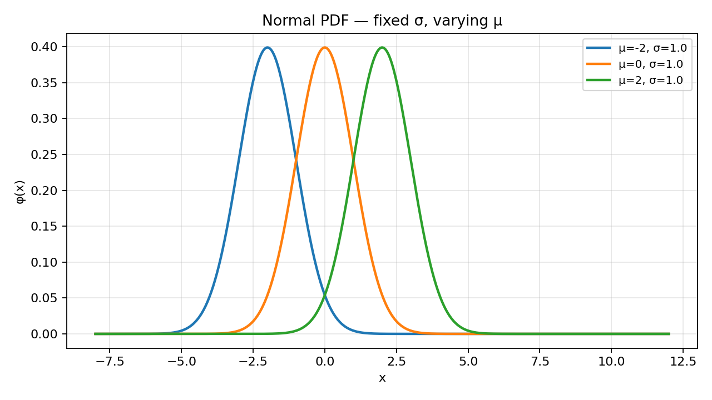
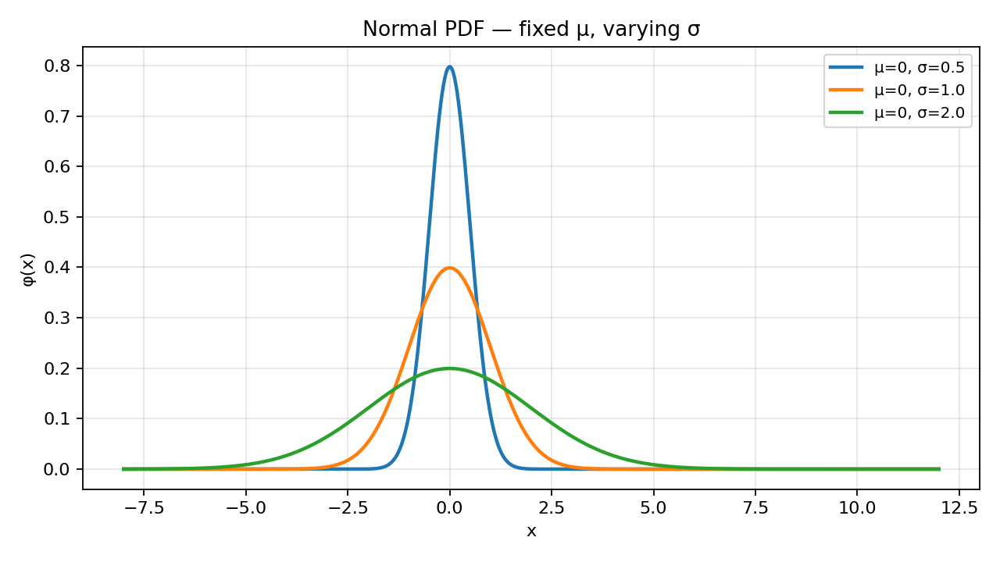
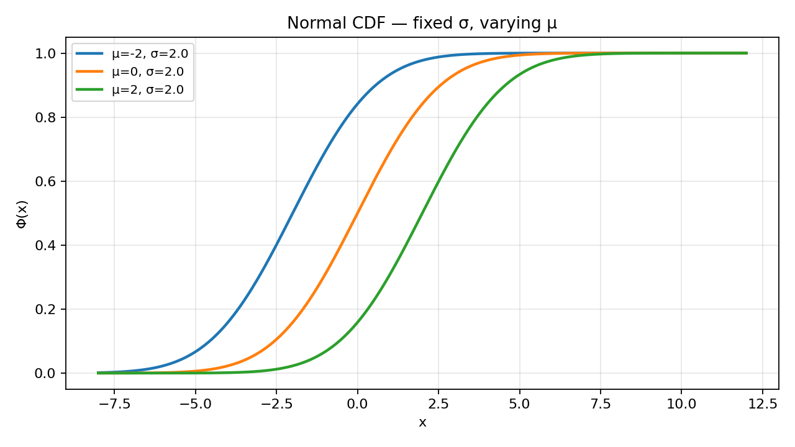
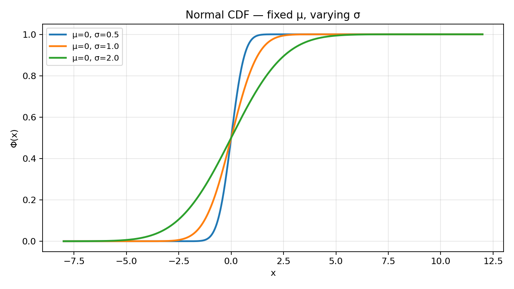

# Problem 10 — Normal Distribution $N(\mu,\sigma^2)$

This task studies the **Gaussian (normal) family** on the real line: the standard model for **continuous measurements** that cluster around a central value with symmetric spread. Unlike Tasks 1–6 (discrete PMFs and staircases), the normal law is described by a **density** $\varphi(x)$ and a **smooth** cumulative curve $F_X(x)$. There is no probability mass at a single point $x=a$; instead, probability lives on **intervals** and is read as **area under the bell curve**.

### Working example for the whole report

Throughout Part 6 we use

$$X \sim N(\mu,\sigma^2), \qquad \mu=2, \qquad \sigma=0.5 \quad (\sigma^2=0.25),$$

interpreted as “a measured quantity is centered at **2** with **standard deviation** **0.5**” (for example a calibrated sensor reading in appropriate units). The headline numerical results are:

| Quantity | Value (4 d.p.) | Meaning |
|----------|:--------------:|---------|
| $P(X\le 2.5)$ | **0.8413** | At most half a unit above the mean |
| $P(X\ge 1.5)$ | **0.8413** | At least half a unit below the mean (symmetry) |
| $P(1.5\le X\le 2.5)$ | **0.6827** | Within one $\sigma$ of the mean |

These numbers come from the standard normal CDF after **standardization** $Z=(X-\mu)/\sigma$.

### How to read the parameters $\mu$ and $\sigma^2$

- **$\mu$** is the **location** (center of symmetry): the peak of the PDF and the median/mean of the distribution.
- **$\sigma^2$** is the **variance**; **$\sigma>0$** is the **standard deviation** and sets the **width** of the bell. Larger $\sigma$ spreads probability over a wider interval on $\mathbb{R}$; smaller $\sigma$ concentrates mass near $\mu$.

The pair $(\mu,\sigma^2)$ does **not** name a single table of numbers — it names an entire **family** of curves. Software uses one function (`norm.pdf`, `norm.cdf`) with arguments `loc=μ`, `scale=σ`.

### What this report does

The goal is to complete all ten items (0–9) from Task 10 in the same **verbose, step-by-step** style as Solutions 01–05:

1. **Build a probability space** for a continuous measurement on $\mathbb{R}$ and define $X(\omega)=\omega$.
2. **Write the PDF** $\varphi(x)$, identify $\mu$ and $\sigma^2$, and sketch normalization.
3. **State the support** $\mathbb{R}$.
4. **Plot PDF** curves for fixed $\sigma$ with varying $\mu$, and fixed $\mu$ with varying $\sigma$.
5. **Plot CDF** curves for the same parameter grids.
6. **Explain** how $\mu$ and $\sigma^2$ control location and spread.
7. **Compute** cumulative, tail, and interval probabilities for $N(2,0.5^2)$ via CDF and standardization.
8. **Explain** why $P(X=a)=0$ for continuous laws.
9. **Survey applications** and point to the shared visualizer [`../distribution_viewer.html`](../distribution_viewer.html) **Normal** tab for overlaying several curves.

Static figures are generated by [`plot.py`](plot.py); rerun `python plot.py` after changing plot parameters.

---

## Theory — concepts used

Before any computation, fix vocabulary. Task 10 is the first **continuous** family in this chapter where the full real line is support and probability is defined by **integration** of a density, not summation of point masses.

| Symbol | Name | Meaning |
|--------|------|---------|
| $(\Omega,\mathcal{F},P)$ | **Probability space** | $\Omega$ — elementary outcomes; $\mathcal{F}$ — events; $P$ — probability measure (K1–K3). |
| $\omega\in\Omega$ | **Elementary outcome** | One realized measurement (here: a real number). |
| $X:\Omega\to\mathbb{R}$ | **Random variable** | Reports the measured value; often $X(\omega)=\omega$ when $\Omega=\mathbb{R}$. |
| $\mu\in\mathbb{R}$, $\sigma^2>0$ | **Parameters** | Mean and variance; $\sigma=\sqrt{\sigma^2}$ is standard deviation. |
| $\varphi(x)$ or $f_X(x)$ | **PDF** (density) | Non-negative; $\int_{-\infty}^{\infty}\varphi(x)\,dx=1$; $P(a\le X\le b)=\int_a^b \varphi(x)\,dx$. |
| $F_X(x)=P(X\le x)$ | **CDF** | Non-decreasing, right-continuous, $\lim_{x\to-\infty}F_X(x)=0$, $\lim_{x\to+\infty}F_X(x)=1$. |
| $\Phi(z)$ | **Standard normal CDF** | $P(Z\le z)$ for $Z\sim N(0,1)$. |
| $\operatorname{supp}(X)$ | **Support** | Here $\mathbb{R}$ — every real value is possible (positive density everywhere). |

### Each object, in plain words

- **Probability space.** $\Omega$ is the set of possible **raw measurement outcomes**. For a generic continuous sensor we take $\Omega=\mathbb{R}$: any real reading is conceivable. $\mathcal{F}$ is a $\sigma$-algebra large enough to include all intervals (Borel sets on $\mathbb{R}$). $P$ assigns probabilities to events; for intervals, those probabilities are **areas** under $\varphi$.
- **Elementary outcome $\omega$.** One finished trial: “the needle read $1.847$ mm,” “the voltage was $3.02$ V,” “the standardized score was $-0.3$.” The outcome is a **number**, not a category label.
- **Random variable $X$.** The quantity we model statistically. In the minimal construction $X(\omega)=\omega$: the outcome **is** the reported measurement. The normal law describes $\mathcal{L}(X)$, not the microscopic physics of the device.
- **PDF $\varphi$.** At a single point $x$, $\varphi(x)$ is **not** a probability — it is a **density**. Only integrals over intervals (or limits of such integrals) yield probabilities. The bell shape tells you **where** measurements are relatively more likely per unit length on the axis.
- **CDF $F_X$.** Answers cumulative questions: “what fraction of measurements fall at or below $a$?” For continuous $X$, $F_X$ is **continuous** (no jumps) and **differentiable** where $\varphi$ is smooth, with $F_X'(x)=\varphi(x)$.
- **Parameters $\mu$ and $\sigma$.** $\mu$ slides the bell left/right without changing its shape. $\sigma$ stretches or compresses it: $\sigma$ is a length unit on the same scale as $X$.
- **Standardization $Z$.** If $X\sim N(\mu,\sigma^2)$, then $Z=(X-\mu)/\sigma\sim N(0,1)$. Every normal probability reduces to a table lookup in $\Phi$.

### Shift from discrete to continuous (Tasks 1–6 vs. Task 10)

| Feature | Discrete (Tasks 1–6) | Normal (Task 10) |
|---------|----------------------|------------------|
| Law | PMF $p_X(k)$ on countable set | PDF $\varphi(x)$ on $\mathbb{R}$ |
| $P(X=x)$ | Can be $>0$ at support points | **Always $0$** for every single $x$ |
| $F_X$ | Staircase (jumps) | Smooth $S$-curve |
| Interval probability | Sum of masses | Integral $\int_a^b \varphi(x)\,dx$ |
| “Exactly $a$” | $p_X(a)$ or jump height | $0$ |

### Interval-to-CDF dictionary (continuous case)

For any real $a\le b$:

| Event | Probability (in terms of $F_X$) |
|-------|----------------------------------|
| $\{X\le a\}$ | $F_X(a)$ |
| $\{X< a\}$ | $F_X(a)$ (same for continuous — no point mass at $a$) |
| $\{X\ge a\}$ | $1-F_X(a)$ |
| $\{X> a\}$ | $1-F_X(a)$ |
| $\{a\le X\le b\}$ | $F_X(b)-F_X(a)$ |
| $\{a<X<b\}$ | $F_X(b)-F_X(a)$ |
| $\{X=a\}$ | $0$ |

**Endpoint note.** For continuous $X$, strict and non-strict inequalities at isolated endpoints agree because $P(X=a)=0$.

### Normal PDF (central formula)

For $X\sim N(\mu,\sigma^2)$ with $\sigma>0$, the **probability density function** is

$$\boxed{\varphi(x)=\frac{1}{\sigma\sqrt{2\pi}}\exp\!\left(-\frac{(x-\mu)^2}{2\sigma^2}\right), \qquad x\in\mathbb{R}.}$$

Equivalently $f_X(x)=\varphi(x)$. The CDF is

$$F_X(x)=P(X\le x)=\int_{-\infty}^{x}\varphi(t)\,dt=\Phi\!\left(\frac{x-\mu}{\sigma}\right),$$

where $\Phi$ is the CDF of $N(0,1)$.

**Normalization sketch.** Let $z=(x-\mu)/\sigma$. Then

$$\int_{-\infty}^{\infty}\varphi(x)\,dx=\int_{-\infty}^{\infty}\frac{1}{\sqrt{2\pi}}e^{-z^2/2}\,dz=1,$$

the classical Gaussian integral. The factor $\sigma\sqrt{2\pi}$ in the denominator is exactly what makes the area under the bell equal to $1$.

**Moments:** $\mathbb{E}[X]=\mu$, $\mathrm{Var}(X)=\sigma^2$, $\mathrm{SD}(X)=\sigma$. Symmetry about $\mu$ implies median $=$ mode $=\mu$.

---

## Part 0 — Experiment, sample space, elementary outcome, and $X$

### The random experiment (words first)

Fix a **continuous measurement procedure**: read a voltage, weigh a sample, measure a length after machining, record a standardized test score, read a temperature offset from setpoint. One run produces **one real number** on a continuum — not a count, not a category.

> **Experiment:** perform one measurement; record the value shown on the instrument (in fixed units).

We do **not** model digitization, rounding, or detector dead zones in this task; those refinements would turn the law into a mixture or discrete approximation. Here the idealized mathematical model is **perfectly continuous** on $\mathbb{R}$.

### Sample space $\Omega$

Each elementary outcome is one possible measured value:

$$\Omega=\mathbb{R}.$$

An outcome $\omega=x$ means: “the instrument reading equals $x$” (idealized exact real number).

**Why $\mathbb{R}$?** The normal family is defined for every real $x$ with positive density. In applications, instruments only show finitely many decimals, but the **statistical model** treats the underlying quantity as continuous.

### Random variable

Define

$$X:\Omega\to\mathbb{R},\qquad X(\omega)=\omega.$$

Then a realized outcome $\omega=1.73$ reports $X=1.73$. The map is the identity on $\mathbb{R}$.

### Probability measure (informative construction)

Let $\mathcal{F}$ be the Borel $\sigma$-algebra on $\mathbb{R}$. Define $P$ on intervals by

$$P(a\le X\le b)=\int_a^b \varphi(x)\,dx,$$

and extend to all of $\mathcal{F}$ by the usual measure extension theorem. Kolmogorov’s axioms hold: non-negativity of integrals of non-negative $\varphi$, total mass $1$, countable additivity on disjoint events.

### Construction A — minimal (measurement as outcome)

The simplest world: $\Omega=\mathbb{R}$, $X(\omega)=\omega$, and $P$ is the normal law on the line. There is no smaller $\Omega$ that still carries a full $N(\mu,\sigma^2)$ with support $\mathbb{R}$.

| Step | Check | Result |
|:----:|-------|--------|
| 1 | $\varphi(x)\ge 0$ | Exponential is positive; prefactor $>0$. ✓ |
| 2 | $\int_{\mathbb{R}}\varphi=1$ | Gaussian integral (Part 1). ✓ |
| 3 | $P(X\le x)=F_X(x)$ defined | CDF is integral of $\varphi$. ✓ |

### Construction B — noise around a true value (engineering story)

A different microscopic story can produce the **same** distribution. Let $\Theta=\mu$ be the **true** length and $\varepsilon\sim N(0,\sigma^2)$ independent measurement error. Observe

$$X=\Theta+\varepsilon=\mu+\varepsilon.$$

Then $X\sim N(\mu,\sigma^2)$ regardless of whether we think of $\omega$ as the pair $(\theta,\varepsilon)$ or only the sum. The PDF table is an invariant of $\mathcal{L}(X)$, not of how the workshop is wired.

**The same distribution from two stories.** Construction A identifies $\omega$ with the reading; Construction B identifies $\omega$ with latent true value plus noise. Both yield the same $\varphi$ and $F_X$.

**Important distinction.** $\Omega=\mathbb{R}$ is the space of **outcomes** in Construction A. The **support** of $X$ is also $\mathbb{R}$, but in Construction B the full $\Omega$ might be larger before we collapse to $X$. What matters for Tasks 6–7 is always the law of $X$, not the hidden variables.

---

## Part 1 — PDF, parameters, and normalization

### PDF in standard notation

For $X\sim N(\mu,\sigma^2)$,

$$\varphi(x)=\frac{1}{\sigma\sqrt{2\pi}}\exp\!\left(-\frac{(x-\mu)^2}{2\sigma^2}\right).$$

| Parameter | Constraint | Role in words |
|-----------|------------|---------------|
| $\mu$ | any real | **Location** — center of the bell; mean, median, mode. |
| $\sigma^2$ | $>0$ | **Variance** — squared scale of spread. |
| $\sigma$ | $=\sqrt{\sigma^2}>0$ | **Standard deviation** — same units as $X$; appears in the prefactor and exponent. |

The notation $N(\mu,\sigma^2)$ means “normal with mean $\mu$ and **variance** $\sigma^2$,” not “normal with second parameter equal to standard deviation.” Always check whether a source writes $N(\mu,\sigma)$ using $\sigma$ as SD — our task list uses $\sigma^2$ in the family name.

### Reading the formula factor by factor

| Factor | Effect |
|--------|--------|
| $(x-\mu)^2/(2\sigma^2)$ | Squared distance from center, scaled — large when $x$ is far from $\mu$. |
| $\exp(-\cdots)$ | Turns distance into a **bell**; maximum $1$ at $x=\mu$. |
| $1/(\sigma\sqrt{2\pi})$ | Ensures total area $1$; **smaller** when $\sigma$ is larger (taller, narrower need more vertical scale to keep area). |

At $x=\mu$, $\varphi(\mu)=1/(\sigma\sqrt{2\pi})$ — the peak height **decreases** as $\sigma$ grows (the bell widens and must lower to preserve area $1$).

### CDF link

$$F_X(x)=\Phi\!\left(\frac{x-\mu}{\sigma}\right), \qquad \Phi(z)=\frac{1}{\sqrt{2\pi}}\int_{-\infty}^{z}e^{-t^2/2}\,dt.$$

**Standard normal** $Z\sim N(0,1)$ has PDF $\phi(z)=(2\pi)^{-1/2}e^{-z^2/2}$ and CDF $\Phi(z)$. Every general normal problem reduces to $Z$.

### Valid PDF checklist

| # | Condition | Normal check |
|:-:|-----------|--------------|
| 1 | $\varphi(x)\ge 0$ for all $x$ | Exponential factor $>0$. ✓ |
| 2 | $\int_{-\infty}^{\infty}\varphi(x)\,dx=1$ | Substitution $z=(x-\mu)/\sigma$. ✓ |
| 3 | $\varphi$ integrable | Gaussian decay $e^{-x^2}$ dominates any polynomial. ✓ |

### Valid CDF checklist

| # | Condition | Normal check |
|:-:|-----------|--------------|
| 1 | $0\le F_X(x)\le 1$ | Integral of density. ✓ |
| 2 | $F_X$ non-decreasing | Integral of non-negative $\varphi$. ✓ |
| 3 | $\lim_{x\to-\infty}F_X(x)=0$, $\lim_{x\to+\infty}F_X(x)=1$ | Total mass on $\mathbb{R}$. ✓ |
| 4 | Right-continuous | Continuous everywhere (stronger). ✓ |
| 5 | $F_X'(x)=\varphi(x)$ where derivative exists | Fundamental theorem of calculus. ✓ |

---

## Part 2 — Support

$$\operatorname{supp}(X)=\{x\in\mathbb{R}:\varphi(x)>0\}=\mathbb{R}.$$

**Why all reals?** The Gaussian factor is strictly positive for every $x$; no truncation is built into the model.

**Why not “almost all” mass near $\mu$?”** Most probability **does** sit near $\mu\pm 3\sigma$, but the model still assigns **positive density** to $|x-\mu|$ very large — tails decay as $e^{-(x-\mu)^2/(2\sigma^2)}$, so far tails are tiny but never exactly zero.

**Practical truncation.** For plotting and numerical integration, use a window $[\mu-5\sigma,\mu+5\sigma]$ — outside that interval $F_X$ is within about $1-10^{-6}$ of $0$ and $1$ at the ends. [`plot.py`](plot.py) uses $x\in[-8,12]$ for the demonstration grids.

**Relation to discrete tasks.** Poisson/binomial support was countable; geometric support was $\mathbb{N}$. Here support is **uncountable** and probabilities are **intervals only**.

---

## Part 3 — PDF graphs (fixed $\sigma$, varying $\mu$; fixed $\mu$, varying $\sigma$)

Run [`plot.py`](plot.py) to regenerate:

- `pdf_fixed_sigma.png` — $\sigma=1$, $\mu\in\{-2,0,2\}$
- `pdf_fixed_mu.png` — $\mu=0$, $\sigma\in\{0.5,1,2\}$

### Fixed variance, changing mean



**How to read the figure.**

- Three **congruent** bells: same width, different horizontal shifts.
- Peak location equals $\mu$ for each curve ($\mu=-2,0,2$ at $\sigma=1$).
- Peak height is identical ($1/\sqrt{2\pi}\approx 0.3989$ when $\sigma=1$).
- Total area under **each** curve is $1$ (not shared across curves).

**Numerical anchors at $\sigma=1$:**

| $\mu$ | $\varphi(\mu)=1/(\sigma\sqrt{2\pi})$ | $P(\mu-1\le X\le\mu+1)$ |
|:-----:|:------------------------------------:|:-----------------------:|
| $-2$ | $0.3989$ | $\approx 0.6827$ |
| $0$ | $0.3989$ | $\approx 0.6827$ |
| $2$ | $0.3989$ | $\approx 0.6827$ |

The **68%** interval width is always $2\sigma$; only its **position** moves with $\mu$.

### Fixed mean, changing variance



**How to read the figure.**

- All curves centered at $\mu=0$.
- **Small** $\sigma=0.5$: tall, narrow bell — measurements concentrated near $0$.
- **Large** $\sigma=2$: short, wide bell — more mass in the tails.
- As $\sigma$ increases, peak height $\varphi(\mu)=1/(\sigma\sqrt{2\pi})$ **decreases**.

| $\sigma$ | Peak height $\varphi(0)$ | $\mathbb{E}[X]$ | $\mathrm{Var}(X)$ |
|:--------:|:------------------------:|:---------------:|:-----------------:|
| $0.5$ | $0.7979$ | $0$ | $0.25$ |
| $1.0$ | $0.3989$ | $0$ | $1$ |
| $2.0$ | $0.1995$ | $0$ | $4$ |

### Presentation guide (Part 3)

1. **State axes.** Horizontal: measured value $x$ (continuous). Vertical: **density** $\varphi(x)$, not probability — heights can exceed $1$ when $\sigma$ is small.
2. **Compare location panel.** “Sliding $\mu$ translates the bell without stretching it.”
3. **Compare spread panel.** “Increasing $\sigma$ flattens and widens the bell while keeping the center at $\mu$.”
4. **Mention area.** “Shaded area between two $x$-values would be $P(a\le X\le b)$ — the PDF alone is not a percent until integrated.”

Example sentence: *“With $\sigma=1$, shifting $\mu$ from $-2$ to $2$ moves the entire mass packet along the axis; with $\mu=0$, increasing $\sigma$ from $0.5$ to $2$ spreads that packet across a wider range.”*

---

## Part 4 — CDF graphs (same parameter grids)

The **cumulative distribution function** is

$$F_X(x)=P(X\le x)=\int_{-\infty}^{x}\varphi(t)\,dt.$$





### How to read the S-curves

- **Sigmoid shape:** $F_X(x)\approx 0$ far left, $\approx 1$ far right, steepest climb near $x=\mu$.
- **Fixed $\sigma$, varying $\mu$:** three parallel $S$-curves; horizontal shift matches PDF shift. At any fixed $x$, $F_X(x)$ is larger for curves with smaller $\mu$ if $x$ is to the right of their centers.
- **Fixed $\mu$, varying $\sigma$:** small $\sigma$ → steep rise near $\mu$ (most mass collected quickly); large $\sigma$ → gradual rise (mass dribbles into tails).

### Link to PDF plot

Where $F_X$ is steepest, $\varphi$ is highest — $F_X'(x)=\varphi(x)$. The inflection points of the CDF occur at $x=\mu$ (for the normal, symmetry).

### CDF samples (fixed $\sigma=1$)

| $x$ | $F(x)$, $\mu=-2$ | $\mu=0$ | $\mu=2$ |
|:---:|:----------------:|:-------:|:-------:|
| $\mu$ | $0.5$ | $0.5$ | $0.5$ |
| $\mu+1$ | $0.8413$ | $0.8413$ | $0.8413$ |
| $\mu-1$ | $0.1587$ | $0.1587$ | $0.1587$ |

At $x=\mu+1\sigma$, every curve shows **$0.8413$** — the universal one-sigma upper tail complement $1-0.1587$.

### Presentation guide (Part 4)

1. **Read $P(X\le a)$** as **height** at $a$ on the CDF graph.
2. **Interval probability** as **vertical difference** $F_X(b)-F_X(a)$.
3. **Compare panels** to Part 3: steep CDF $\leftrightarrow$ narrow PDF.
4. **Limits:** emphasize $F_X(-\infty)=0$, $F_X(+\infty)=1$ even though plots truncate the axis.

---

## Part 5 — How $\mu$ and $\sigma^2$ influence location and spread

Before comparing curves, fix what is held constant: the **family** (normal) and the **support** ($\mathbb{R}$). Only $(\mu,\sigma^2)$ move.

| Effect | Change in parameter | PDF | CDF | Moments |
|--------|---------------------|-----|-----|---------|
| **Location** | increase $\mu$ | Bell slides **right** | S-curve slides **right** | $\mathbb{E}[X]=\mu$ increases |
| **Spread** | increase $\sigma^2$ | Bell **widens**, peak **lowers** | Rise **slows** near $\mu$ | $\mathrm{Var}(X)=\sigma^2$ increases |
| **Shape** | — | Always symmetric, unimodal | Always logistic-type | Skewness $0$, excess kurtosis $0$ |

### Location detail ($\mu$)

- **Median and mode** equal $\mu$ by symmetry.
- **Percentiles** shift with $\mu$: e.g. 95th percentile is $\mu+1.645\sigma$ (for $\Phi(1.645)\approx 0.95$).
- **Does not** change $P(\mu-a\le X\le\mu+a)$ if $a$ is measured in **$\sigma$ units** — only the center moves.

### Spread detail ($\sigma^2$)

- **68–95–99.7 rule** (empirical rule):

| Interval | Probability (approx.) |
|----------|:-----------------------:|
| $[\mu-\sigma,\mu+\sigma]$ | $0.6827$ |
| $[\mu-2\sigma,\mu+2\sigma]$ | $0.9545$ |
| $[\mu-3\sigma,\mu+3\sigma]$ | $0.9973$ |

- **Coefficient of variation** $\sigma/|\mu|$ (when $\mu\neq 0$) measures relative noise.
- **Standard error** of the sample mean (preview): $\bar{X}$ of $n$ i.i.d. normals has SD $\sigma/\sqrt{n}$ — distinct from $\sigma$ of one observation.

### What does **not** change

- Support remains $\mathbb{R}$.
- Functional form $e^{-(x-\mu)^2/(2\sigma^2)}$ — only parameters move.
- **Symmetry** about $\mu$ — no skew.

### Closing synthesis for Parts 3–5

Think of $\mu$ as sliding a **fixed-shaped** bell along the axis, and $\sigma$ as inflating or deflating it while keeping the center fixed. On the CDF, $\mu$ shifts the steep climb; $\sigma$ controls how abruptly the curve races from $0$ to $1$. The working example $N(2,0.5^2)$ places the steep region around $x=2$ with half-width $0.5$ on the density scale.

---

## Part 6 — Probability calculations for $N(2,\,0.5^2)$

Take

$$X\sim N(\mu,\sigma^2), \qquad \mu=2, \qquad \sigma=0.5.$$

CDF route:

$$F_X(x)=\Phi\!\left(\frac{x-2}{0.5}\right)=\Phi(2x-4).$$

### Standardization (used in every row)

Define

$$Z=\frac{X-\mu}{\sigma}=\frac{X-2}{0.5}=2X-4 \sim N(0,1).$$

Then

$$P(X\le a)=P\!\left(Z\le\frac{a-2}{0.5}\right)=\Phi\!\left(\frac{a-2}{0.5}\right).$$

Tables and software return $\Phi(z)$; [`scipy.stats.norm`](plot.py) evaluates the same numbers.

### Cumulative anchors (build first)

| $a$ | $z=(a-2)/0.5$ | $\Phi(z)$ | Event |
|:---:|:-------------:|:---------:|-------|
| $1.5$ | $-1$ | $0.1587$ | $P(X\le 1.5)$ |
| $2.0$ | $0$ | $0.5000$ | $P(X\le 2)$ |
| $2.5$ | $+1$ | **$0.8413$** | $P(X\le 2.5)$ |

### Example 6.1 — $P(X\le 2.5)$

| Method | Computation | Result |
|--------|-------------|:------:|
| CDF | $\Phi((2.5-2)/0.5)=\Phi(1)$ | **$0.8413$** |
| Integral | $\displaystyle\int_{-\infty}^{2.5}\varphi(x)\,dx$ | **$0.8413$** |

**In words:** about **84%** of measurements fall at or below $2.5$ when centered at $2$ with SD $0.5$ — one half-sigma above the mean.

### Example 6.2 — $P(X\ge 1.5)$

| Method | Computation | Result |
|--------|-------------|:------:|
| CDF complement | $1-\Phi((1.5-2)/0.5)=1-\Phi(-1)$ | **$0.8413$** |
| Symmetry | $P(X\ge 1.5)=P(X\le 2.5)$ because $1.5$ and $2.5$ are equally far from $\mu=2$ | **$0.8413$** |

**In words:** the lower tail “at least $1.5$” mirrors the upper tail “at most $2.5$” — reflection symmetry about $\mu$.

### Example 6.3 — $P(1.5\le X\le 2.5)$

| Method | Computation | Result |
|--------|-------------|:------:|
| CDF difference | $\Phi(1)-\Phi(-1)=0.8413-0.1587$ | **$0.6827$** |
| Standard $Z$ | $P(-1\le Z\le 1)$ | **$0.6827$** |

**In words:** about **68%** of readings land within **one standard deviation** of the mean — the famous $68\%$ rule. Here $[\mu-\sigma,\mu+\sigma]=[1.5,2.5]$.

### Example 6.4 — $P(X\le 2)$ and $P(X>2)$

| Event | $z$ | Value |
|-------|:---:|:-----:|
| $P(X\le 2)=\Phi(0)$ | $0$ | **$0.5000$** |
| $P(X>2)=1-\Phi(0)$ | $0$ | **$0.5000$** |

The median is $\mu=2$: half below, half above (strict inequalities agree with weak ones).

### Example 6.5 — $P(1.0\le X\le 3.0)$ (two-sigma window)

| Method | Computation | Result |
|--------|-------------|:------:|
| CDF | $\Phi((3-2)/0.5)-\Phi((1-2)/0.5)=\Phi(2)-\Phi(-2)$ | **$0.9545$** |

About **95%** within $\mu\pm 2\sigma$.

### Example 6.6 — $P(X\le 1.0)$ (left tail)

| Method | Computation | Result |
|--------|-------------|:------:|
| CDF | $\Phi((1-2)/0.5)=\Phi(-2)$ | **$0.0228$** |

Only about **2.3%** below $1.0$ (two sigmas below mean).

### Summary table ($\mu=2$, $\sigma=0.5$)

| Event | Standardized $z$ | $\Phi$ / complement | Value |
|-------|------------------|---------------------|:-----:|
| $\{X\le 2.5\}$ | $1$ | $\Phi(1)$ | **$0.8413$** |
| $\{X\ge 1.5\}$ | $-1$ | $1-\Phi(-1)$ | **$0.8413$** |
| $\{1.5\le X\le 2.5\}$ | $-1$ to $1$ | $\Phi(1)-\Phi(-1)$ | **$0.6827$** |
| $\{X\le 2\}$ | $0$ | $\Phi(0)$ | **$0.5000$** |
| $\{1.0\le X\le 3.0\}$ | $-2$ to $2$ | $\Phi(2)-\Phi(-2)$ | **$0.9545$** |
| $\{X\le 1.0\}$ | $-2$ | $\Phi(-2)$ | **$0.0228$** |

All rows use the same pipeline: **translate to $Z$**, **look up $\Phi$**, apply complements or differences as needed.

### When to integrate vs. standardize

| Situation | Integral $\int_a^b\varphi$ | Standardization |
|-----------|------------------------------|-----------------|
| Hand calculation | Rare — needs numerical quadrature | **Preferred** — one $\Phi$ call |
| Software | `norm.cdf(b, mu, sigma)-norm.cdf(a, mu, sigma)` | Same internally |
| Theory proofs | Definition of $F_X$ | Change of variable $z=(x-\mu)/\sigma$ |

---

### Standardization and the standard normal table (continued from Part 6)

### Why standardize?

The function $\Phi(z)$ is tabulated once. Every $N(\mu,\sigma^2)$ problem becomes

$$P(X\le a)=\Phi\!\left(\frac{a-\mu}{\sigma}\right), \qquad P(a\le X\le b)=\Phi\!\left(\frac{b-\mu}{\sigma}\right)-\Phi\!\left(\frac{a-\mu}{\sigma}\right).$$

**Algorithm (step by step):**

| Step | Action | Reason |
|:----:|--------|--------|
| 1 | Draw a picture or label $\mu$, $\sigma$ | Avoid using variance where SD is needed. |
| 2 | Convert endpoints: $z_a=(a-\mu)/\sigma$ | Centers and scales to $N(0,1)$. |
| 3 | Express event in terms of $Z$ | Same probability in standard world. |
| 4 | Use $\Phi$ or $1-\Phi$ | Table / software. |
| 5 | Check sign: large positive $z$ $\Rightarrow$ $\Phi(z)\approx 1$ | Sanity check. |

### Universal $z$ values (memorize or look up)

| $z$ | $\Phi(z)$ | Tail $1-\Phi(z)$ |
|:---:|:---------:|:------------------:|
| $0$ | $0.5000$ | $0.5000$ |
| $1$ | $0.8413$ | $0.1587$ |
| $1.645$ | $0.9500$ | $0.0500$ |
| $2$ | $0.9772$ | $0.0228$ |
| $3$ | $0.9987$ | $0.0013$ |

Symmetry: $\Phi(-z)=1-\Phi(z)$.

### Worked chain for headline interval

For $X\sim N(2,0.5^2)$ and $P(1.5\le X\le 2.5)$:

1. $z_1=(1.5-2)/0.5=-1$, $z_2=(2.5-2)/0.5=+1$.
2. $P(1.5\le X\le 2.5)=P(-1\le Z\le 1)$.
3. $=\Phi(1)-\Phi(-1)=0.8413-0.1587=0.6827$.

No integration by hand is required — only algebra and one table row.

### Inverse problem (quantiles)

Find $c$ such that $P(X\le c)=0.95$:

$$\frac{c-\mu}{\sigma}=\Phi^{-1}(0.95)\approx 1.645 \quad\Rightarrow\quad c=\mu+1.645\,\sigma.$$

For $\mu=2$, $\sigma=0.5$: $c\approx 2+0.8225=2.8225$.

---

## Part 7 — Why $P(X=a)=0$ for a continuous distribution

### Formal statement

For $X$ continuous with PDF $\varphi$,

$$P(X=a)=P(\{a\})=\int_a^a \varphi(x)\,dx=0.$$

More generally, any **singleton** has probability zero; only intervals (or unions of intervals) carry positive probability.

### Intuition in words

- Probability is **area** under a curve over an interval.
- A single point $x=a$ has **zero width**, hence **zero area**, even if $\varphi(a)$ is large.
- The bell can be **tall** at $\mu$ — that is density, not $P(X=\mu)$.

### Contrast with discrete Tasks 1–6

| Question | Discrete | Continuous normal |
|----------|----------|---------------------|
| $P(X=3)$ | Can be $>0$ | $0$ |
| $P(X\le 3)$ | Sum of masses | $F_X(3)=\Phi(\cdots)$ |
| “Exactly 3” in data | Possible count | Idealized model says probability $0$; observed rounded values are a different model |

### Rounding caveat (applications)

Real measurements are **rounded** to finitely many decimals. Then “$X=1.50$” means an interval $[1.495,1.505)$ if the instrument resolves $0.01$. That interval probability is **small but positive**, not literally zero — the continuous normal is an idealization of the underlying error, not of the displayed digit string.

### CDF consequence

For continuous $X$, $P(X\le a)=P(X<a)$ and $P(X\ge a)=P(X>a)$ — endpoints can be included or excluded without changing the number. This is why Part 6 used $P(X\le 2.5)$ and $P(X\ge 1.5)$ freely with weak inequalities.

---

## Part 8 — Practical applications

The normal model appears whenever many **small independent errors** add up, or when a **symmetric, unimodal** continuous measurement is described by mean and SD alone.

### 1. Measurement error and instrumentation

- **Experiment:** Read a calibrated sensor once; $X$ is the displayed value.
- **Parameters:** $\mu$ = true value (or nominal setpoint); $\sigma$ = precision (repeatability).
- **Use:** Tolerance intervals — e.g. $P(\mu-3\sigma\le X\le\mu+3\sigma)\approx 0.997$ for acceptance bands.
- **Link to Part 6:** With $\mu=2$, $\sigma=0.5$, $P(1.5\le X\le 2.5)\approx 0.683$ is the one-sigma QC window.

### 2. Natural variation in manufacturing

- **Experiment:** Dimension of a machined part.
- **Parameters:** $\mu$ = target dimension; $\sigma$ from process capability study.
- **Use:** Six-sigma metrics, defect rates via tail probabilities $P(X<\text{LSL})$.

### 3. Standardized scores (education, finance)

- **Experiment:** Convert raw score $X$ to $Z=(X-\mu)/\sigma$ for comparison across scales.
- **Use:** Percentile ranks via $\Phi$; “top 5%” means $Z\ge 1.645$.

### 4. Statistical inference (preview)

- Sample means of large samples are approximately normal (CLT) even when data are not — bridges Tasks 3–5 (counts) to continuous modeling.
- Confidence intervals: $\bar{X}\pm z_{\alpha/2}\,s/\sqrt{n}$.

### 5. Other standard uses (brief)

| Domain | What $X$ represents | Typical role of normal |
|--------|---------------------|-------------------------|
| Physics | Thermal noise voltage | Small fluctuations around mean |
| Biology | Log-transformed concentrations | Approximate normality after log |
| Finance | Log returns (short horizon) | Risk metrics, VaR via tails |
| Metrology | Error in repeated weighings | Uncertainty budgets |

**Common modeling pitfall:** Using normal tails for **heavy-tailed** data (outliers more frequent than $\Phi$ predicts). Always check skewness and tail weight on real data; use normal as baseline, not gospel.

---

## Part 9 — Interactive visualizer (`distribution_viewer.html`, Normal tab)

The task list recommends a **shared distribution explorer** at the parent folder level:

**[`../distribution_viewer.html`](../distribution_viewer.html)**

### Expected functionality for Normal (Task 10, item 9)

1. **Family selector** includes **Normal** $N(\mu,\sigma^2)$ (alongside discrete families from earlier tasks when present).
2. **Parameter inputs** for set **A** and set **B**: mean $\mu_A,\mu_B$ and standard deviation $\sigma_A,\sigma_B$ (variance $\sigma^2$ displayed or derived).
3. **Dual PDF plot:** overlay **two or more** normal densities on one axis — same idea as `pdf_fixed_sigma.png` and `pdf_fixed_mu.png`, but live.
4. **Dual CDF plot:** overlay corresponding $F_X(x)=\Phi((x-\mu)/\sigma)$ curves with $y\in[0,1]$.
5. **Compare several curves on one graph:** e.g. $N(2,0.5^2)$ vs. $N(2,1)$ vs. $N(0,1)$ to see shared center, different spread.
6. **Probability calculator:** user enters $a$, $b$; app reports $P(X\le a)$, $P(X\ge a)$, $P(a\le X\le b)$ using $\Phi$ after standardization — cross-check Part 6 ($0.8413$, $0.6827$).
7. **Optional highlight:** shade $[a,b]$ under the PDF for $P(a\le X\le b)$ (recommended extension from the chapter brief).

### Relation to this solution folder

| Asset | Role |
|-------|------|
| [`plot.py`](plot.py) | Static matplotlib figures for the report |
| [`pdf_fixed_sigma.png`](pdf_fixed_sigma.png) | Part 3 — fixed $\sigma$, varying $\mu$ |
| [`pdf_fixed_mu.png`](pdf_fixed_mu.png) | Part 3 — fixed $\mu$, varying $\sigma$ |
| [`cdf_fixed_sigma.png`](cdf_fixed_sigma.png) | Part 4 — fixed $\sigma$, varying $\mu$ |
| [`cdf_fixed_mu.png`](cdf_fixed_mu.png) | Part 4 — fixed $\mu$, varying $\sigma$ |
| `../distribution_viewer.html` | Browser tool — **Normal tab**, multiple curves on one plot |

Opening the HTML file locally should let you **drag $\mu$ and $\sigma$** and verify interactively that $P(\mu-\sigma\le X\le\mu+\sigma)\approx 0.6827$. Set $\mu=2$, $\sigma=0.5$ and confirm $P(X\le 2.5)\approx 0.8413$ against Part 6.

### Quick exploration checklist

| Action in viewer | Expected observation |
|------------------|----------------------|
| Increase $\mu$ with fixed $\sigma$ | PDF/CDF slide right; $P(X\le c)$ at fixed $c$ decreases |
| Increase $\sigma$ with fixed $\mu$ | PDF flattens; CDF softens; more mass in tails |
| Overlay $N(2,0.5^2)$ and $N(2,1)$ | Same center, wider orange curve |
| Query $a=1.5$, $b=2.5$ at $\mu=2$, $\sigma=0.5$ | Interval probability $\approx 0.6827$ |

---

## Consistency check

| Item | Check | Status |
|------|-------|:------:|
| PDF non-negative | $\varphi(x)>0$ everywhere | ✓ |
| PDF integrates to $1$ | Gaussian integral | ✓ |
| Support $\mathbb{R}$ | All $x$ with positive density | ✓ |
| $\mathbb{E}[X]=\mu$, $\mathrm{Var}(X)=\sigma^2$ | Standard identities | ✓ |
| Construction A/B | Measurement vs. noise story | ✓ |
| Plots fixed $\sigma$ / fixed $\mu$ | `plot.py` four PNGs | ✓ |
| Parts 3–4 presentation guides | Prose checklists | ✓ |
| Part 5 68–95–99.7 | Table + synthesis | ✓ |
| $N(2,0.5^2)$ numerics | $0.8413$, $0.8413$, $0.6827$ | ✓ |
| Part 6 six examples + summary | CDF and $Z$ routes | ✓ |
| Standardization (within Part 6) | Algorithm + $\Phi$ table | ✓ |
| $P(X=a)=0$ Part 7 | Integral + discrete contrast | ✓ |
| Applications Part 8 | Five subsections | ✓ |
| Visualizer Normal tab | `distribution_viewer.html` | ✓ |
| Style vs. Solution 05 | Verbose prose, step tables | ✓ |

**Cross-part numeric coherence ($\mu=2$, $\sigma=0.5$).** Introduction table matches Part 6: $P(X\le 2.5)=P(X\ge 1.5)=0.8413$, $P(1.5\le X\le 2.5)=0.6827$. Part 6 (standardization subsection) reproduces the same via $Z\in[-1,1]$. Part 4 notes $\Phi(1)=0.8413$ at any $\mu$ when $x=\mu+\sigma$.

**Notation.** $N(\mu,\sigma^2)$ always means variance $\sigma^2$ in the family name; $\sigma$ is SD in formulas. $\varphi$ is PDF; $\Phi$ is standard normal CDF. $F_X(x)=\Phi((x-\mu)/\sigma)$.

Every formal requirement of Task 10 (items 0–9) is addressed: a probability space on $\mathbb{R}$ was constructed, the PDF and support were stated, PDF/CDF graphs for multiple $(\mu,\sigma)$ choices were drawn and interpreted, location and spread were explained, probabilities for $N(2,0.5^2)$ were computed by CDF and standardization, the zero point-mass property was explained, applications were surveyed, and the shared HTML visualizer **Normal** tab was referenced for comparing several curves on one plot.

---

## Appendix — Regenerating figures

From this directory:

```bash
python plot.py
```

Requires `matplotlib`, `numpy`, `scipy`. Outputs:

- `pdf_fixed_sigma.png`
- `pdf_fixed_mu.png`
- `cdf_fixed_sigma.png`
- `cdf_fixed_mu.png`

Edit the `mu` loops and `sigma` lists in `plot.py` to add parameter values; rerun to refresh embedded images in this report.

### Standard normal reference (extra digits)

For audit of Part 6:

| $z$ | $\Phi(z)$ |
|:---:|:---------:|
| $-2$ | $0.022750132$ |
| $-1$ | $0.158655254$ |
| $0$ | $0.500000000$ |
| $1$ | $0.841344746$ |
| $2$ | $0.977249868$ |

$\Phi(1)-\Phi(-1)=0.682689492$ — reported as **$0.6827$** in the task headline.
